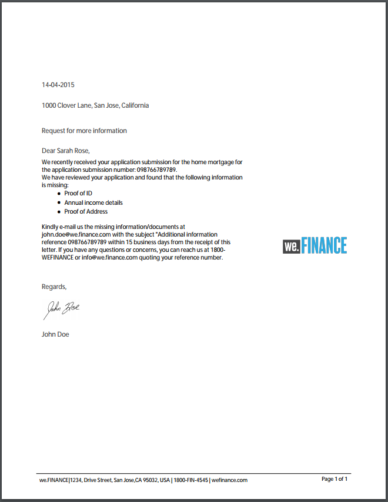

# Modelos de carta de referência {#reference-letter-templates}

No Gerenciamento de correspondência, um modelo de carta contém campos de formulário típicos, recursos de layout como um cabeçalho e rodapé e &quot;áreas de destino&quot; vazias para o posicionamento do conteúdo.

O Gerenciamento de correspondência fornece modelos de carta no [pacote complementar do AEM Forms](https://experienceleague.adobe.com/docs/experience-manager-release-information/aem-release-updates/forms-updates/aem-forms-releases.html?lang=en). Você pode personalizar os modelos no Designer de acordo com suas necessidades comerciais e de marcas. O pacote inclui os seguintes modelos:

* Clássico
* Simples clássico
* Balanceado à Esquerda
* Equilibrado à Direita
* Visual Esquerda
* Parte superior visual
* Visual Top - Classic

Depois de instalar o pacote, os modelos de layout (XDPs) são listados na pasta de modelos no seguinte local:

`https://'[server]:[port]'/[context-root]/aem/forms.html/content/dam/formsanddocuments/templates-folder`

A seguir estão os campos comuns em todos os templates deste pacote:

* Data
* Saudação
* Fechamento de texto
* Texto de assinatura

Depois de instalar o pacote AEM-FORMS-6.3-REFERENCE-LAYOUT-TEMPLATES, os modelos são listados na pasta de modelos

## Clássico {#classic}

Com um logotipo no topo, o modelo Clássico é adequado para uma carta profissional simples.

Visualização em PDF de uma carta criada com o modelo Clássico

## Simples clássico {#classic-simple}

Inclui campos para capturar o número de telefone e o endereço de email. Um modelo Simples clássico é semelhante ao modelo Clássico, exceto que ele não tem campos nos quais você pode inserir o endereço do recipient.

Visualização em PDF de uma carta criada usando o modelo Simples clássico

## Balanceado à Esquerda {#balanced-left}

O modelo Esquerda Equilibrada inclui o logotipo à esquerda da carta.

Visualização em PDF de uma carta criada usando o modelo Esquerda Equilibrada

## Equilibrado à Direita {#balanced-right}

O modelo Equilibrado à Direita tem o logotipo da empresa à esquerda e fornece espaço para inserir o endereço dos recipients na própria letra. O modelo Equilibrado à direita também inclui um rodapé que reflui quando a carta tem várias páginas.

Visualização em PDF de uma carta criada usando o modelo Direito Equilibrado

## Visual Esquerda {#visual-left}

O modelo da Esquerda visual tem um cabeçalho lateral à esquerda da página com o logotipo da empresa posicionado sobre a cabeça lateral. O modelo da Esquerda visual tem um campo de assunto, mas nenhum rodapé.

Visualização de PDF de uma carta criada usando o modelo Esquerda Visual

## Parte superior visual {#visual-top}

O modelo do Visual Top tem margem visual no topo. O modelo do Visual Top tem um campo para inserir o endereço do destinatário na própria página. O modelo Superior visual tem o campo de assunto e um rodapé que reflui para letras que se estendem para várias páginas.

Visualização em PDF de uma carta criada usando o modelo Parte superior visual

## Visual Top - Classic {#visual-top-classic}

O modelo Visual Top - Classic tem um cabeçalho na parte superior da página com o logotipo da empresa. O modelo Início visual - Clássico tem um campo para inserir um assunto, mas nenhum rodapé.

Visualização em PDF de uma carta criada usando o modelo Visual Top - Classic
