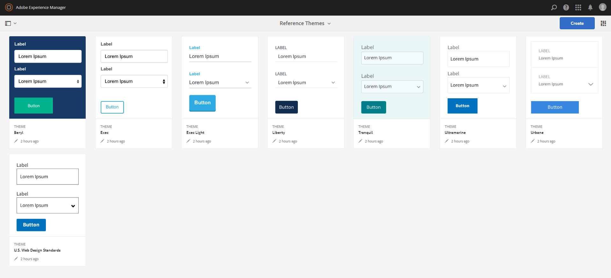
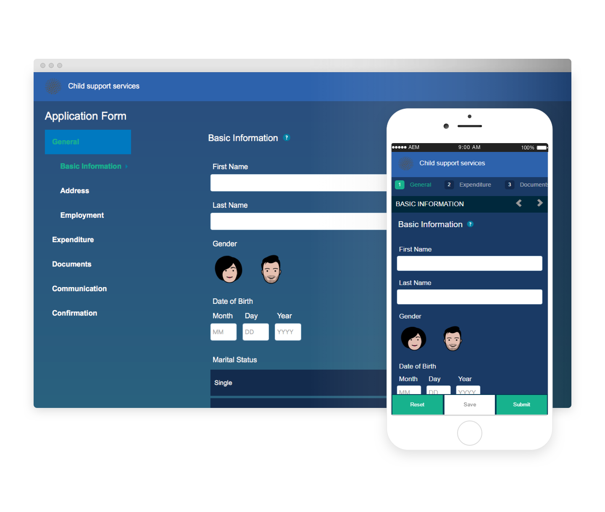
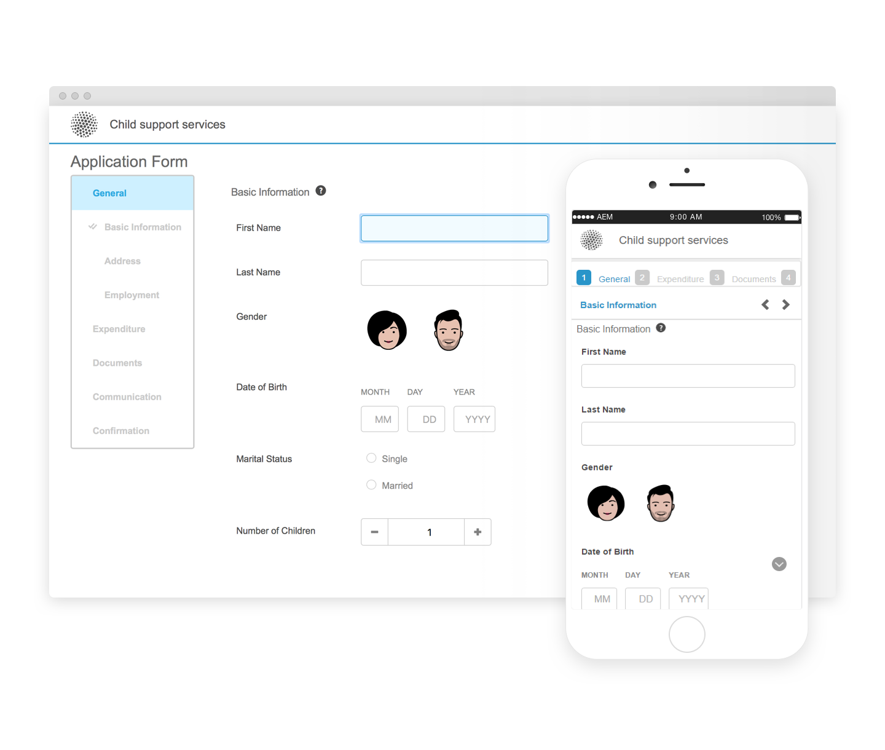
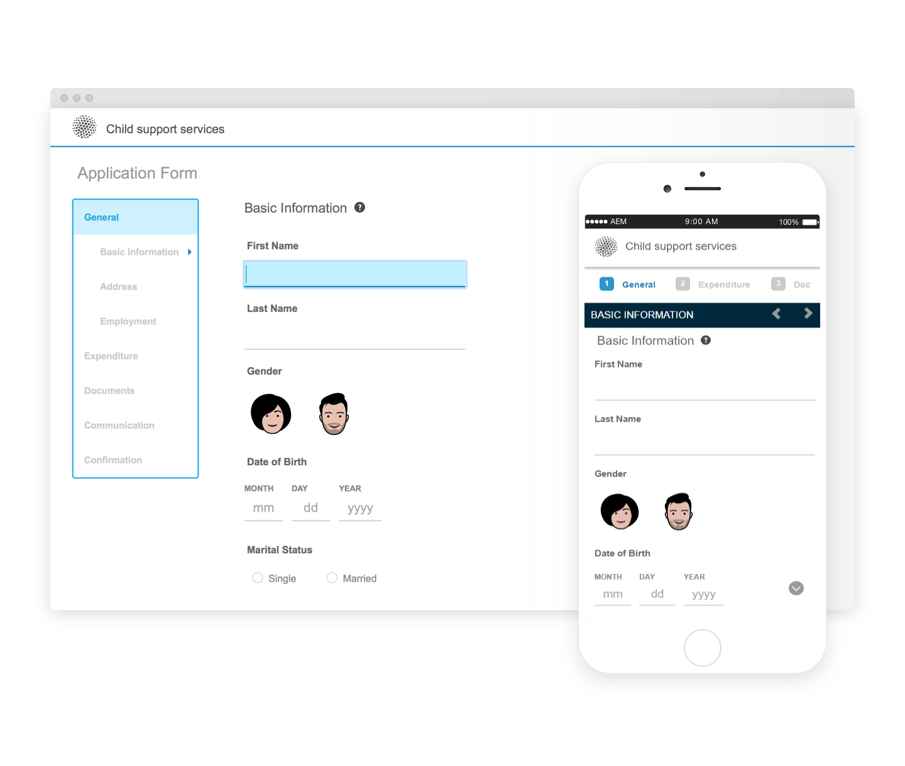
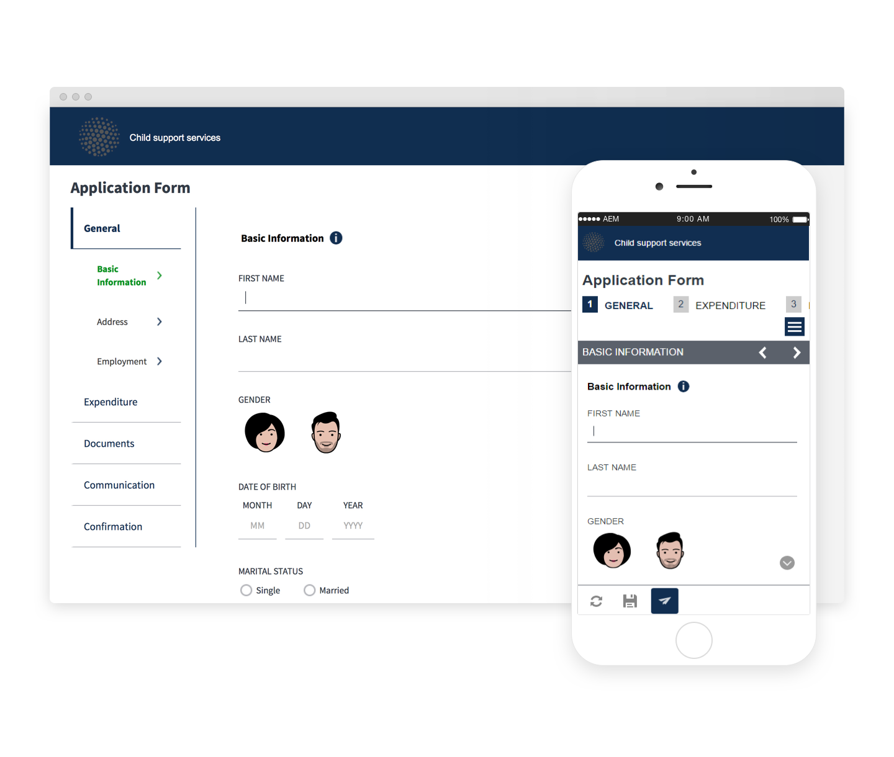
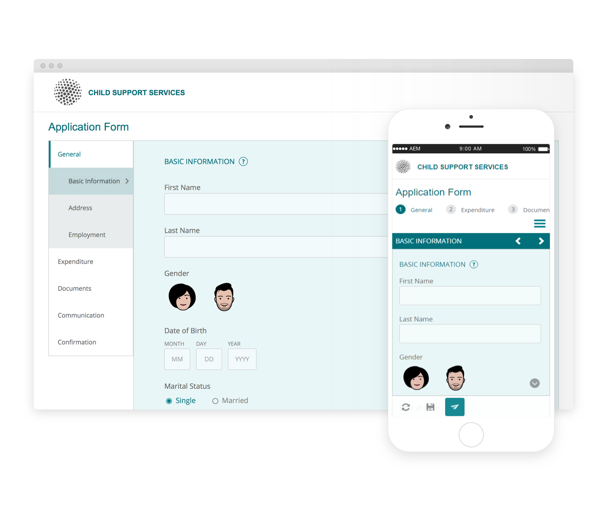
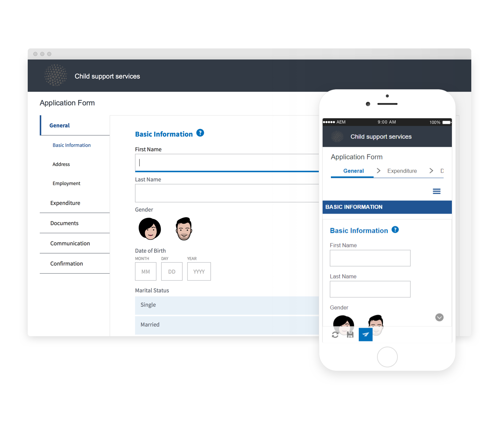
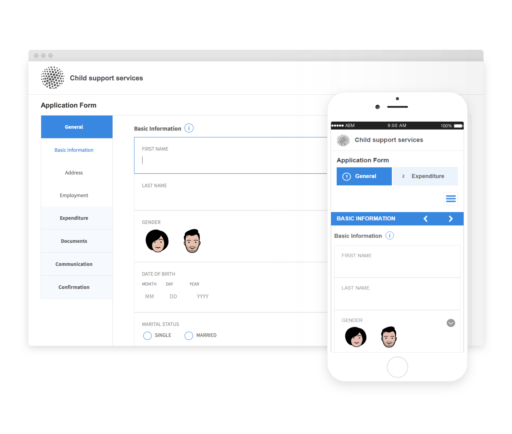
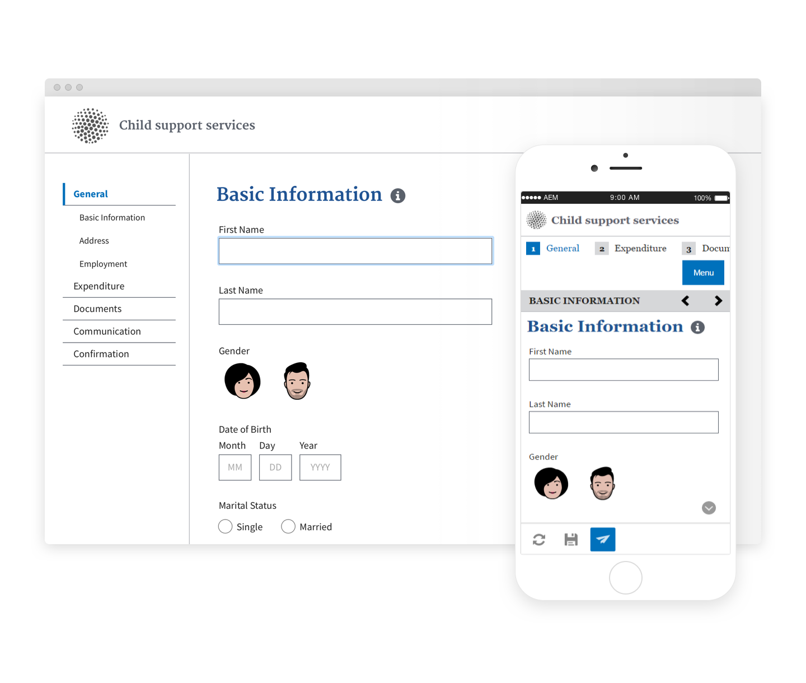

# Reference Themes{#reference-themes}

[Themes](../../forms/using/themes.md) let you style your forms without deep knowledge of CSS. In addition to the default theme, you can get the following themes by installing the [AEM Forms add-on package](https://experienceleague.adobe.com/docs/experience-manager-release-information/aem-release-updates/forms-updates/aem-forms-releases.html?lang=pt-BR):

* Beryl
* Exec
* Exec-Light
* Liberty
* Ultramarine
* Urbane
* U.S. Web Design Standards
* Tranquil

Each theme contains a unique and elegant style that you can use to create delightful adaptive forms for your users. It contains unique styling for selectors such as panel, text box, numeric box, radio button, table, and switch. Stylings in these themes are based on requirement. For example, in a particular scenario you require a minimalist theme with clean fonts. Liberty theme lets you achieve that look.

Themes included in this package are responsive, and styling in these themes are defined for mobile and desktop displays. Most modern browsers on a variety of devices can render forms applied with one of these themes without any hassle.

For more information on installing the package, see [How to Work With Packages](/help/sites-administering/package-manager.md).

## Beryl {#beryl}

Beryl theme is used by We.Gov adaptive form, and emphasizes use of background image, transparency, and large, flat icons. Na captura de tela abaixo, você pode ver como o tema Beryl aparece e como ele pode melhorar o estilo do seu formulário.

<!--
[Click to enlarge

](assets/beryl-1.png)
-->

## Exec {#exec}

O tema de execução evita preenchimentos de plano de fundo sólidos para enfatizar componentes de formulário. Selecionar e clicar em componentes altera as cores da fonte. Em comparação com o tema padrão da Tela de Pintura, a cor da fonte do texto na guia selecionada muda para azul escuro. Observe como os botões de navegação e envio são diferentes do tema Beryl.

<!--
[Click to enlarge

](assets/exec-1.png)
-->

## Luz de execução {#exec-light}

O tema Exec Light usa espaço em branco para criar uma experiência contínua. Os botões Avançar e Enviar obtêm um preenchimento sólido e uma sombra 3D. As guias selecionadas à esquerda recebem uma seta em vez de marcas de seleção dupla.

<!--
[Click to enlarge

](assets/exec-light-1.png)
-->

## Liberty {#liberty}

O tema Liberdade usa uma abordagem minimalista para destacar o importante. Por exemplo, a cor da fonte da guia visitada muda para verde. Você só pode ver o contorno inferior da caixa de texto que emula a aparência de um formulário em papel com linhas. A caixa de texto ativa tem um contorno inferior preto, enquanto outros têm contorno inferior cinza claro.

<!--
[Click to enlarge

](assets/liberty-1.png)
-->

## Tranquilo {#tranquil}

O tema Tranquil fornece tons claros e escuros do esquema de cores Tranquil para destacar diferentes componentes de um formulário. Por exemplo, botões de opção, painéis e guias obtêm um tom diferente de verde.

<!--
[Click to enlarge

](assets/tranquil-1.png)
-->

## Ultramarina {#ultramarine}

O tema ultramarino usa sombras azuis profundas para realçar componentes como guias, painéis, caixas de texto e botões.

<!--[Click to enlarge](assets/ultramarine-1.png)-->

## Urbana {#urbane}

O tema Urbane enfatiza uma aparência minimalista e funcional para o seu formulário. Ao aplicar o tema Urbane ao formulário, você pode ver que os componentes são planos. Os painéis têm contornos finos para criar uma aparência moderna.

<!--
[Click to enlarge

](assets/urbane-1.png)
-->

## Padrões de design da Web nos EUA {#u-s-web-design-standards}

O tema de padrões de design da Web dos EUA, como o nome sugere, usa faces de texto e estilos descritos no site de padrões de design da Web em rascunho dos EUA. O padrão da Web é usado por organizações federais para criar experiências consistentes na Web em sites do governo federal.

<!--
[Click to enlarge

](assets/usgov.png)
-->
