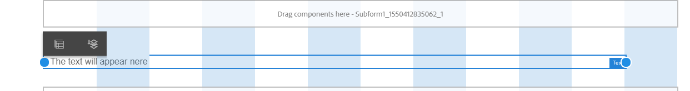
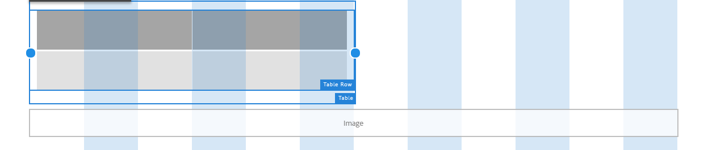

# Usar o modo Layout para redimensionar componentes{#use-layout-mode-to-resize-components}

A interface adaptativa de criação de canais da Web de formulários e comunicações interativas permite redimensionar componentes usando o modo Layout. Arraste e solte pontos azuis dentro de colunas para definir os pontos inicial e final para posicionar os componentes. Os pontos azuis são exibidos após tocar no componente dentro da grade responsiva. A grade responsiva consiste em 12 colunas iguais. O sombreamento de cores branco e azul em colunas alternativas diferencia uma coluna da outra.

Você pode usar o modo Layout para redimensionar componentes para todos os tipos de dispositivos, como desktop, tablet, telefone e outros dispositivos menores. O tablet deriva automaticamente a configuração do layout da versão do desktop e os dispositivos menores derivam a configuração do layout do telefone. Entretanto, é possível substituir as configurações derivadas automaticamente para definir uma configuração diferente para cada tipo de dispositivo.

Se você estiver criando o canal da Web usando o canal [Imprimir como mestre](../../forms/using/create-interactive-communication.md) para uma Comunicação interativa, os componentes disponíveis para redimensionamento também incluirão os subformulários e campos gerados automaticamente no canal da Web usando o canal Imprimir. O canal da Web retém o layout dos elementos do canal de Impressão no modo Layout.

## Modo de layout de acesso {#access-layout-mode}

Selecione **Layout** na lista suspensa que é exibida na parte superior da interface de criação do formulário adaptável e do Interative Communication ao lado da opção **Visualizar** . O formulário é exibido no modo Layout.

1. Faça logon na instância do autor do AEM e navegue até **Adobe Experience Manager** > **Formulários** > **Formulários e documentos**.
1. [Crie um novo](../../forms/using/create-interactive-communication.md) formulário ou abra um formulário adaptativo existente ou uma Comunicação interativa.
1. Selecione **Layout** na lista suspensa que aparece na parte superior ao lado da opção **Visualizar** . O formulário é exibido no modo Layout.

   

## Redimensionar componentes {#resize-components}

1. No modo Layout, toque no componente para redimensioná-lo. Os pontos azuis são exibidos no início e no final da grade responsiva.
1. Arraste e solte os pontos azuis para definir a posição do componente na grade responsiva.

   

   A barra de ferramentas que é exibida após tocar nos componentes consiste nas seguintes opções:

   * **Pai:** Selecione o pai de um componente.
   * **Flutuar para nova linha:** Alterne o componente para a linha seguinte se houver vários componentes dentro da mesma linha.
   Você pode desfazer todas as alterações de redimensionamento e aplicar o layout padrão ao painel que contém componentes redimensionados usando a opção **[!UICONTROL Reverter layout]** do ponto de interrupção ( ). Toque no pai do componente redimensionado para exibir a opção.

   >[!NOTE]
   >
   >Não é possível redimensionar a coluna da tabela, a barra de ferramentas, o botão da barra de ferramentas e os componentes da área de destino usando o modo Layout. Use o modo Estilo para redimensionar esses componentes.

### Exemplo {#example}

**Objetivo:** Você deseja inserir um componente de tabela e um componente de Imagem e posicioná-los paralelamente entre si em uma Comunicação interativa.

1. Insira os componentes de tabela e imagem usando o modo Editar no canal da Web. O componente de imagem é exibido após o componente de tabela.
1. Alterne para o modo Layout e toque no componente Tabela. Os pontos azuis para redimensionar o componente são exibidos nas colunas 1 e 12.
1. Arraste e solte o ponto azul na coluna 12 para a coluna 6 da grade responsiva.

   

1. Da mesma forma, selecione o componente de Imagem e arraste e solte o ponto azul na coluna 1 para a coluna 7 da grade responsiva. Os componentes de tabela e imagem são exibidos em paralelo.

   

   Você pode selecionar o componente de Imagem e tocar na opção **Flutuar para uma nova linha** disponível na barra de ferramentas para deslocar o componente de Imagem para a próxima linha.

## Redimensionar painéis {#resize-panels-layout-mode}

Execute as seguintes etapas se quiser redimensionar o painel inteiro em vez de componentes individuais:

1. Toque em qualquer um dos componentes no painel que deseja redimensionar, selecione e selecione a primeira opção na lista suspensa, se o painel for o pai imediato do componente.

   Os pontos azuis são exibidos no início e no final da grade responsiva.

1. Arraste e solte os pontos azuis para definir a posição do painel na grade responsiva.
Você pode repetir as etapas 1 e 2 e selecionar  para deslocar o painel redimensionado para a linha seguinte.

## Definir o layout de várias colunas para um painel

Execute as seguintes etapas para definir o número de colunas de um painel:

1. No modo **[!UICONTROL Editar]** , toque no painel, selecione e selecione **[!UICONTROL Responsivo - tudo na página sem a opção de navegação]** na lista suspensa Layout **[!UICONTROL do]** painel.

1. Toque em  para salvar as propriedades.

1. No modo **[!UICONTROL Layout]** , toque em qualquer um dos componentes no painel, selecione e selecione o painel.

1. Toque em  e selecione o número de colunas na lista suspensa. O número de colunas pode variar de 1 a 12. O painel é dividido em um layout de várias colunas.

## Habilitar a nova grade responsiva para layouts responsivos antigos {#enableresponsivegrid}

Ative a nova grade responsiva para formulários criados usando o AEM Forms 6.4 ou versão anterior para redimensionar componentes.

>[!NOTE]
>
>A alternância para a nova grade responsiva descarta as propriedades de layout já definidas para os componentes usados no formulário.

Execute as seguintes etapas para ativar a nova grade responsiva:

1. Selecione **Layout** na lista suspensa que aparece na parte superior ao lado da opção **Visualizar** . Uma confirmação para ativar o modo Layout é exibida.
1. Toque em **Sim** para ativar o modo **Layout** para o formulário.

### Incorporar um fragmento antigo em um formulário adaptável com novo layout responsivo {#embed-an-old-fragment-in-an-adaptive-form-with-new-responsive-layout}

O novo layout responsivo para formulário adaptável permite adicionar um fragmento de formulário adaptável com o layout responsivo antigo ao formulário. Entretanto, o novo layout descarta as propriedades de layout já definidas para os componentes usados no fragmento. Você pode alternar para o modo Layout para definir as propriedades de layout para os componentes usados no fragmento.

### Incorporar um fragmento com novo layout responsivo em um formulário adaptável antigo {#embed-a-fragment-with-new-responsive-layout-in-an-old-adaptive-form}

Se um fragmento for incorporado ao novo layout responsivo em um formulário adaptável com um layout responsivo antigo, o sistema solicitará que você ative o modo Layout para o formulário e reincorpore o fragmento.

Para ativar o modo Layout, selecione **Layout** na lista suspensa que aparece na parte superior ao lado da opção **Visualizar** e toque em **Sim** para confirmar. Selecione o modo **Editar** para reincorporar o fragmento.

## Desativar o modo Layout para formulários com layout responsivo antigo {#disable-layout-mode-for-forms-with-old-responsive-layout}

É possível desativar o modo Layout para formulários com layout responsivo antigo editando as propriedades para o modelo usado no formulário.

Execute as seguintes etapas para desativar o modo Layout:

1. Selecione **[!UICONTROL Ferramentas]** > **[!UICONTROL Geral]** > **[!UICONTROL Modelos]** e abra o modelo usado no formulário no modo **[!UICONTROL Editar]** .
1. Selecione o Contêiner de documento no painel esquerdo e toque em **[!UICONTROL Política.]**

   

1. Toque na guia Configurações **[!UICONTROL de]** layout e selecione **[!UICONTROL Desativar modo]** de layout.
1. Toque em  para salvar as propriedades do modelo.

