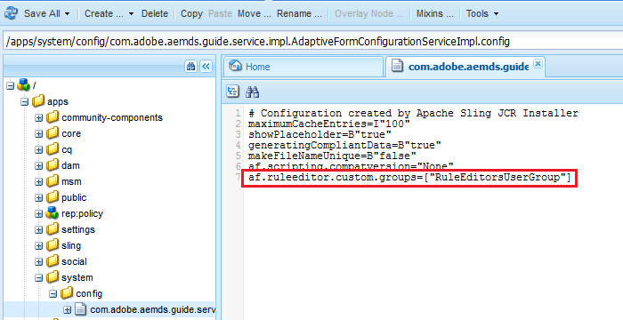

# Conceder acesso ao editor de regras para grupos de usuários selecionados{#grant-rule-editor-access-to-select-user-groups}

## Visão geral {#overview}

Você pode ter diferentes tipos de usuários com habilidades variadas que trabalham com formulários adaptáveis. Embora os usuários especialistas tenham o conhecimento certo para trabalhar com scripts e regras complexas, pode haver usuários básicos que precisam trabalhar somente com o layout e as propriedades básicas dos formulários adaptáveis.

O AEM Forms permite limitar o acesso do editor de regras aos usuários com base em sua função ou função. Nas configurações do Serviço de configuração de formulários adaptáveis, você pode especificar os [grupos de usuários](/help/sites-administering/security.md) que podem visualizar e acessar o editor de regras.

## Especificar grupos de usuários que podem acessar o editor de regras {#specify-user-groups-that-can-access-rule-editor}

1. Faça logon no AEM Forms como administrador.
1. Na instância do autor, clique em Adobe Experience Manager > Ferramentas  > Operações > Console da Web. O Console da Web é aberto em uma nova janela.

   

1. Na janela Console da Web, localize e clique em **[!UICONTROL Adaptive Form e Interative Communication Web Channel Configuration]**. **[!UICONTROL A caixa de diálogo Adaptive Form and Interative Communication Web Channel]** Configuration (Formulário adaptável e comunicação interativa) é exibida. Não altere nenhum valor e clique em **Save**.

   Ele cria um arquivo /apps/system/config/com.adobe.aemds.guide.service.impl.AdaptiveFormConfigurationServiceImpl.config no CRX-repository.

1. Faça logon no CRXDE como administrador. Abra o arquivo /apps/system/config/com.adobe.aemds.guide.service.impl.AdaptiveFormConfigurationServiceImpl.config para edição.
1. Use a propriedade a seguir para especificar o nome de um grupo que pode acessar o editor de regras (por exemplo, RuleEditorsUserGroup) e clique em **Salvar tudo**.

   `af.ruleeditor.custom.groups=["RuleEditorsUserGroup"]`

   Para habilitar o acesso de vários grupos, especifique uma lista de valores separados por vírgula:

   `af.ruleeditor.custom.groups=["RuleEditorsUserGroup", "PermittedUserGroup"]`

   

   Agora, quando um usuário que não faz parte de um grupo de usuários especificado (aqui RuleEditorsUserGroup) toca em um campo, o ícone Editar Regra ( ) não está disponível para ela na barra de ferramentas de componentes:

   

   Barra de ferramentas Componentes visível para um usuário com acesso ao editor de regras

   

   Barra de ferramentas Componentes visível para um usuário sem acesso ao editor de regras

   Para obter instruções sobre como adicionar usuários a grupos, consulte [Administração e segurança do usuário](/help/sites-administering/security.md).

