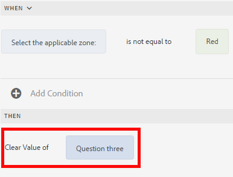
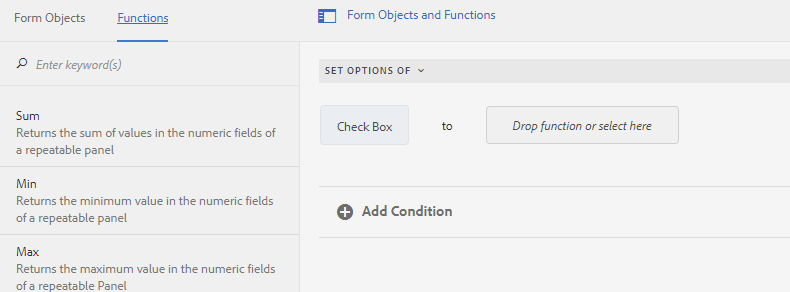

# Editor de regras para formulários adaptáveis{#adaptive-forms-rule-editor}

## Visão geral {#overview}

O recurso de editor de regras no Adobe Experience Manager Forms permite que usuários e desenvolvedores de empresas criem regras em objetos de formulário adaptáveis. Essas regras definem ações para acionar objetos de formulário com base em condições predefinidas, entradas do usuário e ações do usuário no formulário. Ele ajuda a simplificar ainda mais a experiência de preenchimento de formulários, garantindo a precisão e a velocidade.

O editor de regras fornece uma interface de usuário intuitiva e simplificada para gravar regras. O editor de regras oferta um editor visual para todos os usuários. Além disso, somente para usuários avançados de formulários, o editor de regras fornece um editor de código para gravar regras e scripts. Algumas das ações principais que podem ser executadas em objetos de formulário adaptáveis usando regras são:

* Mostrar ou ocultar um objeto
* Ativar ou desativar um objeto
* Definir um valor para um objeto
* Validar o valor de um objeto
* Executar funções para calcular o valor de um objeto
* Chame um serviço de modelo de dados de formulário e execute uma operação
* Definir propriedade de um objeto

O editor de regras substitui os recursos de script no AEM 6.1 Forms e em versões anteriores. No entanto, os scripts existentes são preservados no novo editor de regras. Para obter mais informações sobre como trabalhar com scripts existentes no editor de regras, consulte [Impacto do editor de regras em scripts](../../forms/using/rule-editor.md#p-impact-of-rule-editor-on-existing-scripts-p)existentes.

Os usuários adicionados ao grupo de usuários avançados para formulários podem criar novos scripts e editar os existentes. Os usuários do grupo de usuários de formulários podem usar os scripts, mas não podem criar ou editar scripts.

## Como entender uma regra {#understanding-a-rule}

Uma regra é uma combinação de ações e condições. No editor de regras, as ações incluem atividades como ocultar, mostrar, ativar, desativar ou calcular o valor de um objeto em um formulário. As condições são expressões booleanas avaliadas pela execução de verificações e operações no estado, valor ou propriedade de um objeto de formulário. As ações são executadas com base no valor ( `True` ou `False`) retornado pela avaliação de uma condição.

O editor de regras fornece um conjunto de tipos de regras predefinidos, como Quando, Mostrar, Ocultar, Ativar, Desativar, Definir valor de e Validar para ajudar a gravar regras. Cada tipo de regra permite que você defina condições e ações em uma regra. O documento explica mais detalhadamente cada tipo de regra.

Uma regra geralmente segue uma das seguintes construções:

**Condição-Ação** Nesta construção, uma regra define primeiro uma condição seguida de uma ação a ser acionada. A construção é comparável à declaração if-then em linguagens de programação.

No editor de regras, o tipo de regra **Quando** impõe a construção condição-ação.

**Condição** de ação Nesta construção, uma regra primeiro define uma ação a ser acionada seguida de condições para avaliação. Outra variação dessa construção é a ação action-condition-alternativo, que também define uma ação alternativa a ser acionada se a condição retornar False.

Os tipos de regras Mostrar, Ocultar, Ativar, Desativar, Definir valor de e Validar no editor de regras impõem a construção da regra de condição de ação. Por padrão, a ação alternativa para Mostrar é Ocultar e para Ativar é Desativar e vice-versa. Não é possível alterar a ação alternativa padrão.

>[!NOTE]
>
>Os tipos de regras disponíveis, incluindo condições e ações que você define no editor de regras, também dependem do tipo de objeto de formulário no qual você está criando uma regra. O editor de regras exibe apenas tipos de regras e opções válidos para gravar declarações de condição e de ação para um tipo de objeto de formulário específico. Por exemplo, os tipos de regras Validate, Set Value Of, Enable e Disable não são exibidos para um objeto de painel.

Para obter mais informações sobre os tipos de regras disponíveis no editor de regras, consulte Tipos de regras [disponíveis no editor](../../forms/using/rule-editor.md#p-available-rule-types-in-rule-editor-p)de regras.

### Diretrizes para escolher uma construção de regra {#guidelines-for-choosing-a-rule-construct}

Embora seja possível obter a maioria dos casos de uso usando qualquer construção de regra, veja algumas diretrizes para escolher uma construção em vez de outra. Para obter mais informações sobre as regras disponíveis no editor de regras, consulte Tipos de regras [disponíveis no editor](../../forms/using/rule-editor.md#p-available-rule-types-in-rule-editor-p)de regras.

* Uma regra típica do polegar ao criar uma regra é pensar nela no contexto do objeto no qual você está escrevendo uma regra. Considere que você deseja ocultar ou mostrar o campo B com base no valor especificado por um usuário no campo A. Nesse caso, você está avaliando uma condição no campo A e, com base no valor retornado, está acionando uma ação no campo B.

   Portanto, se você estiver escrevendo uma regra no campo B (o objeto no qual você está avaliando uma condição), use a construção condição-ação ou o tipo de regra Quando. Da mesma forma, use a construção da condição de ação ou o tipo de regra Mostrar ou Ocultar no campo A.

* Às vezes, é necessário executar várias ações com base em uma condição. Nesses casos, é recomendável usar a construção de condição-ação. Nesta construção, você pode avaliar uma condição uma vez e especificar várias declarações de ação.

   Por exemplo, para ocultar os campos B, C e D com base na condição que verifica o valor que um usuário especifica no campo A, escreva uma regra com construção condição-ação ou Quando tipo de regra no campo A e especifique ações para controlar a visibilidade dos campos B, C e D. Caso contrário, você precisará de três regras separadas nos campos B, C e D, onde cada regra verifica a condição e mostra ou oculta o respectivo campo. Neste exemplo, é mais eficiente gravar o tipo de regra Quando em um objeto em vez de Mostrar ou Ocultar tipo de regra em três objetos.

* Para acionar uma ação com base em várias condições, é recomendável usar a construção de condição de ação. Por exemplo, para mostrar e ocultar o campo A avaliando as condições nos campos B, C e D, use Mostrar ou Ocultar tipo de regra no campo A.
* Use condição-ação ou construção de condição de ação se a regra contiver uma ação para uma condição.
* Se uma regra verificar uma condição e executar uma ação imediatamente após fornecer um valor em um campo ou sair de um campo, é recomendável gravar uma regra com construção condição-ação ou o tipo de regra Quando no campo em que a condição é avaliada.
* A condição na regra Quando é avaliada quando um usuário altera o valor do objeto no qual a regra Quando é aplicada. No entanto, se você quiser que a ação seja acionada quando o valor mudar no lado do servidor, como no caso de pré-preencher o valor, é recomendável gravar uma regra Quando que aciona a ação quando o campo é inicializado.
* Ao gravar regras para objetos de menu suspenso, botões de opção ou caixas de seleção, as opções ou valores desses objetos de formulário no formulário são preenchidos previamente no editor de regras.

## Tipos de operadores e eventos disponíveis no editor de regras {#available-operator-types-and-events-in-rule-editor}

O editor de regras fornece os operadores lógicos e eventos a seguir que podem ser usados para criar regras.

* **É Igual a**
* **Não é Igual a**
* **Start com**
* **Termina com**
* **Contém**
* **Está vazio**
* **Não está vazio**
* **Selecionou:** Retorna true quando o usuário seleciona uma opção específica para um botão de opção, caixa suspensa.
* **É inicializado (evento):** Retorna true quando um objeto de formulário é renderizado no navegador.
* **É alterado (evento):** Retorna true quando o usuário altera o valor inserido ou a opção selecionada para um objeto de formulário.

## Tipos de regras disponíveis no editor de regras {#available-rule-types-in-rule-editor}

O editor de regras fornece um conjunto de tipos de regras predefinidos que você pode usar para gravar regras. Vejamos cada tipo de regra em detalhes. Para obter mais informações sobre como escrever regras no editor de regras, consulte [Gravar regras](../../forms/using/rule-editor.md#p-write-rules-p).

### Quando {#whenruletype}

O tipo de regra **When** segue a construção da regra de ação **** condição-ação-alternativa ou, às vezes, apenas a construção **condição-ação** . Nesse tipo de regra, você primeiro especifica uma condição para avaliação seguida por uma ação a ser acionada se a condição for atendida ( `True`). Ao usar o tipo de regra Quando, você pode usar vários operadores E e OU para criar expressões [aninhadas](#nestedexpressions).

Usando o tipo de regra Quando, é possível avaliar uma condição em um objeto de formulário e executar ações em um ou mais objetos.

Em palavras simples, uma regra Quando comum é estruturada da seguinte maneira:

`When on Object A:`

`(Condition 1 AND Condition 2 OR Condition 3) is TRUE;`

`Then, do the following:`

Ação 2 relativa ao objeto B;
ANDAção 3 relativa ao objeto C;

_

Quando você tem um componente de vários valores, como botões de opção ou lista, ao criar uma regra para esse componente, as opções são recuperadas automaticamente e disponibilizadas ao criador da regra. Não é necessário digitar os valores de opção novamente.

Por exemplo, uma lista tem quatro opções: Vermelho, Azul, Verde e Amarelo. Ao criar a regra, as opções (botões de opção) são recuperadas automaticamente e disponibilizadas ao criador da regra da seguinte forma:


Ao escrever uma regra Quando, você pode acionar a ação Limpar valor de. A ação Limpar valor de apaga o valor do objeto especificado. Ter Valor limpo como uma opção na instrução Quando permite criar condições complexas com vários campos.



**Ocultar** Oculta o objeto especificado.

**Mostrar** Mostra o objeto especificado.

**Ativar** Ativa o objeto especificado.

**Desativar** Desativa o objeto especificado.

**Invocar serviço** Chama um serviço configurado em um modelo de dados de formulário. Quando você escolhe a operação Chamar serviço, um campo é exibido. Ao tocar no campo, ele exibe todos os serviços configurados em todos os modelos de dados de formulário em sua instância do AEM. Ao escolher um serviço de modelo de dados de formulário, são exibidos campos adicionais nos quais é possível mapear objetos de formulário com parâmetros de entrada e saída para o serviço especificado. Consulte regra de exemplo para chamar serviços de modelo de dados de formulário.

Além do serviço de modelo de dados de formulário, você pode especificar um URL WSDL direto para chamar um serviço da Web. No entanto, um serviço de modelo de dados de formulário tem muitos benefícios e a abordagem recomendada para chamar um serviço.

Para obter mais informações sobre como configurar serviços no modelo de dados de formulário, consulte Integração [de dados do](/help/forms/using/data-integration.md)AEM Forms.

**Defina o valor de** Calcula e define o valor do objeto especificado. Você pode definir o valor do objeto como uma string, o valor de outro objeto, o valor calculado usando a expressão ou função matemática, o valor de uma propriedade de um objeto ou o valor de saída de um serviço de modelo de dados de formulário configurado. Quando você escolhe a opção de serviço da Web, ela exibe todos os serviços configurados em todos os modelos de dados de formulário na instância do AEM. Ao escolher um serviço de modelo de dados de formulário, são exibidos campos adicionais nos quais é possível mapear objetos de formulário com parâmetros de entrada e saída para o serviço especificado.

Para obter mais informações sobre como configurar serviços no modelo de dados de formulário, consulte Integração [de dados do](/help/forms/using/data-integration.md)AEM Forms.

O tipo de regra **Definir propriedade** permite definir o valor de uma propriedade do objeto especificado com base em uma ação de condição.

Ele permite que você defina regras para adicionar caixas de seleção dinamicamente ao formulário adaptável. É possível usar uma função personalizada, um objeto de formulário ou uma propriedade de objeto para definir uma regra.


Para definir uma regra com base em uma função personalizada, selecione Saída **da** função na lista suspensa e arraste e solte uma função personalizada na guia **Funções** . Se a ação da condição for cumprida, o número de caixas de seleção definidas na função personalizada será adicionado ao formulário adaptável.

Para definir uma regra com base em um objeto de formulário, selecione Objeto **de** formulário na lista suspensa e arraste e solte um objeto de formulário na guia Objetos **de** formulário. Se a ação da condição for cumprida, o número de caixas de seleção definidas no objeto de formulário será adicionado ao formulário adaptável.

Uma regra Definir propriedade com base em uma propriedade de objeto permite adicionar o número de caixas de seleção em um formulário adaptável com base em outra propriedade de objeto incluída no formulário adaptável.

A figura a seguir descreve um exemplo de adição dinâmica de caixas de seleção com base no número de listas suspensas no formulário adaptável:


**Limpar valor** Limpa o valor do objeto especificado.

**Definir foco** define o foco no objeto especificado.

**Salvar formulário** Salva o formulário.

**Enviar formulários** Envia o formulário.

**Redefinir formulário** Redefine o formulário.

**Validar formulário** Valida o formulário.

**Adicionar instância** Adiciona uma instância do painel repetitivo ou da linha de tabela especificada.

**Remover instância** Remove uma instância do painel repetitivo ou da linha de tabela especificada.

**Navegue até** Navega para outras Comunicações interativas, formulários adaptáveis, outros ativos, como imagens ou fragmentos de documentos, ou um URL externo. Para obter mais informações, consulte o botão [Adicionar à comunicação](../../forms/using/create-interactive-communication.md#addbuttontothewebchannel)interativa.

### Definir valor de {#set-value-of}

O tipo de regra **[!UICONTROL Definir valor]** permite definir o valor de um objeto de formulário, dependendo se a condição especificada é atendida ou não. O valor pode ser definido como um valor de outro objeto, uma string literal, um valor derivado de uma expressão matemática ou uma função, um valor de uma propriedade de outro objeto ou a saída de um serviço de modelo de dados de formulário. Da mesma forma, é possível verificar se há uma condição em um componente, string, propriedade ou valores derivados de uma função ou expressão matemática.

Observe que o tipo de regra Definir valor de não está disponível para todos os objetos de formulário, como painéis e botões da barra de ferramentas. Uma regra Definir valor de conjunto padrão tem a seguinte estrutura:


Defina o valor do Objeto A como:

(string ABC) OR(propriedade de objeto X do Objeto C) OR(valor de uma função) OR(valor de uma expressão matemática) OR(valor de saída de um serviço de modelo de dados ou serviço da Web);

Quando (opcional):

(Condição 1 E Condição 2 E Condição 3) é VERDADEIRO;


O exemplo a seguir pega o valor no `dependentid` campo como entrada e define o valor do `Relation` campo como a saída do `Relation` argumento do serviço de modelo de dados de `getDependent` formulário.


Exemplo de regra Definir valor usando o serviço de modelo de dados de formulário

>[!NOTE]
>
>Além disso, você pode usar Definir valor da regra para preencher todos os valores em um componente de lista suspenso a partir da saída de um serviço de modelo de dados de formulário ou de um serviço da Web. No entanto, verifique se o argumento de saída escolhido é de um tipo de matriz. Todos os valores retornados em uma matriz ficam disponíveis na lista suspensa especificada.

### Mostrar {#show}

Usando o tipo de regra **Mostrar** , é possível gravar uma regra para mostrar ou ocultar um objeto de formulário com base no fato de uma condição ser atendida ou não. O tipo de regra Mostrar também aciona a ação Ocultar caso a condição não seja atendida ou retorne `False`.

Uma regra de Mostrar típica está estruturada da seguinte maneira:


`Show Object A;`

`When:`

`(Condition 1 OR Condition 2 OR Condition 3) is TRUE;`

`Else:`

`Hide Object A;`


### Ocultar {#hide}

Semelhante ao tipo de regra Mostrar, você pode usar o tipo de regra **Ocultar** para mostrar ou ocultar um objeto de formulário com base no fato de uma condição ser atendida ou não. O tipo de regra Ocultar também aciona a ação Mostrar caso a condição não seja atendida ou retorne `False`.

Uma regra de Ocultar típica está estruturada da seguinte maneira:


`Hide Object A;`

`When:`

`(Condition 1 AND Condition 2 AND Condition 3) is TRUE;`

`Else:`

`Show Object A;`


### Ativar {#enable}

O tipo de regra **Ativar** permite ativar ou desativar um objeto de formulário com base no fato de uma condição ser atendida ou não. O tipo de regra Ativar também aciona a ação Desativar caso a condição não seja atendida ou retorne `False`.

Uma regra Ativar típica está estruturada da seguinte maneira:


`Enable Object A;`

`When:`

`(Condition 1 AND Condition 2 AND Condition 3) is TRUE;`

`Else:`

`Disable Object A;`


### Desativar {#disable}

Semelhante ao tipo de regra Ativar, o tipo de regra **Desativar** permite ativar ou desativar um objeto de formulário com base no cumprimento ou não de uma condição. O tipo de regra Disable também aciona a ação Enable caso a condição não seja atendida ou retorne `False`.

Uma regra de desativação típica está estruturada da seguinte maneira:


`Disable Object A;`

`When:`

`(Condition 1 OR Condition 2 OR Condition 3) is TRUE;`

`Else:`

`Enable Object A;`

### Validar {#validate}

O tipo de regra **Validar** valida o valor em um campo usando uma expressão. Por exemplo, você pode gravar uma expressão para verificar se a caixa de texto para especificar o nome não contém caracteres ou números especiais.

Uma regra de Validação típica está estruturada da seguinte maneira:

`Validate Object A;`

`Using:`

`(Expression 1 AND Expression 2 AND Expression 3) is TRUE;`

>[!NOTE]
>
>Se o valor especificado não estiver em conformidade com a regra Validar, você poderá exibir uma mensagem de validação para o usuário. Você pode especificar a mensagem no campo de mensagem **[!UICONTROL de validação de]** script nas propriedades do componente na barra lateral.


### Set Options Of {#setoptionsof}

O tipo de regra **Definir opções de** permite definir regras para adicionar caixas de seleção dinamicamente ao formulário adaptável. É possível usar um modelo de dados de formulário ou uma função personalizada para definir a regra.

Para definir uma regra com base em uma função personalizada, selecione Saída **da** função na lista suspensa e arraste e solte uma função personalizada na guia **Funções** . O número de caixas de seleção definido na função personalizada é adicionado ao formulário adaptável.



Para criar uma função personalizada, consulte funções [personalizadas no editor](#custom-functions)de regras.

Para definir uma regra com base em um modelo de dados de formulário:

1. Selecione Saída **de** serviço na lista suspensa.
1. Selecione o objeto de modelo de dados.
1. Selecione uma propriedade de objeto de modelo de dados na lista suspensa **Exibir valor** . O número de caixas de seleção no formulário adaptável é derivado do número de instâncias definidas para essa propriedade no banco de dados.
1. Selecione uma propriedade de objeto de modelo de dados na lista suspensa **Salvar Valor** .


## Compreensão da interface do usuário do editor de regras {#understanding-the-rule-editor-user-interface}

O editor de regras fornece uma interface de usuário abrangente, mas simples, para gravar e gerenciar regras. Você pode iniciar a interface de usuário do editor de regras a partir de um formulário adaptável no modo de criação.

Para iniciar a interface do usuário do editor de regras:

1. Abra um formulário adaptável no modo de criação.
1. Toque no objeto de formulário para o qual deseja gravar uma regra e, na Barra de ferramentas do componente, toque em . A interface do usuário do editor de regras é exibida.

   

   Todas as regras existentes nos objetos de formulário selecionados são listadas nesta visualização. Para obter informações sobre como gerenciar regras existentes, consulte [Gerenciar regras](../../forms/using/rule-editor.md#p-manage-rules-p).

1. Toque em **[!UICONTROL Criar]** para gravar uma nova regra. O editor visual da interface do usuário do editor de regras é aberto por padrão quando você inicia o editor de regras pela primeira vez.
[Interface do usuário do editor 

   Clique para visualização da imagem ampliada

   ](assets/rule-editor-ui-1.png)Vamos analisar cada componente da interface do usuário do editor de regras em detalhes.

### A. Exibição de regra de componente {#a-component-rule-display}

Exibe o título do objeto de formulário adaptável pelo qual você iniciou o editor de regras e o tipo de regra selecionado no momento. No exemplo acima, o editor de regras é iniciado a partir de um objeto de formulário adaptável chamado Salário e o tipo de regra selecionado é Quando.

### B. Form objects and functions {#b-form-objects-and-functions-br}

O painel à esquerda na interface do usuário do editor de regras inclui duas guias: **[!UICONTROL Objetos]** e **[!UICONTROL funções]** do Forms.

A guia Objetos de formulário mostra uma visualização hierárquica de todos os objetos contidos no formulário adaptável. Ele exibe o título e o tipo dos objetos. Ao gravar uma regra, é possível arrastar e soltar objetos de formulário no editor de regras. Ao criar ou editar uma regra quando você arrasta e solta um objeto ou função em um espaço reservado, o espaço reservado automaticamente usa o tipo de valor apropriado.

Os objetos de formulário com uma ou mais regras válidas aplicadas são marcados com um ponto verde. Se qualquer regra aplicada a um objeto de formulário for inválida, o objeto de formulário será marcado com um ponto Amarelo.

A guia Funções inclui um conjunto de funções incorporadas, como Soma de, Mín de, Máx. de, Média de, Número de e Validar Formulário. É possível usar essas funções para calcular valores em painéis repetitivos e linhas de tabela e usá-los em declarações de ação e condição ao gravar regras. Entretanto, também é possível criar funções [](#custom-functions) personalizadas.


>[!NOTE]
>
>É possível realizar uma pesquisa de texto em objetos e nomes de funções e títulos nas guias Objetos e Funções do Forms.

Na árvore esquerda dos objetos de formulário, é possível tocar nos objetos para exibir as regras aplicadas a cada um dos objetos. Além de navegar pelas regras dos diversos objetos de formulário, também é possível copiar e colar regras entre os objetos de formulário. Para obter mais informações, consulte [Copiar regras](../../forms/using/rule-editor.md#p-copy-paste-rules-p)de colagem.

### C. Objetos de formulário e funções alternadas {#c-form-objects-and-functions-toggle-br}

O botão de alternância, quando tocado, alterna os objetos de formulário e o painel de funções.

### D. Editor de regras visuais {#d-visual-rule-editor}

O editor de regras visuais é a área no modo editor visual da interface do usuário do editor de regras onde você grava regras. Ela permite selecionar um tipo de regra e, consequentemente, definir condições e ações. Ao definir condições e ações em uma regra, você pode arrastar e soltar objetos de formulário e funções do painel Objetos de formulário e Funções.

Para obter mais informações sobre como usar o editor de regras visuais, consulte [Gravar regras](../../forms/using/rule-editor.md#p-write-rules-p).

### E. Comutador de editores de código visual {#e-visual-code-editors-switcher}

Os usuários do grupo de usuários avançados de formulários podem acessar o editor de código. Para outros usuários, o editor de código não está disponível. Se você tiver os direitos, poderá alternar do modo editor visual para o modo editor de código do editor de regras, e vice-versa, usando o alternador logo acima do editor de regras. Quando você inicia o editor de regras pela primeira vez, ele é aberto no modo editor visual. Você pode gravar regras no modo editor visual ou alternar para o modo editor de código para gravar um script de regra. No entanto, observe que se você modificar uma regra ou gravar uma regra no editor de código, não poderá alternar de volta para o editor visual dessa regra, a menos que você limpe o editor de código.

O AEM Forms rastreia o modo de editor de regras usado por último para gravar uma regra. Quando você iniciar o editor de regras na próxima vez, ele será aberto nesse modo. No entanto, também é possível configurar um modo padrão para abrir o editor de regras no modo especificado. Para isso:

1. Vá para o console da Web do AEM em `https://[host]:[port]/system/console/configMgr`.
1. Clique para editar o Serviço **** de configuração de formulário adaptável.
1. escolha o Editor **** visual ou o Editor **** de código no modo **[!UICONTROL padrão do menu suspenso Editor]** de regras

1. Clique em **[!UICONTROL Salvar]**.

### F. Botões Concluído e cancelar {#f-done-and-cancel-buttons}

O botão **[!UICONTROL Concluído]** é usado para salvar uma regra. É possível salvar uma regra incompleta. No entanto, incompletos são inválidos e não são executados. As regras salvas em um objeto de formulário são listadas quando você inicia o editor de regras na próxima vez a partir do mesmo objeto de formulário. É possível gerenciar regras existentes nessa visualização. Para obter mais informações, consulte [Gerenciar regras](../../forms/using/rule-editor.md#p-manage-rules-p).

O botão **[!UICONTROL Cancelar]** descarta todas as alterações feitas em uma regra e fecha o editor de regras.

## Regras de gravação {#write-rules}

Você pode escrever regras usando o editor de regras visuais ou o editor de códigos. Quando você inicia o editor de regras pela primeira vez, ele é aberto no modo editor visual. Você pode alternar para o modo editor de código e para as regras de gravação. Entretanto, observe que se você gravar ou modificar uma regra no editor de código, não poderá alternar para o editor visual dessa regra a menos que limpe o editor de código. Quando você iniciar o editor de regras na próxima vez, ele será aberto no modo usado pela última vez para criar a regra.

Vamos primeiro ver como escrever regras usando o editor visual.

### Uso do editor visual {#using-visual-editor}

Vamos entender como criar uma regra no editor visual usando o seguinte formulário de exemplo.


A seção Requisitos de Empréstimo no formulário de pedido de empréstimo de exemplo exige que os requerentes especifiquem o seu estado civil, salário e, se forem casados, o salário do cônjuge. Com base nos dados de entrada do usuário, a regra calcula o montante de elegibilidade do empréstimo e é exibida no campo Elegibilidade do empréstimo. Aplique as seguintes regras para implementar o cenário:

* O campo Salário do Cônjuge é mostrado apenas quando o Status Marital é Casado.
* O valor de elegibilidade do empréstimo é 50% do salário total.

Execute as seguintes etapas para gravar regras:

1. Primeiro, escreva a regra para controlar a visibilidade do campo Salário do Cônjuge com base na opção que o usuário seleciona para o botão de opção Status Marital.

   Abra o formulário de solicitação de empréstimo no modo de criação. Toque no componente Status **** marital e toque em regras edição. Em seguida, toque em **[!UICONTROL Criar]** para iniciar o editor de regras.

   

   Quando você inicia o editor de regras, a regra Quando é selecionada por padrão. Além disso, o objeto de formulário (neste caso, Status Marital) de onde você iniciou o editor de regras é especificado na instrução When.

   Embora não seja possível alterar ou modificar o objeto selecionado, é possível usar o menu suspenso de regras, conforme mostrado abaixo, para selecionar outro tipo de regra. Se desejar criar uma regra em outro objeto, toque em Cancelar para sair do editor de regras e iniciá-la novamente a partir do objeto de formulário desejado.

1. Toque em **[!UICONTROL Selecionar estado]** e selecione **[!UICONTROL é igual]** a. O campo **[!UICONTROL Enter a String]** é exibido.

   

   No botão de opção Estado civil, as opções **Casado** e **Único** recebem **0** e **1** valores, respectivamente. Você pode verificar os valores atribuídos na guia Título da caixa de diálogo Editar botão de opção, conforme mostrado abaixo.

   

1. No campo **Inserir uma string** na regra, especifique **0**.

   

   Você definiu a condição como `When Marital Status is equal to Married`. Em seguida, defina a ação a ser executada se essa condição for Verdadeiro.

1. Na declaração Então, selecione **[!UICONTROL Mostrar]** no menu suspenso **[!UICONTROL Selecionar ação]** .

   

1. Arraste e solte o campo Salário **do** Cônjuge na guia Objetos de formulário do objeto **Soltar ou selecione aqui** . Como alternativa, toque no campo **Soltar ou selecione aqui** e selecione o campo Salário **do** Cônjuge no menu pop-up, que lista todos os objetos de formulário no formulário.

   

   A regra é exibida da seguinte forma no editor de regras.

   

   Toque em **Concluído** para salvar a regra.

1. Repita as etapas de 1 a 5 para definir outra regra para ocultar o campo Salário do Cônjuge se o Status conjugal for Único. A regra é exibida da seguinte forma no editor de regras.

   

   >[!NOTE]
   >
   >Como alternativa, você pode escrever uma regra de exibição no campo Salário do Cônjuge, em vez de duas regras de Quando no campo Status do Marital, para implementar o mesmo comportamento.

   

1. Em seguida, escreva uma regra para calcular a quantia de elegibilidade do empréstimo, que é 50% do salário total, e exiba-a no campo Elegibilidade do empréstimo. Para isso, crie o **Valor das** regras no campo Elegibilidade do empréstimo.

   No modo de criação, toque no campo Elegibilidade **[!UICONTROL do]** empréstimo e toque em Regras edição. Em seguida, toque em **[!UICONTROL Criar]** para iniciar o editor de regras.

1. Selecione **[!UICONTROL Definir valor]** da regra no menu suspenso da regra.

   

1. Toque em **[!UICONTROL Selecionar opção]** e selecione Expressão **[!UICONTROL matemática]**. Um campo para escrever expressões matemáticas é aberto.

   

1. No campo expressão:

   * Selecione ou arraste e solte na guia Objeto de formulários o campo **Salário** no primeiro objeto **Soltar ou selecione aqui** .

   * Selecione **Mais** no campo **Selecionar operador** .

   * Selecione ou arraste e solte na guia Objeto de formulários o campo Salário **do** Cônjuge no outro objeto **Soltar ou selecione aqui** .

   

1. Em seguida, toque na área realçada ao redor do campo de expressão e toque em **Estender Expressão**.

   

   No campo expressão estendida, selecione **dividido por** no campo **Selecionar operador** e no **Número** no campo **Selecionar opção** . Em seguida, especifique **2** no campo de número.

   

   >[!NOTE]
   >
   >É possível criar expressões complexas usando componentes, funções, expressões matemáticas e valores de propriedade do campo Selecionar opção.

   Em seguida, crie uma condição, que quando retornar Verdadeiro, a expressão será executada.

1. Toque em **Adicionar condição** para adicionar uma instrução Quando.

   

   Na instrução When:

   * Selecione ou arraste e solte na guia Objeto de formulários o campo Status **** civil no primeiro objeto **Soltar ou selecione aqui** .

   * Selecione **é igual** ao campo **Selecionar operador** .

   * Selecione String no outro objeto **Drop ou selecione aqui** campo e especifique **Casado** no campo **Inserir uma string** .

   A regra finalmente aparece da seguinte forma no editor de regras.  

   Toque em **Concluído** para salvar a regra.

1. Repita as etapas 7 a 12 para definir outra regra para calcular a elegibilidade do empréstimo se o Status conjugal for Único. A regra é exibida da seguinte forma no editor de regras.

   

>[!NOTE]
>
>Como alternativa, você pode usar a regra Definir Valor de para calcular a elegibilidade do empréstimo na regra Quando que você criou para mostrar e ocultar o campo Salário do Cônjuge. A regra combinada resultante quando o Status Marital é Único é exibida da seguinte forma no editor de regras.
>
>Da mesma forma, você pode escrever uma regra combinada para controlar a visibilidade do campo Salário do Cônjuge e calcular a elegibilidade do empréstimo quando o Status do Capital for Casado.


### Uso do editor de código {#using-code-editor}

Os usuários adicionados ao grupo de usuários avançados de formulários podem usar o editor de código. O editor de regras gera automaticamente o código JavaScript para qualquer regra que você criar usando o editor visual. Você pode alternar do editor visual para o editor de código para visualização do código gerado. No entanto, se você modificar o código da regra no editor de código, não será possível alternar de volta para o editor visual. Se preferir escrever regras no editor de código em vez de no editor visual, você pode escrever regras novamente no editor de código. O alternador de editores de código visual ajuda a alternar entre os dois modos.

O JavaScript do editor de código é a linguagem de expressão dos formulários adaptáveis. Todas as expressões são expressões JavaScript válidas e usam APIs de modelo de script de formulários adaptáveis. Essas expressões retornam valores de certos tipos. Para obter a lista completa de classes de formulários adaptáveis, eventos, objetos e APIs públicas, consulte Referência da API da biblioteca [JavaScript para formulários](https://helpx.adobe.com/experience-manager/6-5/forms/javascript-api/index.html)adaptáveis.

Para obter mais informações sobre diretrizes para escrever regras no editor de código, consulte [Expressões](/help/forms/using/adaptive-form-expressions.md)de formulário adaptáveis.

Ao escrever o código JavaScript no editor de regras, as seguintes dicas visuais ajudam na estrutura e na sintaxe:

* Destaques da sintaxe
* Recuo automático
* Dicas e sugestões para objetos, funções e suas propriedades do formulário
* Conclusão automática de nomes de componentes de formulário e funções JavaScript comuns


#### Funções personalizadas no editor de regras {#custom-functions}

Além das funções predefinidas, como *Soma das* que estão listadas em Saída de funções, você pode gravar funções personalizadas de que precisa com frequência. Certifique-se de que a função que você grava esteja acompanhada da função `jsdoc` acima.

O acompanhamento `jsdoc` é obrigatório:

* Se quiser configuração e descrição personalizadas.
* Como há várias maneiras de declarar uma função em `JavaScript,` e os comentários permitem que você controle as funções.

For more information, see [usejsdoc.org](https://usejsdoc.org/).

Tags `jsdoc` suportadas:

* **Sintaxe privada**: 
Uma função privada não é incluída como uma função personalizada.`@private`
Uma função privada não é incluída como uma função personalizada.

* **Sintaxe de nome**: 
Como `@name funcName <Function Name>`alternativa, `,` você pode usar: `@function funcName <Function Name>` **ou** `@func` `funcName <Function Name>`.
   `funcName` é o nome da função (sem espaços permitidos).
   `<Function Name>` é o nome de exibição da função.

* **Sintaxe do membro**: 
Anexa uma namespace à função.`@memberof namespace`
Anexa uma namespace à função.

* **Sintaxe do parâmetro**: 
Como alternativa, você pode usar: `@param {type} name <Parameter Description>`
Como alternativa, você pode usar: `@argument` `{type} name <Parameter Description>` **ou** `@arg` `{type}``name <Parameter Description>`.
Mostra os parâmetros usados pela função. Uma função pode ter várias tags de parâmetro, uma tag para cada parâmetro na ordem de ocorrência.
   `{type}` representa o tipo de parâmetro. Os tipos de parâmetro permitidos são:

   1. string
   1. número
   1. boolean

   Todos os outros tipos de parâmetros são classificados em um dos tipos anteriores. Nenhum é suportado. Certifique-se de selecionar um dos tipos acima. Os tipos não distinguem maiúsculas de minúsculas. Os espaços não são permitidos no parâmetro `name`. `<Parameter Descrption>` `<parameter>  can have multiple words. </parameter>`

* **Sintaxe do tipo**de retorno: 
Como alternativa, você pode usar `@return {type}`como alternativa `@returns {type}`.
Adiciona informações sobre a função, como seu objetivo.
{type} representa o tipo de retorno da função. Os tipos de retorno permitidos são:

   1. string
   1. número
   1. boolean

   Todos os outros tipos de retorno são classificados em um dos tipos acima. Nenhum é suportado. Certifique-se de selecionar um dos tipos acima. Os tipos de retorno não distinguem maiúsculas de minúsculas.

>[!NOTE]
>
>Os comentários antes da função personalizada são usados para resumo. O resumo pode se estender para várias linhas até que uma tag seja encontrada. Limitar o tamanho a uma única descrição concisa no construtor de regras.

**Adicionar uma função personalizada**

Por exemplo, você deseja adicionar uma função personalizada que calcula a área de um quadrado. A extensão lateral é a entrada do usuário para a função personalizada, que é aceita usando uma caixa numérica em seu formulário. A saída calculada é exibida em outra caixa numérica do formulário. Para adicionar uma função personalizada, primeiro crie uma biblioteca de cliente e depois adicione-a ao repositório do CRX.

Execute as seguintes etapas para criar uma biblioteca de cliente e adicioná-la ao repositório CRX.

1. Crie uma biblioteca de clientes. Para obter mais informações, consulte [Uso de bibliotecas](/help/sites-developing/clientlibs.md)do lado do cliente.
1. No CRXDE, adicione uma propriedade `categories`com valor de tipo de string como `customfunction` à `clientlib` pasta.

   >[!NOTE]
   >
   >`customfunction`é um exemplo de categoria. Você pode escolher qualquer nome para a categoria que criar na `clientlib`pasta.

Depois de adicionar a biblioteca cliente no repositório CRX, use-a no formulário adaptável. Ele permite que você use sua função personalizada como uma regra em seu formulário. Execute as seguintes etapas para adicionar a biblioteca do cliente ao formulário adaptável.

1. Abra o formulário no modo de edição.
Para abrir um formulário no modo de edição, selecione-o e toque em **Abrir**.
1. No modo de edição, selecione um componente, em seguida, toque em nível  campo > Container **de formulário** adaptável e, em seguida, toque em .
1. Na barra lateral, em Nome da biblioteca do cliente, adicione a biblioteca do cliente. ( `customfunction` no exemplo.)

   

1. Selecione a caixa numérica de entrada e toque em  para abrir o editor de regras.
1. Toque em **Criar regra**. Usando as opções mostradas abaixo, crie uma regra para salvar o valor quadrado da entrada no campo Saída do formulário.
   [ ](assets/add-custom-rule.png)ruleTap **Done**. Sua função personalizada é adicionada.

#### Tipos suportados pela declaração de função {#function-declaration-supported-types}

**Instrução de função**

```javascript
function area(len) {
    return len*len;
}
```

Essa função é incluída sem `jsdoc` comentários.

**Expressão da função**

```javascript
var area;
//Some codes later
/** */
area = function(len) {
    return len*len;
};
```

**Expressão e declaração de função**

```
var b={};
/** */
b.area = function(len) {
    return len*len;
}
```

**Declaração de função como variável**

```
/** */
var x1,
    area = function(len) {
        return len*len;
    },
    x2 =5, x3 =true;
```

Limitação: a função personalizada seleciona somente a primeira declaração de função da lista de variável, se estiver juntas. Você pode usar a expressão de função para cada função declarada.

**Declaração de função como objeto**

```
var c = {
    b : {
        /** */
        area : function(len) {
            return len*len;
        }
    }
};
```

>[!NOTE]
>
>Certifique-se de usar `jsdoc` para cada função personalizada. Embora `jsdoc`os comentários sejam encorajados, inclua um `jsdoc`comentário vazio para marcar sua função como função personalizada. Ela permite a manipulação padrão de sua função personalizada.

## Gerenciar regras {#manage-rules}

Quaisquer regras existentes em um objeto de formulário são listadas quando você toca no objeto e toca em . Você pode visualização o título e pré-visualização o resumo da regra. Além disso, a interface do usuário permite que você expanda e visualização o resumo completo da regra, altere a ordem das regras, edite as regras e exclua as regras.


É possível executar as seguintes ações nas regras:

* **Expandir/Recolher**: A coluna Conteúdo na lista da regra exibe o conteúdo da regra. Se todo o conteúdo da regra não estiver visível na visualização padrão, toque em  para expandi-lo.

* **Reordenar**: Qualquer nova regra criada é empilhada na parte inferior da lista da regra. As regras são executadas de cima para baixo. A regra na parte superior é executada primeiro, seguida por outras regras do mesmo tipo. Por exemplo, se você tiver regras Quando, Mostrar, Ativar e Quando na primeira, segunda, terceira e quarta posições da parte superior, respectivamente, a regra Quando na parte superior será executada primeiro, seguida pela regra Quando na quarta posição. Em seguida, as regras Mostrar e Ativar serão executadas.
É possível alterar a ordem de uma regra tocando em regras  classificação ou arrastando e soltando na ordem desejada na lista.

* **Editar**: Para editar uma regra, marque a caixa de seleção ao lado do título da regra. Opções adicionais para editar e excluir a regra são exibidas. Toque em **Editar** para abrir a regra selecionada no editor de regras no modo visual ou editor de código, dependendo do modo usado para criar a regra.

* **Excluir**: Para excluir uma regra, selecione-a e toque em **Excluir**.

* **Ativar/Desativar**: Talvez seja necessário suspender temporariamente o uso de uma regra. Você pode selecionar uma ou mais regras e tocar em Desativar na barra de ferramentas Ações para desativá-las. Se uma regra estiver desativada, ela não será executada no tempo de execução. Para ativar uma regra que esteja desativada, você pode selecioná-la e tocar em Ativar na barra de ferramentas de ações. A coluna de status da regra exibe se ela está ativada ou desativada.


## Copiar regras de colagem {#copy-paste-rules}

É possível copiar e colar uma regra de um campo para outros campos semelhantes para economizar tempo.

Para copiar e colar regras, faça o seguinte:

1. Toque no objeto de formulário do qual deseja copiar uma regra e, na barra de ferramentas do componente, toque em . A interface do usuário do editor de regras é exibida com o objeto de formulário selecionado e as regras existentes são exibidas.

   

   Para obter informações sobre como gerenciar regras existentes, consulte [Gerenciar regras](../../forms/using/rule-editor.md#p-manage-rules-p).

1. Marque a caixa de seleção ao lado do título da regra. Opções adicionais para gerenciar a regra são exibidas. Toque em **Copiar**.

   

1. Selecione outro objeto de formulário ao qual deseja colar a regra e toque em **Colar**. Além disso, você pode editar a regra para fazer alterações nela.

   >[!NOTE]
   >
   >É possível colar uma regra em outro objeto de formulário somente se esse objeto suportar o evento da regra copiada. Por exemplo, um botão suporta o evento click. É possível colar uma regra com um evento de clique em um botão, mas não em uma caixa de seleção.

1. Toque em **Concluído** para salvar a regra.

## expressões aninhadas {#nestedexpressions}

O editor de regras permite que você use vários operadores AND e OR para criar regras aninhadas. É possível combinar vários operadores E e OU nas regras.

Veja a seguir um exemplo de uma regra aninhada que exibe uma mensagem para o usuário sobre a elegibilidade para a custódia de uma criança quando as condições necessárias são atendidas.


Também é possível arrastar e soltar condições em uma regra para editá-la. Toque e passe o mouse sobre a alça ( ) antes de uma condição. Quando o ponteiro se transformar no símbolo de mão, conforme mostrado abaixo, arraste e solte a condição em qualquer lugar dentro da regra. A estrutura da regra muda.


## Condições de expressão da data {#dateexpression}

O editor de regras permite que você use comparações de datas para criar condições.

A seguir, há um exemplo de condição que exibe um objeto de texto estático se a hipoteca da casa já estiver realizada, o que o usuário significa preenchendo o campo de data.

Quando a data da hipoteca da propriedade como preenchida pelo usuário estiver no passado, o formulário adaptativo exibirá uma observação sobre o cálculo de renda. A regra a seguir compara a data preenchida pelo usuário com a data atual e, se a data preenchida pelo usuário for anterior à data atual, o formulário exibirá a mensagem de texto (com o nome de Receita).


Quando a data preenchida for anterior à data atual, o formulário exibirá a mensagem de texto (Receita) da seguinte forma:


## Condições de comparação de números {#number-comparison-conditions}

O editor de regras permite criar condições que comparam dois números.

A seguir, há uma condição de exemplo que exibe um objeto de texto estático se o número de meses em que um candidato está hospedado em seu endereço atual for menor que 36.


Quando o usuário indicar que está morando no seu endereço residencial atual há menos de 36 meses, o formulário exibirá uma notificação informando que pode ser solicitada uma prova de residência adicional.


## Impacto do editor de regras em scripts existentes {#impact-of-rule-editor-on-existing-scripts}

Em versões do AEM Forms anteriores ao AEM 6.1 Forms feature pack 1, autores e desenvolvedores de formulários usavam para escrever expressões na guia Scripts da caixa de diálogo Editar componente para adicionar comportamento dinâmico aos formulários adaptativos. A guia Scripts agora é substituída pelo editor de regras.

Quaisquer scripts ou expressões que precisem ter gravado na guia Scripts estão disponíveis no editor de regras. Embora não seja possível visualização ou edição no editor visual, se você fizer parte do grupo de usuários avançados dos formulários, poderá editar scripts no editor de código.

## Exemplo de regras {#example}

### Invoke form data model service {#invoke}

Considere um serviço da Web `GetInterestRates` que utiliza a quantia do empréstimo, o prazo e a pontuação de crédito do candidato como entrada e retorna um plano de empréstimo incluindo o montante do IME e a taxa de juro. Você cria um modelo de dados de formulário usando o serviço da Web como uma fonte de dados. É possível adicionar objetos de modelo de dados e um `get` serviço ao modelo de formulário. O serviço é exibido na guia Serviços do modelo de dados de formulário. Em seguida, crie um formulário adaptável que inclua campos de objetos de modelo de dados para capturar as entradas do usuário para a quantia do empréstimo, duração e pontuação de crédito. Adicione um botão que aciona o serviço da Web para buscar detalhes do plano. A saída é preenchida nos campos apropriados.

A regra a seguir mostra como você irá configurar a ação Invocar serviço para realizar o cenário de exemplo.


Invocar o serviço de modelo de dados de formulário usando a regra de formulário adaptável

### Acionamento de várias ações usando a regra Quando {#triggering-multiple-actions-using-the-when-rule}

Em um formulário de solicitação de empréstimo, você deseja capturar se o candidato a empréstimo é um cliente existente ou não. Com base nas informações fornecidas pelo usuário, o campo de ID do cliente deve mostrar ou ocultar. Além disso, você deseja definir o foco no campo ID do cliente se o usuário for um cliente existente. O formulário de pedido de empréstimo tem os seguintes componentes:

* Um botão de opção, você **é um cliente Geometrixx existente?**, que fornece opções Sim e Não. O valor para Sim é **0** e Não é **1**.

* Um campo de texto, ID **do cliente do** Geometrixx, para especificar a ID do cliente.

Quando você escreve uma regra Quando no botão de opção para implementar esse comportamento, a regra é exibida da seguinte forma no editor de regras visuais.  

Regra no editor visual

Na regra de exemplo, a instrução na seção Quando é a condição, que, quando retorna Verdadeiro, executa as ações especificadas na seção Depois.

A regra é exibida da seguinte forma no editor de código.


Regra no editor de código

### Uso de uma saída de função em uma regra {#using-a-function-output-in-a-rule}

Em um formulário de pedido de compra, você tem a seguinte tabela, na qual os usuários preencherão seus pedidos. Neste quadro:

* A primeira linha pode ser repetida, de modo que os usuários possam solicitar vários produtos e especificar quantidades diferentes. O nome do elemento é `Row1`.
* O título da célula na coluna Quantidade do produto da linha repetível é Quantidade. O nome do elemento desta célula é `productquantity`.
* A segunda linha da tabela não é repetível e o título da célula na coluna Quantidade do Produto desta linha é Quantidade Total.


**A.** Linha1 **B.** Quantidade **C.** Quantidade Total

Agora, você deseja adicionar quantidades especificadas na coluna Quantidade de produto para todos os produtos e exibir a soma na célula Quantidade total. Para isso, escreva uma regra Definir valor de na célula Quantidade total, conforme mostrado abaixo.


Regra no editor visual

A regra é exibida da seguinte forma no editor de código.


Regra no editor de código

### Validação de um valor de campo usando expressão {#validating-a-field-value-using-expression}

No formulário de pedido de compra explicado no exemplo anterior, você deseja restringir o usuário de solicitar mais de uma quantidade de qualquer produto cujo preço seja superior a 10000. Para fazer isso, você pode gravar uma regra Validar, como mostrado abaixo.


Regra no editor visual

A regra é exibida da seguinte forma no editor de código.


Regra no editor de código

