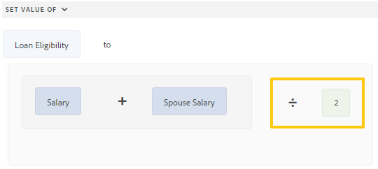
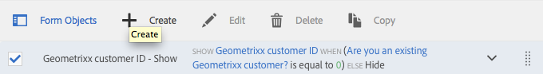

# Editor de regras de formulários adaptáveis{#adaptive-forms-rule-editor}

## Visão geral {#overview}

O recurso de editor de regras no Adobe Experience Manager Forms permite que usuários e desenvolvedores de negócios criem regras em objetos de formulário adaptáveis. Essas regras definem ações a serem acionadas em objetos de formulário com base em condições predefinidas, entradas de usuário e ações de usuário no formulário. Ajuda a simplificar ainda mais a experiência de preenchimento de formulários, garantindo a precisão e a velocidade.

O editor de regras oferece uma interface de usuário intuitiva e simplificada para gravar regras. O editor de regras oferece um editor visual para todos os usuários. Além disso, somente para usuários avançados de formulários, o editor de regras fornece um editor de códigos para gravar regras e scripts. Algumas das ações principais que podem ser executadas em objetos de formulário adaptáveis usando regras são:

* Mostrar ou ocultar um objeto
* Ativar ou desativar um objeto
* Definir um valor para um objeto
* Validar o valor de um objeto
* Executar funções para calcular o valor de um objeto
* Chamar um serviço de modelo de dados de formulário e executar uma operação
* Definir a propriedade de um objeto

O editor de regras substitui os recursos de script no AEM 6.1 Forms e versões anteriores. No entanto, seus scripts existentes são preservados no novo editor de regras. Para obter mais informações sobre como trabalhar com scripts existentes no editor de regras, consulte [Impacto do editor de regras em scripts existentes](#impact-of-rule-editor-on-existing-scripts).

Os usuários adicionados ao grupo usuários avançados de formulários podem criar novos scripts e editar os existentes. Os usuários do grupo forms-users podem usar os scripts, mas não podem criar ou editar scripts.

## Como entender uma regra {#understanding-a-rule}

Uma regra é uma combinação de ações e condições. No editor de regras, as ações incluem atividades como ocultar, mostrar, ativar, desativar ou calcular o valor de um objeto em um formulário. As condições são expressões booleanas avaliadas pela execução de verificações e operações no estado, valor ou propriedade de um objeto de formulário. As ações são executadas com base no valor ( `True` ou `False`) retornado avaliando uma condição.

O editor de regras fornece um conjunto de tipos de regras predefinidos, como Quando, Mostrar, Ocultar, Ativar, Desativar, Definir valor de e Validar para ajudar você a gravar regras. Cada tipo de regra permite definir condições e ações em uma regra. O documento explica mais detalhadamente cada tipo de regra.

Uma regra geralmente segue uma das seguintes construções:

**Condição-Ação** Nesta construção, uma regra define primeiro uma condição seguida de uma ação a ser acionada. A construção é comparável à declaração if-then em linguagens de programação.

No editor de regras, a variável **When** o tipo de regra impõe a construção de condição-ação.

**Condição de ação** Nesta construção, uma regra define primeiro uma ação a ser acionada, seguida de condições para avaliação. Outra variação dessa construção é a ação alternativa de condição de ação, que também define uma ação alternativa a ser acionada se a condição retornar Falso.

Os tipos de regras Mostrar, Ocultar, Ativar, Desativar, Definir valor de e Validar no editor de regras impõem a construção da regra de condição de ação. Por padrão, a ação alternativa para Mostrar é Ocultar e para Ativar é Desativar, e vice-versa. Não é possível alterar a ação alternativa padrão.

>[!NOTE]
>
>Os tipos de regras disponíveis, incluindo condições e ações definidas no editor de regras, também dependem do tipo de objeto de formulário no qual você está criando uma regra. O editor de regras exibe apenas tipos de regras válidos e opções para escrever condições e declarações de ação para um tipo de objeto de formulário específico. Por exemplo, você não vê os tipos de regras Validar, Definir valor de, Ativar e Desativar para um objeto de painel.

Para obter mais informações sobre tipos de regras disponíveis no editor de regras, consulte [Tipos de regras disponíveis no editor de regras](#available-rule-types-in-rule-editor).

### Diretrizes para escolher uma construção de regra {#guidelines-for-choosing-a-rule-construct}

Embora seja possível obter a maioria dos casos de uso usando qualquer construção de regra, veja a seguir algumas diretrizes para escolher uma construção em vez de outra. Para obter mais informações sobre as regras disponíveis no editor de regras, consulte [Tipos de regras disponíveis no editor de regras](#available-rule-types-in-rule-editor).

* Uma regra típica do polegar ao criar uma regra é pensar nela no contexto do objeto no qual você está escrevendo uma regra. Considere que deseja ocultar ou mostrar o campo B com base no valor que um usuário especifica no campo A. Nesse caso, você está avaliando uma condição no campo A e, com base no valor retornado, está acionando uma ação no campo B.

   Portanto, se estiver escrevendo uma regra no campo B (o objeto no qual você está avaliando uma condição), use a construção de condição-ação ou o tipo de regra Quando. Da mesma forma, use o tipo de regra de construção da condição de ação ou Mostrar ou Ocultar no campo A.

* Às vezes, é necessário executar várias ações com base em uma condição. Nesses casos, é recomendável usar a construção de condição-ação. Nesta construção, você pode avaliar uma condição uma vez e especificar várias declarações de ação.

   Por exemplo, para ocultar os campos B, C e D com base na condição que verifica o valor que um usuário especifica no campo A, escreva uma regra com construção de condição-ação ou Quando a regra tipo no campo A e especifique ações para controlar a visibilidade dos campos B, C e D. Caso contrário, você precisará de três regras separadas nos campos B, C e D, onde cada regra verifica a condição e mostra ou oculta o respectivo campo. Neste exemplo, é mais eficiente gravar o tipo de regra Quando em um objeto em vez de Mostrar ou Ocultar tipo de regra em três objetos.

* Para acionar uma ação com base em várias condições, é recomendável usar a construção de condição de ação. Por exemplo, para mostrar e ocultar o campo A avaliando as condições nos campos B, C e D, use o tipo de regra Mostrar ou Ocultar no campo A.
* Use condição-ação ou construção de condição de ação se a regra contiver uma ação para uma condição.
* Se uma regra verificar uma condição e executar uma ação imediatamente após fornecer um valor em um campo ou sair de um campo, é recomendável gravar uma regra com construção de condição-ação ou o tipo de regra Quando no campo em que a condição é avaliada.
* A condição na regra Quando é avaliada quando um usuário altera o valor do objeto no qual a regra Quando é aplicada. No entanto, se desejar que a ação seja acionada quando o valor for alterado no lado do servidor, como no caso de pré-preencher o valor, é recomendável gravar uma regra Quando que acione a ação quando o campo for inicializado.
* Ao escrever regras para objetos de listas suspensas, botões de opção ou caixas de seleção, as opções ou valores desses objetos de formulário no formulário são preenchidos previamente no editor de regras.

## Tipos de operador e eventos disponíveis no editor de regras {#available-operator-types-and-events-in-rule-editor}

O editor de regras fornece os operadores lógicos e eventos a seguir que podem ser usados para criar regras.

* **É Igual A**
* **Is Not Equal To**
* **Começa com**
* **Termina com**
* **Contém**
* **Está vazio**
* **Não está vazio**
* **Selecionou:** Retorna verdadeiro quando o usuário seleciona uma opção específica para uma caixa de seleção, lista suspensa e um botão de opção.
* **É Inicializado (evento):** Retorna true quando um objeto de formulário é renderizado no navegador.
* **É alterado (evento):** Retorna true quando o usuário altera o valor inserido ou a opção selecionada para um objeto de formulário.

## Tipos de regras disponíveis no editor de regras {#available-rule-types-in-rule-editor}

O editor de regras fornece um conjunto de tipos de regras predefinidos que podem ser usados para gravar regras. Vamos analisar cada tipo de regra detalhadamente. Para obter mais informações sobre como escrever regras no editor de regras, consulte [Regras de gravação](#write-rules).

### Quando {#whenruletype}

O **When** o tipo de regra segue **ação-condição-alternativa** construção de regra, ou às vezes, apenas o **condição-ação** construir. Nesse tipo de regra, primeiro especifique uma condição para avaliação seguida de uma ação para acionar se a condição for atendida ( `True`). Ao usar o tipo de regra Quando , você pode usar vários operadores AND e OR para criar [expressões aninhadas](#nestedexpressions).

Usando o tipo de regra Quando , é possível avaliar uma condição em um objeto de formulário e executar ações em um ou mais objetos.

Em palavras simples, uma regra Quando típica é estruturada da seguinte maneira:

`When on Object A:`

`(Condition 1 AND Condition 2 OR Condition 3) is TRUE;`

`Then, do the following:`

Ação 2 sobre o objeto B; E a ação 3 relativa ao objeto C;

_

Quando você tem um componente de vários valores, como botões de opção ou lista, enquanto cria uma regra para esse componente, as opções são recuperadas automaticamente e disponibilizadas para o criador da regra. Não é necessário digitar os valores de opção novamente.

Por exemplo, uma lista tem quatro opções: Vermelho, Azul, Verde e Amarelo. Ao criar a regra, as opções (botões de opção) são recuperadas automaticamente e disponibilizadas para o criador da regra da seguinte maneira:


Ao escrever uma regra de Quando, é possível acionar a ação Limpar valor de. A ação Limpar valor da apaga o valor do objeto especificado. Ter Valor Limpo de como uma opção na instrução Quando permite criar condições complexas com vários campos.


**Ocultar** Oculta o objeto especificado.

**Mostrar** Mostra o objeto especificado.

**Habilitar** Ativa o objeto especificado.

**Desativar** Desativa o objeto especificado.

**Chamar serviço** Chama um serviço configurado em um modelo de dados de formulário. Quando você escolhe a operação Invoke Service , um campo é exibido. Ao tocar no campo , ele exibe todos os serviços configurados em todos os modelos de dados de formulário na instância do AEM. Ao escolher um serviço de modelo de dados de formulário, campos adicionais são exibidos, onde é possível mapear objetos de formulário com parâmetros de entrada e saída para o serviço especificado. Consulte a regra de exemplo para chamar serviços de modelo de dados de formulário.

Além do serviço de modelo de dados de formulário, você pode especificar um URL WSDL direto para chamar um serviço da Web. No entanto, um serviço de modelo de dados de formulário tem muitos benefícios e a abordagem recomendada para invocar um serviço.

Para obter mais informações sobre como configurar serviços no modelo de dados de formulário, consulte [Integração de dados do AEM Forms](/help/forms/using/data-integration.md).

**Definir valor de** Calcula e define o valor do objeto especificado. Você pode definir o valor do objeto como uma string, o valor de outro objeto, o valor calculado usando a expressão ou função matemática, o valor de uma propriedade de um objeto ou o valor de saída de um serviço de modelo de dados de formulário configurado. Ao escolher a opção serviço da Web, ele exibe todos os serviços configurados em todos os modelos de dados de formulário na instância de AEM. Ao escolher um serviço de modelo de dados de formulário, campos adicionais são exibidos, onde é possível mapear objetos de formulário com parâmetros de entrada e saída para o serviço especificado.

Para obter mais informações sobre como configurar serviços no modelo de dados de formulário, consulte [Integração de dados do AEM Forms](/help/forms/using/data-integration.md).

O **Definir propriedade** o tipo de regra permite definir o valor de uma propriedade do objeto especificado com base em uma ação de condição.

Ele permite definir regras para adicionar caixas de seleção dinamicamente ao formulário adaptável. É possível usar uma função personalizada, um objeto de formulário ou uma propriedade de objeto para definir uma regra.


Para definir uma regra baseada em uma função personalizada, selecione **Saída de função** na lista suspensa e arraste e solte uma função personalizada do **Funções** guia . Se a ação de condição for atendida, o número de caixas de seleção definido na função personalizada será adicionado ao formulário adaptável.

Para definir uma regra baseada em um objeto de formulário, selecione **Objeto de formulário** na lista suspensa e arraste e solte um objeto de formulário da **Objetos de formulário** guia . Se a ação de condição for atendida, o número de caixas de seleção definidas no objeto de formulário será adicionado ao formulário adaptável.

Uma regra Definir propriedade com base em uma propriedade de objeto permite adicionar o número de caixas de seleção em um formulário adaptável com base em outra propriedade de objeto incluída no formulário adaptável.

A figura a seguir descreve um exemplo de adição dinâmica de caixas de seleção com base no número de listas suspensas no formulário adaptável:


**Valor Claro De** Apaga o valor do objeto especificado.

**Definir foco** Define o foco no objeto especificado.

**Salvar formulário** Salva o formulário.

**Enviar Forms** Envia o formulário.

**Redefinir formulário** Redefine o formulário.

**Validar formulário** Valida o formulário.

**Adicionar instância** Adiciona uma instância do painel repetitivo ou linha de tabela especificada.

**Remover instância** Remove uma instância do painel ou linha de tabela repetível especificado.

**Navegar para** Navega para outras Comunicações interativas, formulários adaptáveis, outros ativos, como imagens ou fragmentos de documento, ou um URL externo. Para obter mais informações, consulte [Adicionar botão à Comunicação Interativa](../../forms/using/create-interactive-communication.md#addbuttontothewebchannel).

### Definir valor de {#set-value-of}

O **[!UICONTROL Definir valor de]** o tipo de regra permite definir o valor de um objeto de formulário, dependendo se a condição especificada é atendida ou não. O valor pode ser definido como um valor de outro objeto, uma string literal, um valor derivado de uma expressão matemática ou uma função, um valor de uma propriedade de outro objeto ou a saída de um serviço de modelo de dados de formulário. Da mesma forma, é possível verificar uma condição em um componente, string, propriedade ou valores derivados de uma função ou expressão matemática.

Observe que o tipo de regra Definir valor de não está disponível para todos os objetos de formulário, como painéis e botões da barra de ferramentas. Uma regra Definir valor de conjunto padrão tem a seguinte estrutura:


Defina o valor do Objeto A como:

(string ABC) OU (propriedade de objeto X do Objeto C) OU (valor de uma função) OU (valor de uma expressão matemática) OU (valor de saída de um serviço de modelo de dados ou serviço da Web);

Quando (opcional):

(Condição 1 E Condição 2 E Condição 3) é TRUE;


O exemplo a seguir pega o valor em `dependentid` como entrada e define o valor da variável `Relation` para a saída do `Relation` argumento do `getDependent` serviço de modelo de dados de formulário.


Exemplo de regra Definir valor usando o serviço de modelo de dados de formulário

>[!NOTE]
>
>Além disso, é possível usar a opção Definir valor da regra para preencher todos os valores em um componente de lista suspensa da saída de um serviço de modelo de dados de formulário ou de um serviço da Web. No entanto, verifique se o argumento de saída escolhido é de um tipo de matriz. Todos os valores retornados em uma matriz ficam disponíveis na lista suspensa especificada.

### Mostrar {#show}

Usar o **Mostrar** tipo de regra , é possível gravar uma regra para mostrar ou ocultar um objeto de formulário com base em se uma condição é atendida ou não. O tipo de regra Mostrar também aciona a ação Ocultar caso a condição não seja atendida ou retorne `False`.

Uma regra de Mostrar típica é estruturada da seguinte maneira:


`Show Object A;`

`When:`

`(Condition 1 OR Condition 2 OR Condition 3) is TRUE;`

`Else:`

`Hide Object A;`


### Ocultar {#hide}

Semelhante ao tipo de regra Mostrar , você pode usar o **Ocultar** tipo de regra para mostrar ou ocultar um objeto de formulário com base em se uma condição é atendida ou não. O tipo de regra Ocultar também aciona a ação Mostrar caso a condição não seja atendida ou retorne `False`.

Uma regra de Ocultar típica é estruturada da seguinte maneira:


`Hide Object A;`

`When:`

`(Condition 1 AND Condition 2 AND Condition 3) is TRUE;`

`Else:`

`Show Object A;`


### Ativar {#enable}

O **Habilitar** o tipo de regra permite habilitar ou desabilitar um objeto de formulário com base em se uma condição é atendida ou não. O tipo de regra Ativar também aciona a ação Desativar caso a condição não seja atendida ou retorne `False`.

Uma regra típica de Ativar está estruturada da seguinte maneira:


`Enable Object A;`

`When:`

`(Condition 1 AND Condition 2 AND Condition 3) is TRUE;`

`Else:`

`Disable Object A;`


### Desativar {#disable}

Semelhante ao tipo de regra Ativar , a variável **Desativar** o tipo de regra permite habilitar ou desabilitar um objeto de formulário com base em se uma condição é atendida ou não. O tipo de regra Desativar também aciona a ação Ativar caso a condição não seja atendida ou retorne `False`.

Uma regra de desativação típica é estruturada da seguinte maneira:


`Disable Object A;`

`When:`

`(Condition 1 OR Condition 2 OR Condition 3) is TRUE;`

`Else:`

`Enable Object A;`

### Validar {#validate}

O **Validar** o tipo de regra valida o valor em um campo usando uma expressão. Por exemplo, você pode gravar uma expressão para verificar se a caixa de texto para especificar o nome não contém caracteres especiais ou números.

Uma regra Validar típica está estruturada da seguinte maneira:

`Validate Object A;`

`Using:`

`(Expression 1 AND Expression 2 AND Expression 3) is TRUE;`

>[!NOTE]
>
>Se o valor especificado não estiver em conformidade com a regra Validar, você poderá exibir uma mensagem de validação para o usuário. Você pode especificar a mensagem no **[!UICONTROL Mensagem de validação de script]** nas propriedades do componente na barra lateral.


### Definir Opções de {#setoptionsof}

O **Definir Opções de** o tipo de regra permite definir regras para adicionar caixas de seleção dinamicamente ao formulário adaptável. Você pode usar um modelo de dados de formulário ou uma função personalizada para definir a regra.

Para definir uma regra baseada em uma função personalizada, selecione **Saída de função** na lista suspensa e arraste e solte uma função personalizada do **Funções** guia . O número de caixas de seleção definidas na função personalizada é adicionado ao formulário adaptável.


Para criar uma função personalizada, consulte [funções personalizadas no editor de regras](#custom-functions).

Para definir uma regra baseada em um modelo de dados de formulário:

1. Selecionar **Saída de serviço** na lista suspensa.
1. Selecione o objeto de modelo de dados.
1. Selecione uma propriedade de objeto de modelo de dados no **Exibir valor** lista suspensa. O número de caixas de seleção no formulário adaptável é derivado do número de instâncias definidas para essa propriedade no banco de dados.
1. Selecione uma propriedade de objeto de modelo de dados no **Salvar valor** lista suspensa.


## Entendendo a interface do usuário do editor de regras {#understanding-the-rule-editor-user-interface}

O editor de regras fornece uma interface de usuário abrangente, mas simples, para gravar e gerenciar regras. Você pode iniciar a interface do usuário do editor de regras a partir de um formulário adaptável no modo de criação.

Para iniciar a interface do usuário do editor de regras:

1. Abra um formulário adaptável no modo de criação.
1. Toque no objeto de formulário para o qual você deseja gravar uma regra e, na Barra de ferramentas do componente, toque em . A interface do usuário do editor de regras é exibida.

   

   Todas as regras existentes nos objetos de formulário selecionados são listadas nesta exibição. Para obter informações sobre como gerenciar regras existentes, consulte [Gerenciar regras](#manage-rules).

1. Toque **[!UICONTROL Criar]** para escrever uma nova regra. O editor visual da interface do usuário do editor de regras é aberto por padrão quando você inicia o editor de regras pela primeira vez.

   

Vamos analisar cada componente da interface do usuário do editor de regras em detalhes.

### A. Exibição da regra de componente {#a-component-rule-display}

Exibe o título do objeto de formulário adaptável pelo qual você iniciou o editor de regras e o tipo de regra selecionado no momento. No exemplo acima, o editor de regras é iniciado a partir de um objeto de formulário adaptável intitulado Salário e o tipo de regra selecionado é Quando.

### B. Objetos e funções de formulário {#b-form-objects-and-functions-br}

O painel à esquerda na interface do usuário do editor de regras inclui duas guias: **[!UICONTROL Objetos do Forms]** e **[!UICONTROL Funções]**.

A guia Objetos de formulário mostra uma exibição hierárquica de todos os objetos contidos no formulário adaptável. Ele exibe o título e o tipo dos objetos. Ao gravar uma regra, é possível arrastar e soltar objetos de formulário no editor de regras. Ao criar ou editar uma regra ao arrastar e soltar um objeto ou função em um espaço reservado, o espaço reservado utiliza automaticamente o tipo de valor apropriado.

Os objetos de formulário que têm uma ou mais regras válidas aplicadas são marcados com um ponto verde. Se qualquer regra aplicada a um objeto de formulário for inválida, o objeto de formulário será marcado com um ponto Amarelo.

A guia Funções inclui um conjunto de funções incorporadas, como Soma, Mín., Máx. de, Média, Número de e Validar formulário. Você pode usar essas funções para calcular valores em painéis repetitivos e linhas de tabela e usá-los em instruções de ação e condição ao gravar regras. No entanto, você pode criar [funções personalizadas](#custom-functions) também.


>[!NOTE]
>
>É possível realizar uma pesquisa de texto em objetos e nomes de funções e títulos nas guias Objetos e Funções do Forms .

Na árvore esquerda dos objetos de formulário, é possível tocar nos objetos de formulário para exibir as regras aplicadas a cada um dos objetos. Além de poder navegar pelas regras dos vários objetos de formulário, também é possível copiar e colar regras entre os objetos de formulário. Para obter mais informações, consulte [Copiar e colar regras](#copy-paste-rules).

### C. Objetos de formulário e alternância de funções {#c-form-objects-and-functions-toggle-br}

O botão de alternância, quando tocado, alterna os objetos de formulário e o painel de funções.

### D. Editor de regras visuais {#d-visual-rule-editor}

O editor de regras visuais é a área no modo de editor visual da interface do usuário do editor de regras, onde você grava regras. Ela permite selecionar um tipo de regra e definir condições e ações de acordo com isso. Ao definir condições e ações em uma regra, você pode arrastar e soltar objetos e funções de formulário do painel Objetos de formulário e Funções .

Para obter mais informações sobre o uso do editor de regras visuais, consulte [Regras de gravação](#write-rules).

### E. Seletor de editores de código visual {#e-visual-code-editors-switcher}

Os usuários do grupo forms-power-users podem acessar o editor de código. Para outros usuários, o editor de código não está disponível. Se você tiver os direitos, poderá alternar do modo de editor visual para o modo de editor de código do editor de regras, e vice-versa, usando o alternador logo acima do editor de regras. Ao iniciar o editor de regras pela primeira vez, ele é aberto no modo de editor visual. Você pode gravar regras no modo do editor visual ou alternar para o modo do editor de códigos para gravar um script de regra. No entanto, observe que se você modificar uma regra ou gravar uma regra no editor de códigos, não poderá voltar ao editor visual para essa regra, a menos que você limpe o editor de códigos.

O AEM Forms rastreia o modo de editor de regras usado por último para gravar uma regra. Na próxima vez que você iniciar o editor de regras, ele será aberto nesse modo. No entanto, também é possível configurar um modo padrão para abrir o editor de regras no modo especificado. Para fazer isso:

1. Vá para AEM console da Web em `https://[host]:[port]/system/console/configMgr`.
1. Clique para editar **[!UICONTROL Configuração do canal Web de comunicação interativa e formulário adaptável]**.
1. Choose **[!UICONTROL Editor visual]** ou **[!UICONTROL Editor de códigos]** do **[!UICONTROL Modo padrão para o Editor de regras]** lista suspensa

1. Clique em **[!UICONTROL Salvar]**.

### F. Botões Concluir e cancelar {#f-done-and-cancel-buttons}

O **[!UICONTROL Concluído]** é usado para salvar uma regra. Você pode salvar uma regra incompleta. No entanto, incompletos são inválidos e não são executados. Regras salvas em um objeto de formulário são listadas quando você inicia o editor de regras na próxima vez no mesmo objeto de formulário. Você pode gerenciar regras existentes nessa visualização. Para obter mais informações, consulte [Gerenciar regras](#manage-rules).

O **[!UICONTROL Cancelar]** descarta qualquer alteração feita em uma regra e fecha o editor de regras.

## Regras de gravação {#write-rules}

Você pode gravar regras usando o editor de regras visuais ou o editor de códigos. Ao iniciar o editor de regras pela primeira vez, ele é aberto no modo de editor visual. Você pode alternar para o modo do editor de códigos e para as regras de gravação. No entanto, observe que se você escrever ou modificar uma regra no editor de códigos, não poderá alternar para o editor visual dessa regra, a menos que limpe o editor de códigos. Na próxima vez que você iniciar o editor de regras, ele será aberto no modo usado por último para criar a regra.

Vamos primeiro ver como escrever regras usando o editor visual.

### Uso do editor visual {#using-visual-editor}

Vamos entender como criar uma regra no editor visual usando o seguinte formulário de exemplo.


A seção Requisitos de Empréstimo no formulário de pedido de empréstimo de exemplo requer que os requerentes especifiquem o seu estado civil, salário e, se casados, o salário do cônjuge. Com base nos dados de entrada do usuário, a regra calcula o montante de elegibilidade do empréstimo e é exibida no campo Elegibilidade do empréstimo. Aplique as seguintes regras para implementar o cenário:

* O campo Salário do Cônjuge é mostrado somente quando o Status Marital é Casado.
* O valor de elegibilidade do empréstimo é 50% do salário total.

Execute as seguintes etapas para gravar regras:

1. Primeiro, escreva a regra para controlar a visibilidade do campo Salário do Cônjuge com base na opção que o usuário seleciona para o botão de opção Status Marital .

   Abra o formulário do aplicativo de empréstimo no modo de criação. Toque no **Estado civil** componente e toque . Em seguida, toque em **[!UICONTROL Criar]** para iniciar o editor de regras.

   

   Ao iniciar o editor de regras, a regra Quando é selecionada por padrão. Além disso, o objeto de formulário (nesse caso, Status civil) de onde o editor de regras foi iniciado é especificado na instrução Quando.

   Embora não possa alterar ou modificar o objeto selecionado, você pode usar o menu suspenso de regras, como mostrado abaixo, para selecionar outro tipo de regra. Para criar uma regra em outro objeto, toque em Cancelar para sair do editor de regras e iniciá-la novamente a partir do objeto de formulário desejado.

1. Toque **[!UICONTROL Selecionar Estado]** e selecione **[!UICONTROL é igual a]**. O **[!UICONTROL Digite uma string]** é exibido.

   

   No botão de opção Estado civil, **Casado** e **Único** opções atribuídas **0** e **1** , respectivamente. Você pode verificar os valores atribuídos na guia Título da caixa de diálogo Editar botão de opção, como mostrado abaixo.

   

1. No **Digite uma string** na regra, especifique **0**.

   

   Você definiu a condição como `When Marital Status is equal to Married`. Em seguida, defina a ação a ser executada se essa condição for True.

1. Na instrução Then , selecione **[!UICONTROL Mostrar]** do **[!UICONTROL Selecionar ação]** lista suspensa.

   

1. Arraste e solte a **Salário do Cônjuge** na guia Objetos de formulário na **Solte o objeto ou selecione aqui** campo. Como alternativa, toque no **Solte o objeto ou selecione aqui** e selecione o **Salário do Cônjuge** no menu pop-up, que lista todos os objetos de formulário no formulário.

   

   A regra aparece da seguinte maneira no editor de regras.

   

   Toque **Concluído** para salvar a regra.

1. Repita as etapas de 1 a 5 para definir outra regra para ocultar o campo Salário do Cônjuge se o Status conjugal for Único. A regra aparece da seguinte maneira no editor de regras.

   

   >[!NOTE]
   >
   >Como alternativa, você pode escrever uma regra Mostrar no campo Salário do Cônjuge, em vez de duas regras Quando no campo Status do Marital , para implementar o mesmo comportamento.

   

1. Em seguida, escreva uma regra para calcular a quantia de elegibilidade do empréstimo, que é 50% do salário total, e exiba-a no campo Loan Eligibility . Para fazer isso, crie **Definir valor de** regras relativas ao campo Elegibilidade do empréstimo.

   No modo de criação, toque no **[!UICONTROL Elegibilidade do empréstimo]** campo e toque em . Em seguida, toque em **[!UICONTROL Criar]** para iniciar o editor de regras.

1. Selecionar **[!UICONTROL Definir Valor De]** na lista suspensa de regras.

   

1. Toque **[!UICONTROL Selecionar Opção]** e selecione **[!UICONTROL Expressão matemática]**. Um campo para gravar expressão matemática é aberto.

   

1. No campo de expressão:

   * Selecione ou arraste para soltar a partir da guia Objeto do Forms **Salário** no primeiro **Solte o objeto ou selecione aqui** campo.

   * Selecionar **Plus** do **Selecionar operador** campo.

   * Selecione ou arraste para soltar a partir da guia Objeto do Forms **Salário do Cônjuge** no outro **Solte o objeto ou selecione aqui** campo.

   

1. Em seguida, toque na área realçada ao redor do campo de expressão e toque em **Estender expressão**.

   

   No campo de expressão estendida, selecione **dividido por** do **Selecionar operador** e **Número** do **Selecionar Opção** campo. Em seguida, especifique **2** no campo número.

   

   >[!NOTE]
   >
   >Você pode criar expressões complexas usando componentes, funções, expressões matemáticas e valores de propriedade no campo Selecionar opção .

   Em seguida, crie uma condição, que quando retornar True, a expressão será executada.

1. Toque **Adicionar condição** para adicionar uma instrução When.

   

   Na instrução Quando:

   * Selecione ou arraste para soltar a partir da guia Objeto do Forms **Estado civil** no primeiro **Solte o objeto ou selecione aqui** campo.

   * Selecione i **s igual a** do **Selecionar operador** campo.

   * Selecione String no outro **Solte o objeto ou selecione aqui** e especifique **Casado** no **Digite uma string** campo.

   A regra finalmente aparece da seguinte maneira no editor de regras.  

   Toque **Concluído** para salvar a regra.

1. Repita as etapas de 7 a 12 para definir outra regra para calcular a elegibilidade do empréstimo se o Status civil for Único. A regra aparece da seguinte maneira no editor de regras.

   

>[!NOTE]
>
>Como alternativa, você pode usar a regra Definir Valor de para calcular a qualificação do empréstimo na regra Quando criada para mostrar e ocultar o campo Salário do Cônjuge. A regra combinada resultante quando o Status Marital é Único aparece da seguinte maneira no editor de regras.
>
>Da mesma forma, você pode escrever uma regra combinada para controlar a visibilidade do campo Salário do Cônjuge e calcular a qualificação do empréstimo quando o Status do Capital estiver Casado.


### Uso do editor de código {#using-code-editor}

Os usuários adicionados ao grupo usuários avançados de formulários podem usar o editor de código. O editor de regras gera automaticamente o código JavaScript para qualquer regra que você criar usando o editor visual. Você pode alternar do editor visual para o editor de código para exibir o código gerado. No entanto, se você modificar o código de regra no editor de códigos, não poderá voltar para o editor visual. Se preferir escrever regras no editor de código ao invés de no editor visual, você pode escrever regras novamente no editor de código. O alternador de editores de código visual ajuda a alternar entre os dois modos.

O JavaScript do editor de códigos é a linguagem de expressão de formulários adaptáveis. Todas as expressões são expressões JavaScript válidas e usam APIs de modelo de script de formulários adaptáveis. Essas expressões retornam valores de determinados tipos. Para obter a lista completa de classes de formulários adaptáveis, eventos, objetos e APIs públicas, consulte [Referência da API da biblioteca JavaScript para formulários adaptáveis](https://helpx.adobe.com/experience-manager/6-5/forms/javascript-api/index.html).

Para obter mais informações sobre diretrizes para gravar regras no editor de códigos, consulte [Expressões de formulário adaptável](/help/forms/using/adaptive-form-expressions.md).

Ao escrever o código JavaScript no editor de regras, as seguintes dicas visuais ajudam na estrutura e na sintaxe:

* Destaques da sintaxe
* Recuo Automático
* Dicas e sugestões para objetos, funções e propriedades do formulário
* Preenchimento automático de nomes de componentes de formulário e funções JavaScript comuns


#### Funções personalizadas no editor de regras {#custom-functions}

Além das funções prontas para uso como *Soma de* que estão listadas em Saída das funções, você pode gravar funções personalizadas que precisa com frequência. Certifique-se de que a função gravada seja acompanhada pela função `jsdoc` acima.

Acompanhamento `jsdoc` é obrigatório:

* Se quiser configuração e descrição personalizadas.
* Como há várias maneiras de declarar uma função no `JavaScript,` Os comentários e permitem que você acompanhe as funções.

Para obter mais informações, consulte [usejsdoc.org](https://jsdoc.app/).

Suportado `jsdoc` tags:

* **Privado**
Sintaxe: Uma função privada não é incluída como uma função personalizada.`@private`
Uma função privada não é incluída como uma função personalizada.

* **Nome**
Sintaxe: Alternativamente `@name funcName <Function Name>`
Alternativamente `,` você pode usar: `@function funcName <Function Name>` **ou** `@func` `funcName <Function Name>`.
   `funcName` é o nome da função (sem espaços permitidos).
   `<Function Name>` é o nome de exibição da função.

* **membro**
Sintaxe: Anexa um namespace à função .`@memberof namespace`
Anexa um namespace à função .

* **Parâmetro**
Sintaxe: Como alternativa, você pode usar: `@param {type} name <Parameter Description>`
Como alternativa, você pode usar: `@argument` `{type} name <Parameter Description>` **ou** `@arg` `{type}` `name <Parameter Description>`.
Mostra os parâmetros usados pela função. Uma função pode ter várias tags de parâmetro, uma tag para cada parâmetro na ordem de ocorrência.
   `{type}` representa o tipo de parâmetro. Os tipos de parâmetros permitidos são:

   1. sequência de caracteres
   1. número
   1. booleano
   1. scope

   O escopo é usado para campos de referência de um formulário adaptável. Quando um formulário usa carregamento lento, você pode usar `scope` para acessar os campos. Você pode acessar campos quando os campos são carregados ou se os campos são marcados como global.

   Todos os outros tipos de parâmetros são categorizados em um dos acima. Nenhum é suportado. Certifique-se de selecionar um dos tipos acima. Os tipos não fazem distinção entre maiúsculas e minúsculas. Espaços não são permitidos no parâmetro `name`. `<Parameter Descrption>` `<parameter>  can have multiple words. </parameter>`

* **Tipo de retorno**
Sintaxe: Como alternativa, você pode usar `@return {type}`
Como alternativa, você pode usar `@returns {type}`.
Adiciona informações sobre a função, como seu objetivo.
{type} representa o tipo de retorno da função. Os tipos de retorno permitidos são:

   1. sequência de caracteres
   1. número
   1. booleano

   Todos os outros tipos de retorno são classificados em um dos acima. Nenhum é suportado. Certifique-se de selecionar um dos tipos acima. Os tipos de retorno não distinguem maiúsculas de minúsculas.

* **Essa**
Sintaxe: 
`@this currentComponent`

   Use @this para se referir ao componente Formulário adaptativo no qual a regra é gravada.

   O exemplo a seguir é baseado no valor do campo. No exemplo a seguir, a regra oculta um campo no formulário. O `this` porção de `this.value` refere-se ao componente subjacente do Formulário adaptativo, no qual a regra é gravada.

   ```
      /**
      * @function myTestFunction
      * @this currentComponent
      * @param {scope} scope in which code inside function will be executed.
      */
      myTestFunction = function (scope) {
         if(this.value == "O"){
               scope.age.visible = true;
         } else {
            scope.age.visible = false;
         }
      }
   ```

>[!NOTE]
>
>Comentários antes da função personalizada são usados para resumo. O resumo pode estender-se para várias linhas até que uma tag seja encontrada. Limite o tamanho para um único para uma descrição concisa no construtor de regras.

**Adicionar uma função personalizada**

Por exemplo, você deseja adicionar uma função personalizada que calcula a área de um quadrado. Comprimento lateral é a entrada do usuário para a função personalizada, que é aceita por meio de uma caixa numérica no formulário. A saída calculada é exibida em outra caixa numérica do formulário. Para adicionar uma função personalizada, primeiro crie uma biblioteca do cliente e depois adicione-a ao repositório CRX.

Execute as etapas a seguir para criar uma biblioteca do cliente e adicioná-la ao repositório CRX.

1. Crie uma biblioteca do cliente. Para obter mais informações, consulte [Usar bibliotecas do lado do cliente](/help/sites-developing/clientlibs.md).
1. No CRXDE, adicione uma propriedade `categories`com valor do tipo string como `customfunction` para `clientlib` pasta.

   >[!NOTE]
   >
   >`customfunction`é uma categoria de exemplo. Você pode escolher qualquer nome para a categoria que criar na `clientlib`pasta.

Depois de adicionar a biblioteca do cliente ao repositório CRX, use-a no formulário adaptável. Ele permite usar sua função personalizada como uma regra no formulário. Execute as etapas a seguir para adicionar a biblioteca do cliente no formulário adaptável.

1. Abra o formulário no modo de edição.
Para abrir um formulário no modo de edição, selecione um formulário e toque em **Abrir**.
1. No modo de edição, selecione um componente e toque em  > **Contêiner de formulário adaptável** e toque em .
1. Na barra lateral, em Nome da biblioteca do cliente, adicione a biblioteca do cliente. ( `customfunction` no exemplo.)

   

1. Selecione a caixa numérica de entrada e toque em  para abrir o editor de regras.
1. Toque **Criar regra**. Usando as opções mostradas abaixo, crie uma regra para salvar o valor quadrado da entrada no campo Saída do formulário.
   [ ](assets/add-custom-rule.png)Toque **Concluído**. Sua função personalizada é adicionada.

#### Tipos suportados da declaração de função {#function-declaration-supported-types}

**Instrução de função**

```javascript
function area(len) {
    return len*len;
}
```

Essa função é incluída sem `jsdoc` comentários.

**Expressão de função**

```javascript
var area;
//Some codes later
/** */
area = function(len) {
    return len*len;
};
```

**Expressão de função e declaração**

```javascript
var b={};
/** */
b.area = function(len) {
    return len*len;
}
```

**Declaração de função como variável**

```javascript
/** */
var x1,
    area = function(len) {
        return len*len;
    },
    x2 =5, x3 =true;
```

Limitação: a função personalizada escolhe somente a primeira declaração de função da lista de variáveis, se estiver juntos. Você pode usar a expressão de função para cada função declarada.

**Declaração de função como objeto**

```javascript
var c = {
    b : {
        /** */
        area : function(len) {
            return len*len;
        }
    }
};
```

>[!NOTE]
>
>Certifique-se de usar `jsdoc` para cada função personalizada. Embora `jsdoc`os comentários são encorajados, inclua um vazio `jsdoc`comente para marcar sua função como função personalizada. Ela permite a manipulação padrão da sua função personalizada.

## Gerenciar regras {#manage-rules}

Qualquer regra existente em um objeto de formulário é listada ao tocar no objeto e tocar em . Você pode exibir o título e um resumo da regra de visualização. Além disso, a interface do usuário permite expandir e exibir o resumo completo da regra, alterar a ordem das regras, editar regras e excluir regras.


Você pode executar as seguintes ações em regras:

* **Expandir/recolher**: A coluna Conteúdo na lista de regras exibe o conteúdo da regra. Se todo o conteúdo da regra não estiver visível na exibição padrão, toque em  para expandi-lo.

* **Reordenar**: Qualquer nova regra criada é empilhada na parte inferior da lista de regras. As regras são executadas de cima para baixo. A regra no topo é executada primeiro, seguida por outras regras do mesmo tipo. Por exemplo, se você tiver as regras Quando, Mostrar, Ativar e Quando na primeira, segunda, terceira e quarta posições a partir da parte superior, respectivamente, a regra Quando na parte superior será executada primeiro, seguida pela regra Quando na quarta posição. Em seguida, as regras Exibir e Ativar serão executadas.
É possível alterar a ordem de uma regra ao tocar em  ou arraste-a e solte-a na ordem desejada na lista.

* **Editar**: Para editar uma regra, marque a caixa de seleção ao lado do título da regra. Opções adicionais para editar e excluir a regra são exibidas. Toque **Editar** para abrir a regra selecionada no editor de regras no modo visual ou editor de códigos, dependendo do modo usado para criar a regra.

* **Excluir**: Para excluir uma regra, selecione-a e toque em **Excluir**.

* **Ativar/Desativar**: Talvez seja necessário suspender temporariamente o uso de uma regra. Você pode selecionar uma ou mais regras e tocar em Desativar na barra de ferramentas Ações para desativá-las. Se uma regra estiver desativada, ela não será executada no tempo de execução. Para ativar uma regra que esteja desativada, você pode selecioná-la e tocar em Ativar na barra de ferramentas de ações. A coluna de status da regra exibe se a regra está ativada ou desativada.


## Copiar e colar regras {#copy-paste-rules}

É possível copiar e colar uma regra de um campo para outros campos semelhantes para economizar tempo.

Para copiar e colar regras, faça o seguinte:

1. Toque no objeto de formulário do qual você deseja copiar uma regra e, na barra de ferramentas do componente, toque em . A interface do usuário do editor de regras é exibida com o objeto de formulário selecionado e as regras existentes são exibidas.

   

   Para obter informações sobre como gerenciar regras existentes, consulte [Gerenciar regras](#manage-rules).

1. Marque a caixa de seleção ao lado do título da regra. Opções adicionais para gerenciar a regra são exibidas. Toque em **Copiar**.

   

1. Selecione outro objeto de formulário no qual deseja colar a regra e toque em **Colar**. Além disso, é possível editar a regra para fazer alterações.

   >[!NOTE]
   >
   >É possível colar uma regra em outro objeto de formulário somente se esse objeto de formulário suportar o evento da regra copiada. Por exemplo, um botão suporta o evento click . É possível colar uma regra com um evento click em um botão, mas não em uma caixa de seleção.

1. Toque **Concluído** para salvar a regra.

## Expressões aninhadas {#nestedexpressions}

O editor de regras permite usar vários operadores AND e OR para criar regras aninhadas. Você pode combinar vários operadores AND e OR em regras.

A seguir, um exemplo de uma regra aninhada que exibe uma mensagem ao usuário sobre a elegibilidade para a custódia de uma criança quando as condições necessárias forem atendidas.


Também é possível arrastar e soltar condições em uma regra para editá-la. Toque e passe o mouse sobre a alça ( ) antes de uma condição. Quando o ponteiro se transformar no símbolo da mão, como mostrado abaixo, arraste e solte a condição em qualquer lugar dentro da regra. A estrutura da regra muda.


## Condições da expressão de data {#dateexpression}

O editor de regras permite usar comparações de datas para criar condições.

A seguir, um exemplo de condição que exibe um objeto de texto estático se a hipoteca na casa já estiver sendo realizada, o que o usuário significa preenchendo o campo de data.

Quando a data da hipoteca da propriedade preenchida pelo usuário estiver no passado, o formulário adaptável exibirá uma nota sobre o cálculo de renda. A regra a seguir compara a data preenchida pelo usuário com a data atual e, se a data preenchida pelo usuário for anterior à data atual, o formulário exibirá a mensagem de texto (denominada Renda).


Quando a data de preenchimento for anterior à data atual, o formulário exibirá a mensagem de texto (Renda) da seguinte maneira:


## Condições de comparação de números {#number-comparison-conditions}

O editor de regras permite criar condições que comparam dois números.

A seguir, um exemplo de condição que exibe um objeto de texto estático se o número de meses que um candidato permanece em seu endereço atual for menor que 36.


Quando o utilizador indicar que vive no seu endereço residencial atual há menos de 36 meses, o formulário apresenta uma notificação de que pode ser solicitada uma prova de residência adicional.


## Impacto do editor de regras em scripts existentes {#impact-of-rule-editor-on-existing-scripts}

Nas versões do AEM Forms anteriores ao AEM 6.1 Forms feature pack 1, os autores e desenvolvedores de formulários usavam para gravar expressões na guia Scripts da caixa de diálogo Editar componente para adicionar comportamento dinâmico aos formulários adaptáveis. A guia Scripts agora é substituída pelo editor de regras.

Qualquer script ou expressão que deva ter escrito na guia Scripts estará disponível no editor de regras. Embora não seja possível exibi-los ou editá-los no editor visual, se você fizer parte do grupo forms-power-users , poderá editar scripts no editor de códigos.

## Exemplo de regras {#example}

### Chamar o serviço de modelo de dados de formulário {#invoke}

Considere um serviço da Web `GetInterestRates` que utiliza o montante do empréstimo, o contrato e a pontuação de crédito do requerente como entrada e retorna um plano de empréstimo incluindo o montante do IME e a taxa de juro. Crie um modelo de dados de formulário usando o serviço da Web como uma fonte de dados. Você adiciona objetos de modelo de dados e um `get` para o modelo de formulário. O serviço é exibido na guia Services do modelo de dados de formulário. Em seguida, crie um formulário adaptável que inclua campos de objetos de modelo de dados para capturar entradas de usuário para valor do empréstimo, duração e pontuação de crédito. Adicione um botão que aciona o serviço da Web para buscar detalhes do plano. A saída é preenchida em campos apropriados.

A regra a seguir mostra como você irá configurar a ação Invoke service para realizar o cenário de exemplo.


Chamar o serviço de modelo de dados de formulário usando a regra de formulário adaptável

### Acionando várias ações usando a regra Quando {#triggering-multiple-actions-using-the-when-rule}

Em um formulário de pedido de empréstimo, você deseja capturar se o candidato do empréstimo é ou não um cliente existente. Com base nas informações fornecidas pelo usuário, o campo de ID do cliente deve mostrar ou ocultar. Além disso, é necessário definir o foco no campo ID do cliente se o usuário for um cliente existente. O formulário de pedido de empréstimo tem os seguintes componentes:

* Um botão de opção, **Você já é cliente do Geometrixx?**, que fornece as opções Sim e Não. O valor para Sim é **0** e Não é **1**.

* Um campo de texto, **ID do cliente do Geometrixx**, para especificar a ID do cliente.

Quando você escreve uma regra Quando no botão de opção para implementar esse comportamento, a regra aparece da seguinte maneira no editor de regras visuais.  

Regra no editor visual

Na regra de exemplo, a declaração na seção Quando é a condição, que quando retorna Verdadeiro, executa as ações especificadas na seção Then.

A regra aparece da seguinte maneira no editor de códigos.


Regra no editor de códigos

### Uso de uma saída de função em uma regra {#using-a-function-output-in-a-rule}

Em um formulário de pedido de compra, há a seguinte tabela, na qual os usuários preencherão seus pedidos. Nesta tabela:

* A primeira linha é repetível, de modo que os usuários podem solicitar vários produtos e especificar quantidades diferentes. O nome do elemento é `Row1`.
* O título da célula na coluna Quantidade de Produto da linha repetível é Quantidade. O nome do elemento desta célula é `productquantity`.
* A segunda linha da tabela não é repetível e o título da célula na coluna Quantidade do Produto nessa linha é Quantidade Total.


**A.** Linha1 **B.** Quantidade **C.** Quantidade total

Agora, você deseja adicionar quantidades especificadas na coluna Quantidade de Produto para todos os produtos e exibir a soma na célula Quantidade Total. Você pode fazer isso escrevendo uma regra Definir valor de na célula Quantidade total, como mostrado abaixo.


Regra no editor visual

A regra aparece da seguinte maneira no editor de códigos.


Regra no editor de códigos

### Validação de um valor de campo usando expressão {#validating-a-field-value-using-expression}

No formulário de pedido de compra explicado no exemplo anterior, você deseja impedir que o usuário solicite mais de uma quantidade de qualquer produto cujo preço seja superior a 10000. Para fazer isso, você pode gravar uma regra Validar como mostrado abaixo.


Regra no editor visual

A regra aparece da seguinte maneira no editor de códigos.


Regra no editor de códigos
