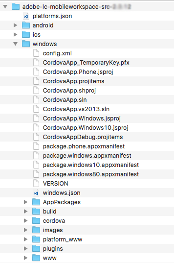

# Configure o projeto do Visual Studio e crie o aplicativo do Windows{#set-up-the-visual-studio-project-and-build-the-windows-app}

O AEM Forms fornece o código fonte completo do aplicativo AEM Forms. A origem contém todos os componentes para criar um aplicativo de espaço de trabalho personalizado. O arquivo de código-fonte `adobe-lc-mobileworkspace-src-<version>.zip`é parte do `adobe-aemfd-forms-app-src-pkg-<version>.zip` pacote de distribuição de software.

Para obter a fonte do aplicativo AEM Forms, execute as seguintes etapas:

1. Distribuição [de](https://experience.adobe.com/downloads)software aberta. Você precisa de um Adobe ID para fazer login na Software Distribution (Distribuição de software).
1. Toque em **[!UICONTROL Adobe Experience Manager]** disponível no menu de cabeçalho.
1. Na seção **[!UICONTROL Filtros]** :
   1. Selecione **[!UICONTROL Formulários]** na lista suspensa **[!UICONTROL Solução]** .
   2. Selecione a versão e o tipo do pacote. Você também pode usar a opção **[!UICONTROL Pesquisar downloads]** para filtrar os resultados.
1. Toque no nome do pacote aplicável ao seu sistema operacional, selecione **[!UICONTROL Aceitar termos]** do EULA e toque em **[!UICONTROL Download]**.
1. Abra o Gerenciador [de](https://docs.adobe.com/content/help/en/experience-manager-65/administering/contentmanagement/package-manager.html) pacotes e clique em **[!UICONTROL Carregar pacote]** para fazer upload do pacote.
1. Select the package and click **[!UICONTROL Install]**.

1. Para baixar o arquivo de código fonte, abra `https://<server>:<port>/crx/de/content/forms/mobileapps/src/adobe-lc-mobileworkspace-src-<version>.zip` no navegador.\
   O pacote de origem é baixado em seu dispositivo.

A imagem a seguir exibe o conteúdo extraído do `adobe-lc-mobileworkspace-src-<version>.zip`.

A imagem a seguir exibe a estrutura de diretório da `windows` pasta na `src` pasta.

## Configuração do ambiente {#setting-up-the-environment}

Para dispositivos Windows, é necessário:

* Microsoft Windows 8.1 ou Windows 10
* Microsoft Visual Studio 2015
* Ferramentas do Microsoft Visual Studio para o Apache Cordova

## Configuração do projeto do Visual Studio para o aplicativo AEM Forms {#setting-up-visual-studio-project-for-aem-forms-app}

Execute as seguintes etapas para configurar o projeto do aplicativo AEM Forms no Visual Studio.

1. Copie o `adobe-lc-mobileworkspace-src-<version>.zip` arquivo para a `%HOMEPATH%\Projects` pasta no dispositivo Windows 8.1 ou Windows 10 com o Visual Studio 2015 instalado e configurado.
1. Extraia o arquivo no `%HOMEPATH%\Projects\MobileWorkspace` diretório.
1. Navegue até o `%HOMEPATH%\Projects\MobileWorkspace\adobe-lc-mobileworkspace-src-[versionsrc]\windows` diretório.
1. Abra o `CordovaApp.sln` arquivo usando o Visual Studio 2015 e continue criando o aplicativo AEM Forms.

## Criar aplicativo AEM Forms {#build-aem-forms-app}

Execute as seguintes etapas para criar e implantar o aplicativo AEM Forms.

>[!NOTE]
>
>Os dados armazenados no sistema de arquivos do Windows para o aplicativo AEM Forms não são criptografados. É recomendável usar uma ferramenta de terceiros, como a Encriptação de Unidade BitLocker do Windows, para encriptar dados de disco.

1. Na barra de ferramentas do Visual Studio Standard, selecione **Liberar** no menu suspenso para o modo de compilação.

1. Selecione Windows-AnyCPU, Windows-x64 ou Windows-x86 com base na sua plataforma. O Windows-AnyCPU é recomendado.
1. No Visual Studio Solution Explorer, clique com o botão direito do mouse no projeto **CordovaApp.Windows** e selecione **Loja > Criar AppPackages**.

   

   O assistente Criar pacotes de aplicativos é exibido.

   O arquivo instalador do CordovaApp.Windows_3.0.2.0_anycpu.appx é criado no diretório platforms\windows\AppPackages\CordovaApp.Windows_3.0.2.0_anycpu_Test.

   Se você encontrar o erro `Retarget to windows 8.1 required`, clique com o botão direito do mouse no erro e, no menu pop-up, selecione **Redirecionar para Windows 8.1**.

   

1. No assistente Criar pacotes de aplicativos, selecione o tempo ou não que deseja carregar seu aplicativo na loja do Windows e clique em **Avançar**.

   

1. Faça as alterações nos parâmetros, como a versão e o local de saída da criação do aplicativo, conforme necessário.

   

1. Depois que o projeto for criado, você poderá instalar o aplicativo usando:

   * Windows PowerShell
   * Visual Studio

   O `.appx` pacote requer os seguintes itens para ser instalado com êxito:

   1. Biblioteca WinJS
   1. Certifique-se de que o pacote vem com um certificado autoassinado ou um certificado público assinado por uma autoridade confiável, como o VeriSign.
   1. Licença do desenvolvedor

   O diretório Platforms\windows\AppPackages\CordovaApp.Windows_3.0.2.0_anycpu_Test contém os quatro componentes principais nele:

   1. `.appx` arquivo
   1. Certificado (Atualmente, é um certificado autoassinado pelo Apache Cordova)
   1. Pasta de dependência
   1. Arquivo PowerShell (extensão .ps1)

## Implantação de um aplicativo usando o Windows PowerShell {#deploying-an-app-using-windows-powershell}

Há duas maneiras de instalar o aplicativo em um dispositivo Windows.

### Ao adquirir a licença de desenvolvedor {#by-acquiring-the-developer-license}

1. Clique com o botão direito do mouse no arquivo PowerShell ( `Add-AppDevPackage.ps1)`, e escolha **Executar com PowerShell**.

1. A configuração solicita que você obtenha uma licença de desenvolvedor. Use credenciais de conta da Microsoft para adquirir uma licença de desenvolvedor.\
   Esta licença é válida por 30 dias e você pode renová-la gratuitamente.
1. Quando você adquire a licença do desenvolvedor, a configuração instala o certificado autoassinado no sistema e o aplicativo é instalado com êxito.

### Usando dispositivos de propriedade da empresa {#by-using-enterprise-owned-devices}

Para dispositivos de propriedade de empresas que estejam ligados ao domínio da empresa, não é necessário adquirir uma licença de desenvolvedor.

Dispositivos de propriedade corporativa usam edições Professional e Enterprise do Windows.

A Microsoft recomenda que você instale um certificado público emitido por uma autoridade confiável, como o VeriSign.

Para implantar o aplicativo:

* Verifique se o dispositivo está associado ao domínio da empresa.
* Habilitar a configuração de política de grupo.

**Para ativar a configuração de política de grupo:**

1. Em seu dispositivo, execute `gpedit.msc`.
1. Navegue até Configuração do **computador > Modelos administrativos > Componente do Windows > Implantação** de pacotes de aplicativos.
1. Clique com o botão direito do mouse em **Permitir a instalação** de todos os aplicativos confiáveis.
1. Clique em **Editar** e selecione **Ativado**.

1. Clique em **OK**.

Edite o script PowerShell gerado pelo Visual Studio para impedir que ele adquira licença de desenvolvedor.

No script do PowerShell, defina a variável: `$NeedDeveloperLicense = $false`.

Para dispositivos que não são unidos por domínio, é necessário carregar lado a chave de ativação do produto. Você pode comprá-lo de um revendedor do Windows.

No Windows 8.1 Home Edition, não há política de grupo, o carregamento no lado da empresa não é permitido e você não pode ingressar nele no domínio da empresa. Implante o aplicativo em um dispositivo Windows 8.1 Home Edition usando a licença do desenvolvedor.

Para obter mais informações, clique [aqui](https://blogs.msdn.com/b/mvpawardprogram/archive/2014/03/24/side-loading-deployment-of-windows-store-apps-in-enterprises-step-by-step.aspx).

## Implantação de um aplicativo usando o Visual Studio {#deploying-an-app-using-visual-studio}

Para instalar o aplicativo no Windows usando o Visual Studio:

1. Conecte o dispositivo usando o depurador remoto.\
   Para obter mais informações, consulte [Executar aplicativos da Windows Store em um computador](https://docs.microsoft.com/en-us/visualstudio/debugger/run-windows-store-apps-on-a-remote-machine)remoto.

1. Com seu aplicativo aberto no Visual Studio, escolha Windows-x64, Windows-x86 ou Windows-AnyCPU na lista Plataformas de solução e selecione Máquina **remota**.
1. Seu aplicativo é implantado na máquina remota.

