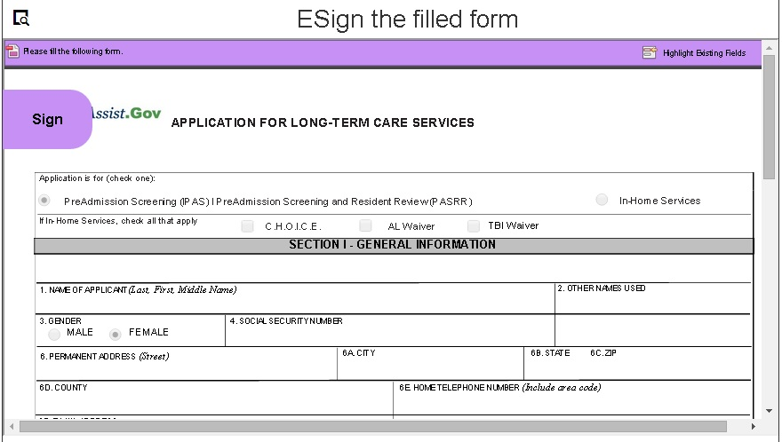

# Aplicar assinaturas eletrônicas a um formulário usando assinaturas do scribble{#apply-electronic-signatures-to-a-form-using-deprecated-scribble-signatures}

Você pode usar o componente **Assinatura do Scribble** e o componente **Etapa de assinatura** para desenhar (Scribble) assinatura em um formulário adaptável. O componente Etapa de assinatura exibe uma versão PDF do formulário adaptável. É necessário ativar uma opção Documento de registro ou formulários adaptáveis baseados em modelo de formulário para usar o componente Etapa de assinatura.

Ambos os componentes fornecem uma janela, conforme exibido abaixo, para assinar um formulário. Você também pode clicar no ícone de geolocalização  para adicionar geolocalização à assinatura.

## Configurar um formulário adaptável para usar a Assinatura do Scribble {#configure-an-adaptive-form-to-use-scribble-signature}

1. Crie uma opção Documento de registro ativada ou um formulário adaptável baseado em modelo de formulário. Para obter informações passo a passo, consulte [Criação de um formulário adaptável](../../forms/using/creating-adaptive-form.md).
1. Arraste e solte o componente **Scribble Signature** do navegador de componentes para o formulário adaptável.
1. Toque no ícone **Configurar** . Ele abre o navegador de propriedades e exibe as propriedades do componente Assinatura do rabisco. Configure as propriedades do componente Assinatura do Scribble.
1. Arraste e solte o componente Etapa de assinatura do navegador de componentes para o formulário adaptável.

   >[!NOTE]
   >
   >O componente Etapa de assinatura ocupa a largura total disponível para o formulário. É recomendável não ter nenhum outro componente na seção que contenha o componente Etapa de assinatura.

1. No navegador Conteúdo, toque em **Contêiner de formulário** e toque no ícone **Configurar** . Ele abre o navegador de propriedades e exibe as propriedades do contêiner do Formulário adaptável. Navegue até **Adaptive Form Container** > **Electronic Signature** e desmarque a opção **Enable Adobe Sign**. Toque no ícone Concluído  para salvar as alterações.

   >[!NOTE]
   >
   >Quando você adiciona um componente Etapa de assinatura a um formulário adaptável, a opção Habilitar Adobe Sign é selecionada automaticamente.

1. Toque no ícone **Configurar** . Ele abre o navegador de propriedades e exibe as propriedades da etapa Assinatura. Configure as seguintes propriedades:

   * **Nome** do elemento: Especifique o nome do componente.

   * **Título:** especifique o título exclusivo do componente.
   * **Mensagem de modelo:** Especifique a mensagem a ser exibida enquanto o PDF de assinatura estiver sendo carregado. Os serviços da Adobe Sign levam algum tempo para preparar e carregar um PDF de assinatura.
   * **Serviço de assinatura:** selecione a opção  **Assinar** assinatura.

   * **Classe** CSS: Especifique a classe CSS da biblioteca do cliente, se houver. Recomenda-se usar [themes](../../forms/using/themes.md) e [estilos em linha](../../forms/using/inline-style-adaptive-forms.md) em vez de Classe CSS.

   Toque no ícone Concluído  para salvar as alterações. A Assinatura é configurada com êxito.

   Agora, quando um formulário é preenchido, uma versão em PDF do formulário adaptável é exibida e as opções para assinar o documento PDF são fornecidas. Para obter informações detalhadas, consulte [Assinar um formulário adaptável usando Assinatura do Scribble](../../forms/using/signing-forms-using-scribble.md#sign-an-adaptive-form-using-scribble-signature).

## Assinar um formulário adaptável usando a Assinatura do Scribble {#sign-an-adaptive-form-using-scribble-signature}

1. Depois de preencher um formulário adaptável e chegar à página Etapa de assinatura, a tela de assinatura é exibida.

   

1. Clique em **[!UICONTROL Assinar]**. A caixa de diálogo de sinal de rabisco é exibida. Assine o formulário e clique no ícone Concluído  para salvar a assinatura.

   

1. Clique em concluir para concluir o processo de assinatura.

   

As assinaturas são adicionadas ao formulário e o controle do formulário é movido para o próximo painel.

