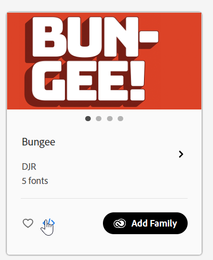

# Estilizar o formulário adaptável {#do-not-publish-style-your-adaptive-form}

Saiba como criar um tema personalizado, estilizar componentes individuais e usar Web Fonts em um tema.

Este tutorial é uma etapa da série [Criar o primeiro formulário adaptável](https://helpx.adobe.com/br/experience-manager/6-3/forms/using/create-your-first-adaptive-form.html). A Adobe recomenda que você siga a série em sequência cronológica para entender, executar e demonstrar o caso de uso tutorial completo.

## Sobre o tutorial  {#about-the-tutorial}

É possível usar temas para fornecer uma aparência e um estilo exclusivos a um formulário adaptável. Você pode aplicar temas prontos para uso fornecidos com o editor de formulários adaptáveis ou criar temas personalizados próprios. O AEM [!DNL Forms] fornece um [editor de temas](https://helpx.adobe.com/experience-manager/6-3/forms/using/themes.html) para criar temas personalizados. Um único tema pode fornecer a aparência diferente para o mesmo formulário adaptável aberto em dispositivos móveis, tablets ou áreas de trabalho. Qualquer conhecimento prévio de CSS ou MENOS não é necessário para usar o editor de temas, mas é desejável.

No final do tutorial, você poderá fazer o seguinte:

* Aplicar um tema pronto para uso a um formulário adaptável
* Criar um tema para formulário adaptável usando o editor de temas
* Estilizar componentes individuais
* Seção de Bônus: Usar Web Fonts em um tema personalizado

Seu formulário deve ser semelhante ao seguinte após concluir o tutorial:

## Antes de começar {#before-you-start}

Baixe as imagens de estilo de cabeçalho e logotipo fornecidas abaixo em seu computador local. O cabeçalho do formulário adaptável `shipping-address-add-update-form` usa as imagens de estilo de cabeçalho e logotipo. A imagem de estilo do cabeçalho é exibida no lado direito do cabeçalho.

[Obter arquivo](assets/header-style.png)

[Obter arquivo](assets/logo-1.png)

## Etapa 1: Aplicar um tema ao formulário adaptável {#step-apply-a-theme-to-your-adaptive-form}

O editor de formulários adaptáveis fornece vários temas prontos para uso. Se você planeja não usar um estilo personalizado para seu formulário adaptável, também pode publicar seus formulários adaptáveis com um tema pronto para uso. Os temas são independentes das formas adaptativas. É possível aplicar o mesmo tema a vários formulários adaptáveis.

**Para aplicar um tema ao seu formulário adaptável:**

1. Abra o formulário adaptável para edição.

   [http://localhost:4502/editor.html/content/forms/af/shipping-address-add-update-form.html](http://localhost:4502/editor.html/content/forms/af/shipping-address-add-update-form.html)

1. Abra as propriedades do **[!UICONTROL Contêiner de formulário adaptável]**. No navegador de propriedades, navegue até **[!UICONTROL Básico]** > **[!UICONTROL Tema de Formulário Adaptável]**. O campo **[!UICONTROL Tema de formulário adaptável]** lista todos os temas prontos para uso e personalizados. Por padrão, o tema Tela de desenho é aplicado.
1. Selecione um tema no campo **[!UICONTROL Tema de formulário adaptável]**. Por exemplo, **Tema da pesquisa**. Selecione  para poder aplicar o tema selecionado.

   

   **Figura:** *Formulário adaptável com o tema padrão*

   

   **Figura:** *Formulário adaptável com o tema de Pesquisa*

## Etapa 2: atualizar o formulário adaptável {#step-update-your-adaptive-form}

O design exibido acima requer alterações no texto do espaço reservado e no logotipo do formulário adaptável existente.

**Para atualizar seu formulário adaptável:**

1. Altere o logotipo existente e o texto do cabeçalho. Para remover o logotipo:

   1. Abra o formulário no editor de formulários.

      [http://localhost:4502/editor.html/content/forms/af/shipping-address-add-update-form.html](http://localhost:4502/editor.html/content/forms/af/shipping-address-add-update-form.html)

   1. Selecione a imagem de logotipo no componente [!UICONTROL cabeçalho] e selecione  **[!UICONTROL propriedades]**. Na propriedade [!UICONTROL image], selecione X para remover a imagem de logotipo existente.
   1. Selecione **[!UICONTROL carregar]**, logo.png e  para salvar as alterações. A imagem foi baixada na seção [Antes de você iniciar](/help/forms/using/style-your-adaptive-form.md#before-you-start).
   1. Selecione o texto do cabeçalho, `We.Retail`, e selecione  **[!UICONTROL edit]**. Alterar texto do cabeçalho para `we retail`. Aplicar formatação em negrito somente a `we` em `we retail`.

      

1. Remover título e adicionar texto de espaço reservado:

   1. Selecione o campo ID do cliente e selecione  propriedades.
   1. Copie o conteúdo do campo **[!UICONTROL Título]** para o campo **[!UICONTROL Texto do Espaço Reservado]**.
   1. Exclua o conteúdo do campo **[!UICONTROL Título]** e selecione .
   1. Repita as três etapas anteriores para todas as caixas de texto, caixas numéricas e campos de email do formulário.

      

## Etapa 3: criar um tema personalizado para seu formulário adaptável {#step-create-a-custom-theme-for-your-adaptive-form}

Você pode usar o [editor de temas](/help/forms/using/themes.md) para criar temas personalizados. O editor de temas é um editor WYSIWYG todo-poderoso. É um método visual para aplicar CSS a vários componentes de um formulário adaptável. Ele fornece controles mais finos para estilizar componentes e painéis de um formulário adaptável.

Um tema é uma entidade separada como formulários adaptáveis. Ele contém estilos (CSS) para os componentes e painéis de um formulário adaptável. Os estilos incluem propriedades CSS, como cores de fundo, cores de estado, transparência, alinhamento e tamanho. Quando você aplica um tema, o estilo especificado é aplicado aos componentes correspondentes de um formulário adaptável.

Neste tutorial, você estiliza o cabeçalho e o rodapé, os componentes de texto e numéricos, o componente de anexo e os botões. Vamos começar com a criação de um tema:

### Criar um tema {#create-a-theme}

1. Faça logon na instância de autor do AEM e navegue até **[!UICONTROL Adobe Experience Manager]** > **[!UICONTROL Forms]** > **[!UICONTROL Temas]**. A URL padrão é [http://localhost:4502/aem/forms.html/content/dam/formsanddocuments-themes](http://localhost:4502/aem/forms.html/content/dam/formsanddocuments-themes).
1. Selecione **[!UICONTROL Criar]** e selecione **[!UICONTROL Tema]**. A página [!UICONTROL Criar Tema] com os campos necessários para criar um tema é exibida. Os campos **[!UICONTROL Título]** e **[!UICONTROL Nome]** são obrigatórios:

   * **Título:** especifique um título do tema. Por exemplo, **Tema Global.** O título ajuda a identificar o tema da lista de temas.
   * **Nome:** Especifique o nome do tema. Por exemplo, **Tema Global.** Um nó com o nome especificado é criado no repositório. Quando você começa a digitar um título, o valor do campo de nome é gerado automaticamente. É possível alterar o valor sugerido. O campo de nome pode incluir apenas caracteres alfanuméricos, hifens e sublinhados. Todas as entradas inválidas são substituídas por um hífen.

1. Selecione **[!UICONTROL Criar]**. Um tema é criado e uma caixa de diálogo para abrir o formulário para edição é exibida. Selecione **[!UICONTROL Abrir]** para abrir o tema recém-criado em uma nova guia. O tema é aberto no editor de temas. Para o estilo, o editor de temas usa um formulário adaptável pronto para uso enviado com AEM [!DNL Forms].

   Para obter informações sobre como usar a interface do editor de temas, consulte [Sobre o editor de temas](/help/forms/using/themes.md#aboutthethemeeditor).

1. Selecione **[!UICONTROL Opções de Tema]**  > **[!UICONTROL Configurar]**. No campo **[!UICONTROL Visualizar Formulário]**, selecione o formulário adaptável **delivery-address-add-update-form**, selecione  e **[!UICONTROL Salvar]**. Agora, o editor de temas é configurado para usar seu próprio formulário adaptável em vez do formulário adaptável padrão. Selecione **[!UICONTROL Cancelar]** para retornar ao editor de tema.

   

   **Figura:** *Editor de temas com o formulário adaptável shipping-address-add-update-form*

   

   **Figura:** *Formulário adaptável com o formulário padrão*

### Cabeçalho e rodapé do estilo {#style-header-and-footer}

O cabeçalho e o rodapé fornecem uma aparência consistente e distinta para um formulário adaptável. Geralmente, o cabeçalho contém o logotipo e o nome da organização, o rodapé contém informações de direitos autorais e elas permanecem idênticas em vários formulários de uma organização. Para estilizar o cabeçalho e o rodapé do formulário adaptável delivery-address-add-update-form:

1. Navegue pela opção **[!UICONTROL Cabeçalho]** > **[!UICONTROL Texto]** no painel Seletores. O painel Seletores está à esquerda do editor de tema. Se o painel não estiver visível, selecione  Alternar painel lateral.

1. Defina as seguintes propriedades na opção **[!UICONTROL Texto]** e selecione .

   | Propriedade | Valor |
   |---|---|
   | Família de Fontes | Arial® |
   | Cor da Fonte | FFFFFF |
   | Tamanho da Fonte | 54 px |

1. Selecione o widget [!UICONTROL cabeçalho] e selecione **[!UICONTROL cabeçalho]**. As opções para estilizar o widget Cabeçalho são exibidas à esquerda. Expanda a opção **[!UICONTROL Dimension e Posição]**, defina a **[!UICONTROL Altura]** como `120px` e selecione .
1. Expanda a opção **[!UICONTROL Plano de Fundo]** do widget de cabeçalho. Defina a **[!UICONTROL Cor do Plano de Fundo]** como `F6921E.`

   Passe o mouse sobre **[!UICONTROL Imagem e Gradiente]** > **[!UICONTROL + Adicionar]**, selecione **[!UICONTROL Imagem]**. Defina as seguintes propriedades e selecione .

   | Propriedade | Valor |
   |---|---|
   | imagem | Carregue o header-style.png. A imagem foi baixada na seção [Antes de você iniciar](/help/forms/using/style-your-adaptive-form.md#before-you-start). |
   | Posição | Parte Inferior Direita |
   | Lado a lado | Sem Repetição |

1. No editor de temas, selecione o logotipo no cabeçalho e selecione **[!UICONTROL Logotipo de cabeçalho]**. Expanda a opção Dimension e Posição, defina as seguintes propriedades e selecione .

   <table> 
    <tbody> 
     <tr> 
      <td><b>Margem</b></td> 
      <td><b>Valor</b></td> 
     </tr> 
     <tr> 
      <td>Margem</td> 
      <td> 
       <ul> 
        <li>Superior: 1,5rem</li> 
        <li>Inferior: -35px</li> 
        <li>À esquerda: 1rem<strong>  </strong></li> 
       </ul> 
<strong>Dica:</strong> Selecione o ícone de link  para fornecer um valor diferente para cada campo.  
 </td> 
     </tr> 
     <tr> 
      <td>Altura</td> 
      <td>4,75rem</td> 
     </tr> 
    </tbody> 
   </table>

1. Selecione o widget de rodapé e selecione **[!UICONTROL Rodapé]**. Expanda a opção **[!UICONTROL Plano de Fundo]**, defina a **[!UICONTROL Cor do Plano de Fundo]** como `F6921E` e selecione .

### Estilo do componente de captura de dados e aplicação de um plano de fundo ao formulário adaptável {#style-the-data-capture-component-and-apply-a-background-to-the-adaptive-form}

É possível usar vários componentes em um formulário adaptável para capturar dados. Por exemplo, caixa de texto e caixa numérica. Você pode fornecer um estilo idêntico a todos os componentes de captura de dados ou um estilo separado para cada componente. Neste tutorial, um estilo idêntico é aplicado a caixas numéricas (ID do cliente, CEP) e caixas de texto (ID do cliente, Nome, Endereço de entrega, Estado, Email). Para estilizar os componentes de captura de dados:

1. Selecione o campo **[!UICONTROL ID do cliente]** e selecione a opção **[!UICONTROL Widget de campo]**. Defina as seguintes propriedades e selecione .

   <table> 
    <tbody> 
     <tr> 
      <td><b>Acordeão</b></td> 
      <td><b>Propriedade</b></td> 
      <td><b>Valor</b></td> 
     </tr> 
     <tr> 
      <td>Borda</td> 
      <td>Cor da Borda</td> 
      <td>A7A9AC</td> 
     </tr> 
     <tr> 
      <td>Borda</td> 
      <td>Raio da Borda </td> 
      <td> 
       <ul> 
        <li>Superior: 7 px  </li> 
        <li>Direita: 7 px  </li> 
        <li>Inferior: 7 px  </li> 
        <li>Esquerda: 7 px  </li> 
       </ul> </td> 
     </tr> 
     <tr> 
      <td>Texto</td> 
      <td>Família de Fontes</td> 
      <td>Arial®</td> 
     </tr> 
     <tr> 
      <td>Texto</td> 
      <td>Cor da Fonte</td> 
      <td>939598  </td> 
     </tr> 
     <tr> 
      <td>Texto</td> 
      <td>Tamanho da Fonte</td> 
      <td>18 px</td> 
     </tr> 
     <tr> 
      <td>Dimension e Posição</td> 
      <td>Largura</td> 
      <td>60%</td> 
     </tr> 
     <tr> 
      <td>Dimension e Posição</td> 
      <td>Margem</td> 
      <td> 
       <ul> 
        <li>À esquerda: 10 rem</li> 
       </ul> </td> 
     </tr> 
    </tbody> 
    </table>

1. Selecione a área vazia acima do campo **[!UICONTROL ID do cliente]** e selecione **[!UICONTROL Contêiner do painel responsivo]**. Defina o **[!UICONTROL Plano de Fundo]** > **[!UICONTROL Cor do Plano de Fundo]** como F1F2F2. Selecione .

   

### Estilo dos botões {#style-the-buttons}

Você pode usar um tema personalizado para aplicar um estilo idêntico a todos os botões do formulário adaptável e [estilo em linha](/help/forms/using/inline-style-adaptive-forms.md) para aplicar um estilo a um botão específico. Para estilizar os botões:

1. Selecione o botão **[!UICONTROL Enviar]** e selecione a opção **[!UICONTROL Botão]**. Defina as seguintes propriedades e selecione .

   <table> 
    <tbody> 
     <tr> 
      <td><b>Acordeão</b></td> 
      <td><b>Propriedade</b></td> 
      <td><b>Valor</b></td> 
     </tr> 
     <tr> 
      <td>Fundo</td> 
      <td>Cor do Plano de Fundo</td> 
      <td>F6921E</td> 
     </tr> 
     <tr> 
      <td>Borda  </td> 
      <td>Cor da Borda</td> 
      <td>F6921E</td> 
     </tr> 
     <tr> 
      <td>Borda</td> 
      <td>Raio da Borda </td> 
      <td> 
       <ul> 
        <li>Superior: 7 px  </li> 
        <li>Direita: 7 px  </li> 
        <li>Inferior: 7 px  </li> 
        <li>Esquerda: 7 px</li> 
       </ul> </td> 
     </tr> 
     <tr> 
      <td>Texto  </td> 
      <td>Família de Fontes</td> 
      <td>Arial®</td> 
     </tr> 
     <tr> 
      <td>Texto</td> 
      <td>Cor da Fonte</td> 
      <td>FFFFFF</td> 
     </tr> 
     <tr> 
      <td>Texto</td> 
      <td>Tamanho da Fonte</td> 
      <td>18 px</td> 
     </tr> 
    </tbody> 
   </table>

1. [Aplique o tema personalizado](/help/forms/using/style-your-adaptive-form.md#step-apply-a-theme-to-your-adaptive-form), Tema global, ao seu formulário adaptável. Se o estilo não refletir no formulário adaptável, limpe o cache do navegador e tente novamente.

   

## Etapa 4: Estilizar componentes individuais {#step-style-individual-components}

Alguns estilos se aplicam a apenas um componente específico. Esses componentes são estilizados no editor de formulários adaptáveis.

1. Abra o formulário adaptável para edição. [http://localhost:4502/editor.html/content/forms/af/shipping-address-add-update-form.html](http://localhost:4502/editor.html/content/forms/af/change-billing-shipping-address.html)
1. Na barra superior, selecione a opção **[!UICONTROL Estilo]**.

   

1. Selecione o botão **[!UICONTROL Anexar]** e selecione o ícone . Defina as seguintes propriedades na opção **[!UICONTROL Dimension e Posição]**:

   | Propriedade | Valor |
   |---|---|
   | Flutuante | À esquerda |
   | Largura | 10% |

1. Selecione a opção **[!UICONTROL Prova de endereço aprovada pelo governo]** e selecione o ícone . Defina as seguintes propriedades:

   <table> 
    <tbody> 
     <tr> 
      <td><b>Acordeão</b></td> 
      <td><b>Propriedade</b></td> 
      <td><b>Valor</b></td> 
     </tr> 
     <tr> 
      <td>Dimensões e Posição</td> 
      <td>Flutuante</td> 
      <td>À esquerda</td> 
     </tr> 
     <tr> 
      <td>Dimensões e Posição</td> 
      <td>Largura</td> 
      <td>73%</td> 
     </tr> 
     <tr> 
      <td>Dimensões e Posição</td> 
      <td>Preenchimento</td> 
      <td> 
       <ul> 
        <li>Esquerda: 10 px</li> 
       </ul> </td> 
     </tr> 
     <tr> 
      <td>Dimensões e Posição</td> 
      <td>Altura</td> 
      <td>40px</td> 
     </tr> 
     <tr> 
      <td>Dimension e Posição  </td> 
      <td>Margem</td> 
      <td>  
       <ul> 
        <li>Direito: 2 rem</li> 
        <li>À esquerda: 10 rem </li> 
       </ul> </td> 
     </tr> 
     <tr> 
      <td>Fundo</td> 
      <td>Cor do Plano de Fundo</td> 
      <td>FFFFFF</td> 
     </tr> 
     <tr> 
      <td>Borda</td> 
      <td>Largura da Borda</td> 
      <td>1 px</td> 
     </tr> 
     <tr> 
      <td>Borda</td> 
      <td>Estilo de Borda</td> 
      <td>Sólido</td> 
     </tr> 
     <tr> 
      <td>Borda</td> 
      <td>Cor da Borda</td> 
      <td>A7A9AC</td> 
     </tr> 
     <tr> 
      <td>Borda</td> 
      <td>Raio da Borda</td> 
      <td>7 px</td> 
     </tr> 
     <tr> 
      <td>Texto</td> 
      <td>Família de Fontes</td> 
      <td>Arial®</td> 
     </tr> 
     <tr> 
      <td>Texto</td> 
      <td>Cor da Fonte</td> 
      <td>BCBEC0</td> 
     </tr> 
     <tr> 
      <td>Texto</td> 
      <td>Tamanho da Fonte</td> 
      <td>18 px</td> 
     </tr> 
     <tr> 
      <td>Texto</td> 
      <td>Altura da Linha</td> 
      <td>2</td> 
     </tr> 
     </tr> 
    </tbody> 
   </table>

1. Selecione o botão **[!UICONTROL Enviar]** e selecione o ícone . Defina as seguintes propriedades:

   <table> 
    <tbody> 
     <tr> 
      <td><b>Acordeão</b></td> 
      <td><b>Propriedade</b></td> 
      <td><b>Valor</b></td> 
     </tr> 
     <tr> 
      <td>Dimension e Posição</td> 
      <td>Flutuante</td> 
      <td>Direito</td> 
     </tr> 
     <tr> 
      <td>Dimension e Posição</td> 
      <td>Margem</td> 
      <td> 
       <ul> 
        <li>Superior: 5 rem</li> 
        <li>Direito: 14 rem</li> 
        <li>Inferior: 20 px</li> 
        <li>Esquerda: 20 px  </li> 
       </ul> </td> 
     </tr> 
     <tr> 
      <td>Fundo</td> 
      <td>Cor do Plano de Fundo</td> 
      <td>F6921E</td> 
     </tr> 
     <tr> 
      <td>Borda</td> 
      <td>Cor da Borda</td> 
      <td>F6921E</td> 
     </tr> 
    </tbody> 
   </table>

   

## Etapa 5: Seção de bônus: Uso de Web Fonts em um tema personalizado {#step-bonus-section-using-web-fonts-in-a-custom-theme}

É possível usar várias fontes para criar um formulário adaptável. Todos os dispositivos nos quais o formulário adaptável é exibido podem não ter as fontes usadas para criar o formulário adaptável. Você pode usar um serviço de fontes da Web para fornecer as fontes necessárias ao dispositivo de destino.

[!DNL Adobe Fonts] é um serviço do Web Fonts. Você pode configurar e usar o serviço com formulários adaptáveis. Para usar [!DNL Adobe Fonts] em um formulário adaptável:
1. Procure a [biblioteca de fontes de Adobe](https://fonts.adobe.com/) e escolha a fonte para estilizar o formulário.
<!--
>[!NOTE]
>
> [!DNL Typekit] is now called Adobe Fonts and is included with Creative Cloud and other subscriptions. [Learn more](https://fonts.adobe.com/).-->

>[!NOTE]
>
> É possível adicionar tags ou filtros para refinar a lista de fontes.

1. Clique no botão &lt;/> para adicionar a família a um projeto da Web, caso encontre uma fonte que goste.

   

   A tela de diálogo Adicionar fontes a um projeto da Web é exibida.

   >[!NOTE]
   >
   > Você só poderá adicionar fontes ao projeto da Web se elas tiverem o botão &lt;/> disponível.

2. Dê um nome ao projeto da Web.
3. Marque as caixas de seleção para selecionar os pesos e estilos de fonte que deseja incluir.

   

4. Selecione **Clique** para criar o projeto.
5. Copie o código incorporado e o URL da tela.
   

6. Clique em **Concluído** para fechar a janela do projeto Web.
7. Faça logon na instância do AEM e vá para a URL `http://server:port/crx/de/index.jsp#`
8. Crie uma estrutura de pastas no CRXDE, por exemplo `/apps/[fontslibrary]/[customlibrary(clientlibrary)]`.
9. Vá para a pasta `clientlibs` recém-criada e adicione as propriedades `allowProxy` e `categories`.
10. Navegue até `/apps/[fontslibrary]/[customlibrary(clientlibrary)]` e crie uma pasta css.
11. Vá para a pasta CSS criada e crie um arquivo. Por exemplo, crie um arquivo como `fonts.css` e cole o código incorporado junto com a URL.
   
12. Salve as alterações.

>[!NOTE]
>
> Para usar as fontes personalizadas adicionadas em um Formulário Adaptável, verifique se o nome da biblioteca do cliente na **[!UICONTROL Categoria da Biblioteca do Cliente]** está alinhado com o nome especificado na opção de categorias da pasta clientlib.

As fontes incluídas agora podem ser acessadas no Formulário adaptável por meio da seguinte biblioteca de cliente de fontes personalizadas.

<!--
Create Adobe Fonts Configuration

1. To create a API Token, go to **login** > **API Token** > **Make me a new API token**.

   

2. Once, you click **Make me a new API token**, a new token is generated. 
3. Copy the generated token for future use.
4. Now login to your AEM  author instance. On the author instance, go to **[!UICONTROL Tools]**>**[!UICONTROL Cloud Services]**> **[!UICONTROL Adobe Fonts]**.
5. Select the configuration container and click **Create**. **[UICONTROL Create Adobe Fonts Configuration]** screen appears.
    

6. Spceify the name and paste the API token in the **[!UICONTROL Kit ID]** textbox.
7. Click **Create**.

The fonts added to the **[!UICONTROL Adobe Fonts]** are available for selection in the **[!UICONTROL Text]** accordion of all the components.
1. In the theme editor, navigate to **[!UICONTROL Theme Options]**  > **[!UICONTROL Configure]**. 
2. In the **[!UICONTROL Adobe Fonts Configuration]** field, select the kit, and click **[!UICONTROL Save]**.

1. Create an [Adobe Fonts](https://fonts.adobe.com/?ref=tk.com) account, create a kit, add font Myriad Pro to the kit, publish the kit, and obtain the Kit ID. It is required to use [!DNL Adobe Fonts] (Web Fonts) in an adaptive form. 
1. In the AEM [!DNL Forms] Server, navigate to  **[!UICONTROL Adobe Experience Manager]** > **[!UICONTROL Tools]**  > **[!UICONTROL Adobe Fonts]**. Now, open a configuration folder. If a configuration is already available, click the **[!UICONTROL Create]** button to create an instance.

   On the Create Configuration dialog, specify a **Title** for the configuration, and click **[!UICONTROL Create]**. You are redirected to the configuration page. In the [!UICONTROL Edit Component] dialog that appears, provide your **Kit ID** and click **[!UICONTROL OK]**. -->

