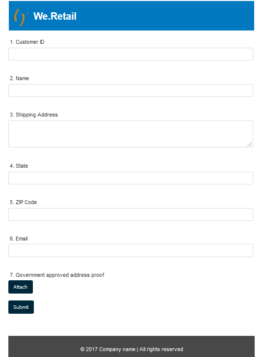

# Estilizar o formulário adaptável {#do-not-publish-style-your-adaptive-form}

Saiba como criar um tema personalizado, estilizar componentes individuais e usar Web Fonts em um tema.

Este tutorial é uma etapa da [Criar O Primeiro Formulário Adaptável](https://helpx.adobe.com/br/experience-manager/6-3/forms/using/create-your-first-adaptive-form.html) série. A Adobe recomenda que você siga a série em sequência cronológica para entender, executar e demonstrar o caso de uso tutorial completo.

## Sobre o tutorial  {#about-the-tutorial}

É possível usar temas para fornecer uma aparência e um estilo exclusivos a um formulário adaptável. Você pode aplicar temas prontos para uso fornecidos com o editor de formulários adaptáveis ou criar temas personalizados próprios. AEM [!DNL Forms] fornecer um [editor de tema](https://helpx.adobe.com/experience-manager/6-3/forms/using/themes.html) para criar temas personalizados. Um único tema pode fornecer a aparência diferente para o mesmo formulário adaptável aberto em dispositivos móveis, tablets ou áreas de trabalho. Qualquer conhecimento prévio de CSS ou MENOS não é necessário para usar o editor de temas, mas é desejável.

No final do tutorial, você poderá fazer o seguinte:

* Aplicar um tema pronto para uso a um formulário adaptável
* Criar um tema para formulário adaptável usando o editor de temas
* Estilizar componentes individuais
* Seção de Bônus: Usar Web Fonts em um tema personalizado

Seu formulário deve ser semelhante ao seguinte após concluir o tutorial:

## Antes de você iniciar {#before-you-start}

Baixe as imagens de estilo de cabeçalho e logotipo fornecidas abaixo em seu computador local. O cabeçalho do `shipping-address-add-update-form` o formulário adaptável usa as imagens de estilo de cabeçalho e logotipo. A imagem de estilo do cabeçalho é exibida no lado direito do cabeçalho.

[Obter arquivo](assets/header-style.png)

[Obter arquivo](assets/logo-1.png)

## Etapa 1: Aplicar um tema ao formulário adaptável {#step-apply-a-theme-to-your-adaptive-form}

O editor de formulários adaptáveis fornece vários temas prontos para uso. Se você planeja não usar um estilo personalizado para seu formulário adaptável, também pode publicar seus formulários adaptáveis com um tema pronto para uso. Os temas são independentes das formas adaptativas. É possível aplicar o mesmo tema a vários formulários adaptáveis.

**Para aplicar um tema ao formulário adaptável:**

1. Abra o formulário adaptável para edição.

   [http://localhost:4502/editor.html/content/forms/af/shipping-address-add-update-form.html](http://localhost:4502/editor.html/content/forms/af/shipping-address-add-update-form.html)

1. Abrir propriedades de **[!UICONTROL Contêiner de formulário adaptável]**. No navegador de propriedades, navegue até **[!UICONTROL Básico]** > **[!UICONTROL Tema do formulário adaptável]**. A variável **[!UICONTROL Tema do formulário adaptável]** O campo lista todos os temas prontos para uso e personalizados. Por padrão, o tema Tela de desenho é aplicado.
1. Selecione um tema no **[!UICONTROL Tema do formulário adaptável]** campo. Por exemplo, **Tema da pesquisa**. Toque  para poder aplicar o tema selecionado.

   

   **Figura:** *Formulário adaptável com o tema padrão*

   

   **Figura:** *Formulário adaptável com o tema Pesquisa*

## Etapa 2: atualizar o formulário adaptável {#step-update-your-adaptive-form}

O design exibido acima requer alterações no texto do espaço reservado e no logotipo do formulário adaptável existente.

**Para atualizar o formulário adaptável:**

1. Altere o logotipo existente e o texto do cabeçalho. Para remover o logotipo:

   1. Abra o formulário no editor de formulários.

      [http://localhost:4502/editor.html/content/forms/af/shipping-address-add-update-form.html](http://localhost:4502/editor.html/content/forms/af/shipping-address-add-update-form.html)

   1. Toque na imagem do logotipo no [!UICONTROL cabeçalho] componente e toque em  **[!UICONTROL propriedades]**. No [!UICONTROL imagem] toque em X para remover a imagem de logotipo existente.
   1. Toque **[!UICONTROL upload]**, selecione o arquivo logo.png e toque em  para salvar as alterações. A imagem foi baixada no [Antes de começar](/help/forms/using/style-your-adaptive-form.md#before-you-start) seção.
   1. Toque no texto do cabeçalho, `We.Retail`e toque em  **[!UICONTROL editar]**. Alterar texto do cabeçalho para `we retail`. Aplicar formatação em negrito somente a `we`in `we retail`.

      

1. Remover título e adicionar texto de espaço reservado:

   1. Toque no campo ID do cliente e em  propriedades.
   1. Copie o conteúdo do **[!UICONTROL Título]** para o campo **[!UICONTROL Texto para espaço reservado]** campo.
   1. Exclua o conteúdo do **[!UICONTROL Título]** e toque em .
   1. Repita as três etapas anteriores para todas as caixas de texto, caixas numéricas e campos de email do formulário.

      

## Etapa 3: criar um tema personalizado para seu formulário adaptável {#step-create-a-custom-theme-for-your-adaptive-form}

Você pode usar o [editor de tema](/help/forms/using/themes.md) para criar temas personalizados. O editor de temas é um editor WYSIWYG todo-poderoso. É um método visual para aplicar CSS a vários componentes de um formulário adaptável. Ele fornece controles mais finos para estilizar componentes e painéis de um formulário adaptável.

Um tema é uma entidade separada como formulários adaptáveis. Ele contém estilos (CSS) para os componentes e painéis de um formulário adaptável. Os estilos incluem propriedades CSS, como cores de fundo, cores de estado, transparência, alinhamento e tamanho. Quando você aplica um tema, o estilo especificado é aplicado aos componentes correspondentes de um formulário adaptável.

Neste tutorial, você estiliza o cabeçalho e o rodapé, os componentes de texto e numéricos, o componente de anexo e os botões. Vamos começar com a criação de um tema:

### Criar um tema {#create-a-theme}

1. Faça logon na instância de autor do AEM e acesse **[!UICONTROL Adobe Experience Manager]** > **[!UICONTROL Forms]** > **[!UICONTROL Temas]**. O URL padrão é [http://localhost:4502/aem/forms.html/content/dam/formsanddocuments-themes](http://localhost:4502/aem/forms.html/content/dam/formsanddocuments-themes).
1. Toque **[!UICONTROL Criar]** e selecione **[!UICONTROL Tema]**. A variável [!UICONTROL Criar tema] página com os campos necessários para criar um tema é exibida. A variável **[!UICONTROL Título]** e **[!UICONTROL Nome]** os campos são obrigatórios:

   * **Título:** Especifique um título do tema. Por exemplo, **Tema global.** O título ajuda a identificar o tema da lista de temas.
   * **Nome:** Especifique o nome do tema. Por exemplo, **Tema global.** Um nó com o nome especificado será criado no repositório. Quando você começa a digitar um título, o valor do campo de nome é gerado automaticamente. É possível alterar o valor sugerido. O campo de nome pode incluir apenas caracteres alfanuméricos, hifens e sublinhados. Todas as entradas inválidas são substituídas por um hífen.

1. Toque em **[!UICONTROL Criar]**. Um tema é criado e uma caixa de diálogo para abrir o formulário para edição é exibida. Toque **[!UICONTROL Abertura]** para abrir o tema recém-criado em uma nova guia. O tema é aberto no editor de temas. Para o estilo, o editor de temas usa um formulário adaptável pronto para uso enviado com AEM [!DNL Forms].

   Para obter informações sobre como usar a interface do editor de temas, consulte [Sobre o editor de temas](/help/forms/using/themes.md#aboutthethemeeditor).

1. Toque **[!UICONTROL Opções de tema]**  > **[!UICONTROL Configurar]**. No **[!UICONTROL Visualizar Formulário]** selecione o **endereço-entrega-adicionar-atualizar-formulário** formulário adaptável, toque em , toque em **[!UICONTROL Salvar]**. Agora, o editor de temas é configurado para usar seu próprio formulário adaptável em vez do formulário adaptável padrão. Toque **[!UICONTROL Cancelar]** para retornar ao editor de temas.

   

   **Figura:** *Editor de temas com o formulário adaptável delivery-address-add-update-form*

   

   **Figura:** *Formulário adaptável com o formulário padrão*

### Cabeçalho e rodapé do estilo {#style-header-and-footer}

O cabeçalho e o rodapé fornecem uma aparência consistente e distinta para um formulário adaptável. Geralmente, o cabeçalho contém o logotipo e o nome da organização, o rodapé contém informações de direitos autorais e elas permanecem idênticas em vários formulários de uma organização. Para estilizar o cabeçalho e o rodapé do formulário adaptável delivery-address-add-update-form:

1. Navegue pela **[!UICONTROL Cabeçalho]** > **[!UICONTROL Texto]** no painel Seletores. O painel Seletores está à esquerda do editor de tema. Se o painel não estiver visível, toque em  Alternar painel lateral.

1. Defina as seguintes propriedades no **[!UICONTROL Texto]** acordeão e toque em .

   | Propriedade | Valor |
   |---|---|
   | Família da fonte | Arial® |
   | Cor da fonte | FFFFFF |
   | Tamanho da fonte | 54 px |

1. Toque no [!UICONTROL cabeçalho] widget e toque em **[!UICONTROL Cabeçalho]**. As opções para estilizar o widget Cabeçalho são exibidas à esquerda. Expanda a **[!UICONTROL Dimension e Posição]** , defina o **[!UICONTROL Altura]** para `120px`e toque em .
1. Expanda a **[!UICONTROL Histórico]** do widget cabeçalho, defina o **[!UICONTROL Cor do plano de fundo]** para `F6921E.`

   Focalizar **[!UICONTROL Imagem e Gradiente]** > **[!UICONTROL + Adicionar]**, toque em **[!UICONTROL Imagem]**. Defina as seguintes propriedades e toque em .

   | Propriedade | Valor |
   |---|---|
   | imagem | Carregue o header-style.png. A imagem foi baixada no [Antes de começar](/help/forms/using/style-your-adaptive-form.md#before-you-start) seção. |
   | Posição | Parte Inferior Direita |
   | Lado a lado | Sem Repetição |

1. No editor de temas, toque no logotipo no cabeçalho e toque em **[!UICONTROL Logotipo de cabeçalho]**. Expanda a opção Dimension e Posição, defina as seguintes propriedades e toque em .

   <table> 
    <tbody> 
     <tr> 
      <td><b>Margem</b></td> 
      <td><b>Valor</b></td> 
     </tr> 
     <tr> 
      <td>Margem</td> 
      <td> 
       <ul> 
        <li>Superior: 1,5rem</li> 
        <li>Inferior: -35px</li> 
        <li>À esquerda: 1rem<strong>  </strong></li> 
       </ul> 
<strong>Dica:</strong> Toque no  ícone de link para fornecer um valor diferente para cada campo.  
 </td> 
     </tr> 
     <tr> 
      <td>Altura</td> 
      <td>4.75rem</td> 
     </tr> 
    </tbody> 
   </table>

1. Toque no widget de rodapé e em **[!UICONTROL Rodapé]**. Expanda a **[!UICONTROL Histórico]** , defina o **[!UICONTROL Cor do plano de fundo]** para `F6921E`e toque em .

### Estilo do componente de captura de dados e aplicação de um plano de fundo ao formulário adaptável {#style-the-data-capture-component-and-apply-a-background-to-the-adaptive-form}

É possível usar vários componentes em um formulário adaptável para capturar dados. Por exemplo, caixa de texto e caixa numérica. Você pode fornecer um estilo idêntico a todos os componentes de captura de dados ou um estilo separado para cada componente. Neste tutorial, um estilo idêntico é aplicado a caixas numéricas (ID do cliente, CEP) e caixas de texto (ID do cliente, Nome, Endereço de entrega, Estado, Email). Para estilizar os componentes de captura de dados:

1. Toque no **[!UICONTROL ID do cliente]** e toque no **[!UICONTROL Widget de campo]** opção. Defina as seguintes propriedades e toque em .

   <table> 
    <tbody> 
     <tr> 
      <td><b>Acordeão</b></td> 
      <td><b>Propriedade</b></td> 
      <td><b>Valor</b></td> 
     </tr> 
     <tr> 
      <td>Borda</td> 
      <td>Cor da borda</td> 
      <td>A7A9AC</td> 
     </tr> 
     <tr> 
      <td>Borda</td> 
      <td>Raio da Borda </td> 
      <td> 
       <ul> 
        <li>Superior: 7 px  </li> 
        <li>À direita: 7 px  </li> 
        <li>Inferior: 7 px  </li> 
        <li>Esquerda: 7 px  </li> 
       </ul> </td> 
     </tr> 
     <tr> 
      <td>Texto</td> 
      <td>Família da fonte</td> 
      <td>Arial®</td> 
     </tr> 
     <tr> 
      <td>Texto</td> 
      <td>Cor da fonte</td> 
      <td>939598  </td> 
     </tr> 
     <tr> 
      <td>Texto</td> 
      <td>Tamanho da fonte</td> 
      <td>18 px</td> 
     </tr> 
     <tr> 
      <td>Dimension e Posição</td> 
      <td>Largura</td> 
      <td>60%</td> 
     </tr> 
     <tr> 
      <td>Dimension e Posição</td> 
      <td>Margem</td> 
      <td> 
       <ul> 
        <li>À esquerda: 10 rem</li> 
       </ul> </td> 
     </tr> 
    </tbody> 
    </table>

1. Toque na área vazia acima da **[!UICONTROL ID do cliente]** e toque em **[!UICONTROL Contêiner do painel responsivo]**. Defina o **[!UICONTROL Histórico]** > **[!UICONTROL Cor do plano de fundo]** a F1F2F2. Toque .

   

### Estilo dos botões {#style-the-buttons}

É possível usar um tema personalizado para aplicar um estilo idêntico a todos os botões do formulário adaptável e [estilo em linha](/help/forms/using/inline-style-adaptive-forms.md) para aplicar um estilo a um botão específico. Para estilizar os botões:

1. Toque no **[!UICONTROL Enviar]** e toque no botão **[!UICONTROL Botão]** opção. Defina as seguintes propriedades e toque em .

   <table> 
    <tbody> 
     <tr> 
      <td><b>Acordeão</b></td> 
      <td><b>Propriedade</b></td> 
      <td><b>Valor</b></td> 
     </tr> 
     <tr> 
      <td>Segundo plano</td> 
      <td>Cor do plano de fundo</td> 
      <td>F6921E</td> 
     </tr> 
     <tr> 
      <td>Borda  </td> 
      <td>Cor da borda</td> 
      <td>F6921E</td> 
     </tr> 
     <tr> 
      <td>Borda</td> 
      <td>Raio da Borda </td> 
      <td> 
       <ul> 
        <li>Superior: 7 px  </li> 
        <li>À direita: 7 px  </li> 
        <li>Inferior: 7 px  </li> 
        <li>Esquerda: 7 px</li> 
       </ul> </td> 
     </tr> 
     <tr> 
      <td>Texto  </td> 
      <td>Família da fonte</td> 
      <td>Arial®</td> 
     </tr> 
     <tr> 
      <td>Texto</td> 
      <td>Cor da fonte</td> 
      <td>FFFFFF</td> 
     </tr> 
     <tr> 
      <td>Texto</td> 
      <td>Tamanho da fonte</td> 
      <td>18 px</td> 
     </tr> 
    </tbody> 
   </table>

1. [Aplicar o tema personalizado](/help/forms/using/style-your-adaptive-form.md#step-apply-a-theme-to-your-adaptive-form), Tema global, ao seu formulário adaptável. Se o estilo não refletir no formulário adaptável, limpe o cache do navegador e tente novamente.

   

## Etapa 4: Estilizar componentes individuais {#step-style-individual-components}

Alguns estilos se aplicam a apenas um componente específico. Esses componentes são estilizados no editor de formulários adaptáveis.

1. Abra o formulário adaptável para edição. [http://localhost:4502/editor.html/content/forms/af/shipping-address-add-update-form.html](http://localhost:4502/editor.html/content/forms/af/change-billing-shipping-address.html)
1. Na barra superior, selecione a **[!UICONTROL Estilo]** opção.

   

1. Toque no **[!UICONTROL Anexar]** e toque no botão ícone. Defina as seguintes propriedades no **[!UICONTROL Dimension e Posição]** acordeão:

   | Propriedade | Valor |
   |---|---|
   | Flutuante | Esquerda |
   | Largura | 10% |

1. Toque no **[!UICONTROL Prova de endereço aprovada pelo governo]** e toque na guia ícone. Defina as seguintes propriedades:

   <table> 
    <tbody> 
     <tr> 
      <td><b>Acordeão</b></td> 
      <td><b>Propriedade</b></td> 
      <td><b>Valor</b></td> 
     </tr> 
     <tr> 
      <td>Dimensões e Posição</td> 
      <td>Flutuante</td> 
      <td>Esquerda</td> 
     </tr> 
     <tr> 
      <td>Dimensões e Posição</td> 
      <td>Largura</td> 
      <td>73%</td> 
     </tr> 
     <tr> 
      <td>Dimensões e Posição</td> 
      <td>Preenchimento</td> 
      <td> 
       <ul> 
        <li>Esquerda: 10 px</li> 
       </ul> </td> 
     </tr> 
     <tr> 
      <td>Dimensões e Posição</td> 
      <td>Altura</td> 
      <td>40px</td> 
     </tr> 
     <tr> 
      <td>Dimensões e Posição  </td> 
      <td>Margem</td> 
      <td>  
       <ul> 
        <li>Direito: 2 rem</li> 
        <li>À esquerda: 10 rem </li> 
       </ul> </td> 
     </tr> 
     <tr> 
      <td>Segundo plano</td> 
      <td>Cor do plano de fundo</td> 
      <td>FFFFFF</td> 
     </tr> 
     <tr> 
      <td>Borda</td> 
      <td>Largura da Borda</td> 
      <td>1 px</td> 
     </tr> 
     <tr> 
      <td>Borda</td> 
      <td>Estilo de Borda</td> 
      <td>Sólido</td> 
     </tr> 
     <tr> 
      <td>Borda</td> 
      <td>Cor da borda</td> 
      <td>A7A9AC</td> 
     </tr> 
     <tr> 
      <td>Borda</td> 
      <td>Raio da Borda</td> 
      <td>7 px</td> 
     </tr> 
     <tr> 
      <td>Texto</td> 
      <td>Família da fonte</td> 
      <td>Arial®</td> 
     </tr> 
     <tr> 
      <td>Texto</td> 
      <td>Cor da fonte</td> 
      <td>BCBEC0</td> 
     </tr> 
     <tr> 
      <td>Texto</td> 
      <td>Tamanho da fonte</td> 
      <td>18 px</td> 
     </tr> 
     <tr> 
      <td>Texto</td> 
      <td>Altura da Linha</td> 
      <td>2</td> 
     </tr> 
     </tr> 
    </tbody> 
   </table>

1. Toque no **[!UICONTROL Enviar]** e toque no botão  ícone. Defina as seguintes propriedades:

   <table> 
    <tbody> 
     <tr> 
      <td><b>Acordeão</b></td> 
      <td><b>Propriedade</b></td> 
      <td><b>Valor</b></td> 
     </tr> 
     <tr> 
      <td>Dimension e Posição</td> 
      <td>Flutuante</td> 
      <td>Direita</td> 
     </tr> 
     <tr> 
      <td>Dimension e Posição</td> 
      <td>Margem</td> 
      <td> 
       <ul> 
        <li>Superior: 5 rem</li> 
        <li>Direito: 14 rem</li> 
        <li>Inferior: 20 px</li> 
        <li>Esquerda: 20 px  </li> 
       </ul> </td> 
     </tr> 
     <tr> 
      <td>Segundo plano</td> 
      <td>Cor do plano de fundo</td> 
      <td>F6921E</td> 
     </tr> 
     <tr> 
      <td>Borda</td> 
      <td>Cor da borda</td> 
      <td>F6921E</td> 
     </tr> 
    </tbody> 
   </table>

   

## Etapa 5: Seção de bônus: Uso de Web Fonts em um tema personalizado {#step-bonus-section-using-web-fonts-in-a-custom-theme}

É possível usar várias fontes para criar um formulário adaptável. Todos os dispositivos nos quais o formulário adaptável é exibido podem não ter as fontes usadas para criar o formulário adaptável. Você pode usar um serviço de fontes da Web para fornecer as fontes necessárias ao dispositivo de destino.

[!DNL Adobe Fonts] O é um serviço do Web Fonts. Você pode configurar e usar o serviço com formulários adaptáveis. Para usar [!DNL Adobe Fonts] em um formulário adaptável:

>[!NOTE]
>
> [!DNL Typekit] agora é chamado de Adobe Fonts e está incluído na Creative Cloud e em outras assinaturas. [Saiba mais](https://fonts.adobe.com/).

1. Criar um [Adobe Fonts](https://fonts.adobe.com/?ref=tk.com) , crie um kit, adicione a fonte Myriad Pro ao kit, publique o kit e obtenha a ID do kit. É necessário usar [!DNL Adobe Fonts] (Web Fonts) em um formulário adaptável.
1. No AEM [!DNL Forms] Servidor, navegue até  **[!UICONTROL Adobe Experience Manager]** > **[!UICONTROL Ferramentas]**  > **[!UICONTROL Adobe Fonts]**. Agora, abra uma pasta de configuração. Se uma configuração já estiver disponível, clique no link **[!UICONTROL Criar]** botão para criar uma instância.

   Na caixa de diálogo Criar configuração, especifique uma **Título** para a configuração e clique em **[!UICONTROL Criar]**. Você é redirecionado para a página de configuração. No [!UICONTROL Editar componente] que for exibida, forneça a **ID do kit** e clique em **[!UICONTROL OK]**.

1. Configure seu tema para usar a variável [!DNL Adobe Fonts] configuração. Na instância do autor, abra **[!UICONTROL Tema Global]** no editor de temas. No editor de temas, acesse **[!UICONTROL Opções de tema]**  > **[!UICONTROL Configurar]**. No **[!UICONTROL Configuração do Adobe Fonts]** selecione o kit e clique em **[!UICONTROL Salvar]**.

   As fontes adicionadas à variável **[!UICONTROL Adobe Fonts]** estão disponíveis para seleção no **[!UICONTROL Texto]** de todos os componentes.
