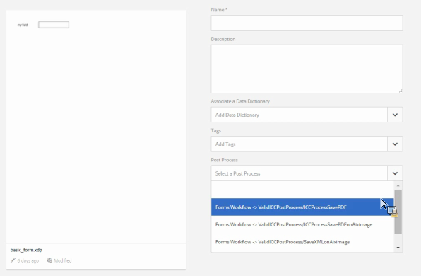

# Pós-processamento de cartas e comunicações interativas{#post-processing-of-letters-and-interactive-communications}

## Pós-processamento {#post-processing}

Os agentes podem associar e executar workflows de pós-processamento em letras e comunicações interativas. O processo de postagem a ser executado pode ser selecionado na visualização Propriedades do modelo Carta. Você pode configurar processos de publicação para enviar emails, imprimir, enviar fax ou arquivar suas cartas finais.

Para associar processos de publicação a letras ou comunicações interativas, primeiro é necessário configurar os processos de publicação. Dois tipos de workflows podem ser executados em cartas enviadas:

1. **Forms Workflow:** Estes são os workflows de gerenciamento de processos do AEM Forms em JEE. Instruções para configurar [Forms Workflow](#formsworkflow).

1. **Fluxo de trabalho AEM:** AEM workflows também podem ser usados como processos de publicação para cartas enviadas. Instruções para configurar [AEM Workflow](../../forms/using/aem-forms-workflow.md).

## Fluxo de trabalho dos formulários {#formsworkflow}

1. Em AEM, abra a Configuração do Adobe Experience Manager Web Console para seu servidor usando o seguinte URL: `https://<server>:<port>/<contextpath>/system/console/configMgr`

   

1. Nesta página, localize a Configuração do SDK do AEM Forms Client e expanda-a clicando nela.
1. No URL do servidor, digite o nome do AEM Forms no servidor JEE, os detalhes de login e clique em **Salvar**.

   

1. Especifique o nome de usuário e a senha.
1. Certifique-se de que sun.util.calendário é adicionado à Configuração do Firewall de Deserialização.

   Vá para Configuração do firewall de desserialização e, em Incluir na lista de permissões classes de prefixos do pacote, adicione sun.util.calendário.

1. Agora seus servidores são mapeados e os processos de publicação no AEM Forms no JEE estão disponíveis na interface do usuário AEM ao criar letras.

   

1. Para autenticar um processo/serviço, copie o nome de um processo e volte para a página Configurações do Adobe Experience Manager Web Console > Configuração do AEM Forms Client SDK e adicione o processo como um novo serviço.

   Por exemplo, se o menu suspenso na página Propriedades da letra exibir o nome do processo como Forms Workflow -> ValidCCPostProcess/SaveXML, adicione um Nome de serviço como `ValidCCPostProcess/SaveXML`.

1. Para usar o AEM Forms em workflows JEE para pós-processamento, configure os parâmetros e as saídas necessários. Os valores padrão dos parâmetros são indicados abaixo.

   Vá para a página Configurações do Adobe Experience Manager Web Console > **[!UICONTROL Configurações de gerenciamento de correspondência]** e configure os seguintes parâmetros:

   1. **inPDFDoc (parâmetro de documento PDF):** Um documento PDF como entrada. Esta entrada contém a letra renderizada como entrada. Os nomes de parâmetros indicados são configuráveis. Eles podem ser configurados nas configurações do Gerenciamento de correspondência a partir da configuração.
   1. **inXMLDoc (parâmetro de dados XML):** um documento XML como entrada. Essa entrada contém dados inseridos pelo usuário na forma de XML.
   1. **inXDPDoc (parâmetro de documento XDP):** Um documento XML como entrada. Esta entrada contém o layout subjacente (XDP).
   1. **inAttachmentDocs (parâmetro Documentos de anexo):** Um parâmetro de entrada de lista. Esta entrada contém todos os anexos como entrada.
   1. **redirectURL (Redirect URL Output):** Um tipo de saída que indica o url para o qual redirecionar.

   Seu fluxo de trabalho de formulários deve ter parâmetro de documento PDF ou parâmetro de dados XML como entrada com o mesmo nome especificado em **[!UICONTROL Configurações de gerenciamento de correspondência]**. Isso é necessário para que o processo seja listado na lista suspensa Processo de publicação.

## Configurações na instância Publicar {#settings-on-the-publish-instance}

1. faça logon em `https://localhost:publishport/aem/forms`.
1. Navegue até **[!UICONTROL Cartas]** para visualização da carta publicada disponível na instância de publicação.
1. Configure as configurações do AEM DS. Consulte [Definição AEM configurações do DS](../../forms/using/configuring-the-processing-server-url-.md).

>[!NOTE]
>
>Ao usar workflows Forms ou AEM, antes de fazer qualquer envio do servidor de publicação, é necessário configurar o serviço de configurações do DS. Caso contrário, a apresentação do formulário não será efetuada.

## Recuperação de Instâncias de Carta {#letter-instances-retrieval}

As instâncias de carta salvas podem ser mais manipuladas, como recuperação de instâncias de carta e exclusão de instâncias de carta, usando as seguintes APIs definidas em LetterInstanceService.

<table>
 <tbody>
  <tr>
   <td><strong>API do lado do servidor</strong></td>
   <td><strong>Nome da operação</strong></td>
   <td><strong>Descrição</strong></td>
  </tr>
  <tr>
   <td>
CartaInstanceVO pública
 
getLetterInstance(String letterInstanceId)
 
Lança o ICCException; 
 </td>
   <td>getLetterInstance</td>
   <td>Buscar a instância da carta especificada </td>
  </tr>
  <tr>
   <td>Public void deleteLetterInstance(String letterInstanceId) lança ICCException; </td>
   <td>deleteLetterInstance </td>
   <td>Excluída a instância da carta especificada </td>
  </tr>
  <tr>
   <td>Lista getAllLetterInstances(Query) lança ICCException; </td>
   <td>getAllLetterInstances </td>
   <td>Essa API obtém instâncias de carta com base no parâmetro de query de entrada. Para obter todas as instâncias de letra, o parâmetro de query pode ser transmitido como nulo.  </td>
  </tr>
  <tr>
   <td>Letra booleana públicaInstanceExists(String letterInstanceName) lança ICCException; </td>
   <td>letterInstanceExists </td>
   <td>Verificar se uma LetterInstance existe pelo nome fornecido </td>
  </tr>
 </tbody>
</table>

## Associando um processo de publicação a uma letra {#associating-a-post-process-with-a-letter}

Na interface do usuário do CCR, conclua as seguintes etapas para associar um processo de publicação a uma letra:

1. Passe o mouse sobre uma letra e toque em **Propriedades da Visualização**.
1. Selecione **Editar**.
1. Nas Propriedades básicas, usando o menu suspenso Processo de publicação, selecione o processo de publicação a ser associado à letra. Os processos de publicação relacionados ao AEM e ao Forms estão listados na lista suspensa.
1. Toque em **Salvar**.
1. Depois de configurar a carta com o Processo de publicação, publique a carta e, opcionalmente, na instância de publicação, especifique o URL de processamento no serviço de Configurações AEM DS. Isso garante que o processo de publicação seja executado na instância de processamento.

## Recarregar uma instância de carta de rascunho  {#reloaddraft}

Uma instância de carta de rascunho pode ser recarregada na interface do usuário usando o seguinte url:

`https://<server>:<port>/aem/forms/`

`createcorrespondence.html?/random=$&cmLetterInstanceId=$<LetterInstanceId>`

LetterInstaceID: A ID exclusiva da instância da carta enviada.

Para obter mais informações sobre como salvar uma carta de rascunho, consulte [Salvar rascunhos e enviar instâncias de carta](../../forms/using/create-correspondence.md#savingdrafts).
