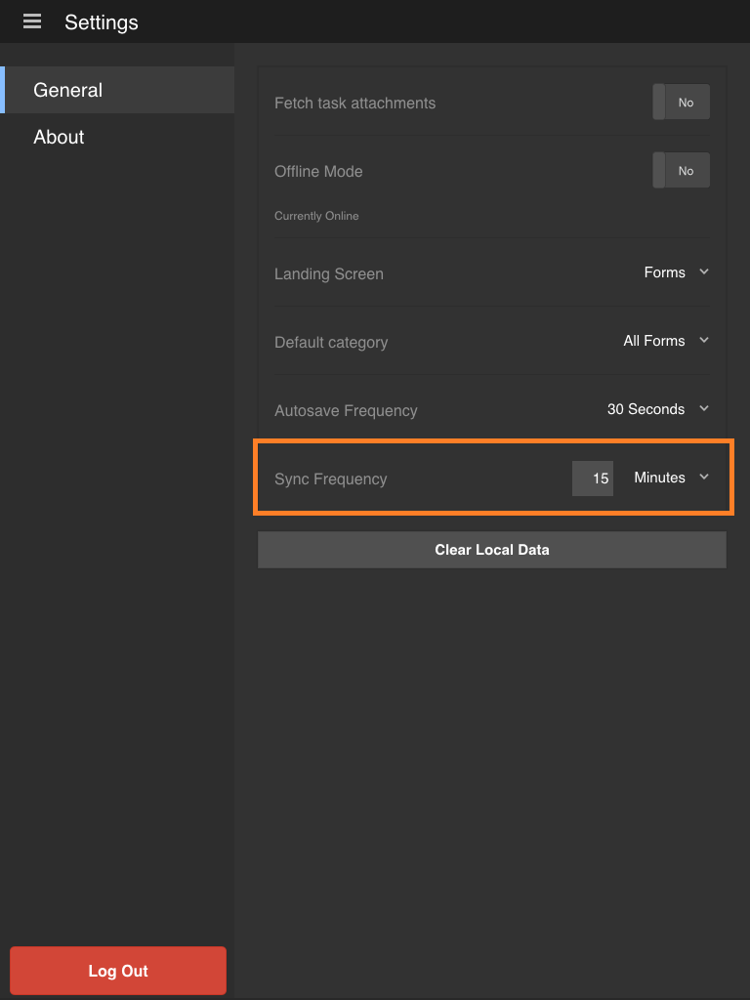

# Sincronizar o aplicativo{#synchronizing-the-app}

## Sincronizar o aplicativo {#synchronizing-the-app-1}

Os formulários em seu aplicativo são baixados do servidor de formulários AEM. Os formulários são baixados nas guias Tarefa e Forms. Os rascunhos criados a partir de formulários são baixados na guia rascunhos e os rascunhos criados a partir do tarefa são baixados na guia tarefa. Para um formulário independente no servidor OSGi, os formulários e rascunhos são baixados nas guias Formulários e Rascunho, respectivamente.

Quando você preenche e envia um formulário, o formulário é carregado de volta ao servidor do AEM Forms instantaneamente se o aplicativo estiver online. Os formulários são obtidos do servidor quando o aplicativo é sincronizado. No entanto, os rascunhos são sincronizados com o servidor instantaneamente se o aplicativo estiver online.

Por padrão, quando você está online com o servidor do AEM Forms, seu aplicativo é sincronizado a cada 15 minutos. No entanto, você tem a opção de alterar a frequência de sincronização. Como alternativa, você pode sincronizar manualmente o aplicativo a qualquer momento.

**Para sincronizar o aplicativo manualmente**

Toque no botão Sincronizar aplicativo  sincronização no canto inferior direito da tela inicial.

**Alteração da frequência de sincronização**

1. Para acessar a tela Setting (Configuração), toque no botão de menu no canto superior esquerdo da tela Home (Início) e, em seguida, toque em **Settings (Configurações)**.
1. Na tela Configurações, toque na guia Geral.

   

1. Na opção Frequência de sincronização, toque no valor à direita de Frequência de sincronização.
1. Na lista suspensa, selecione a nova frequência de sincronização.

### Especificações técnicas {#technical-specifications}

* A lógica principal de enviar os dados do aplicativo offline para o servidor do AEM Forms está incluída em runtime/offline/util/offline.js.
* Na função .js, a chamada para a função processOfflineSubmitedSavedTasks(...) envia as tarefas salvas / enviadas ao servidor. Também lida com erros ou conflitos no processo de sincronização. Se o envio de uma tarefa falhar, a tarefa no aplicativo será marcada como com falha. Além disso, a tarefa permanece em sua Caixa de saída.
* As funções syncSubmitedTask() e syncSavedTask() executam operações em tarefas individuais.
* A chamada para a função processOfflineSubmitedSavedTasks() é iniciada pelo componente de lista depois que um usuário seleciona para sincronizar o estado offline com o servidor ou uma sincronização automática pelo thread em segundo plano.
