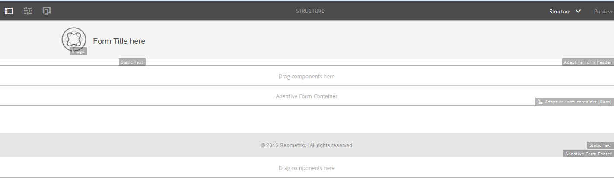

# Modelos de formulário adaptáveis{#adaptive-form-templates}

Ao criar um formulário, você adiciona campos e componentes para definir a estrutura do formulário, o conteúdo e as ações no editor. É possível adicionar campos e componentes na parte superior `guideRootPanel` do container de formulário. Com o Editor de modelos, você pode criar um modelo que contenha estrutura básica e conteúdo inicial que os autores podem usar para criar formulários.

Por exemplo, você deseja que todos os autores de formulários tenham determinadas caixas de texto, botões de navegação e um botão Enviar em um formulário de inscrição. Você pode criar um modelo com os componentes que os autores podem usar para criar um formulário que seja consistente com outros formulários de inscrição. Quando os autores usam o modelo para criar um formulário adaptável, o novo formulário herda a estrutura e os componentes especificados no modelo. O Editor de modelos permite:

* Adicione componentes de cabeçalho e rodapé de um formulário na camada de estrutura.
* Forneça o conteúdo inicial do formulário.
* Especifique um tema e envie ações.

## Trabalhar com modelos {#working-with-templates}

Você pode acessar o editor de modelos no menu Ferramentas navegando até **Adobe Experience Manager > Ferramentas > Modelos**. Aqui, os modelos são organizados em pastas ativadas para modelos editáveis. O AEM fornece uma pasta global para organizar modelos. No entanto, não está ativado por padrão. Você pode solicitar ao Administrador que ative a pasta global ou crie uma nova pasta para modelos. Para obter mais informações sobre como criar pastas, consulte Pastas [de](/help/sites-developing/page-templates-editable.md)modelos.

Depois de tocar em para abrir uma pasta, você encontrará um botão Criar que permite a criação de um novo modelo para formulários adaptáveis.

### Criação de um modelo {#create-template}

Depois de criar uma pasta, abra-a e execute as seguintes etapas para criar um modelo:

1. No console Modelo, toque em **Criar** dentro da pasta que você criou.
1. Na seção Escolha um tipo de modelo, selecione Modelo **de formulário** adaptável e toque em **Próximo**.

1. Na seção Detalhes do modelo, forneça um Título do modelo e toque em **Criar**.
É possível fornecer uma descrição e uma miniatura que podem ser vistas quando você pode selecionar o modelo criado no momento da criação do formulário.

1. Toque em **Concluído** para retornar ao console ou toque em **Abrir** para abrir o modelo no editor.

### Interface do usuário do editor de modelos {#template-editor-ui}

Ao abrir um modelo para edição, você pode ver os seguintes componentes do Editor de AEM:

* **Barra de ferramentas** Página contém as seguintes opções:

   * **Alternar painel** lateral: Permite mostrar ou ocultar a barra lateral.
   * **Informações** da página: Permite que você especifique informações como o tempo de publicação/despublicação, miniaturas, bibliotecas do lado do cliente, política de página e biblioteca do lado do cliente do design de página.
   * **Emulador**: Permite simular e personalizar a aparência para dispositivos diferentes.
   * **Seletor de camada:** Permite alterar a camada.
É possível escolher a camada **Estrutura** ou a camada Conteúdo **** inicial. A camada de estrutura permite adicionar e personalizar o cabeçalho e o rodapé. A camada Conteúdo inicial permite personalizar o conteúdo do formulário.

   * **Pré-visualização:** Permite que você pré-visualização a aparência do modelo ao publicá-lo. Você pode usar o Seletor de camada e a Pré-visualização para alternar os modos de edição e pré-visualização.

* **Barra lateral:** Fornece os navegadores de Conteúdo, Propriedades, Ativos e Componentes.
* **Barra de ferramentas do componente:** Ao selecionar um componente, você verá uma barra de ferramentas que permite personalizar o componente.
* **Página**: A área onde você adiciona conteúdo para criar o modelo.

Consulte [Introdução à criação de formulários](../../forms/using/introduction-forms-authoring.md) adaptáveis para entender o editor da interface de toque.

### Editar um modelo {#editing-a-template}

Um modelo de formulário adaptável é criado usando duas camadas:

* Estrutura
* Conteúdo inicial

O seletor de camada está disponível ao lado da opção Pré-visualização no canto superior direito da tela.

### Estrutura {#structure}

Ao selecionar a camada de estrutura no Editor de modelos, é possível ver os container de layout acima e abaixo do Container de formulário adaptável. Os autores podem usar esses container de layout para cabeçalho e rodapé. Você pode adicionar, editar ou personalizar o cabeçalho e o rodapé. Arraste e solte o componente Cabeçalho do formulário adaptativo no container de layout acima do Container de formulário adaptável para personalizar o cabeçalho do modelo. Arraste e solte o componente Rodapé do formulário adaptável no container de layout abaixo do Container de formulário adaptável para personalizar o rodapé do modelo.

container de layout na camada de estrutura

**A.** container de layout para o componente Cabeçalho **B.** container de layout para o componente Rodapé

Arraste e solte o componente Cabeçalho do formulário adaptativo no container de layout acima do Container de formulário adaptável. Depois de adicionar o componente, você pode especificar suas propriedades que permitem adicionar um logotipo e fornecer seu título.

Da mesma forma, ao arrastar e soltar o componente de rodapé no container de layout abaixo do Container de formulário adaptável, você pode fornecer as informações de direitos autorais e detalhes da empresa.

Cabeçalho e rodapé adicionados na camada Estrutura

#### Bloquear/desbloquear componentes na camada de estrutura {#locking-unlocking-components-in-the-structure-layer}

Ao editar o modelo com a camada de estrutura selecionada, você pode desbloquear o cabeçalho e o rodapé do modelo. Se um componente estiver desbloqueado no modelo, os autores de formulário poderão editar o componente no formulário adaptável que usa o modelo. Bloquear um componente impede que os autores de formulários o editem no formulário adaptável. A opção Bloquear está disponível na barra de ferramentas do componente.

Por exemplo, você adiciona o componente de cabeçalho no modelo. Quando você seleciona o componente, é possível ver uma opção de bloqueio na barra de ferramentas do componente. Normalmente, o cabeçalho inclui o nome e o logotipo da empresa e você não quer que os autores de formulário alterem o logotipo e o cabeçalho em um modelo. Em um formulário adaptável criado usando o modelo com o componente de cabeçalho bloqueado, os autores de formulário não podem alterar o logotipo e o nome da empresa.

>[!NOTE]
>
>O bloqueio ou desbloqueio de imagem ou logotipo no componente de cabeçalho, individualmente, não é recomendado. Você pode desbloquear o componente de cabeçalho.

### Conteúdo inicial {#initial-content}

Quando a opção Conteúdo inicial estiver selecionada, o Container Formulário adaptável do modelo será aberto como um formulário adaptável para edição. Como criar um formulário adaptável, você pode especificar configurações iniciais, como selecionar um tema e enviar ações.

Os autores de formulários usam-no como base para criar um formulário. A estrutura de fluxo de conteúdo é especificada na camada Conteúdo inicial do modelo. Para alternar para a edição do conteúdo inicial do modelo de formulário, antes da Pré-visualização na barra de ferramentas da página, toque em  Tela **> Conteúdo**inicial.

Camada Conteúdo inicial no Editor de modelos mostrando o Container de formulário adaptável selecionado para especificar as propriedades.

Na camada Conteúdo inicial, você cria o modelo de formulário adaptável que seus autores usam como base. A criação de um modelo é semelhante à criação de um formulário, você usa as opções disponíveis na Barra lateral. A barra lateral fornece navegadores de conteúdo, propriedades, ativos e componentes.

Consulte [Barra lateral](../../forms/using/introduction-forms-authoring.md#sidebar).

>[!NOTE]
>
>Quando você seleciona Armazenar conteúdo ou Armazenar PDF como a Ação de envio, obtém uma opção para especificar o caminho do Armazenamento. Se você especificar um caminho no modelo, todos os formulários criados a partir dele terão o mesmo caminho. Você pode especificar o caminho de armazenamento correto ou garantir que os autores do formulário o atualizem para impedir que os dados de cada formulário sejam armazenados no mesmo local.

#### Criação de um modelo de formulário adaptável com guias e painéis {#creating-an-adaptive-form-template-with-tabs-and-panels-nbsp}

Por exemplo, você deseja criar um modelo com as seguintes guias:

* Informações gerais
* Informações profissionais

Você adicionou um logotipo, forneceu um título e adicionou um rodapé na camada de estrutura. Bloqueie o cabeçalho e o rodapé para impedir que os autores de formulários editem-nos quando usam o modelo para criar formulários.

Altere a camada de Estrutura para Conteúdo inicial e o start adicione conteúdo ao formulário. Para criar uma estrutura com guias, adicione um painel filho no guiaPainel raiz do container de formulário adaptável. Para adicionar um painel:

* Você pode adicionar um painel tocando no botão **+** ao selecionar a opção **Arrastar componentes aqui** .

* Você pode arrastar e soltar o componente do painel do navegador de componentes na barra lateral.
* Você pode adicionar o painel filho da barra de ferramentas `guideRootPanel` do componente.

Para criar as guias Informações gerais e Informações profissionais, adicione dois painéis no painel filho do `guideRootPanel`. Selecione os painéis e toque em  para abrir as propriedades na barra lateral. Altere os nomes dos elementos como `general-info` e `professional-info`e os títulos como Informações gerais e Informações profissionais, respectivamente. Na barra lateral, toque em conteúdo para abrir o navegador de conteúdo. Na guia Objetos de formulário, selecione `guideRootPanel`. No editor, guideRootPanel é selecionado. Toque em  na barra de ferramentas do componente para abrir suas propriedades. No campo Layout do painel, selecione **Guias na parte superior** e toque em **Concluído**. A estrutura de modelo com guias é aplicada.

#### Adicionar conteúdo em guias {#adding-content-in-tabs}

[ 

Adicionar campos no modelo

](assets/template-edit-initial-content-1.png) Depois de adicionar painéis e estruturá-los como guias, é possível adicionar campos dentro das guias. Ao selecionar uma guia no editor, é possível ver a opção **Arrastar componentes aqui** . Você pode arrastar e soltar componentes como caixas de texto, itens de lista e botões. Você pode arrastar e soltar componentes do navegador de componentes na barra lateral.

Cada componente tem propriedades que aprimoram a captura e manipulação de dados. Por exemplo, você pode ativar a propriedade de campo **** Obrigatório de um componente. Seus autores podem especificar uma mensagem que seus clientes veem quando ignoram o preenchimento de um campo obrigatório. Especifique a mensagem na propriedade Mensagem **de campo** obrigatória.

No modelo de exemplo, os campos Nome, Número de telefone e Data de nascimento são adicionados na guia Informações gerais. Na guia Informações profissionais, são adicionados o tipo de emprego atualmente empregado, os campos Qualificação educacional.

Depois de adicionar campos, você pode adicionar botões, como Enviar e Redefinir.

### Ativação do modelo {#enabling-the-template}

Quando você cria um modelo, ele é adicionado como rascunho. Ative o modelo para usá-lo na criação de formulários adaptáveis. Para ativar um modelo:

1. Navegue até **Adobe Experience Manager > Ferramentas > Modelos** e abra a pasta na qual você criou o modelo.

1. O modelo criado está marcado como Rascunho.
1. Selecione o modelo e toque em **Ativar** na barra de ferramentas.
Ao criar um formulário adaptável, você pode ver o modelo listado quando for solicitado a escolher um modelo.

## Importando ou exportando um modelo {#importing-or-exporting-a-template}

Um formulário funciona com seu modelo. Quando você baixa um formulário adaptável criado usando um modelo personalizado, o modelo não é baixado. Quando você importa o formulário em uma instância diferente do AEM Forms, ele é importado sem seu modelo. Se um formulário for importado, mas seu modelo não estiver disponível, ele não será renderizado. Você pode disponibilizar o modelo personalizado do `/conf` nó em `https://<server>:<port>/crx/packmgr`e exportá-lo para a instância do AEM Forms onde deseja carregar o formulário.

## Criação de um formulário adaptável usando o modelo {#creating-an-adaptive-form-using-the-template}

Depois de criar e ativar um modelo, ele estará disponível no gerenciador de formulários ao criar um formulário adaptável. Para usar um modelo e criar um formulário adaptável, consulte [Criação de um formulário](../../forms/using/creating-adaptive-form.md)adaptável.

## Alterar a opção de exibição dos modelos predefinidos {#change-display-option-of-out-of-the-box-templates}

Você pode criar modelos personalizados para formulários adaptáveis para definir a estrutura básica e o conteúdo inicial. O AEM Forms também fornece um conjunto de modelos prontos para formulários adaptáveis. Você pode optar por mostrar ou ocultar os modelos.

Execute as seguintes etapas para mostrar e ocultar modelos:

1. Faça logon na instância do autor do AEM Forms e navegue até **Ferramentas** > **Operações** > Console **da** Web.

   >[!NOTE]
   >
   >O URL do console da Web do AEM é https://&#39;[server]:[port]&#39;/system/console/configMgr

1. Localize e abra as configurações **do** FormsManager:

   * Para mostrar ou ocultar modelos de formulários adaptáveis, marque ou desmarque a opção **Incluir fora da caixa AF e Modelos** AD.
   * Para mostrar ou ocultar modelos de formulário adaptáveis que foram adicionados nos formulários AEM 6.0 ou AEM 6.1, mas que agora estão obsoletos, marque ou desmarque a opção **Incluir modelos** AF do AEM 6.0. Se essa opção estiver marcada, para entrar em vigor, será necessário ativar a configuração **Incluir fora da caixa AF e Modelos** AD para que ela seja ativada.

1. Clique em **Salvar**. As opções de exibição para os modelos predefinidos são alteradas.

## Recomendações {#recommendations}

* Ao modificar as propriedades do formulário no editor de modelo, não use a propriedade BindReference.
* Se você quiser adicionar um ponto de interrupção, crie-o ao criar um modelo de formulário adaptável.
Para obter mais informações sobre pontos de interrupção, consulte Layout [responsivo](/help/sites-authoring/responsive-layout.md).

