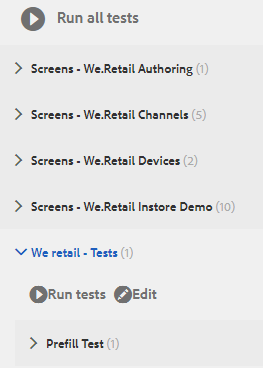

# Tutorial: Teste do formulário adaptável {#tutorial-testing-your-adaptive-form}


Este tutorial é uma etapa da série [Create Your First Adaptive Form](https://helpx.adobe.com/br/experience-manager/6-3/forms/using/create-your-first-adaptive-form.html). É recomendável seguir a série em sequência cronológica para entender, executar e demonstrar o caso de uso tutorial completo.

Depois que o formulário adaptável estiver pronto, é importante testar sua capacidade adaptável antes de rolar para os usuários finais. Você pode testar manualmente (teste funcional) cada campo ou automatizar o teste do formulário adaptável. Quando você tem vários formulários adaptáveis, testar manualmente cada campo de todos os formulários adaptáveis se torna uma tarefa intimidante.

AEM [!DNL Forms] fornece uma estrutura de teste, Calvin, para automatizar o teste de seus formulários adaptáveis. Usando a estrutura , você grava e executa testes de interface do usuário diretamente em um navegador da Web. A estrutura fornece APIs JavaScript para criar testes. O teste automatizado permite testar a experiência de preenchimento prévio de um formulário adaptável, enviar experiência de um formulário adaptável, regras de expressão, de validações, carregamento lento e interações da interface do usuário. Este tutorial o orienta pelas etapas para criar e executar testes automáticos em um formulário adaptável. Ao final deste tutorial, você poderá:

* [Criar um conjunto de testes para seu formulário adaptável](../../forms/using/testing-your-adaptive-form.md#step-create-a-test-suite)
* [Criar testes para o formulário adaptável](../../forms/using/testing-your-adaptive-form.md#step-create-a-test-case-to-prefill-values-in-an-adaptive-form)
* [Executar conjunto de testes e testes criados para seu formulário adaptável](#step-run-all-the-tests-in-a-suite-or-individual-tests-cases)

## Etapa 1: Criar um conjunto de teste {#step-create-a-test-suite}

Os conjuntos de teste têm uma coleção de casos de teste. Você pode ter vários conjuntos de testes. É recomendável ter um conjunto de testes separado para cada formulário. Para criar um conjunto de teste:

1. Faça logon em AEM instância do autor [!DNL Forms] como administrador. Abra [!UICONTROL CRXDE Lite]. Toque em AEM Logotipo > **[!UICONTROL Ferramentas]** > **[!UICONTROL Geral]** > **[!UICONTROL CRXDE Lite]** ou abra o URL [https://localhost:4502/crx/de/index.jsp](https://localhost:4502/crx/de/index.jsp) em um navegador para abrir o CRXDE Lite.

1. Navegue até /etc/clientlibs em [!UICONTROL CRXDE Lite]. Clique com o botão direito do mouse na subpasta /etc/clientlibs e clique em **[!UICONTROL Create]** > **[!UICONTROL Create Node]**. No campo **[!UICONTROL Nome]** digite **WeRetailFormTestCasos**. Selecione o tipo como **cq:ClientLibraryFolder** e clique em **[!UICONTROL OK]**. Ele cria um nó. Você pode usar qualquer nome no lugar de `WeRetailFormTestCases`.
1. Adicione as seguintes propriedades ao nó `WeRetailFormTestCases` e toque em **[!UICONTROL Salvar tudo]**.

   <table>
    <tbody>
     <tr>
      <td><strong>Propriedade</strong></td>
      <td><strong>Tipo</strong></td>
      <td><strong>Multi</strong></td>
      <td><strong>Valor</strong></td>
     </tr>
     <tr>
      <td>categorias</td>
      <td>Sequência de caracteres</td>
      <td>Ativado</td>
      <td>
       <ul>
        <li>granite.testing.hobbes.tests<br /> </li>
        <li>granite.testing.calvin.tests</li>
       </ul> </td>
     </tr>
     <tr>
      <td>dependências</td>
      <td>Sequência de caracteres</td>
      <td>Ativado</td>
      <td>
       <ul>
        <li>granite.testing.hobbes.testrunner <br /> </li>
        <li>granite.testing.calvin <br /> </li>
        <li>apps.testframework.all</li>
       </ul> </td>
     </tr>
    </tbody>
   </table>

   Certifique-se de que cada propriedade seja adicionada a uma caixa separada, conforme exibido abaixo:

   

1. Clique com o botão direito do mouse no nó **[!UICONTROL WeRetailFormTestCasos]** clique em **[!UICONTROL Criar]** > **[!UICONTROL Criar arquivo]**. No campo **[!UICONTROL Nome]**, digite `js.txt` e clique em **[!UICONTROL OK]**.
1. Abra o arquivo js.txt para edição, adicione o seguinte código e salve o arquivo:

   ```text
   #base=.
    init.js
   ```

1. Crie um arquivo, init.js, no nó `WeRetailFormTestCases`. Adicione o código abaixo ao arquivo e toque em **[!UICONTROL Salvar tudo]**.

   ```javascript
   (function(window, hobs) {
       'use strict';
       window.testsuites = window.testsuites || {};
     // Registering the test form suite to the sytem
     // If there are other forms, all registration should be done here
       window.testsuites.testForm3 = new hobs.TestSuite("We retail - Tests", {
           path: '/etc/clientlibs/WeRetailFormTestCases/init.js',
           register: true
       });
    // window.testsuites.testForm2 = new hobs.TestSuite("testForm2");
   }(window, window.hobs));
   ```

   O código acima cria um conjunto de testes chamado **We retail - Tests**.

1. Abra AEM interface de teste (AEM > **[!UICONTROL Ferramentas]** > **[!UICONTROL Operações]** > **[!UICONTROL Teste]**). O conjunto de testes - **We retail - Tests** - está listado na interface do usuário.

   

## Etapa 2: Crie um caso de teste para preencher previamente valores em um formulário adaptável {#step-create-a-test-case-to-prefill-values-in-an-adaptive-form}

Um caso de teste é um conjunto de ações para testar uma funcionalidade específica. Por exemplo, preencher todos os campos de um formulário e validar alguns campos para garantir que os valores corretos sejam inseridos.

Uma ação é uma atividade específica em um formulário adaptável, como clicar em um botão. Para criar um caso de teste e ações para validar a entrada do usuário para cada campo de formulário adaptável:

1. Em [!UICONTROL CRXDE lite], navegue até a pasta `/content/forms/af/create-first-adaptive-form`. Clique com o botão direito do mouse no nó da pasta **[!UICONTROL create-first-adaptive-form]** e clique em **[!UICONTROL Create]**> **[!UICONTROL Create File]**. No campo **[!UICONTROL Nome]**, digite `prefill.xml` e clique em **[!UICONTROL OK]**. Adicione o seguinte código ao arquivo:

   ```xml
   <?xml version="1.0" encoding="UTF-8"?><afData>
     <afUnboundData>
       <data>
         <customer_ID>371767</customer_ID>
         <customer_Name>John Jacobs</customer_Name>
         <customer_Shipping_Address>1657 1657 Riverside Drive Redding</customer_Shipping_Address>
         <customer_State>California</customer_State>
         <customer_ZIPCode>096001</customer_ZIPCode>
        </data>
     </afUnboundData>
     <afBoundData>
       <data xmlns:xfa="https://www.xfa.org/schema/xfa-data/1.0/"/>
     </afBoundData>
   </afData>
   ```

1. Vá até `/etc/clientlibs`. Clique com o botão direito do mouse na subpasta `/etc/clientlibs` e clique em **[!UICONTROL Criar]** **[!UICONTROL Criar nó]**.

   No campo **[!UICONTROL Nome]**, digite `WeRetailFormTests`. Selecione o tipo como `cq:ClientLibraryFolder` e clique em **[!UICONTROL OK]**.

1. Adicione as seguintes propriedades ao nó **[!UICONTROL WeRetailFormTests]**.

   <table>
    <tbody>
     <tr>
      <td><strong>Propriedade</strong></td>
      <td><strong>Tipo</strong></td>
      <td><strong>Multi</strong></td>
      <td><strong>Valor</strong></td>
     </tr>
     <tr>
      <td>categorias</td>
      <td>Sequência de caracteres</td>
      <td>Ativado</td>
      <td>
       <ul>
        <li>granite.testing.hobbes.tests<br /> </li>
        <li>granite.testing.hobbes.tests.testForm</li>
       </ul> </td>
     </tr>
     <tr>
      <td>dependências</td>
      <td>Sequência de caracteres</td>
      <td>Ativado</td>
      <td>
       <ul>
        <li>granite.testing.calvin.tests</li>
       </ul> </td>
     </tr>
     </tbody>
   </table>

1. Crie um arquivo, js.txt, no nó **[!UICONTROL WeRetailFormTests]**. Adicione o seguinte ao arquivo :

   ```shell
   #base=.
   prefillTest.js
   ```

   Clique em **[!UICONTROL Salvar tudo]**.

1. Crie um arquivo, `prefillTest.js`, no nó **[!UICONTROL WeRetailFormTests]**. Adicione o código abaixo ao arquivo . O código cria um caso de teste. O caso de teste preenche todos os campos de um formulário e valida alguns campos para garantir que os valores corretos sejam inseridos.

   ```javascript
   (function (window, hobs) {
       'use strict';
   
       var ts = new hobs.TestSuite("Prefill Test", {
           path: '/etc/clientlibs/WeRetailFormTests/prefillTest.js',
           register: false
       })
   
       .addTestCase(new hobs.TestCase("Prefill Test")
           // navigate to the testForm which is to be test
           .navigateTo("/content/forms/af/create-first-adaptive-form/shipping-address-add-update-form.html?wcmmode=disabled&dataRef=crx:///content/forms/af/create-first-adaptive-form/prefill.xml")
           // check if adaptive form is loaded
           .asserts.isTrue(function () {
               return calvin.isFormLoaded()
           })
           .asserts.isTrue(function () {
               return calvin.model("customer_ID").value == 371767;
           })
           .asserts.isTrue(function () {
               return calvin.model("customer_ZIPCode").value == 96001;
           })
       );
   
       // register the test suite with testForm
       window.testsuites.testForm3.add(ts);
   
   }(window, window.hobs));
   ```

   O caso de teste é criado e pronto para ser executado. Você pode criar casos de teste para validar vários aspectos de um formulário adaptável, como verificar a execução do script de cálculo, validar padrões e validar a experiência de envio de um formulário adaptável. Para obter informações sobre vários aspectos do teste de formulários adaptáveis, consulte automatizar o teste de formulários adaptáveis.

## Etapa 3: Executar todos os testes em um conjunto ou em casos de testes individuais {#step-run-all-the-tests-in-a-suite-or-individual-tests-cases}

Um conjunto de testes pode ter vários casos de teste. Você pode executar todos os casos de teste em um conjunto de teste de uma só vez ou individualmente. Quando você executa testes, os ícones indicam os resultados:

* Um ícone de marca de verificação indica um teste aprovado: 
* Um ícone &quot;X&quot; indica um teste com falha: 

1. Navegue até AEM ícone > **[!UICONTROL Ferramentas]**> **[!UICONTROL Operações]**> **[!UICONTROL Teste]**
1. Para executar todos os testes do Test Suite:

   1. No painel [!UICONTROL Testes], toque em **[!UICONTROL Varejo - Testes (1)]**. Ele O conjunto se expande para exibir uma lista de testes.
   1. Toque no botão **[!UICONTROL Executar testes]**. A área em branco no lado direito da tela é substituída pela forma adaptável à medida que o teste é executado.

      

1. Para executar um único teste a partir do Test Suite:

   1. No painel Testes, toque em **[!UICONTROL Varejo da Web - Testes (1)]**. Ele O conjunto se expande para exibir uma lista de testes.
   1. Toque em **[!UICONTROL Preencher Teste]** e toque no botão **[!UICONTROL Executar testes]**. A área em branco no lado direito da tela é substituída pela forma adaptável à medida que o teste é executado.

1. Toque no nome do teste, Teste de preenchimento prévio, para analisar os resultados do caso de teste. Ele abre o painel [!UICONTROL Resultado]. Toque no nome do Caso de teste no painel [!UICONTROL Resultado] para visualizar todos os detalhes do teste.

   

Agora, o formulário adaptável está pronto para publicação.
