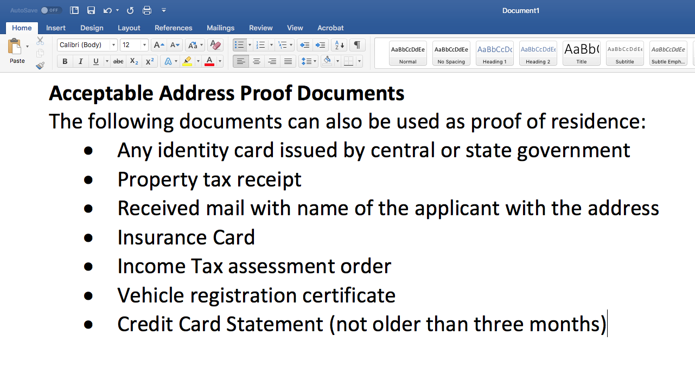

# Textos em comunicações interativas{#texts-in-interactive-communications}

## Visão geral {#overview}

Um fragmento de documento de texto consiste em um ou mais parágrafos de texto. Um parágrafo pode ser estático ou dinâmico. Um parágrafo dinâmico pode conter propriedades e variáveis do modelo de dados de formulário. Também é possível aplicar regras e repetir em um fragmento de documento de texto. Por exemplo, o nome do cliente em uma saudação pode ser uma propriedade do Modelo de dados de formulário (FDM) com seu valor disponibilizado no tempo de execução. Ao alterar esses valores, a mesma Comunicação interativa pode ser usada para preparar a Comunicação interativa para clientes diferentes usando a interface do usuário do agente.

O fragmento do documento de texto na Comunicação interativa é compatível com o seguinte tipo de dados dinâmicos:

* **Objetos do modelo de dados**: As propriedades de dados usam uma fonte de dados de back-end.
* **Conteúdo baseado em regras**: partes do conteúdo em um texto que são exibidas ou ficam ocultas com base em uma regra. Uma regra também pode ser baseada nas propriedades e variáveis do modelo de dados de formulário.
* **Variáveis**: no fragmento do documento de texto, as variáveis não são vinculadas a uma fonte de dados de back-end. O agente preenche/seleciona valores nas variáveis ou vincula as variáveis às fontes de dados ao preparar a comunicação interativa para enviá-la a um processo de publicação.
* **Repetir**: Você pode ter informações dinâmicas em sua Comunicação Interativa, como transações em um demonstrativo de cartão de crédito, cujo número de ocorrências pode continuar mudando com cada Comunicação Interativa gerada. Usando a repetição, é possível formatar e estruturar essas informações dinâmicas. Para obter mais informações, consulte [Condição em linha e repetir](https://helpx.adobe.com/experience-manager/6-3/forms/using/cm-inline-condition.html).

## Criar texto {#createtext}

1. Selecionar **[!UICONTROL Forms]** > **[!UICONTROL Fragmentos do documento]**.
1. Selecionar **[!UICONTROL Criar]** > **[!UICONTROL Texto]**.
1. Especifique as seguintes informações:

   * **[!UICONTROL Título]**: (Opcional) Insira o título do fragmento do documento de texto. Os títulos não precisam ser exclusivos e podem ter caracteres especiais e caracteres que não estejam em inglês. Os textos são referenciados por seus títulos (quando disponíveis), como em miniaturas e propriedades.
   * **[!UICONTROL Nome]**: o nome exclusivo do texto, em uma pasta. Não podem existir dois fragmentos de documento (texto, condição ou lista) em nenhum estado com o mesmo nome em uma pasta. No campo Nome, você pode inserir apenas caracteres, números e hifens do idioma inglês. O campo Nome é preenchido automaticamente com base no campo Título. Os caracteres especiais, espaços, números e caracteres que não estão em inglês inseridos no campo Título são substituídos por hifens no campo Nome. Embora o valor no campo Título seja copiado automaticamente para o Nome, você pode editar o valor.

   * **[!UICONTROL Descrição]**: digite uma descrição do texto.
   * **[!UICONTROL Modelo de dados do formulário]**: como opção, selecione o botão de opção Modelo de dados de formulário para criar o texto com base em um modelo de dados de formulário. Ao selecionar o botão de opção Modelo de dados de formulário, **[!UICONTROL Modelo de dados do formulário]** é exibido. Procure e selecione um modelo de dados de formulário. Ao criar texto e condição para uma Comunicação interativa, certifique-se de usar o mesmo modelo de dados que pretende usar na Comunicação interativa. Para obter mais informações sobre o Modelo de dados de formulário, consulte [Integração de dados](/help/forms/using/data-integration.md).

   * **[!UICONTROL Tags]**: Opcionalmente, para criar uma tag personalizada, insira o valor no campo de texto e pressione Enter. Quando você salva esse texto, as tags recém-adicionadas são criadas.

1. Selecione **[!UICONTROL Próximo]**.

   Criar texto é exibida. Se você tiver optado por criar um texto baseado no modelo de dados de formulário, as propriedades desse modelo serão exibidas no painel esquerdo.

1. Digite o texto e use as seguintes opções para formatar, condicionar e inserir propriedades e variáveis do modelo de dados de formulário no texto:

   * [Modelo de dados do formulário](#formdatamodel)
   * [Variáveis](#variables)
   * [Editor de regras](#rules)
   * [Opções de formatação](#formatting)

      * [Copiar e colar texto formatado de outros aplicativos](#paste)

      * [Realçar partes do texto](#highlight)

   * [Repetir](/help/forms/using/cm-inline-condition.md)
   * [Caracteres especiais](#special)
   * [Pesquisa e substituição de texto](#searching)
   * [Atalhos de teclado](/help/forms/using/keyboard-shortcuts.md)

   >[!NOTE]
   >
   >Você pode adicionar elementos do Modelo de dados de formulário, elementos do Dicionário de dados e variáveis usando o símbolo @ no editor de texto. Quando você insere uma string precedida por @ no editor de texto, todos os elementos do modelo de dados, os elementos do dicionário de dados e as variáveis são pesquisados, e os elementos ou as variáveis que contêm a string pesquisada são exibidos. É possível navegar pelos resultados da pesquisa e selecionar um elemento ou variável. Se não houver resultado correspondente, a variável *Nenhum resultado correspondente encontrado* será exibida.

1. Selecione **[!UICONTROL Salvar]**.

   O texto é criado. Agora é possível continuar usando o texto como um bloco de construção ao criar uma Comunicação interativa.

## Editar texto {#edittext}

Você pode editar um fragmento de documento de texto existente usando as etapas a seguir. Você também pode optar por editar um fragmento de documento de texto em um editor de Comunicação interativa.

1. Selecionar **[!UICONTROL Forms]** > **[!UICONTROL Fragmentos do documento]**.
1. Navegue até um fragmento de documento de texto e selecione-o.
1. Selecione **[!UICONTROL Editar]**.
1. Faça as alterações necessárias. Para obter mais informações sobre opções em texto, consulte [Criar texto](#createtext).
1. Selecionar **[!UICONTROL Salvar]** e selecione **[!UICONTROL Fechar]**.

## Personalização de um fragmento de documento de texto usando propriedades do modelo de dados de formulário {#formdatamodel}

É possível personalizar fragmentos de documento de texto inserindo as propriedades do modelo de dados de formulário. Inserindo as propriedades do modelo de dados de formulário no texto, você pode buscar e preencher dados específicos do recipient a partir da fonte de dados associada enquanto visualiza uma comunicação interativa. Para obter mais informações sobre o modelo de dados de formulário, consulte [Integração de dados do AEM Forms](/help/forms/using/data-integration.md).

Se você tiver especificado um modelo de dados de formulário ao criar um texto, as propriedades no modelo de dados de formulário aparecerão no painel esquerdo do editor de texto. O modelo de dados de formulário especificado deve ser o mesmo para o fragmento do documento de texto e a Comunicação interativa que o inclui.

* Para inserir uma propriedade de modelo de dados de formulário no texto, coloque o cursor onde deseja inserir a propriedade e selecione o **[A]** no painel esquerdo tocando nela e selecione **[!UICONTROL [B] Adicionar selecionado]**. Você também pode simplesmente selecionar duas vezes a propriedade para inseri-la na **[C]** posição do cursor. As propriedades do modelo de dados de formulário são realçadas em uma cor de plano de fundo acastanhada.

Como alternativa, você pode pesquisar e adicionar a propriedade do modelo de dados de formulário usando o símbolo @ no editor de texto. Coloque o cursor onde deseja inserir a propriedade. Digite @ seguido pela sequência de pesquisa. A operação de pesquisa é executada em todas as propriedades e variáveis do modelo de dados de formulário disponíveis no fragmento do documento. As propriedades ou variáveis que contêm a string de pesquisa são recuperadas e exibidas como uma lista suspensa. Navegue pelos resultados da pesquisa e clique na propriedade que você deseja inserir no local do cursor. Pressione Esc para ocultar os resultados da pesquisa.

* Para permitir que os agentes editem o valor de uma propriedade do modelo de dados de formulário na interface do usuário do agente enquanto [Preparar e enviar a comunicação interativa](/help/forms/using/prepare-send-interactive-communication.md) usando a IU do agente, selecione a variável **[D]** bloquear ícone para essa propriedade e garantir que ela esteja em um estado desbloqueado. O estado padrão da propriedade é bloqueado e um agente não pode editar a propriedade na interface do usuário do agente.

Você também pode usar as propriedades do modelo de dados de formulário para criar regras para exibir ou ocultar partes do conteúdo. Para obter mais informações, consulte [Criar regras em texto](#rules).

## Criação e uso de variáveis em um fragmento de documento de texto {#variables}

As variáveis são espaços reservados que podem ser vinculados ao criar uma Comunicação interativa. As variáveis podem ser vinculadas a uma propriedade de modelo de dados de formulário ou a um fragmento de texto. As variáveis também podem ser deixadas para o agente preencher.

Você pode usar variáveis em vez de propriedades do modelo de dados de formulário quando:

* Um fragmento de documento de texto deve ser usado em várias Comunicações interativas, onde o vínculo precisa ser diferente para diferentes Comunicações interativas.
* O fragmento do documento de texto não tem um modelo de dados de formulário no momento de sua criação. Você pode inserir variáveis e depois vinculá-las às propriedades do modelo de dados de formulário no momento da criação da Comunicação interativa.
* Você precisa vincular e recuperar texto de um fragmento de documento de texto. Somente os fragmentos de documento de texto podem ser vinculados a variáveis que não têm variáveis no.

Ao criar ou editar um fragmento de documento de texto, é possível criar e inserir variáveis. As variáveis criadas são exibidas na guia Data da interface do usuário do agente. O agente especifica os valores das variáveis enquanto [Preparar e enviar a comunicação interativa usando a interface do usuário do agente](/help/forms/using/prepare-send-interactive-communication.md).

### Criar variáveis {#createvariables}

1. No painel esquerdo, selecione **[!UICONTROL Variáveis]**.

   O painel Variáveis é exibido.

   

1. Selecione **[!UICONTROL Criar]**.

   Criar variáveis é exibido.

1. Insira as seguintes informações e selecione **[!UICONTROL Criar]**:

   * **[!UICONTROL Nome]** : Nome da variável.
   * **[!UICONTROL Descrição]** : Opcionalmente, insira uma descrição sobre a variável.
   * **[!UICONTROL Tipo]** : selecione um tipo da variável: String, Number, Boolean ou Date.
   * **[!UICONTROL Permitir Somente Valores Específicos]** : para variáveis de string e número, você pode garantir que o agente escolha entre um conjunto específico de valores para um espaço reservado na interface do usuário do agente. Para especificar o conjunto de valores, selecione essa opção e especifique valores separados por vírgula que sejam permitidos na **[!UICONTROL Valores]** campo.

1. Selecione **[!UICONTROL Criar]**.

   A variável é criada e listada no painel Variáveis.

1. Para inserir uma variável no texto, coloque o cursor no local apropriado, selecione a variável e **[!UICONTROL Adicionar selecionado]**.

   

   As variáveis são realçadas com a cor de fundo azul claro, enquanto as propriedades do modelo de dados de formulário são realçadas com uma cor acastanhada.

   Como alternativa, você pode pesquisar e adicionar variáveis usando o símbolo @ no editor de texto. Coloque o cursor onde deseja inserir a variável. Digite @ seguido pela sequência de pesquisa. A operação de pesquisa é executada em todas as propriedades e variáveis do modelo de dados de formulário disponíveis no fragmento do documento. As propriedades e variáveis que contêm a string de pesquisa são recuperadas e exibidas como uma lista suspensa. Navegue pelos resultados da pesquisa e clique na variável que deseja inserir no local do cursor. Pressione Esc para ocultar os resultados da pesquisa.

1. Selecione **[!UICONTROL Salvar]**.

## Criar regras em texto {#rules}

Ao usar o editor de regras em um texto, é possível criar regras para exibir ou ocultar cadeias de texto ou partes de conteúdo com base em **condições predefinidas**. Essas condições podem ser construídas com base em:

* Cadeias de caracteres
* Números
* Expressão matemática
* Datas
* Propriedades do modelo de dados de formulário associado
* Quaisquer variáveis criadas no texto

### Criar regras em texto {#create-rules-in-text}

1. Ao criar ou editar um texto, selecione a sequência de caracteres de texto, o parágrafo ou o conteúdo que deseja condicionar usando a regra.

   

1. Selecionar **[!UICONTROL Criar regra]**.

   A caixa de diálogo Criar regra é exibida. Além de sequência, número, expressão matemática e data, os itens a seguir também estão disponíveis no Editor de regras para criar instruções das regras:

   * Propriedades do modelo de dados de formulário associado
   * Quaisquer variáveis criadas por você

   Selecione a opção apropriada a ser avaliada.

    

   >[!NOTE]
   >
   >A propriedade de coleção não tem suporte para a criação de regras para condicionar e exibir texto.

1. Selecione o operador apropriado para avaliar a regra, como É igual a, Contém e Começa com.

   

1. Insira a expressão de avaliação, valor, propriedade do modelo de dados ou variável.

   

   Regra para exibir o texto selecionado se o local do destinatário for EUA de acordo com os dados de origem do FDM

   * Ao criar ou editar uma regra, você também pode selecionar  (Redimensionar) para expandir a caixa de diálogo Criar regra/Editar regra. A caixa de diálogo expandida em janela cheia permite arrastar e soltar propriedades e variáveis do modelo de dados de formulário para criar regras. Selecione Redimensionar novamente para voltar à caixa de diálogo Criar regra.
   * Você também pode criar várias condições em uma regra.
   * Você também pode criar regras de sobreposição, em que uma regra é aplicada a uma parte de um conteúdo que já tem uma regra aplicada.

1. Selecionar **[!UICONTROL Concluído]**.

   A regra é aplicada. O texto ou conteúdo ao qual a regra é aplicada é realçado em verde. Quando você passa o mouse sobre a alça esquerda do destaque, a regra aplicada é exibida.

   

   Ao clicar na alça esquerda da regra aplicada, você obtém as opções para editar ou remover a regra.

## Formatação de texto {#formatting}

Ao criar ou editar um texto, a barra de ferramentas muda dependendo do tipo de edições que você escolher fazer: Parágrafo, Alinhamento ou Listagem:

Selecione o tipo de barra de ferramentas: Parágrafo, Alinhamento ou Listagem

Barra de ferramentas de edição da fonte

Barra de ferramentas Alinhamento

Barra de ferramentas Listagem

### Realçar/Enfatizar partes do texto {#highlight}

Para destacar\enfatizar partes do texto em um fragmento de documento editável, selecione o texto e selecione Realçar cor.

É possível selecionar diretamente uma cor básica `**[A]**` presente na paleta Cores básicas ou selecione **Selecionar** depois de usar o controle deslizante `**[B]**` para escolher o tom apropriado da cor.

Como opção, você também pode ir para a guia Avançado para selecionar o Matiz, a Luminosidade e a Saturação apropriados `**[C]**` para criar a cor precisa e, em seguida, selecione Selecionar `**[D]**` para aplicar a cor para realçar o texto.

### Colar texto formatado {#paste}

Para reutilizar um ou mais parágrafos de texto existentes em outro aplicativo, como páginas do Microsoft® Word ou HTML, copie e cole o texto no editor de texto. A formatação do texto copiado é mantida no editor de texto.

É possível copiar e colar um ou mais parágrafos de texto em um fragmento de documento de texto editável. Por exemplo, você pode ter um documento do Microsoft® Word com uma lista com marcadores de provas de residência aceitáveis, como as seguintes:

Você pode copiar e colar diretamente o texto do documento do Microsoft® Word em um fragmento de documento de texto editável. A formatação, como lista com marcadores, fonte e cor do texto, é mantida no fragmento do documento de texto.

>[!NOTE]
>
>A formatação do texto colado, no entanto, tem alguns [limitações](https://helpx.adobe.com/aem-forms/kb/cm-copy-paste-text-limitations.html).

## Inserir caracteres especiais no texto {#special}

Se necessário, insira caracteres especiais no fragmento do documento. Por exemplo, você pode usar a paleta Caracteres especiais para inserir:

* Símbolos de moeda, como €,¥ e £
* Símbolos matemáticos como ∑, √, ‖ e ^
* Símbolos de pontuação, como ‟ e &quot;

O editor de texto inclui suporte para 210 caracteres especiais. O administrador pode [adicionar suporte para mais caracteres especiais/personalizados por personalização](/help/forms/using/custom-special-characters.md).

## Pesquisa e substituição de texto {#searching}

Ao trabalhar com fragmentos de documento de texto contendo uma grande quantidade de texto, é necessário procurar uma string de texto específica. Talvez também seja necessário substituir uma sequência específica de texto por uma sequência alternativa.

O recurso Localizar e substituir permite procurar (e substituir) qualquer cadeia de caracteres de texto em um fragmento de documento de texto. O recurso também inclui uma pesquisa avançada de expressão regular.

1. Abrir um fragmento de documento de texto para [edição](#edittext).
1. Selecionar **[!UICONTROL Localizar e substituir]**.

1. Insira o texto a ser pesquisado na **[!UICONTROL Localizar]** e o novo texto (texto de substituição) na caixa de texto **[!UICONTROL Substituir]** caixa de texto e selecione **[!UICONTROL Substituir]**.

1. Se o texto pesquisado for encontrado, ele será substituído pelo texto de substituição.

   * Se outra instância do texto de pesquisa for encontrada, essa instância será realçada no fragmento do documento de texto. Se você selecionar **[!UICONTROL Substituir]** novamente, a instância destacada é substituída e o cursor avança, se uma terceira instância for encontrada.
   * Se outra instância não for encontrada, a caixa de diálogo Localizar e substituir exibirá uma mensagem: Fim do módulo atingido.

   Você também pode selecionar Substituir todas para substituir todas as correspondências de uma só vez.

   Localizar e substituir também inclui uma pesquisa poderosa de expressão regular. Para usar regex em sua pesquisa, selecione **[!UICONTROL Reg ex]** e selecione **[!UICONTROL Localizar]** ou **[!UICONTROL Substituir]**.
