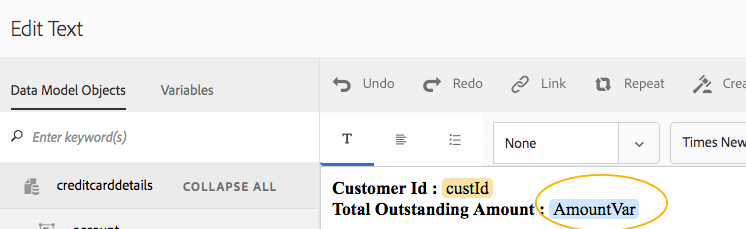

# Textos em Comunicações interativas{#texts-in-interactive-communications}

## Visão geral {#overview}

Um fragmento de documento de texto consiste em um ou mais parágrafos de texto. Um parágrafo pode ser estático ou dinâmico. Um parágrafo dinâmico pode conter propriedades e variáveis do modelo de dados de formulário. Também é possível aplicar regras e repetir em um fragmento de documento de texto. Por exemplo, o nome do cliente em uma saudação pode ser uma propriedade do Form Data Model (FDM) com seu valor disponibilizado no tempo de execução. Ao alterar esses valores, a mesma Comunicação interativa pode ser usada para preparar a Comunicação interativa para diferentes clientes usando a interface do usuário do agente.

O fragmento de documento de texto em Comunicação interativa é compatível com o seguinte tipo de dados dinâmicos:

* **Objetos** do modelo de dados: As propriedades dos dados usam uma fonte de dados back-end.
* **Conteúdo** baseado em regras: Partes de conteúdo em um texto que são exibidas ou ocultadas com base em uma regra. Uma regra também pode se basear em propriedades e variáveis do modelo de dados de formulário.
* **Variáveis**: No fragmento do documento de texto, as variáveis não são vinculadas a uma fonte de dados de backend. O agente preenche/seleciona valores em variáveis ou vincula as variáveis a fontes de dados, enquanto prepara a Comunicação interativa para enviá-la a um processo de publicação.
* **Repita**: Você pode ter informações dinâmicas em sua Comunicação Interativa, como transações em um demonstrativo de cartão de crédito, cujo número de ocorrências pode continuar mudando a cada Comunicação Interativa gerada. Usando a repetição, você pode formatar e estruturar essas informações dinâmicas. Para obter mais informações, consulte [Condição embutida e repita](https://helpx.adobe.com/experience-manager/6-3/forms/using/cm-inline-condition.html).

## Criar texto {#createtext}

1. Selecione **[!UICONTROL Forms]** > **[!UICONTROL Fragmentos de Documento]**.
1. Selecione **[!UICONTROL Criar]** > **[!UICONTROL Texto]**.
1. Especifique as seguintes informações:

   * **[!UICONTROL Título]**: (Opcional) Insira o título do fragmento do documento de texto. Os títulos não precisam ser exclusivos e podem ter caracteres especiais e caracteres que não sejam do inglês. Os textos são referenciados por seus títulos (quando disponíveis), como em miniaturas e propriedades.
   * **[!UICONTROL Nome]**: O nome exclusivo do texto, em uma pasta. Não é possível existir dois fragmentos de documento (texto, condição ou lista) em qualquer estado com o mesmo nome em uma pasta. No campo Nome , é possível inserir somente caracteres, números e hifens em inglês. O campo Nome é automaticamente preenchido com base no campo Título . Os caracteres especiais, espaços, números e caracteres que não estão em inglês inseridos no campo Título são substituídos por hífens no campo Nome. Embora o valor no campo Título seja copiado automaticamente para o Nome, você pode editar o valor.

   * **[!UICONTROL Descrição]**: Digite uma descrição do texto.
   * **[!UICONTROL Modelo]** de dados do formulário: Como opção, selecione o botão de opção Modelo de dados de formulário para criar o texto com base em um modelo de dados de formulário. Quando o botão de opção Modelo de dados de formulário é selecionado, o campo **[!UICONTROL Modelo de dados de formulário]** é exibido. Navegue e selecione um modelo de dados de formulário. Ao criar texto e condição para uma Comunicação interativa, certifique-se de usar o mesmo modelo de dados que pretende usar na Comunicação interativa. Para obter mais informações sobre o Modelo de dados de formulário, consulte [Integração de dados](/help/forms/using/data-integration.md).

   * **[!UICONTROL Tags]**: Como opção, para criar um valor de entrada de tag personalizado no campo de texto e pressione Enter. Ao salvar esse texto, as tags recém-adicionadas são criadas.

1. Toque em **[!UICONTROL Próximo]**.

   A página Criar texto é exibida. Se você optou por criar um texto baseado no modelo de dados de formulário, as propriedades do modelo de dados de formulário aparecerão no painel esquerdo.

1. Digite o texto e use as seguintes opções para formatar, condicionar e inserir as propriedades e variáveis do modelo de dados de formulário no texto:

   * [Modelo de dados do formulário](#formdatamodel)
   * [Variáveis](#variables)
   * [Editor de regras](#rules)
   * [Opções de formatação](#formatting)

      * [Copiar e colar texto formatado de outros aplicativos](#paste)

      * [Realçar partes do texto](#highlight)
   * [Repetir](/help/forms/using/cm-inline-condition.md)
   * [Caracteres especiais](#special)
   * [Como pesquisar e substituir texto](#searching)
   * [Atalhos de teclado](/help/forms/using/keyboard-shortcuts.md)

   >[!NOTE]
   >
   >Você pode adicionar elementos de Modelo de dados de formulário, elementos de Dicionário de dados e variáveis usando o símbolo @ no editor de texto. Quando você insere uma string precedida por @ no editor de texto, todos os elementos do Modelo de dados, os elementos do Dicionário de dados e as variáveis são pesquisados e os elementos ou variáveis que contêm a string pesquisada são exibidos. É possível navegar pelos resultados da pesquisa e selecionar um elemento ou variável. Se não houver resultado correspondente, a mensagem *No match results found* será exibida.

1. Toque em **[!UICONTROL Salvar]**.

   O texto é criado. Agora, você pode continuar usando o texto como um elemento fundamental ao criar uma Comunicação interativa.

## Editar texto {#edittext}

É possível editar um fragmento de documento de texto existente usando as etapas a seguir. Você também pode optar por editar um fragmento de documento de texto de um editor de Comunicação interativa.

1. Selecione **[!UICONTROL Forms]** > **[!UICONTROL Fragmentos de Documento]**.
1. Navegue até um fragmento de documento de texto e selecione-o.
1. Toque em **[!UICONTROL Editar]**.
1. Faça as alterações necessárias. Para obter mais informações sobre opções no texto, consulte [Criar texto](#createtext).
1. Toque em **[!UICONTROL Salvar]** e toque em **[!UICONTROL Fechar]**.

## Personalização de um fragmento de documento de texto usando as propriedades do modelo de dados de formulário {#formdatamodel}

É possível personalizar fragmentos de documento de texto inserindo as propriedades do modelo de dados de formulário. Inserindo propriedades de modelo de dados de formulário no texto, você pode buscar e preencher dados específicos do recipient da fonte de dados associada, enquanto visualiza uma Comunicação interativa. Para obter mais informações sobre o modelo de dados de formulário, consulte [AEM Forms Data Integration](/help/forms/using/data-integration.md).

Se você tiver especificado um modelo de dados de formulário ao criar um texto, as propriedades no modelo de dados de formulário aparecerão no painel esquerdo do editor de texto. O modelo de dados de formulário especificado deve ser o mesmo para o fragmento de documento de texto, bem como para a Comunicação interativa que o inclui.

* Para inserir uma propriedade de modelo de dados de formulário no texto, coloque o cursor onde deseja inserir a propriedade e selecione a propriedade **[A]** no painel esquerdo tocando nela e toque em **[!UICONTROL [B] Adicionar Selecionado]**. Também é possível tocar duas vezes na propriedade para inseri-la na posição do cursor **[C]**. As propriedades do modelo de dados de formulário são destacadas em uma cor de fundo acastanhada.

Como alternativa, pesquise e adicione a propriedade de modelo de dados de formulário usando o símbolo @ no editor de texto. Posicione o cursor onde deseja inserir a propriedade. Digite @ seguido pela string de pesquisa. A operação de pesquisa é executada em todas as propriedades e variáveis do modelo de dados de formulário disponíveis no fragmento do documento. As propriedades ou variáveis que contêm a string de pesquisa são recuperadas e exibidas como uma lista suspensa. Navegue pelos resultados da pesquisa e clique na propriedade que deseja inserir no local do cursor. Pressione Esc para ocultar os resultados da pesquisa.

* Para permitir que os agentes editem o valor de uma propriedade do modelo de dados de formulário na interface do agente enquanto [Prepare and send Interative Communication](/help/forms/using/prepare-send-interactive-communication.md) usando a interface do agente, toque no ícone de bloqueio **[D]** dessa propriedade e verifique se ela está em um estado desbloqueado. O estado padrão da propriedade é bloqueado e um agente não pode editar a propriedade na interface do agente.

Também é possível usar as propriedades do modelo de dados de formulário para criar regras para exibir ou ocultar partes do conteúdo. Para obter mais informações, consulte [Criar regras em texto](#rules).

## Criação e uso de variáveis em um fragmento de documento de texto {#variables}

As variáveis são marcadores de posição que podem ser vinculados ao criar uma Comunicação interativa. As variáveis podem ser vinculadas a uma propriedade de modelo de dados de formulário ou a um fragmento de texto. As variáveis também podem ser deixadas para o agente preencher.

Você pode usar variáveis em vez de propriedades de modelo de dados de formulário quando:

* Um fragmento de documento de texto deve ser usado em várias Comunicações interativas, onde o vínculo precisa ser diferente para diferentes Comunicações interativas.
* O fragmento do documento de texto não tem um modelo de dados de formulário no momento de sua criação. Você pode inserir variáveis e depois vinculá-las às propriedades do modelo de dados de formulário no momento da criação da Comunicação interativa.
* É necessário vincular e recuperar o texto de um fragmento de documento de texto. Somente esses fragmentos de documento de texto podem ser vinculados a variáveis não devem ter variáveis no .

Ao criar ou editar um fragmento de documento de texto, você pode criar e inserir variáveis. As variáveis criadas aparecem na guia Dados da interface do usuário do agente. O agente especifica os valores para as variáveis enquanto [Prepare and send Interative Communication using the Agent UI](/help/forms/using/prepare-send-interactive-communication.md).

### Criar variáveis {#createvariables}

1. No painel esquerdo, toque em **[!UICONTROL Variáveis]**.

   O painel Variáveis é exibido.

   

1. Toque em **[!UICONTROL Criar]**.

   O painel Criar variáveis é exibido.

1. Insira as seguintes informações e toque em **[!UICONTROL Create]**:

   * **[!UICONTROL Nome]** : Nome da variável.
   * **[!UICONTROL Descrição]** : Opcionalmente, insira uma descrição sobre a variável.
   * **[!UICONTROL Tipo]** : Selecione um tipo da variável: Sequência, número, booleano ou data.
   * **[!UICONTROL Permitir apenas]**  valores específicos: Para variáveis String e Number, você pode garantir que o agente escolha a partir de um conjunto específico de valores para um espaço reservado na interface do agente. Para especificar o conjunto de valores, selecione essa opção e especifique valores separados por vírgula que são permitidos no campo **[!UICONTROL Values]**.

1. Toque em **[!UICONTROL Criar]**.

   A variável é criada e listada no painel Variáveis.

1. Para inserir uma variável no texto, coloque o cursor no local apropriado, selecione a variável e toque em **[!UICONTROL Adicionar seleção]**.

   

   As variáveis são destacadas com a cor de fundo azul claro, enquanto as propriedades do modelo de dados de formulário são destacadas com uma cor acastanhada.

   Como alternativa, você pode pesquisar e adicionar variáveis usando o símbolo @ no editor de texto. Posicione o cursor onde deseja inserir a variável. Digite @ seguido pela string de pesquisa. A operação de pesquisa é executada em todas as propriedades e variáveis do modelo de dados de formulário disponíveis no fragmento do documento. As propriedades e variáveis que contêm a string de pesquisa são recuperadas e exibidas como uma lista suspensa. Navegue pelos resultados da pesquisa e clique na variável que deseja inserir no local do cursor. Pressione Esc para ocultar os resultados da pesquisa.

1. Toque em **[!UICONTROL Salvar]**.

## Criar regras no texto {#rules}

Usando o editor de regras em um texto, você pode criar regras para exibir ou ocultar cadeias de texto ou partes de conteúdo com base em **condições predefinidas**. Essas condições podem ser construídas com base em:

* Cadeias
* Números
* Expressão matemática
* Datas
* Propriedades do modelo de dados de formulário associado
* Quaisquer variáveis que você tenha criado no texto

### Criar regras no texto {#create-rules-in-text}

1. Ao criar ou editar um texto, selecione a string de texto, o parágrafo ou o conteúdo que deseja condicionar usando a regra.

   

1. Toque em **[!UICONTROL Criar regra]**.

   A caixa de diálogo Criar regra é exibida. Além da string, do número, da expressão matemática e da data, as seguintes etapas também estão disponíveis no Editor de regras para criar instruções das regras:

   * Propriedades do modelo de dados de formulário associado
   * Quaisquer variáveis que você tenha criado

   Selecione a opção apropriada a ser avaliada.

    

   >[!NOTE]
   >
   >A propriedade Collection não é compatível com a criação de regras para condicionar e exibir texto.

1. Selecione o operador apropriado para avaliar a regra, como Is Equal To, Contains e Starts With.

   

1. Insira a expressão de avaliação, o valor, a propriedade do modelo de dados ou a variável.

   

   Regra para exibir o texto selecionado se o local do recipient for US de acordo com os dados de origem do FDM

   * Ao criar ou editar uma regra, você também pode tocar em  (Redimensionar) para expandir a caixa de diálogo Criar regra/Editar regra . A caixa de diálogo expandida de janela cheia permite arrastar e soltar as propriedades e variáveis do modelo de dados de formulário para criar regras. Toque em Redimensionar novamente para voltar à caixa de diálogo Criar regra .
   * Também é possível criar várias condições em uma regra.
   * Você também pode criar regras sobrepostas, nas quais uma regra é aplicada a uma parte de um conteúdo que já tem uma regra aplicada.

1. Toque em **[!UICONTROL Concluído]**.

   A regra é aplicada. O texto ou conteúdo ao qual a regra é aplicada é destacado em verde. Quando você passa o mouse sobre a alça esquerda do destaque, a regra aplicada é exibida.

   

   Ao clicar no identificador esquerdo da regra aplicada, você obtém as opções para editar ou remover a regra.

## Formatação de texto {#formatting}

Ao criar ou editar texto, a barra de ferramentas é alterada dependendo do tipo de edições que você escolher fazer: Parágrafo, Alinhamento ou Listagem:

Selecione o tipo de barra de ferramentas: Parágrafo, Alinhamento ou Listagem

Barra de ferramentas de edição de fontes

Barra de ferramentas Alinhamento

Barra de ferramentas Listagem

### Realçar/realçar partes do texto {#highlight}

Para realçar\enfatizar partes do texto em um fragmento de documento editável, selecione o texto e toque em Realçar cor.

Você pode tocar diretamente em uma cor básica `**[A]**` presente na paleta Cores básicas ou tocar em **Selecionar** depois de usar o controle deslizante `**[B]**` para escolher a sombra apropriada da cor.

Como opção, você também pode ir para a guia Avançado para selecionar a Matiz, a Luminosidade e a Saturação apropriadas `**[C]**` para criar a cor precisa e, em seguida, tocar em Selecionar `**[D]**` para aplicar a cor para realçar o texto.

### Colar texto formatado {#paste}

Para reutilizar um ou mais parágrafos de texto que existem em outro aplicativo, como páginas do Microsoft® Word ou HTML, copie e cole o texto no editor de texto. A formatação do texto copiado é retida no editor de texto.

Você pode copiar e colar um ou mais parágrafos de texto em um fragmento de documento de texto editável. Por exemplo, você pode ter um documento do Microsoft® Word com uma lista com marcadores de provas aceitáveis de residência como:

Você pode copiar e colar diretamente o texto do documento do Microsoft® Word em um fragmento de documento de texto editável. A formatação, como lista com marcadores, fonte e cor do texto, é mantida no fragmento do documento de texto.

>[!NOTE]
>
>No entanto, a formatação do texto colado tem algumas [limitações](https://helpx.adobe.com/aem-forms/kb/cm-copy-paste-text-limitations.html).

## Inserir caracteres especiais no texto {#special}

Se necessário, insira caracteres especiais no fragmento do documento. Por exemplo, é possível usar a paleta Caracteres especiais para inserir:

* Símbolos monetários como €, ¥ e £
* Símbolos matemáticos como ∑, Lei e ^
* Símbolos de pontuação como ‟ e&quot;

O editor de texto tem suporte integrado para 210 caracteres especiais. O administrador pode [adicionar suporte para caracteres especiais mais/personalizados por personalização](/help/forms/using/custom-special-characters.md).

## Como pesquisar e substituir texto {#searching}

Ao trabalhar com fragmentos de documento de texto contendo uma grande quantidade de texto, é necessário procurar por uma string de texto específica. Talvez também seja necessário substituir uma string específica de texto por uma string alternativa.

O recurso Localizar e substituir permite que você procure (e substitua) qualquer string de texto em um fragmento de documento de texto. O recurso também inclui uma pesquisa de expressão regular avançada.

1. Abra um fragmento de documento de texto para [editar](#edittext).
1. Toque em **[!UICONTROL Localizar e substituir]**.

1. Insira o texto a ser pesquisado na caixa de texto **[!UICONTROL Find]** e o novo texto (texto de substituição) na caixa de texto **[!UICONTROL Replace]** e toque em **[!UICONTROL Replace]**.

1. Se o texto pesquisado for encontrado, ele será substituído pelo texto substituto.

   * Se outra instância do texto de pesquisa for encontrada, essa instância será realçada no fragmento do documento de texto. Se você tocar em **[!UICONTROL Substituir]** novamente, a instância realçada será substituída e o cursor avançará, se uma terceira instância for encontrada.
   * Se outra instância não for encontrada, a caixa de diálogo Localizar e substituir exibirá uma mensagem: Fim do módulo atingido.

   Você também pode tocar em Substituir tudo para substituir todas as correspondências de uma só vez.

   Localizar e substituir também inclui uma pesquisa de expressão regular avançada. Para usar regex em sua pesquisa, selecione **[!UICONTROL Reg ex]** e toque em **[!UICONTROL Localizar]** ou **[!UICONTROL Substituir]**.

