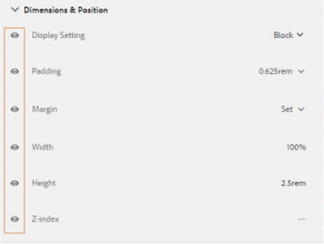

# Criar e usar temas {#creating-and-using-themes}

## Introdução {#introduction}

É possível criar e aplicar temas para estilizar um formulário adaptável ou uma comunicação interativa. Um tema contém detalhes de estilo para os componentes e painéis. Os estilos incluem propriedades como cores de plano de fundo, cores de estado, transparência, alinhamento e tamanho. Quando você aplica um tema, o estilo especificado reflete nos componentes correspondentes. Os temas são gerenciados independentemente sem referência a um formulário adaptável ou comunicação interativa.

É possível:

* Criar um tema
* Editar e copiar um tema existente
* Baixe e faça upload de um tema existente para o servidor AEM Forms
* Gerenciar dependências de um tema

## Criação, download ou upload de um tema {#creating-downloading-or-uploading-a-theme}

Com o AEM Forms, você pode criar, baixar ou fazer upload de temas. Um tema é criado como outros ativos, como formulários, documentos e cartas. O tema é salvo como uma entidade separada, preenchida com meta-propriedades como formulários. O fato de os temas serem uma entidade separada permite o reuso em vários formulários adaptáveis e comunicações interativas. Você também pode mover um tema para uma instância diferente do AEM Forms e reutilizá-lo.

### Criação de um tema {#creating-a-theme}

Execute as seguintes etapas para criar um tema:

1. Clique em **Adobe Experience Manager**, clique em **Forms** e em **Temas**.

1. Na página Temas , clique em **Criar > Tema**.
Um assistente para criar um tema é iniciado.

1. Na guia Básico do assistente Criar Tema , forneça **Título** e **Nome** do tema. Esses são campos obrigatórios.

1. Na guia Advanced , você obtém dois campos:

   * **Localização** da Clientlib: Localização no repositório que armazena as clientlibs para o tema.

   * **Categoria** Clientlib: Fornece um campo de texto para inserir o nome da categoria clientlib para o tema.

1. Clique em **Criar** e em **Editar** para abrir o tema no Editor de Temas ou clique em **Concluído** para voltar à página de temas.

### Download de um tema {#downloading-a-theme}

É possível exportar temas como um arquivo zip e usá-los em outros projetos ou instâncias de AEM. Para baixar um tema:

1. Clique em **Adobe Experience Manager**, clique em **Forms** e em **Temas**.

1. Na página Temas , **Selecione** um tema e clique em **Baixar**. Uma caixa de diálogo com os detalhes do tema é exibida.

1. Clique em **Baixar**. O tema é baixado como um arquivo zip.

>[!NOTE]
>
>Se você baixar um tema que tem um formulário adaptável associado a ele e o formulário adaptável associado for baseado em um modelo personalizado, então também baixe o modelo personalizado. Ao fazer upload do tema baixado e do formulário adaptável para um servidor AEM Forms, faça upload do modelo personalizado relacionado também.

### Fazer upload de um tema {#uploading-a-theme}

É possível usar os temas criados com predefinições de estilização em seu projeto. Você pode importar pacotes de temas criados por outras pessoas, carregando-os no seu projeto.

Para fazer upload de um tema:

1. Clique em **Adobe Experience Manager**, clique em **Forms** e em **Temas**.

1. Na página Temas , clique em **Criar > Upload de arquivo**.
1. No prompt Upload de arquivo, procure e selecione um pacote de temas no seu computador e clique em **Upload**.
O tema carregado está disponível na página de temas.

## Metadados de um tema {#metadata-of-a-theme}

Lista de meta-propriedades de um tema (encontrada na página de propriedades de um tema).

<table>
 <tbody>
  <tr>
   <th>
<strong>ID</strong>
 
 
 </th>
   <th><strong>Nome</strong></th>
   <th><strong>Pode ser editado</strong></th>
   <th><strong>Descrição da propriedade</strong></th>
  </tr>
  <tr>
   <td>1.</td>
   <td>Título</td>
   <td>Sim</td>
   <td>Nome de exibição do tema.</td>
  </tr>
  <tr>
   <td>2.</td>
   <td>Descrição</td>
   <td>Sim</td>
   <td>Descrição sobre o tema.</td>
  </tr>
  <tr>
   <td>3.</td>
   <td>Tipo</td>
   <td>Não</td>
   <td>
    <ul>
     <li>Tipo de ativo.</li>
     <li>Valor é sempre Tema.</li>
    </ul> </td>
  </tr>
  <tr>
   <td>4.</td>
   <td>Criado</td>
   <td>Não</td>
   <td>Data de criação do tema</td>
  </tr>
  <tr>
   <td>5.</td>
   <td>Nome do autor</td>
   <td>Sim</td>
   <td>Autor do tema. Calculado no momento da criação do tema.</td>
  </tr>
  <tr>
   <td>6.</td>
   <td>Data da última modificação</td>
   <td>Não</td>
   <td>Data em que o tema foi modificado pela última vez.</td>
  </tr>
  <tr>
   <td>7.</td>
   <td>Status</td>
   <td>Não</td>
   <td>Status do tema (Modificado/Publicado).</td>
  </tr>
  <tr>
   <td>8.</td>
   <td>Data de início da publicação</td>
   <td>Sim</td>
   <td>Tempo para publicar o tema automaticamente.</td>
  </tr>
  <tr>
   <td>9.</td>
   <td>Data de término da publicação</td>
   <td>Sim</td>
   <td>Tempo para desfazer a publicação automática do tema.</td>
  </tr>
  <tr>
   <td>10.</td>
   <td>Tags</td>
   <td>Sim</td>
   <td>Um rótulo anexado ao tema para identificação usado para melhorar a pesquisa.</td>
  </tr>
  <tr>
   <td>11.</td>
   <td>Referências</td>
   <td>Links</td>
   <td>
    <ul>
     <li>Contém a seção "Referenciado por". Lista formulários que usam o tema.</li>
     <li>Como o tema não se refere a nenhum outro ativo, não há seção "Referências".</li>
    </ul> </td>
  </tr>
  <tr>
   <td>12.</td>
   <td>Local do Clientlib</td>
   <td>Sim</td>
   <td>
    <ul>
     <li>O caminho de repositório definido pelo usuário em '/etc', onde as clientlibs correspondentes a esse tema são armazenadas.</li>
     <li>Valor padrão - '/etc/clientlibs/fd/themes' + caminho relativo do ativo do tema.</li>
     <li>Se o local não existir, a hierarquia de pastas será gerada automaticamente.</li>
     <li>Quando esse valor é alterado, a estrutura do nó clientlib é movida para o novo local inserido.  <em><strong>Observação:</strong> se você alterar o local padrão da clientlib, no repositório CRXDE, atribua  <code>crx:replicate, rep:write, rep:glob:*, rep:itemNames:: js.txt, jcr:read </code>a  <code>forms-users</code> e  <code>crx:replicate</code>,  <code>jcr:read </code>a  <code>fd-service</code> no novo local. Além disso, anexe outra ACL adicionando <code>deny jcr:addChildNodes</code> para <code>forms-user</code></em></li>
    </ul> </td>
  </tr>
  <tr>
   <td>13.</td>
   <td>Nome da categoria do Clientlib</td>
   <td>Sim</td>
   <td>
    <ul>
     <li>O nome da categoria clientlib definida pelo usuário para este tema.</li>
     <li>Um erro será exibido se o nome já estiver sendo usado por algum outro tema existente.</li>
     <li>Valor padrão - calculado usando a localização do tema.</li>
     <li>Quando esse valor é alterado, o nome da categoria é atualizado no nó clientlib correspondente. Não é necessário atualizar o Nome da categoria Clientlib nos arquivos jsp porque o nome da categoria clientlib é usado por referência.</li>
    </ul> </td>
  </tr>
 </tbody>
</table>

## Sobre o Editor de Temas {#about-the-theme-editor}

O AEM Forms é enviado com o Editor de Temas. É uma interface amigável para usuários empresariais e web-designer/desenvolvedor que fornece as funcionalidades necessárias para especificar o estilo de vários formulários adaptáveis e elementos de comunicação interativos facilmente. Ao criar um tema, ele é armazenado como uma entidade separada, como formulários, comunicações interativas, cartas, fragmentos de documento e dicionários de dados.

O Editor de Temas permite personalizar estilos dos componentes estilizados em um tema. Você pode personalizar a aparência de um formulário ou de uma comunicação interativa em um dispositivo.

O Editor de Temas é dividido em dois painéis:

* **Tela**  - Aparece no lado direito. Ele mostra um exemplo de formulário adaptável ou comunicação interativa em que todas as alterações de estilo refletem instantaneamente. Também é possível selecionar objetos diretamente da tela para procurar estilos associados a eles e editar esses estilos. Uma régua de resolução de dispositivo na parte superior governa a Tela. Selecionar um ponto de interrupção de resolução na régua mostra a visualização do formulário de amostra ou a comunicação interativa para a respectiva resolução. A tela é discutida detalhadamente [abaixo](../../forms/using/themes.md#using-canvas).

* **Barra lateral** - Aparece no lado esquerdo. Ela tem os seguintes itens:

   * **Seletor:** Mostra o componente selecionado para estilo e suas propriedades que podem ser estilizadas. O seletor representa todos os componentes de um tipo. Se você selecionar um componente de caixa de texto em um tema para estilo, todas as caixas de texto em seu formulário ou comunicação interativa herdarão o estilo. Os seletores permitem selecionar um componente genérico ou um componente específico para o estilo. Por exemplo, um componente de campo é um componente genérico e uma caixa de texto é um componente específico.

      **Componente genérico de estilo:**
 um campo pode ser um campo de caixa numérica, como idade, ou um campo de caixa de texto, como endereço.
Ao criar um estilo em um campo, todos os campos, como idade, nome, endereço, são estilizados.

      **Componente** específico de estilo: Um componente específico afeta objetos da categoria específica. Ao criar o estilo do componente de caixa numérica no tema, somente o objeto de caixa numérica no herda o estilo.

      Por exemplo, um campo de caixa de texto como endereço é maior em comprimento e um campo de caixa numérica como idade é menor em comprimento. É possível selecionar um campo de caixa numérica, reduzir seu comprimento e aplicar ao formulário. A largura de todos os campos de caixa numérica é reduzida no formulário.

      Ao personalizar todos os componentes do campo com uma cor de plano de fundo específica, todos os campos, como idade, nome e endereço, herdam a cor de plano de fundo. Ao selecionar uma caixa numérica, como idade, e reduzir sua largura, largura de todas as caixas numéricas, como idade, o número de pessoas em uma família é reduzido. A largura das caixas de texto não é alterada.

   * **Estado:** permite personalizar os estilos de um objeto em um estado específico. Por exemplo, você pode especificar a aparência de um objeto quando ele estiver no estado padrão, de foco, desativado, ao passar o mouse ou de erro.
   * **Categorias de propriedade:** as propriedades de estilo são divididas em várias categorias. Por exemplo, Dimension e posição, texto, plano de fundo, borda e efeitos. Em cada categoria, você fornece informações de estilo. Por exemplo, em Plano de fundo, você pode fornecer Cor do plano de fundo, Imagem e gradiente.

   * **Avançado:** Permite adicionar CSS personalizado a um objeto, que substitui as propriedades que os controles visuais definem se houver uma sobreposição.

   * **Exibir CSS**: Permite que você visualize o CSS do componente selecionado
   Além disso, na Barra lateral, na parte inferior, uma seta está presente. Ao clicar na seta, você terá mais duas opções: **Simular Êxito** e **Simular Erro.** Essas opções, juntamente com as opções descritas acima, são discutidas detalhadamente  [abaixo](../../forms/using/themes.md#using-rail).

 **A.** Barra lateral  **B.** Tela

### Estilo de componentes {#styling-components}

Você pode usar um tema em várias formas adaptáveis e comunicações interativas, o que importa a formatação do componente especificado no tema. Você pode criar estilo em vários componentes, como títulos, descrição, painéis, campos, ícones e caixas de texto. Use widgets para configurar as propriedades do componente em um tema. O conhecimento anterior de CSS ou LESS não é necessário, mas é desejado, embora a seção Substituições de CSS permita que você grave o código CSS ou forneça seletores personalizados. A seção Substituições de CSS é exibida ao selecionar um componente na barra lateral.

Opções na barra lateral que permitem selecionar e estilizar componentes diferentes.

Clicar no botão Editar em relação a um componente na barra lateral seleciona o componente na Tela e permite estilizar o componente usando opções na barra lateral.

Determinados componentes, como caixa de texto, caixa numérica, botão de opção e caixa de seleção, são categorizados em componentes genéricos, como Campo. Por exemplo, você deseja personalizar o estilo dos botões de opção. Para selecionar botões de opção para estilo, selecione **Campo > Widget > Botão de opção**.

Clique em **EXPAND ALL** na barra lateral para exibir, selecionar e estilizar os componentes categorizados que não estão visíveis à frente.

### Layouts de painel de estilo {#styling-panel-layouts-br}

Os temas no AEM Forms suportam o estilo de elementos no layout de painéis em seus formulários e comunicações interativas. O estilo de elementos em layouts prontos e layouts personalizados é compatível.

Os painéis prontos para uso incluem:

* Guias na esquerda
* Guias na parte superior
* Menu sanfonado
* Receptivo
* Assistente
* Layout móvel

   * Títulos do painel no cabeçalho
   * Sem títulos de painel no cabeçalho

Os seletores variam para cada layout.
O estilo de layouts personalizados no Editor de Temas envolve:

* Definição dos componentes para um layout que pode ser estilizado, e seletores de CSS para identificar esses componentes exclusivamente
* Definição das propriedades de CSS que podem ser aplicadas a esses componentes
* Definir o estilo desses componentes interativamente na interface do usuário

### Estilos diferentes para tamanhos de tela diferentes {#different-styles-for-different-screen-sizes-br}

Os layouts para desktop e dispositivos móveis podem ter estilos ligeiramente ou totalmente diferentes. Para dispositivos móveis, tablets e telefones compartilham layouts semelhantes, exceto para tamanhos de componentes.

Use pontos de interrupção do Editor de Temas para definir estilos alternativos para tamanhos de tela diferentes. Você pode selecionar um dispositivo ou resolução base em que começa a criar o tema e as variações de estilo para outras resoluções são geradas automaticamente. Você pode modificar explicitamente o estilo de todas as resoluções.

>[!NOTE]
>
>O tema é criado primeiro usando um formulário ou uma comunicação interativa e, em seguida, aplicado em diferentes formas ou comunicações interativas. Os pontos de interrupção usados na criação de temas podem ser diferentes da forma ou da comunicação interativa em que o tema é aplicado. As consultas de mídia CSS são baseadas na forma ou comunicação interativa usada na criação de temas, e não na forma ou comunicação interativa na qual o tema é aplicado.

### Alterar o contexto das propriedades de estilo na barra lateral ao selecionar objetos {#styling-properties-context-changes-in-sidebar-on-selecting-objects}

Quando você seleciona um componente na Tela, suas propriedades de estilo são listadas na barra lateral. Selecione o tipo de objeto e seu estado e forneça seu estilo.

### Estilos usados recentemente no Editor de Temas {#recently-used-styles-in-theme-editor}

O editor de temas armazena em cache até 10 estilos aplicados a um componente. Você pode usar os estilos em cache com outro componente de um tema. Os estilos usados recentemente estão disponíveis logo abaixo do componente selecionado na barra lateral como uma caixa de listagem. Inicialmente, a lista de estilos usados recentemente está vazia.

Ao criar um estilo em um componente, os estilos são armazenados em cache e listados na caixa de listagem. Neste exemplo, o rótulo da caixa de texto é estilizado para alterar o tamanho e a cor da fonte. Você pode seguir etapas semelhantes para escolher uma imagem ou alterar cores para criar estilo em um componente. Observe como o estilo é armazenado em cache e listado na caixa de listagem quando o estilo do rótulo do campo é alterado.

Neste exemplo, o estilo do rótulo do campo é alterado e, quando a Descrição do painel responsivo é selecionada para estilo, uma entrada de lista é adicionada na biblioteca de ativos. A entrada na biblioteca de ativos pode ser usada para alterar o estilo da Descrição do painel responsivo.

Quando um estilo é adicionado na biblioteca de ativos, ele está disponível para outros temas e no [modo de estilo](../../forms/using/inline-style-adaptive-forms.md) da interface do editor de formulários ou do editor de comunicações interativo. Da mesma forma, quando você usa o modo de estilo do editor de formulários ou a interface do usuário do editor de comunicações interativo para criar o estilo de um componente, o estilo é armazenado em cache e está disponível em temas.

O botão de mais na biblioteca de ativos permite salvar permanentemente o estilo com um nome que você fornece. O botão de adição salva o estilo mesmo se você não clicar no botão Salvar na barra lateral para aplicar o estilo a um componente. O botão de mais para salvar um estilo para uso posterior não está disponível no modo de estilo.

Quando você fornece um nome personalizado para um estilo, o estilo é vinculado a um tema e não está mais disponível para outros temas. Para excluir um estilo salvo:

1. Na barra de ferramentas do CANVAS, clique em **Opções de Tema**  > **Gerenciar Estilos**.
1. Na caixa de diálogo Gerenciar estilos, selecione um estilo salvo, clique em **Excluir**.

   

### Visualização ao vivo, salvar e descartar alterações {#live-preview-save-and-discard-changes}

As modificações feitas no estilo são refletidas instantaneamente no formulário ou na comunicação interativa carregada na Tela. A visualização ao vivo permite que você defina e veja interativamente o impacto do estilo. Quando você altera o estilo de um componente, o botão **Concluído** é ativado na barra lateral. Para manter as alterações, use o botão **Concluído**.

>[!NOTE]
>
>Quando um caractere inválido é inserido em um campo, a cor do limite do campo muda para vermelho e uma mensagem de erro é exibida no canto superior esquerdo da tela. Por exemplo, se você digitar alfabetos em uma caixa de texto que aceite caracteres numéricos como entradas, a cor do limite da caixa de entrada será alterada para vermelho. Não é possível salvar esse tema sem resolver o erro exibido na parte superior.

### Tema com outro formulário adaptável ou comunicação interativa {#theme-with-another-adaptive-form-or-interactive-communication}

Ao criar um tema, ele é criado com um formulário enviado com o Editor de Temas. Você fornece estilo para componentes neste formulário. Em vez do formulário enviado com o Editor de Temas, você pode selecionar um formulário ou comunicação interativa de sua escolha para fornecer estilo e visualizar seus resultados.

Para substituir o formulário atual ou a comunicação interativa na Tela do Editor de Temas:

1. No painel EDITOR DE TEMAS, clique em **Opções de Temas**  > **Configurar**.

1. Na guia General , navegue e selecione um formulário ou comunicação interativa para o campo **Adaptive Form/Document**.

### Refazer/Desfazer {#redo-undo}

Você pode desfazer ou refazer as alterações indesejadas que ocorrem acidentalmente. Use os botões refazer/desfazer na Tela.

Botões Desfazer/Refazer na Tela de desenho

Os botões Refazer/Desfazer aparecem quando você estimula um componente no Editor de Temas.

## Uso do Editor de Temas {#using-the-theme-editor}

O Editor de Temas permite que você edite um tema que você criou ou carregou. Navegue até **Forms &amp; Documents > Themes**, selecione um tema e o abra. O tema é aberto no Editor de Temas.

Como discutido acima, o Editor de Temas tem dois painéis: Barra lateral e Tela de desenho.

Personalização do estilo de estado de sucesso do componente de Widget de caixa de texto no Editor de temas. O componente é selecionado na Tela e seu estado é selecionado na barra lateral. As opções de estilo disponíveis na barra lateral são usadas para personalizar a aparência de um componente.

### Usando Tela {#using-canvas}

O tema é criado usando o formulário pronto para uso ou usando um formulário ou uma comunicação interativa de sua escolha. A Tela mostra a visualização do formulário ou a comunicação interativa usada para criar o tema com personalizações especificadas no tema. A régua acima do formulário é usada para determinar o layout de acordo com o tamanho da exibição do dispositivo.

Na barra de ferramentas da Tela, você vê:

* **Alternar painel lateral do** : Permite mostrar ou ocultar a barra lateral.
* **Opções de Temas** : Fornece três opções

   * Configurar: Fornece opções para selecionar o formulário de visualização ou a comunicação interativa, a clientlib base e a configuração do Adobe Fonts.
   * Exibir CSS do Tema: Gera CSS para o tema selecionado.
   * Gerenciar estilos: Fornece opções para gerenciar estilos de texto e imagem
   * Ajuda: Executa um tour guiado por imagem do Editor de Temas.

* **** : Emula a aparência do seu tema para tamanhos de exibição diferentes. Um tamanho de exibição é tratado como um ponto de interrupção no emulador. Você pode selecionar um ponto de interrupção e especificar um estilo para ele. Por exemplo, Desktop e Tablet são dois pontos de interrupção. Você pode especificar estilos diferentes para cada ponto de interrupção.

Ao selecionar um componente na Tela, você vê a barra de ferramentas do componente na parte superior dela. A barra de ferramentas do componente permite selecionar componentes ou alternar para componentes genéricos. Por exemplo, você seleciona uma caixa de texto numérico em um painel. Você vê as seguintes opções na barra de ferramentas do componente:

* **Widget** de caixa numérica: Permite que você selecione o componente para personalizar sua aparência na barra lateral.
* **Widget** de campo: Permite selecionar o componente genérico para o estilo. Neste exemplo, todos os componentes de entrada de texto (caixa de texto/caixa numérica/etapa numérica/entrada de data) são selecionados para estilo.

*  de campo: Permite alternar para um componente genérico para o estilo. Se você selecionar uma caixa numérica e tocar nesse ícone, o componente de campo será selecionado. Se você selecionar o componente de campo e tocar nesse ícone, o painel será selecionado. Se você continuar tocando nesse ícone para seleção, acabará selecionando o layout para o estilo.

>[!NOTE]
>
>As opções disponíveis na barra de ferramentas do componente variam de acordo com o componente selecionado.

Barra de ferramentas do componente na caixa numérica na Tela

### Usando a Barra Lateral {#using-rail}

A barra lateral no editor de temas fornece opções para personalizar estilos para componentes em um tema e usar seletores. Os seletores permitem selecionar um grupo de componentes ou componentes individuais, e você pode procurar seletores na barra lateral. Você pode gravar seletores para componentes personalizados.

Quando você seleciona um componente da Tela ou seletores na barra lateral, a barra lateral mostra todas as opções que permitem personalizar estilos para ela.
Abaixo estão as opções exibidas na barra lateral ao selecionar um componente:

* Estado
* Folha de propriedades
* Simular Erro/Sucesso

#### Estado {#state}

Um estado é um indicador da interação do usuário com um componente. Por exemplo, quando um usuário insere dados incorretos em uma caixa de texto, o estado da caixa de texto muda para um estado de erro. O editor de temas permite que você especifique o estilo para um estado específico.

As opções para personalizar estilos de estado variam para componentes diferentes.

#### Folha de propriedades {#property-sheet}

<table>
 <tbody>
  <tr>
   <td><strong>Propriedade</strong></td>
   <td><strong>Uso</strong></td>
  </tr>
  <tr>
   <td>
Dimensões e Posição
 </td>
   <td>
Permite estilizar o alinhamento, o tamanho, o posicionamento e o posicionamento dos componentes no tema. 
 
Suas opções são configuração de exibição, preenchimento, margem, largura, altura e índice Z.
 
Você também pode usar o modo Layout para definir a largura dos componentes usando uma interface de arrastar e soltar fácil. Para obter mais informações, consulte <a href="../../forms/using/resize-using-layout-mode.md">Usar o modo Layout para redimensionar componentes</a>.
 </td>
  </tr>
  <tr>
   <td>
Texto
 </td>
   <td>
Permite personalizar os estilos de texto no componente do tema.
 
Por exemplo, você deseja alterar a aparência do texto inserido na caixa de texto.
 
Suas opções são família de fontes, peso, cor, tamanho, altura da linha, alinhamento do texto, espaço da letra, recuo do texto, sublinhado, itálico, transformação do texto, alinhamento vertical, linha de base e direção. 
 </td>
  </tr>
  <tr>
   <td>
Segundo plano 
 </td>
   <td>
Permite preencher o plano de fundo do componente com uma imagem ou uma cor. 
 </td>
  </tr>
  <tr>
   <td>
Borda
 </td>
   <td>
Permite escolher a aparência da borda de seu componente. Por exemplo, você deseja que a caixa de texto tenha uma borda vermelha profunda e espessa com uma linha pontilhada. 
 
Suas opções são largura, estilo, raio e cor da borda.
 </td>
  </tr>
  <tr>
   <td>
Efeitos
 </td>
   <td>
Permite adicionar efeitos especiais aos componentes, como opacidade, modo de mesclagem e sombras. 
 </td>
  </tr>
  <tr>
   <td>
Avançado 
 </td>
   <td>
Permite adicionar:

    <ul>
     <li>Propriedades de <code>::before</code> e <code>::after</code> pseudo-elementos para adicionar conteúdo depois ou antes do conteúdo padrão no seletor e estilizá-lo.  Consulte Pseudo-elementos  <a href="https://www.w3schools.com/css/css_pseudo_elements.asp" target="_blank">CSS</a>.</li>
     <li>Código CSS personalizado em linha para um componente e gravar seletores personalizados. </li>
    </ul> 
Quando você adiciona um código CSS personalizado, ele substitui a personalização que você adicionou usando as opções na barra lateral. 
 </td>
  </tr>
 </tbody>
</table>

#### Simular Erro/Sucesso {#simulate-error-success}

As opções Simular erro e sucesso estão disponíveis na parte inferior da barra lateral. Você pode vê-las usando uma seta de mostrar/ocultar visível na parte inferior da barra lateral. Usando o Editor de Temas, você pode criar um estilo em vários estados de um componente.

Por exemplo, você adiciona um campo numérico em seu formulário e especifica seu estilo no editor de temas. Quando um usuário digita um valor alfanumérico no campo, é necessário alterar a cor de fundo da caixa de texto. Você seleciona o campo numérico no tema e usa a opção de estado na barra lateral. Você seleciona o estado Erro na barra lateral e altera a cor do plano de fundo para vermelho. Para visualizar o comportamento, você pode usar a opção Simular erro disponível na barra lateral. As opções Simular erro e sucesso são descritas detalhadamente abaixo:

* **Simular sucesso**: Permite ver a aparência de um componente se você especificar seu estilo para o estado de sucesso. Por exemplo, em um formulário, os clientes definem a senha. Os usuários podem definir a senha de acordo com as diretrizes fornecidas. Quando um usuário digita uma senha seguindo todas as diretrizes fornecidas, a caixa de texto fica verde. Quando a caixa de texto fica verde, ela está em estado de sucesso. Você pode especificar o estilo de um componente em estado de sucesso e simular sua aparência usando a opção Simular sucesso .

* **Erro** Simulado: Permite ver a aparência de um componente se você especificar seu estilo para o estado de erro. Por exemplo, em um formulário, os clientes definem a senha. Os usuários podem definir a senha de acordo com as diretrizes fornecidas. Quando um usuário digita uma senha que não siga todas as diretrizes fornecidas, a caixa de texto fica vermelha. Quando a caixa de texto fica vermelha, ela está no estado de erro. Você pode especificar o estilo de um componente em estado de erro e simular sua aparência usando a opção Simular erro .

### Estilo de um componente {#styling-a-component}

Por exemplo, em seu formulário, há dois tipos de caixas de texto: uma que aceita apenas valores numéricos e outra que aceita valores alfanuméricos. É possível personalizar o estilo da caixa de texto que aceita apenas valores numéricos (uma caixa numérica).

Execute as seguintes etapas para personalizar o estilo de um componente específico (uma caixa numérica neste exemplo):

1. No Editor de Temas, selecione a caixa numérica na Tela.
1. Ao selecionar a caixa numérica, é possível ver a barra de ferramentas do componente com três opções:

   * **Widget de caixa numérica**
   * **Nível de campo do** 

1. Selecione **Widget de caixa numérica**.
1. O título da barra lateral muda para o Widget de caixa numérica e mostra opções para personalizar sua aparência.
Use a opção **Dimension e Position** na barra lateral para personalizar o tamanho do componente. Certifique-se de que o Estado seja **Padrão**.

Em vez de selecionar **Widget de caixa numérica**, selecione **Widget de campo** na barra de ferramentas do componente e execute as etapas acima. Quando você seleciona dimensões para a opção **Widget de campo**, todas as caixas de texto, exceto a caixa numérica, têm o mesmo tamanho.

### Estilo de campos para um determinado estado {#styling-fields-given-state}

Com a barra de ferramentas do componente, também é possível especificar o estilo dos componentes para seus diferentes estados. Por exemplo, se um componente estiver desativado, ele estará em um estado desativado. Os estados normalmente usados de um componente que pode ser estilizado no editor de temas são: Padrão, Foco, Desativado, Erro, Sucesso e Passar o mouse. Você pode selecionar um componente na Tela e usar a opção Estado na barra lateral para personalizar sua aparência.

Execute as seguintes etapas para personalizar o estilo de um componente em um estado específico:

1. Selecione um componente na Tela e selecione a opção apropriada na barra de ferramentas do componente.
A barra lateral mostra opções para personalizar o estilo do componente.
1. Selecione um estado na barra lateral. Por exemplo, Estado do erro.
1. Use opções como **Borda, Plano de Fundo** na barra lateral para personalizar a aparência do componente.
1. Use a opção **Simular Erro** na parte inferior da barra lateral para ver a aparência do estilo na edição.

Quando você personaliza o estilo de um componente após especificar seu estado, a personalização aparece para o componente somente para o estado especificado. Por exemplo, se você personalizar o estilo do componente quando o estado de passar o mouse estiver selecionado. A personalização aparece para o componente quando você move o ponteiro sobre o componente no formulário renderizado ou na comunicação interativa à qual você aplica o tema.

Para simular o comportamento de estados diferentes de erro e sucesso, use o Modo de visualização. Para usar o modo de Visualização, clique em **Visualizar** na barra de ferramentas da página.

### Layouts de estilo para telas menores {#styling-layouts-for-smaller-displays}

Use a régua na Tela de desenho para selecionar pontos de interrupção para dispositivos com exibições menores. Clique no emulador  na Tela para exibir a régua e os pontos de interrupção. Os pontos de interrupção permitem que você visualize um formulário ou uma comunicação interativa para tamanhos de exibição pertencentes a diferentes dispositivos, como telefones e tablets. Vários tamanhos de exibição são suportados no Editor de Tema.

Para criar estilos de componentes para diferentes pontos de interrupção:

1. Na Tela, selecione um ponto de interrupção acima da régua.
Um ponto de interrupção representa um dispositivo móvel e seu tamanho de exibição.
1. Use a barra lateral para personalizar o estilo de componentes de formulário ou de comunicação interativa no tema para o tamanho de exibição selecionado.
1. Certifique-se de que a personalização seja salva.

É possível criar um estilo de componentes de formulário ou de comunicação interativa para vários dispositivos. Os componentes de forma e comunicação interativa para desktops e dispositivos móveis podem ter estilos totalmente diferentes.

### Uso de fontes da Web em um tema {#using-web-fonts-in-a-theme}

Agora é possível usar fontes disponíveis em um serviço da Web em um formulário adaptável ou comunicação interativa. Pronto para uso, [Adobe Fonts](https://fonts.adobe.com/), Adobe Web font service, está disponível como uma configuração. Para usar o Adobe Fonts, crie um kit, adicione fontes nele e obtenha a ID do Kit de [Adobe Fonts](https://fonts.adobe.com/).

Execute as seguintes etapas para configurar o Adobe Fonts no AEM:

1. Na instância do autor, clique em Adobe Experience Manager > Ferramentas  > Implantação > Cloud Services.
1. Na página **Cloud Services**, navegue até a opção **Adobe Fonts** e abra-a. Abra a pasta de configuração e clique em **Create**.
1. Na caixa de diálogo **Criar configuração**, especifique um título para a configuração e clique em **Criar**.

   Você é redirecionado para a página de configuração.

1. Na caixa de diálogo Editar componente, forneça sua ID de Kit e clique em **OK**.

Execute as seguintes etapas para configurar um tema para usar a configuração do Adobe Fonts:

1. Na instância do autor, abra um tema no editor de temas.
1. No editor de temas, navegue até **Opções de Temas**  > **Configurar**.
1. No campo **Configuração do Adobe Fonts**, selecione um kit e clique em **Salvar**.

   Agora, é possível ver que as fontes são adicionadas na propriedade família de fontes do tema.

### Listar e selecionar fontes no editor de temas {#listing-and-selecting-fonts-in-theme-editor}

Você pode usar o serviço de configuração de tema para adicionar mais fontes ao editor de temas. Execute as seguintes etapas para adicionar fontes:

1. Faça logon no Console da Web AEM com privilégios administrativos. O URL para o Console da Web AEM é `https://'[server]:[port]'/system/console/configMgr`.
1. Abra **Serviço de Configuração de Tema de Formulário Adaptativo**.

   

1. Clique em +, especifique o nome da fonte e clique em **Save**. A fonte é adicionada e disponibilizada no editor de temas.

#### Seleção de fontes no editor de temas {#selecting-fonts-in-theme-editor}

Você pode usar o botão + para adicionar uma fonte. Quando você adiciona uma fonte, ela é listada na barra lateral.

Além da opção de configuração de tema, também é possível adicionar a fonte do próprio editor de temas. Digite a fonte que deseja usar no campo família de fontes na barra lateral e pressione a tecla de retorno no teclado.

Ao selecionar uma fonte, ela é adicionada sob a lista família de fontes. Você pode usar a opção Máscara no editor de temas para desativar ou ativar as fontes listadas.

É possível ver a alteração da fonte do componente.

O campo Família de fontes oferece suporte a várias fontes. Quando você digita uma fonte, o navegador a procura e a aplica ao componente selecionado. Se o navegador não conseguir localizar uma fonte, ele procurará uma fonte próxima a ela na família. Você pode começar digitando a fonte específica que está procurando. Se você não encontrar a fonte que deseja usar, é possível digitar uma fonte genérica na família e usá-la.

#### Estilos de máscara aplicados no editor de temas {#mask-styles-applied-in-theme-editor}

É possível mascarar estilos aplicados em um tema. Na barra lateral do editor de temas, você pode usar o ícone para desativar um estilo aplicado. Por exemplo, se você alterar dimensões de um componente em um formulário ou comunicação interativa, poderá usar o botão de máscara à esquerda de uma propriedade para desativá-la. Ao salvar um tema, as opções de mascaramento selecionadas são mantidas.

O exemplo abaixo mostra estilos mascarados e não mascarados em um tema.

## Aplicar um tema a um formulário ou comunicação interativa {#applying-a-theme-to-a-form-or-interactive-communication-br}

Para aplicar um tema a um formulário adaptável:

1. Abra o formulário no modo de edição. Para abrir um formulário no modo de edição, selecione-o e clique em **Abrir**.
1. No modo de edição, selecione um componente, em seguida, clique em  > **Contêiner de formulário adaptável** e clique em .

   É possível editar as propriedades do formulário na barra lateral.

1. Na barra lateral, clique em **Estilo**.
1. Selecione o tema no menu suspenso **Adaptive Form Theme** e clique em **done** .

Para aplicar um tema a uma comunicação interativa:

1. Abra a comunicação interativa no modo de edição. Para abrir uma comunicação interativa no modo de edição, selecione um formulário e clique em **Abrir**.
1. No modo de edição, selecione um componente, em seguida, clique em  >**Contêiner de documento** e clique em .

   É possível editar as propriedades do formulário na barra lateral.

1. Na barra lateral, em **Básico**, selecione seu tema no menu suspenso **Tema** e clique em **Concluído** 

### Alterar tema de um formulário no tempo de execução {#change-theme-of-a-form-at-runtime}

Um tema estimula diferentes componentes de um formulário. Você pode usar a propriedade `themeOverride` para alterar dinamicamente o tema de um formulário. Um URL típico de um formulário é:

`https://<server>:<port>/content/forms/af/test.html`

Você pode usar o parâmetro themeOverride para aplicar um tema no tempo de execução.

`https://<server>:<port>/content/forms/af/test.html?themeOverride=/content/dam/formsanddocuments-themes/simpleEnrollmentTheme`

A opção `themeOverride` permite fornecer um caminho para um tema. Altera o tema do formulário e atualiza o formulário com estilos atualizados.

## Obter aparência específica usando Temas {#specific-af-appearance}

Com o AEM Forms, juntamente com o tema de tela predefinido, há muitos outros temas. Para projetar seu formulário ou comunicação interativa usando outros temas, juntamente com alterações adicionais, copie o tema da pasta Biblioteca de Temas. Cole os temas copiados fora da pasta Biblioteca de Temas e edite o tema copiado de acordo com as alterações desejadas.

Para copiar um tema, execute as seguintes etapas:

1. Na instância de criação, navegue até **Adobe Experience Manager > Forms > Temas**.
1. Abra a pasta Biblioteca de Temas.
1. Na pasta Biblioteca de Temas , passe o ponteiro do mouse sobre o tema predefinido correspondente e toque em **Copiar**.
1. Cole o tema copiado fora da pasta Biblioteca de Temas.
1. Personalize o tema copiado.

Depois de personalizar o tema, aplique-o ao formulário ou à comunicação interativa.

>[!NOTE]
>
>Não modifique os temas disponíveis na pasta Biblioteca de Temas. Esta pasta contém temas do sistema. Qualquer alteração feita nesses temas será substituída na instalação de uma versão mais recente ou de um hotfix do AEM Forms.

## Impacto em outros casos de uso de formulário adaptável {#impact-on-other-adaptive-form-use-cases}

* **Publicar/desfazer a publicação de um formulário:** ao publicar um formulário, o tema aplicado a também é publicado (se já não estiver publicado)
* **Importar/exportar um formulário:** ao importar ou exportar um formulário, seu tema associado também é automaticamente importado ou exportado.
* **Referências de um formulário:** A seção Referências em referências de formulário contém uma entrada extra para o tema.
* **Hora da última modificação de um formulário:** atualizada quando o tema associado é alterado.
* **Teste A/B:** você pode aplicar um tema diferente a duas versões do formulário em testes A/B. As informações dos dois temas são armazenadas individualmente nos dois containers guias.

## Sequência de geração de CSS {#css-generation-sequence}

Ao selecionar exibir CSS, o Editor de Temas coleta todas as informações de estilização e cria um CSS. Ele coleta informações na seguinte ordem:

1. Estilo definido na biblioteca de cliente base do tema.
1. Estilo definido pelo usuário, especificado pelas propriedades na barra lateral.
1. O estilo CSS fornecido usando a opção Substituição de CSS.

Por exemplo, a cor de fundo de uma caixa de texto é azul na biblioteca de cliente base. Altere-o para rosa usando as propriedades na barra lateral. Ao gerar CSS, você vê a cor de fundo da caixa de texto como rosa. Depois de alterar a cor do plano de fundo usando as propriedades, outro autor usa a opção de substituição de CSS para alterar a caixa de texto da cor do plano de fundo como branco. Ao gerar CSS, você vê a cor do fundo como branca no CSS gerado.

## Depuração de estilos {#debugging-styles}

Ao especificar estilos para componentes no Editor de Temas, um CSS é gerado. Ao criar um estilo em um componente genérico, vários componentes incluídos nele também têm o estilo. Por exemplo, ao criar um estilo em um campo, a caixa de texto e o rótulo nele também têm o estilo. Ao criar um estilo para a caixa de texto dentro do campo, ela recebe seu próprio CSS. Se você deseja depurar o CSS gerado para o campo e o componente, o Editor de Temas fornece opções que permitem a visualização do CSS.

Você pode ver o CSS gerado usando as seguintes opções:

* **Opção Exibir** CSS na barra lateral: Ao selecionar um componente no Tema, você pode ver a opção EXIBIR CSS na barra lateral. Ele mostra o CSS gerado, incluindo o CSS para os pseudoelementos `::before` e `::after` .
* **Opção Exibir Tema** CSS na barra de ferramentas da tela: Na barra de ferramentas da Tela, clique em    >  **View Theme CSS**. Você pode ver o CSS do tema inteiro gerado pelas propriedades definidas no Editor de Temas.

## Solução de problemas, recomendações e práticas recomendadas {#troubleshooting-recommendations-and-best-practices}

* **Evitar ativos de outro Tema**

   Ao editar um tema, você pode procurar e adicionar ativos (como imagens) de outros temas. Por exemplo, você está editando o plano de fundo de uma página. Por exemplo, ao selecionar **Page**  **Background** > **Add** > **Image**, você verá uma caixa de diálogo que permite navegar e adicionar imagens em outro tema.

* Você pode enfrentar problemas com seu tema atual se um ativo for adicionado de outro tema e o outro tema for movido ou excluído. É recomendável evitar navegar e adicionar ativos de outros temas.
* **Uso da clientlib base, do editor de temas e do estilo em linha**

   * **Clientlib** básico:

      A biblioteca de cliente base contém informações de estilo. Para usar informações de estilo em bibliotecas do lado do cliente em temas.

      1. Navegue até **Experience Manager > Forms > Temas**.
      1. Na página Temas , selecione um tema e clique em **Propriedades da exibição**.
      1. Na página Propriedades que é aberta, clique em **Avançado**.
      1. Na guia Avançado , no campo Localização da biblioteca de clientes , procure e selecione a biblioteca de clientes que deseja usar.
      1. Clique em **Salvar**.

      O estilo especificado na biblioteca do cliente é importado no tema que o usa. Por exemplo, você especifica o estilo para caixa de texto, caixa numérica e alternar na biblioteca do cliente. Ao importar a biblioteca do cliente para o tema, o estilo da caixa de texto, da caixa numérica e do switch é importado. Em seguida, é possível criar um estilo para outros componentes usando o editor de temas.
Você também pode criar um tema, criar cópias dele e modificar o estilo fornecido nos temas copiados para casos de uso semelhantes.
Consulte [Obtendo aparência específica usando Temas](#specific-af-appearance)

   * **Editor de temas:**

      O Editor de Temas permite criar temas para criar um estilo em seu formulário ou comunicação interativa. Você pode especificar o estilo dos componentes em um tema, que permite a consistência entre várias formas ou comunicações interativas desenvolvidas. É recomendável especificar informações de estilo em um tema e aplicar o tema a um formulário.

   * **Estilo em linha:**

      É possível criar estilos de componentes usando o modo Estilo no formulário ou o editor multicanal de comunicação interativo ao trabalhar com um formulário. Usar o modo de estilo para alterar o estilo do componente de formulário substitui o estilo especificado no tema. Se quiser alterar o estilo de determinados componentes de um formulário específico, consulte [Estilo em linha de componentes](../../forms/using/inline-style-adaptive-forms.md).

* **Uso de bibliotecas do lado do cliente**

   Para criar bibliotecas de clientes para importar informações de estilo, consulte [Usando bibliotecas do lado do cliente](/help/sites-developing/clientlibs.md). Depois de criar uma biblioteca do cliente, você pode importá-la para o tema usando as etapas mencionadas acima.

* **Alteração da largura do layout do painel do contêiner**

   Não é recomendável alterar a largura do layout do painel do contêiner. Quando você especifica a largura de um painel de contêiner, ele se torna estático e não se adapta a exibições diferentes.

* **Quando usar o editor de formulário ou o editor de temas para trabalhar com o cabeçalho e o rodapé**

   Use o editor de temas se desejar criar um estilo de cabeçalho e rodapé usando opções de estilo, como estilo de fonte, plano de fundo e transparência.
Se desejar fornecer informações como uma imagem de logotipo, nome da empresa no cabeçalho e informações de direitos autorais no rodapé, use as opções do editor de formulário.
