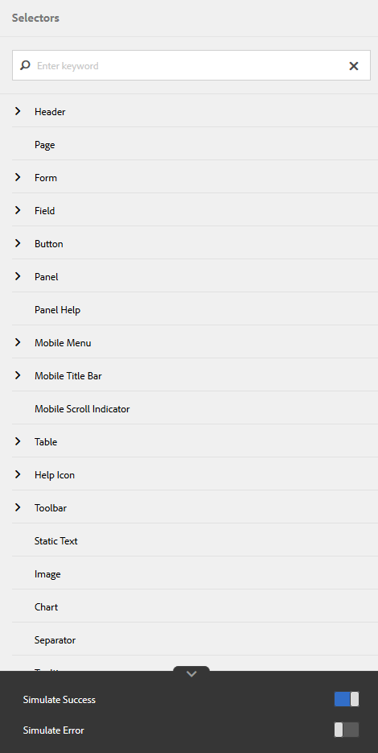
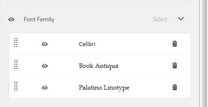

# Criação e uso de temas {#creating-and-using-themes}

 O Adobe recomenda o uso da captura de dados moderna e extensível [Componentes principais](https://experienceleague.adobe.com/docs/experience-manager-core-components/using/adaptive-forms/introduction.html?lang=pt-BR) para [criação de um novo Forms adaptável](/help/forms/using/create-an-adaptive-form-core-components.md) ou [adição de Forms adaptável às páginas do AEM Sites](/help/forms/using/create-or-add-an-adaptive-form-to-aem-sites-page.md). Esses componentes representam um avanço significativo na criação do Forms adaptável, garantindo experiências de usuário impressionantes. Este artigo descreve a abordagem mais antiga para criar o Forms adaptável usando componentes de base. 

| Versão | Link do artigo |
| -------- | ---------------------------- |
| AEM as a Cloud Service | [Clique aqui](https://experienceleague.adobe.com/docs/experience-manager-cloud-service/content/forms/adaptive-forms-authoring/authoring-adaptive-forms-foundation-components/create-an-adaptive-form-on-forms-cs/themes.html?lang=pt-br) |
| AEM 6.5 | Este artigo |

## Introdução {#introduction}

É possível criar e aplicar temas para estilizar um formulário adaptável ou uma comunicação interativa. Um tema contém detalhes de estilo para os componentes e painéis. Os estilos incluem propriedades como cores de fundo, cores de estado, transparência, alinhamento e tamanho. Quando você aplica um tema, o estilo especificado reflete nos componentes correspondentes. O tema é gerenciado de forma independente sem uma referência a um formulário adaptável ou comunicação interativa.

É possível:

* Criar um tema
* Editar e copiar um tema existente
* Baixar e carregar um tema existente no servidor do AEM Forms
* Gerenciar dependências de um tema

## Criar, baixar ou fazer upload de um tema {#creating-downloading-or-uploading-a-theme}

Com o AEM Forms, você pode criar, baixar ou fazer upload de temas. Um tema é criado como outros ativos, como formulários, documentos e cartas. O tema é salvo como uma entidade separada, completa com metapropriedades como formulários. Os temas sendo uma entidade separada permitem reutilização em vários formulários adaptáveis e comunicações interativas. Você também pode mover um tema para uma instância diferente do AEM Forms e reutilizá-lo.

### Criação de um tema {#creating-a-theme}

Execute as seguintes etapas para criar um tema:

1. Clique em **Adobe Experience Manager**, clique em **Forms** e clique em **Temas**.

1. Na página Temas, clique em **Criar > Tema**.
Um assistente para criar um tema é iniciado.

1. Na guia Básico do assistente Criar tema, forneça **Título** e **Nome** do tema. Esses campos são obrigatórios.

1. Na guia Advanced, você tem dois campos:

   * **Local do Clientlib**: Local no repositório que armazena as clientlibs do tema.

   * **Categoria do Clientlib**: fornece um campo de texto para inserir o nome da categoria clientlib do tema.

1. Clique em **Criar** e clique em **Editar** para abrir o tema no Editor de temas, ou clique em **Concluído** para retornar à página temas.

### Download de um tema {#downloading-a-theme}

É possível exportar temas como um arquivo zip e usá-los em outros projetos ou instâncias AEM. Para baixar um tema:

1. Clique em **Adobe Experience Manager**, clique em **Forms** e clique em **Temas**.

1. Na página Temas, **Selecionar** um tema e clique em **Baixar**. Uma caixa de diálogo com os detalhes do tema é exibida.

1. Clique em **Baixar**. O tema é baixado como um arquivo zip.

>[!NOTE]
>
>Se você baixar um tema que tenha um formulário adaptável associado a ele e o formulário adaptável associado for baseado em um modelo personalizado, baixe também o modelo personalizado. Ao fazer upload do tema baixado e do formulário adaptável para um servidor do AEM Forms, faça upload do modelo personalizado relacionado também.

### Carregamento de um tema {#uploading-a-theme}

Você pode usar temas criados com predefinições de estilo em seu projeto. Você pode importar pacotes de temas que outras pessoas criam carregando-os no seu projeto.

Para fazer upload de um tema:

1. Clique em **Adobe Experience Manager**, clique em **Forms** e clique em **Temas**.

1. Na página Temas, clique em **Criar > Upload de arquivo**.
1. No prompt File Upload (Upload de arquivo), procure e selecione um pacote de temas no computador e clique em **Carregar**.
O tema carregado está disponível na página de temas.

## Metadados de um tema {#metadata-of-a-theme}

Lista de metapropriedades de um tema (encontrada na página de propriedades de um tema).

<table>
 <tbody>
  <tr>
   <th>
<strong>ID</strong>
 
 
 </th>
   <th><strong>Nome</strong></th>
   <th><strong>Pode ser editado</strong></th>
   <th><strong>Descrição da propriedade</strong></th>
  </tr>
  <tr>
   <td>1.</td>
   <td>Título</td>
   <td>Sim</td>
   <td>Nome de exibição do tema.</td>
  </tr>
  <tr>
   <td>2.</td>
   <td>Descrição</td>
   <td>Sim</td>
   <td>Descrição sobre o tema.</td>
  </tr>
  <tr>
   <td>3.</td>
   <td>Tipo</td>
   <td>Não</td>
   <td>
    <ul>
     <li>Tipo de ativo.</li>
     <li>O valor é sempre Theme.</li>
    </ul> </td>
  </tr>
  <tr>
   <td>4.</td>
   <td>Criado</td>
   <td>Não</td>
   <td>Data de criação do tema</td>
  </tr>
  <tr>
   <td>5.</td>
   <td>Nome do autor</td>
   <td>Sim</td>
   <td>Autor do tema. Calculado no momento da criação do tema.</td>
  </tr>
  <tr>
   <td>6.</td>
   <td>Data da última modificação</td>
   <td>Não</td>
   <td>Data da última modificação do tema.</td>
  </tr>
  <tr>
   <td>7.</td>
   <td>Status</td>
   <td>Não</td>
   <td>Status do tema (modificado/publicado).</td>
  </tr>
  <tr>
   <td>8.</td>
   <td>Data de início da publicação</td>
   <td>Sim</td>
   <td>Tempo para publicar automaticamente o tema.</td>
  </tr>
  <tr>
   <td>9.</td>
   <td>Data de término da publicação</td>
   <td>Sim</td>
   <td>Tempo para desfazer a publicação automática do tema.</td>
  </tr>
  <tr>
   <td>10.</td>
   <td>Tags</td>
   <td>Sim</td>
   <td>Um rótulo anexado ao tema para identificação usado para melhorar a pesquisa.</td>
  </tr>
  <tr>
   <td>11.</td>
   <td>Referências</td>
   <td>Links</td>
   <td>
    <ul>
     <li>Contém a seção "Referenciado por". Lista os formulários que usam o tema.</li>
     <li>Como o tema não se refere a nenhum outro ativo, não há seção "Indica".</li>
    </ul> </td>
  </tr>
  <tr>
   <td>12.</td>
   <td>Local do Clientlib</td>
   <td>Sim</td>
   <td>
    <ul>
     <li>O caminho do repositório definido pelo usuário em '/etc' onde as clientlibs correspondentes a este tema são armazenadas.</li>
     <li>Valor padrão - "/etc/clientlibs/fd/themes" + caminho relativo do ativo do tema.</li>
     <li>Se o local não existir, a hierarquia de pastas será gerada automaticamente.</li>
     <li>Quando esse valor é alterado, a estrutura do nó clientlib é movida para o novo local inserido.  <em><strong>Nota:</strong> Se você alterar o local padrão das bibliotecas de clientes, no repositório CRXDE, atribua <code>crx:replicate, rep:write, rep:glob:*, rep:itemNames:: js.txt, jcr:read </code>para <code>forms-users</code> e <code>crx:replicate</code>, <code>jcr:read </code>para <code>fd-service</code> no novo local. Também anexe outra ACL adicionando <code>deny jcr:addChildNodes</code> para <code>forms-user</code></em></li>
    </ul> </td>
  </tr>
  <tr>
   <td>13.</td>
   <td>Nome da categoria do Clientlib</td>
   <td>Sim</td>
   <td>
    <ul>
     <li>O nome da categoria clientlib definido pelo usuário para este tema.</li>
     <li>Um erro será exibido se o nome já estiver sendo usado por algum outro tema existente.</li>
     <li>Valor padrão - calculado usando a localização do tema.</li>
     <li>Quando esse valor é alterado, o nome da categoria é atualizado no nó clientlib correspondente. Não é necessário atualizar o nome da categoria do clientlib nos arquivos jsp, pois o nome da categoria do clientlib é usado como referência.</li>
    </ul> </td>
  </tr>
 </tbody>
</table>

## Sobre o Editor de temas {#about-the-theme-editor}

O AEM Forms vem com o Editor de temas. É uma interface amigável para usuários empresariais e designers da Web/desenvolvedores que fornece as funcionalidades necessárias para especificar facilmente o estilo de vários elementos de forma adaptável e comunicação interativa. Ao criar um tema, ele é armazenado como uma entidade separada, como formulários, comunicações interativas, cartas, fragmentos de documentos e dicionários de dados.

O Editor de temas permite personalizar estilos dos componentes estilizados em um tema. Você pode personalizar a aparência de um formulário ou comunicação interativa em um dispositivo.

O Editor de temas é dividido em dois painéis:

* **Tela** - Aparece no lado direito. Ele mostra um exemplo de formulário adaptável ou comunicação interativa em que todas as alterações de estilo são refletidas instantaneamente. Você também pode selecionar objetos diretamente da tela para pesquisar estilos associados a eles e editar esses estilos. Uma régua de resolução de dispositivo na parte superior controla a Tela de Pintura. Selecionar um ponto de interrupção de resolução na régua mostra a pré-visualização do formulário de amostra ou da comunicação interativa para a respectiva resolução. A tela de desenho é discutida em detalhes [abaixo](../../forms/using/themes.md#using-canvas).

* **Barra lateral**- Aparece no lado esquerdo. Ele tem os seguintes itens:

   * **Seletor:** Mostra o componente selecionado para estilo e suas propriedades que podem ser estilizadas. O seletor representa todos os componentes de um tipo. Se você selecionar um componente Caixa de texto em um tema para estilo, todas as caixas de texto no formulário ou comunicação interativa herdarão o estilo. Os seletores permitem selecionar um componente genérico ou um componente específico para o estilo. Por exemplo, um componente de campo é um componente genérico e uma caixa de texto é um componente específico.

     **Componente genérico de estilo:**
Um campo pode ser um campo de caixa numérica, como idade, ou um campo de caixa de texto, como endereço.
Ao estilizar um campo, todos os campos, como idade, nome, endereço, são estilizados.

     **Componente específico do estilo**: um componente específico afeta objetos da categoria específica. Ao estilizar o componente caixa numérica no tema, somente o objeto caixa numérica em herdará o estilo.

     Por exemplo, um campo de caixa de texto como endereço tem comprimento maior e um campo de caixa numérica como idade tem comprimento menor. Você pode selecionar um campo de caixa numérica, reduzir seu comprimento e aplicar ao formulário. A largura de todos os campos de caixa numérica é reduzida no formulário.

     Quando você personaliza todos os componentes do campo com uma cor de plano de fundo específica, todos os campos, como idade, nome e endereço, herdam a cor do plano de fundo. Quando você seleciona uma caixa numérica, como idade, e reduz sua largura, a largura de todas as caixas numéricas, como idade, número de pessoas em uma família é reduzida. A largura das caixas de texto não é alterada.

   * **Estado:** Permite personalizar estilos de um objeto em um estado específico. Por exemplo, você pode especificar a aparência de um objeto quando ele está em estado padrão, de foco, desativado, ao passar o mouse ou erro.
   * **Categorias de propriedade:** As propriedades de estilo são divididas em várias categorias. Por exemplo, Dimension e Posição, Texto, Plano de fundo, Borda e Efeitos. Em cada categoria, você fornece informações de estilo. Por exemplo, em Plano de fundo, você pode fornecer Cor do plano de fundo e Imagem e gradiente.

   * **Avançado:** Permite adicionar CSS personalizado a um objeto, o que substitui as propriedades que os controles visuais definem se há uma sobreposição.

   * **Exibir CSS**: permite exibir o CSS do componente selecionado

  Além disso, na barra lateral, uma seta está presente na parte inferior. Ao clicar na seta, você terá mais duas opções: **Simular o sucesso** e **Simular Erro.** Essas opções, juntamente com as descritas acima, são discutidas em detalhes [abaixo](../../forms/using/themes.md#using-rail).

 **A.** Barra lateral **B.** Tela

### Componentes de estilo {#styling-components}

É possível usar um tema em vários formulários adaptáveis e comunicações interativas, que importam a formatação do componente especificada no tema. É possível estilizar vários componentes, como títulos, descrição, painéis, campos, ícones e caixas de texto. Use widgets para configurar propriedades de componentes em um tema. O conhecimento prévio de CSS ou MENOS não é necessário, mas é desejado, embora a seção Substituições de CSS permita escrever o código CSS ou fornecer seletores personalizados. A seção Sobreposições CSS é exibida quando você seleciona um componente na barra lateral.

Opções na barra lateral que permitem selecionar e estilizar diferentes componentes.

Clicar no botão editar em um componente na barra lateral seleciona o componente na Tela e permite estilizar o componente usando as opções na barra lateral.

Determinados componentes, como caixa de texto, caixa numérica, botão de opção e caixa de seleção, são categorizados em componentes genéricos, como Campo. Por exemplo, você deseja personalizar o estilo de botões de opção. Para selecionar botões de opção para estilo, selecione **Campo > Widget > Botão de opção**.

Clique em **EXPANDIR TUDO** na barra lateral para exibir, selecionar e estilizar componentes categorizados que não estão visíveis antecipadamente.

### Layouts do painel de estilo {#styling-panel-layouts-br}

Os temas no AEM Forms suportam o estilo de elementos no layout de painéis em seus formulários e comunicações interativas. O estilo de elementos em layouts prontos para uso e layouts personalizados é compatível.

Os painéis prontos para uso incluem:

* Guias na esquerda
* Guias na parte superior
* Acordeão
* Receptivo
* Assistente
* Layout para dispositivo móvel

   * Títulos do painel no cabeçalho
   * Sem títulos de painel no cabeçalho

Os seletores variam para cada layout.
O estilo de layouts personalizados do Editor de temas envolve:

* Definir os componentes para um layout que possa ser estilizado e os seletores de CSS para identificar esses componentes de maneira exclusiva
* Definição das propriedades CSS que podem ser aplicadas a esses componentes
* Definir o estilo desses componentes interativamente na interface do usuário

### Estilos diferentes para tamanhos de tela diferentes {#different-styles-for-different-screen-sizes-br}

Os layouts de desktop e dispositivos móveis podem ter estilos ligeiramente ou totalmente diferentes. Para dispositivos móveis, o tablet e o telefone compartilham layouts semelhantes, exceto para tamanhos de componentes.

Use os pontos de interrupção do Editor de temas para definir um estilo alternativo para tamanhos de tela diferentes. É possível selecionar um dispositivo base ou uma resolução na qual você começa a criar o tema, e as variações de estilo de outras resoluções são geradas automaticamente. É possível modificar explicitamente o estilo de todas as resoluções.

>[!NOTE]
>
>O tema é criado primeiro usando um formulário ou comunicação interativa e, em seguida, aplicado em diferentes formulários ou comunicações interativas. Os pontos de interrupção usados na criação do tema podem ser diferentes da forma ou comunicação interativa na qual o tema é aplicado. As consultas de mídia CSS são baseadas no formulário ou na comunicação interativa usada na criação do tema, e não no formulário ou na comunicação interativa na qual o tema é aplicado.

### O contexto das propriedades de estilo é alterado na barra lateral ao selecionar objetos {#styling-properties-context-changes-in-sidebar-on-selecting-objects}

Quando você seleciona um componente na Tela de desenho, suas propriedades de estilo são listadas na barra lateral. Selecione o tipo de objeto e seu estado e forneça seu estilo.

### Estilos usados recentemente no Editor de temas {#recently-used-styles-in-theme-editor}

O editor de temas armazena em cache até 10 estilos aplicados a um componente. É possível usar os estilos em cache com outro componente de um tema. Os estilos usados recentemente estão disponíveis logo abaixo do componente selecionado na barra lateral como uma caixa de listagem. Inicialmente, a lista de estilos usados recentemente está vazia.

À medida que você estiliza um componente, os estilos são armazenados em cache e listados na caixa de lista. Neste exemplo, o rótulo da caixa de texto é estilizado para alterar o tamanho e a cor da fonte. Você pode seguir etapas semelhantes para escolher uma imagem ou alterar as cores para estilizar um componente. Observe como o estilo é armazenado em cache e listado na caixa de listagem quando o estilo do rótulo do campo é alterado.

Neste exemplo, o estilo do rótulo do campo é alterado e, quando a Descrição do painel responsivo é selecionada para estilo, uma entrada de lista é adicionada à biblioteca de ativos. A entrada na biblioteca de ativos pode ser usada para alterar o estilo de Descrição do painel responsivo.

Quando adicionado na biblioteca de ativos, o estilo fica disponível para outros temas e no [modo de estilo](../../forms/using/inline-style-adaptive-forms.md) do editor de formulários ou da interface do editor de comunicação interativa. Da mesma forma, quando você usa o modo de estilo do editor de formulários ou a interface do editor de comunicação interativa para estilizar um componente, o estilo é armazenado em cache e está disponível em temas.

O botão de mais na biblioteca de ativos permite salvar permanentemente o estilo com um nome que você fornece. O botão de adição salva o estilo mesmo se você não clicar no botão Salvar na barra lateral para aplicar o estilo a um componente. O botão de adição para salvar um estilo para uso posterior não está disponível no modo de estilo.

Quando você fornece um nome personalizado para um estilo, ele está vinculado a um tema e não está mais disponível para outros temas. Para excluir um estilo salvo:

1. Na barra de ferramentas da TELA, clique em **Opções de tema**  > **Gerenciar estilos**.
1. Na caixa de diálogo Gerenciar estilos, selecione um estilo salvo e clique em **Excluir**.

   

### Visualização em tempo real, salvar e descartar alterações {#live-preview-save-and-discard-changes}

As modificações feitas no estilo são refletidas instantaneamente no formulário ou na comunicação interativa carregada na Tela. A pré-visualização ao vivo permite que você defina e veja interativamente o impacto do estilo. Quando você altera o estilo de um componente, a variável **Concluído** é ativado na barra lateral. Para reter as alterações, use o **Concluído** botão.

>[!NOTE]
>
>Quando um caractere inválido é inserido em um campo, a cor do limite do campo muda para vermelho e uma mensagem de erro é exibida no canto superior esquerdo da tela. Por exemplo, se você inserir letras em uma caixa de texto que aceita caracteres numéricos como entradas, a cor do limite da caixa de entrada será alterada para vermelho. Não é possível salvar esse tema sem resolver o erro exibido na parte superior.

### Tema com outro formulário adaptável ou comunicação interativa {#theme-with-another-adaptive-form-or-interactive-communication}

Quando você cria um tema, ele é criado com um formulário enviado com o Editor de temas. Você fornece o estilo dos componentes neste formulário. Em vez do formulário enviado com o Editor de temas, você pode selecionar um formulário ou comunicação interativa de sua escolha para fornecer estilo e visualizar seus resultados.

Para substituir o formulário atual ou a comunicação interativa na Tela do Editor de temas:

1. No painel EDITOR DE TEMAS, clique em **Opções de tema**  > **Configurar**.

1. Na guia General, navegue e selecione um formulário ou comunicação interativa para o **Formulário/Documento adaptável** campo.

### Refazer/Desfazer {#redo-undo}

Você pode desfazer ou refazer as alterações indesejadas que ocorrem acidentalmente. Use os botões Refazer/Desfazer na Tela.

Botões Desfazer/Refazer na Tela

Os botões Refazer/Desfazer aparecem ao estilizar um componente no Editor de temas.

## Usar o Editor de temas {#using-the-theme-editor}

O Editor de temas permite editar um tema criado ou carregado. Navegue até **Forms e documentos > Temas**, selecione um tema e abra-o. O tema é aberto no Editor de temas.

Como discutido acima, o Editor de temas tem dois painéis: Barra lateral e Tela.

Personalizar o estilo de estado de sucesso do componente Widget de caixa de texto no Editor de temas. O componente é selecionado na Tela de desenho e seu estado é selecionado na barra lateral. As opções de estilo disponíveis na barra lateral são usadas para personalizar a aparência de um componente.

### Utilização da Tela {#using-canvas}

O tema é criado usando o formulário pronto para uso ou usando um formulário ou comunicação interativa de sua escolha. A Tela mostra a pré-visualização do formulário ou da comunicação interativa usada para criar o tema com personalizações especificadas no tema. A régua acima do formulário é usada para determinar o layout de acordo com o tamanho da exibição do seu dispositivo.

Na barra de ferramentas da Tela de Pintura, você verá:

* **Ativar/desativar painel lateral** : permite mostrar ou ocultar a barra lateral.
* **Opções de tema** : fornece três opções

   * Configurar: fornece opções para selecionar o formulário de visualização ou a comunicação interativa, o clientlib base e a configuração do Adobe Fonts.
   * Visualizar CSS de tema: gera o CSS para o tema selecionado.
   * Gerenciar estilos: fornece opções para gerenciar estilos de texto e imagem
   * Ajuda: executa um tour guiado por imagem do Editor de temas.

* **Emulador** : emula a aparência do tema para diferentes tamanhos de exibição. Um tamanho de exibição é tratado como um ponto de interrupção no emulador. Você pode selecionar um ponto de interrupção e especificar um estilo para ele. Por exemplo, Desktop e Tablet são dois pontos de interrupção. Você pode especificar estilos diferentes para cada ponto de interrupção.

Quando você seleciona um componente na Tela, vê a barra de ferramentas do componente na parte superior dele. A barra de ferramentas do componente permite selecionar componentes ou alternar para componentes genéricos. Por exemplo, você seleciona uma caixa de texto numérica em um painel. Você vê as seguintes opções na barra de ferramentas do componente:

* **Widget de caixa numérica**: permite que você selecione o componente para personalizar sua aparência na barra lateral.
* **Widget de campo**: permite selecionar o componente genérico para o estilo. Neste exemplo, todos os componentes de entrada de texto (caixa de texto/caixa numérica/depurador numérico/entrada de data) são selecionados para estilo.

* : permite alternar para componente genérico para estilização. Se você selecionar caixa numérica e tocar nesse ícone, o componente de campo será selecionado. Se você selecionar componente de campo e tocar neste ícone, o painel será selecionado. Se você continuar tocando nesse ícone para seleção, acabará selecionando o layout para estilo.

>[!NOTE]
>
>As opções disponíveis na barra de ferramentas do componente variam de acordo com o componente selecionado.

Barra de ferramentas do componente na caixa numérica na Tela

### Usando a barra lateral {#using-rail}

A barra lateral no editor de temas fornece opções para personalizar estilos para componentes em um tema e usar seletores. Os seletores permitem selecionar um grupo de componentes ou componentes individuais, e você pode pesquisar por seletores na barra lateral. Você pode gravar seletores para componentes personalizados.

Quando você seleciona um componente na Tela ou nos seletores na barra lateral, a barra lateral mostra todas as opções que permitem personalizar estilos para ela.
Abaixo estão as opções que você vê na barra lateral ao selecionar um componente:

* Estado
* Folha de propriedades
* Simular Erro/Sucesso

#### Estado {#state}

Um estado é um indicador da interação do usuário com um componente. Por exemplo, quando um usuário insere dados incorretos em uma caixa de texto, o estado da caixa de texto muda para um estado de erro. O editor de temas permite especificar o estilo de um estado específico.

As opções para personalizar estilos de estado variam para diferentes componentes.

#### Folha de propriedades {#property-sheet}

<table>
 <tbody>
  <tr>
   <td><strong>Propriedade</strong></td>
   <td><strong>Utilização</strong></td>
  </tr>
  <tr>
   <td>
Dimensões e Posição
 </td>
   <td>
Permite estilizar o alinhamento, o tamanho, o posicionamento e a colocação dos componentes no tema. 
 
Suas opções são: configuração de exibição, preenchimento, margem, largura, altura e índice Z.
 
Você também pode usar o modo Layout para definir a largura dos componentes usando uma interface fácil de arrastar e soltar. Para obter mais informações, consulte <a href="../../forms/using/resize-using-layout-mode.md">Usar o modo Layout para redimensionar componentes</a>.
 </td>
  </tr>
  <tr>
   <td>
Texto
 </td>
   <td>
Permite personalizar os estilos de texto no componente do tema.
 
Por exemplo, você deseja alterar a aparência do texto inserido na caixa de texto.
 
Suas opções são família de fontes, peso, cor, tamanho, altura da linha, alinhamento de texto, espaçamento entre letras, recuo de texto, sublinhado, itálico, transformação de texto, alinhamento vertical, linha de base e direção. 
 </td>
  </tr>
  <tr>
   <td>
Segundo plano 
 </td>
   <td>
Permite preencher o plano de fundo do componente com uma imagem ou cor. 
 </td>
  </tr>
  <tr>
   <td>
Borda
 </td>
   <td>
Permite escolher a aparência da borda do componente. Por exemplo, você deseja que a caixa de texto tenha uma borda espessa vermelha profunda com uma linha pontilhada. 
 
Suas opções são largura, estilo, raio e cor da borda.
 </td>
  </tr>
  <tr>
   <td>
Efeitos
 </td>
   <td>
Permite adicionar efeitos especiais aos componentes, como opacidade, modo de mesclagem e sombras. 
 </td>
  </tr>
  <tr>
   <td>
Avançado 
 </td>
   <td>
Permite adicionar:

    <ul>
     <li>Propriedades de <code>::before</code> e <code>::after</code> pseudoelementos para adicionar conteúdo após ou antes do conteúdo padrão no seletor e estilizá-lo.  Consulte <a href="https://www.w3schools.com/css/css_pseudo_elements.asp" target="_blank">Pseudo-elementos CSS</a>.</li>
     <li>Código CSS personalizado em linha para um componente e grava seletores personalizados. </li>
    </ul> 
Quando você adiciona um código CSS personalizado, ele substitui a personalização adicionada usando as opções na barra lateral. 
 </td>
  </tr>
 </tbody>
</table>

#### Simular Erro/Sucesso {#simulate-error-success}

As opções Simular erro e sucesso estão disponíveis na parte inferior da barra lateral. Você pode vê-los usando uma seta para mostrar/ocultar visível na parte inferior da barra lateral. Usando o Editor de temas, você pode estilizar vários estados de um componente.

Por exemplo, você adiciona um campo numérico ao formulário e especifica seu estilo no editor de temas. Quando um usuário digita um valor alfanumérico no campo, você deseja alterar a cor do plano de fundo da caixa de texto. Você seleciona o campo numérico no tema e usa a opção de estado na barra lateral. Você seleciona o estado de erro na barra lateral e altera a cor do plano de fundo para vermelho. Para visualizar o comportamento, você pode usar a opção Simular erro disponível na barra lateral. As opções Simular Erro e Êxito estão descritas detalhadamente abaixo:

* **Simular o sucesso**: permite ver a aparência de um componente se você especificar seu estilo para o estado de sucesso. Por exemplo, em um formulário, os clientes definem uma senha. Os usuários podem definir a senha de acordo com as diretrizes fornecidas. Quando um usuário digita uma senha seguindo todas as diretrizes fornecidas, a caixa de texto fica verde. Quando a caixa de texto fica verde, ela está em estado de sucesso. Você pode especificar o estilo de um componente no estado de sucesso e simular sua aparência usando a opção Simular sucesso.

* **Simular Erro**: permite ver a aparência de um componente se você especificar seu estilo para o estado de erro. Por exemplo, em um formulário, os clientes definem uma senha. Os usuários podem definir a senha de acordo com as diretrizes fornecidas. Quando um usuário digita uma senha que não segue todas as diretrizes fornecidas, a caixa de texto fica vermelha. Quando a caixa de texto fica vermelha, ela está em estado de erro. Você pode especificar o estilo de um componente em estado de erro e simular sua aparência usando a opção Simular erro.

### Estilo de um componente {#styling-a-component}

Por exemplo, no formulário, você tem dois tipos de caixas de texto: uma que aceita apenas valores numéricos e outra que aceita valores alfanuméricos. É possível personalizar o estilo da caixa de texto que aceita apenas valores numéricos (uma caixa numérica).

Execute as seguintes etapas para personalizar o estilo de um componente específico (uma caixa numérica neste exemplo):

1. No Editor de temas, selecione a caixa numérica na Tela de desenho.
1. Ao selecionar a caixa numérica, é possível ver a barra de ferramentas do componente com três opções:

   * **Widget de caixa numérica**
   * **Widget de campo** 

1. Selecionar **Widget de caixa numérica**.
1. O título da barra lateral muda para Widget de caixa numérica e mostra opções para personalizar sua aparência.
Uso **Dimension e Posição** opção na barra lateral para personalizar o tamanho do componente. Assegurar que o Estado seja **Padrão**.

Em vez de selecionar **Widget de caixa numérica**, selecione **Widget de campo** na barra de ferramentas do componente e execute as etapas acima. Ao selecionar dimensões para **Widget de campo** , todas as caixas de texto, exceto a caixa numérica, têm o mesmo tamanho.

### Campos de estilo para um determinado estado {#styling-fields-given-state}

Com a barra de ferramentas do componente, você também pode especificar o estilo dos componentes para seus diferentes estados. Por exemplo, se um componente estiver desativado, ele estará em um estado desativado. Os estados mais usados de um componente que podem ser estilizados no editor de tema são: Padrão, Foco, Desativado, Erro, Sucesso e Foco. Você pode selecionar um componente na Tela e usar a opção Estado na barra lateral para personalizar sua aparência.

Execute as seguintes etapas para personalizar o estilo de um componente em um estado específico:

1. Selecione um componente na Tela de desenho e selecione a opção apropriada na barra de ferramentas do componente.
A barra lateral mostra opções para personalizar o estilo do componente.
1. Selecione um estado na barra lateral. Por exemplo, Estado de erro.
1. Use opções como **Borda, Plano de fundo** na barra lateral para personalizar a aparência do componente.
1. Use o **Simular Erro** opção na parte inferior da barra lateral para ver a aparência do estilo na edição.

Quando você personaliza o estilo de um componente depois de especificar seu estado, a personalização é exibida somente para o componente no estado especificado. Por exemplo, se você personalizar o estilo do componente quando o estado do mouse for selecionado. A personalização é exibida para o componente quando você move o ponteiro sobre o componente no formulário renderizado ou na comunicação interativa à qual aplica o tema.

Para simular o comportamento de estados diferentes de erro e sucesso, use o modo de Visualização. Para usar o modo de Visualização, clique em **Visualizar** na barra de ferramentas da página

### Layouts de estilo para exibições menores {#styling-layouts-for-smaller-displays}

Use a régua na tela de desenho para selecionar pontos de interrupção para dispositivos com exibições menores. Clique no emulador  no Canvas para exibir a régua e os pontos de interrupção. Os pontos de interrupção permitem visualizar um formulário ou comunicação interativa para tamanhos de exibição pertencentes a diferentes dispositivos, como telefones e tablets. Vários tamanhos de exibição são suportados no Editor de temas.

Para estilizar componentes para diferentes pontos de interrupção:

1. Na Tela de Pintura, selecione um ponto de interrupção acima da régua.
Um ponto de interrupção representa um dispositivo móvel e seu tamanho de exibição.
1. Use a barra lateral para personalizar o estilo de componentes de formulário ou de comunicação interativa no tema para o tamanho de exibição selecionado.
1. Certifique-se de que a personalização foi salva.

É possível estilizar componentes de formulário ou de comunicação interativa para vários dispositivos. Os componentes de formulário e comunicação interativa para desktops e dispositivos móveis podem ter estilos totalmente diferentes.

### Uso de fontes da Web em um tema {#using-web-fonts-in-a-theme}

Agora é possível usar fontes disponíveis em um serviço da Web em um formulário adaptável ou comunicação interativa. Pronto para uso, [Adobe Fonts](https://fonts.adobe.com/), Adobe web font service, está disponível como uma configuração. Para usar o Adobe Fonts, crie um kit, adicione fontes a ele e obtenha a ID do kit de [Adobe Fonts](https://fonts.adobe.com/).

Execute as seguintes etapas para configurar o Adobe Fonts no AEM:

1. Na instância do autor, clique em Adobe Experience Manager > Ferramentas  > Implantação > Cloud Service.
1. No **Cloud Service** , navegue até e abra a **Adobe Fonts** opção. Abra a pasta de configuração e clique em **Criar**.
1. No **Criar configuração** , especifique um título para a configuração e clique em **Criar**.

   Você é redirecionado para a página de configuração.

1. Na caixa de diálogo Editar componente exibida, forneça a ID do kit e clique em **OK**.

Execute as seguintes etapas para configurar um tema para usar a configuração do Adobe Fonts:

1. Na instância do autor, abra um tema no editor de temas.
1. No editor de temas, acesse **Opções de tema**  > **Configurar**.
1. Entrada **Configuração do Adobe Fonts** , selecione um kit e clique em **Salvar**.

   Agora, você pode ver que as fontes são adicionadas na propriedade font-family do tema.

### Listagem e seleção de fontes no editor de temas {#listing-and-selecting-fonts-in-theme-editor}

Você pode usar o serviço de configuração de temas para adicionar mais fontes ao editor de temas. Execute as seguintes etapas para adicionar fontes:

1. Faça logon no AEM Web Console com privilégios administrativos. O URL para o console da Web do AEM é `https://'[server]:[port]'/system/console/configMgr`.
1. Abertura **Serviço de configuração de tema do formulário adaptável**.

   

1. Clique em +, especifique o nome da fonte e clique em **Salvar**. A fonte é adicionada e está disponível no editor de temas.

#### Seleção de fontes no editor de temas {#selecting-fonts-in-theme-editor}

Você pode usar o botão + para adicionar uma fonte. Quando você adiciona uma fonte, ela é listada na barra lateral.

Além da opção de configuração de tema, você também pode adicionar sua fonte a partir do próprio editor de tema. Digite a fonte que deseja usar no campo Família da fonte, na barra lateral, e pressione a tecla Return no teclado.

Quando você seleciona uma fonte, ela é adicionada na lista de famílias de fontes. Você pode usar a opção Máscara no editor de temas para desativar ou ativar as fontes listadas.

É possível ver a alteração da fonte do componente.

O campo Família de fontes é compatível com várias fontes. Quando você digita uma fonte, o navegador a procura e a aplica ao componente selecionado. Se o navegador não conseguir encontrar uma fonte, ele procurará uma fonte próxima a ela na família. Você pode começar digitando a fonte específica que está procurando. Se não encontrar a fonte que deseja usar, você pode digitar uma fonte genérica na família e usá-la.

#### Estilos de máscara aplicados no editor de temas {#mask-styles-applied-in-theme-editor}

É possível mascarar estilos aplicados em um tema. Na barra lateral do editor de temas, você pode usar a variável ícone para desativar um estilo aplicado. Por exemplo, se você alterar as dimensões de um componente em um formulário ou em uma comunicação interativa, poderá usar o botão de máscara à esquerda de uma propriedade para desativá-la. Quando você salva um tema, as opções de mascaramento selecionadas são mantidas.

O exemplo abaixo mostra estilos mascarados e não mascarados em um tema.

## Aplicação de um tema a um formulário ou comunicação interativa {#applying-a-theme-to-a-form-or-interactive-communication-br}

Para aplicar um tema a um formulário adaptável:

1. Abra o formulário no modo de edição. Para abrir um formulário no modo de edição, selecione um formulário e clique em **Abertura**.
1. No modo de edição, selecione um componente e clique em  > **Contêiner de formulário adaptável** e clique em .

   Você pode editar as propriedades do formulário na barra lateral.

1. Na barra lateral, clique em **Estilo**.
1. Selecione seu tema na **Tema do formulário adaptável** e clique em **Concluído** .

Para aplicar um tema a uma comunicação interativa:

1. Abra a comunicação interativa no modo de edição. Para abrir uma comunicação interativa no modo de edição, selecione um formulário e clique em **Abertura**.
1. No modo de edição, selecione um componente e clique em  >**Contêiner de documentos** e clique em .

   Você pode editar as propriedades do formulário na barra lateral.

1. Na barra lateral, em **Básico**, selecione seu tema no **Tema** e clique em **Concluído** 

### Alterar tema de um formulário em tempo de execução {#change-theme-of-a-form-at-runtime}

Um tema estiliza diferentes componentes de um formulário. Você pode usar o `themeOverride` para alterar dinamicamente o tema de um formulário. Uma URL típica de um formulário é:

`https://<server>:<port>/content/forms/af/test.html`

Você pode usar o parâmetro themeOverride para aplicar um tema no tempo de execução.

`https://<server>:<port>/content/forms/af/test.html?themeOverride=/content/dam/formsanddocuments-themes/simpleEnrollmentTheme`

A variável `themeOverride` permite fornecer um caminho para um tema. Ele altera o tema do formulário e atualiza o formulário com estilos atualizados.

## Obter aparência específica usando temas {#specific-af-appearance}

Com o AEM Forms, juntamente com o tema de tela pronto para uso padrão, há muitos outros temas. Se você quiser projetar seu formulário ou comunicação interativa usando outros temas, juntamente com alterações adicionais, copie o tema da pasta Biblioteca de temas. Cole os temas copiados fora da pasta Biblioteca de Temas e edite o tema copiado de acordo com as alterações desejadas.

Para copiar um tema, execute as seguintes etapas:

1. Na instância de criação, navegue até **Adobe Experience Manager > Forms > Temas**.
1. Abra a pasta Biblioteca de temas.
1. Na pasta Biblioteca de temas, passe o mouse sobre o tema predefinido correspondente e toque em **Copiar**.
1. Cole o tema copiado fora da pasta Biblioteca de Temas.
1. Personalizar o tema copiado.

Depois de personalizar o tema, aplique-o ao formulário ou à comunicação interativa.

>[!NOTE]
>
>Não modifique os temas disponíveis na pasta Biblioteca de Temas. Esta pasta contém temas do sistema. Qualquer alteração feita nesses temas é substituída na instalação de uma versão mais recente ou hot fix do AEM Forms.

## Impacto em outros casos de uso de formulário adaptável {#impact-on-other-adaptive-form-use-cases}

* **Publicar/desfazer a publicação de um formulário:** Ao publicar um formulário, o tema aplicado a também será publicado (se ainda não tiver sido publicado)
* **Importar/exportar um formulário:** Ao importar ou exportar um formulário, seu tema associado também é automaticamente importado ou exportado.
* **Referências de um formulário:** A seção Referências nas referências do formulário contém uma entrada extra para o tema.
* **Hora da última modificação de um formulário:** Atualizado quando o tema associado é alterado.
* **Teste AB:** Você pode aplicar um tema diferente a duas versões do formulário no teste A/B. As informações dos dois temas são armazenadas individualmente nos dois containers guia.

## Sequência de geração de CSS {#css-generation-sequence}

Quando você seleciona Exibir CSS, o Editor de temas coleta todas as informações de estilo e cria um CSS. Ele coleta informações na seguinte ordem:

1. Estilo definido na biblioteca base do cliente do tema.
1. Estilo definido pelo usuário, especificado usando as propriedades na barra lateral.
1. Estilo CSS fornecido com a opção Substituição de CSS.

Por exemplo, a cor de fundo de uma caixa de texto é azul na biblioteca base do cliente. Você a altera para rosa usando as propriedades na barra lateral. Ao gerar o CSS, você vê a cor de fundo da caixa de texto como rosa. Depois de alterar a cor do plano de fundo usando as propriedades, outro autor usa a opção de substituição de CSS para alterar a caixa de texto de cor do plano de fundo como branco. Ao gerar o CSS, você vê a cor do plano de fundo como branca no CSS gerado.

## Depuração de estilos {#debugging-styles}

Quando você especifica estilos para componentes no Editor de temas, um CSS é gerado. Ao estilizar um componente genérico, vários componentes incluídos nele também são estilizados. Por exemplo, ao estilizar um campo, a caixa de texto e o rótulo nele também são estilizados. Quando você estiliza a caixa de texto dentro do campo, ele obtém seu próprio CSS. Se você quiser depurar o CSS gerado para o campo e o componente, o Editor de temas fornece opções que permitem exibir CSS.

Você pode ver o CSS gerado usando as seguintes opções:

* **Exibir CSS** opção na barra lateral: Ao selecionar um componente no Tema, você pode ver a opção VISUALIZAR CSS na barra lateral. Ela mostra o CSS gerado, incluindo o CSS de `::before` e `::after` pseudoelementos.
* **Exibir tema CSS** opção na barra de ferramentas da tela de desenho: na barra de ferramentas da tela de desenho, clique em  > **Exibir tema CSS**. Você pode ver todo o tema CSS gerado pelas propriedades definidas no Editor de temas.

## Resolução de problemas, recomendações e práticas recomendadas {#troubleshooting-recommendations-and-best-practices}

* **Evitar ativos de outro tema**

  Ao editar um tema, você pode procurar e adicionar ativos (como imagens) de outros temas. Por exemplo, você está editando o fundo de uma página. Por exemplo, ao selecionar **Página** > **Histórico** > **Adicionar** > **Imagem**, você verá uma caixa de diálogo que permite navegar e adicionar imagens em outro tema.

* Você pode enfrentar problemas com seu tema atual se um ativo for adicionado de outro tema e o outro tema for movido ou excluído. É recomendável evitar a navegação e adicionar ativos de outros temas.
* **Uso da clientlib base, do editor de temas e do estilo em linha**

   * **Clientlib base**:

     A biblioteca base do cliente contém informações de estilo. Para usar informações de estilo em bibliotecas do lado do cliente em temas.

      1. Navegue até **Experience Manager > Forms > Temas**.
      1. Na página Temas, selecione um tema e clique em **Propriedades da exibição**.
      1. Na página Propriedades que é aberta, clique em **Avançado**.
      1. Na guia Avançado, no campo Local da biblioteca de clientes, navegue e selecione a biblioteca de clientes que deseja usar.
      1. Clique em **Salvar**.

     O estilo especificado na biblioteca do cliente é importado no tema que o utiliza. Por exemplo, você especifica o estilo de uma caixa de texto, caixa numérica e troca na biblioteca do cliente. Ao importar a biblioteca do cliente no tema, o estilo da caixa de texto, da caixa numérica e do switch é importado. É possível estilizar outros componentes usando o editor de temas.
Você também pode criar um tema, criar cópias dele e modificar o estilo fornecido nos temas copiados para casos de uso semelhantes.
Consulte [Obter aparência específica usando temas](#specific-af-appearance)

   * **Editor de temas:**

     O Editor de temas permite criar temas para estilizar o formulário ou a comunicação interativa. Você pode especificar o estilo dos componentes em um tema, que permitem consistência na aparência entre vários formulários ou comunicações interativas desenvolvidas. É recomendável especificar informações de estilo em um tema e, em seguida, aplicar o tema a um formulário.

   * **Estilo em linha:**

     É possível estilizar componentes usando o modo Estilo no formulário ou o editor multicanal de comunicação interativa ao trabalhar com um formulário. O uso do modo de estilo para alterar o estilo do componente de formulário substitui o estilo especificado no tema. Se quiser alterar o estilo de determinados componentes de um formulário específico, consulte [Estilo em linha dos componentes](../../forms/using/inline-style-adaptive-forms.md).

* **Uso de bibliotecas do lado do cliente**

  Se quiser criar bibliotecas de clientes para importar informações de estilo, consulte [Uso de bibliotecas do lado do cliente](/help/sites-developing/clientlibs.md). Depois de criar uma biblioteca do cliente, você pode importá-la no tema usando as etapas mencionadas acima.

* **Alteração da largura do layout do painel de contêiner**

  Não é recomendável alterar a largura do layout do painel de contêiner. Quando você especifica a largura de um painel de contêiner, ele se torna estático e não se adapta a exibições diferentes.

* **Quando usar o editor de formulários ou de temas para trabalhar com cabeçalho e rodapé**

  Use o editor de temas se desejar estilizar o cabeçalho e o rodapé usando opções de estilo, como estilo da fonte, plano de fundo e transparência.
Se você quiser fornecer informações como uma imagem de logotipo, o nome da empresa no cabeçalho e informações de direitos autorais no rodapé, use as opções do editor de formulários.
