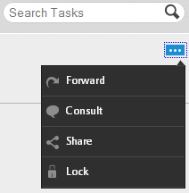

# Trabalhar com listas de tarefas{#working-with-to-do-lists}

Ao visualização de suas listas de tarefas pendentes, você poderá ver tarefas de um processo de negócios atribuído a você, a quaisquer grupos aos quais você pertença ou que sejam tarefas compartilhadas de outros usuários. Você pode abrir, trabalhar e concluir as tarefas conforme necessário, como aprovar ou rejeitar uma solicitação ou adicionar mais informações. Depois que você concluir uma tarefa, ela será enviada para a próxima pessoa no processo comercial,

## Sobre listas a fazer {#about-todo-lists}

A área de trabalho do AEM Forms tem os três tipos de listas a serem feitas:

* listas individuais, que contêm tarefas atribuídas diretamente a você.
* listas de grupo, que contêm tarefas atribuídas a um grupo. Qualquer membro do grupo pode abrir e concluir as tarefas. Para abrir uma tarefa, um membro de um grupo deve reivindicar a tarefa primeiro.
* listas compartilhadas, que contêm tarefas atribuídas a um usuário que compartilhou sua lista de tarefas com você e possivelmente com outros usuários. Qualquer um dos usuários que compartilham uma lista pode reivindicar, abrir e concluir tarefas compartilhadas.

É possível realizar algumas ações sem abrir a tarefa clicando nos ícones que aparecem quando você passa o ponteiro do mouse sobre uma tarefa.

>[!NOTE]
>
>Um ícone de exclamação indica que a tarefa tem prioridade alta.

## tarefas típicas {#typical-tasks}

Ao abrir e trabalhar em uma tarefa, as ferramentas disponíveis dependem da tarefa. tarefas diferentes exigem ações diferentes e, por isso, algumas ferramentas podem ou não estar disponíveis para você. As tarefas típicas que você pode receber são descritas abaixo.

**Fornecer informações**: Você recebe uma tarefa que exige o preenchimento e o envio de um formulário.

**Revisar informações**: Você recebe uma tarefa que requer que você revise as informações e faça logoff no conteúdo.

**Revisão** de vários usuários: Você recebe uma tarefa ao mesmo tempo que outros usuários recebem a tarefa. Você e os outros usuários devem fornecer informações ou revisar o conteúdo, ou ambos. As seguintes ferramentas podem estar disponíveis com esse tipo de tarefa:

* Como visualizar as instruções para a tarefa
* Exibindo o status de conclusão de todos os usuários aos quais a tarefa foi atribuída
* Exibição dos comentários de todos os usuários aos quais a tarefa foi atribuída
* Adicionar comentários à tarefa

As ferramentas adicionais que podem estar disponíveis com qualquer uma das tarefas acima incluem:

* Encaminhar
* Compartilhar
* Consulta
* Retorno
* Notas
* Anexos

## Abrindo tarefas {#opening-tasks}

Você pode abrir e bloquear tarefas de sua lista de Tarefas Pendentes ou solicitação e abrir tarefas de um grupo ou de uma lista de Tarefas Pendentes compartilhada. Quando você abre uma tarefa, ela é exibida no painel principal. As outras tarefas são exibidas na lista da tarefa ao lado da lista de tarefas.

Se existir um URL de resumo de Tarefa, a visualização de resumo de Tarefa será aberta por padrão, em vez do formulário associado a uma tarefa. Mesmo quando um usuário ativa a opção &quot;Abrir o formulário no modo maximizado&quot; em Atribuir Tarefa, o formulário não é aberto no modo maximizado.

>[!NOTE]
>
>Quando uma tarefa é aberta, dependendo dos padrões da tarefa, o formulário associado pode ser exibido em visualização total.

### Abra e trave uma tarefa da lista {#open-and-lock-a-task-from-your-list}

Ao abrir uma tarefa da lista de Tarefas Pendentes, se a lista for compartilhada, você poderá bloquear a tarefa para impedir que outro usuário que tenha acesso à lista trabalhe na tarefa.

1. Na página Tarefas pendentes, no painel esquerdo, selecione sua lista de Tarefas Pendentes individual. Todas as suas tarefas são exibidas no painel do meio.

   >[!NOTE]
   >
   >É possível filtrar as tarefas selecionando o tipo de processo na lista de Tarefas Pendentes. Você pode selecionar sua lista para fazer para visualização de todas as tarefas na lista para fazer novamente.

1. Se necessário, bloqueie a tarefa. Para bloquear uma tarefa, clique no ícone Todas as opções na tarefa e selecione Bloquear. Passe o ponteiro do mouse sobre a tarefa para que a opção esteja disponível.

   >[!NOTE]
   >
   >Você também pode bloquear ou desbloquear uma tarefa em qualquer guia quando a tarefa estiver aberta.

   

   Menu Todas as opções em uma tarefa

1. Abra a tarefa clicando nela.

### Abrir e reivindicar uma tarefa de uma lista compartilhada ou de grupo {#open-and-claim-a-task-from-a-shared-or-group-list}

Quando você abre e reclama uma tarefa de um grupo ou lista compartilhada, a tarefa é movida do grupo ou da lista compartilhada para a lista de ação individual. Outros usuários com acesso à lista não podem trabalhar na tarefa.

1. Na página de Tarefas Pendentes, no painel esquerdo, selecione um grupo ou uma lista de Tarefas Pendentes compartilhada. Todas as tarefas são exibidas no painel do meio.
1. Execute uma destas etapas:

   * Para reivindicar uma tarefa, sem abri-la, a partir de um grupo ou de uma lista compartilhada, clique em **Reivindicação** passando o ponteiro do mouse sobre a tarefa. Como alternativa, quando a tarefa estiver aberta, o botão Reivindicação estará disponível na barra de ação abaixo do painel tarefa. Ao solicitar a solicitação, uma tarefa é movida do grupo ou da lista compartilhada para a sua lista.
   * Para reivindicar e abrir uma tarefa de um grupo ou de uma lista compartilhada para fazer, clique em **Reivindicação e abra**.

## Working with tasks {#working-with-tasks}

Depois de abrir uma tarefa, as guias exibidas no painel principal e as ferramentas disponíveis dependem da tarefa. As guias que podem ser vistas estão descritas abaixo:

**Resumo** da Tarefa: Quando uma tarefa é aberta, o painel Resumo da Tarefa permite que você mostre informações sobre a tarefa, se ela existir, usando um URL especificado no processo na etapa Atribuir Tarefa. Usando o painel Resumo da Tarefa, informações adicionais e relevantes para uma tarefa podem ser exibidas para adicionar mais valor ao usuário final da área de trabalho do AEM Forms. Essa guia não estará disponível se o URL de resumo da Tarefa não existir.

**Detalhes**: Fornece algumas informações sobre a tarefa atual e o processo ao qual ela pertence.

**Formulário**: Exibe o formulário associado à tarefa. O formulário pode ser de vários tipos de arquivo, incluindo PDF, HTML, Guia e arquivo SWF. O formulário pode se parecer com um formulário normal para impressão ou baseado na Web ou guiá-lo por uma série de painéis de estilo assistente para coletar informações.

**Histórico**: Lista as tarefas que fazem parte da instância do processo e o formulário associado, as atribuições de tarefa e os anexos de cada tarefa.

**Anexos**: Exibe anexos existentes associados à tarefa e adiciona anexos, se necessário.

**Notas**: Exibe as notas existentes associadas à tarefa e adiciona notas, se necessário.

Ao trabalhar em uma tarefa, as ferramentas que você pode ver e as ações que você pode executar são descritas abaixo.

### Encaminhar, compartilhar ou consultar uma tarefa {#forward-share-or-consult-on-a-task}

Você pode encaminhar uma tarefa junto com quaisquer observações ou anexos para outro usuário ou compartilhar a tarefa ou consultar a tarefa com outro usuário. Se você alterar os dados do formulário associados a uma tarefa, salve o formulário como rascunho antes de encaminhar, compartilhar ou consultar a tarefa. Caso contrário, a tarefa será enviada sem o formulário atualizado. Depois que você encaminhar e compartilhar uma tarefa, o usuário que receber a tarefa poderá solicitá-la e completá-la ou devolvê-la a você. Se você consultar uma tarefa, o usuário só poderá devolvê-la a você.

1. Se você alterar um formulário associado a uma tarefa que deseja manter, clique em **Salvar**. A opção Salvar está disponível na barra de ação na parte inferior de cada guia. Caso contrário, a tarefa será enviada sem o formulário atualizado.

   >[!NOTE]
   >
   >O botão Salvar não está disponível para alguns formulários, dependendo da tarefa em que você está trabalhando.

1. Em qualquer guia, clique em um destes botões:

   * **Encaminhar**
   * **Compartilhar**
   * **Consulta**
   >[!NOTE]
   >
   >Dependendo da tarefa, também é possível executar essas ações a partir da lista de Tarefas Pendentes sem abrir a tarefa.

1. Na janela de diálogo pop-up, pesquise e selecione o nome do usuário para encaminhar, compartilhar ou consultar a tarefa.

### Retornar uma tarefa {#return-a-task}

1. Em qualquer guia, clique em **Retornar**. A tarefa é retornada à lista de tarefas do usuário que anteriormente encaminhou a tarefa para você, compartilhou ou consultou a tarefa com você.

### Tirar uma tarefa offline {#take-a-task-offline}

Você pode trabalhar em uma tarefa off-line e enviar posteriormente seu formulário do Adobe® Reader® ou Adobe® Acrobat® Professional ou Adobe® Acrobat® Standard. Quando o formulário for enviado, seu cliente de e-mail será iniciado com o endereço de e-mail do servidor apropriado. Em seguida, é possível enviar o formulário preenchido por email para o servidor.

1. Em qualquer guia, clique em **Offline**.
1. Especifique um nome de arquivo para salvar o formulário e clique em **Salvar**. O formulário associado à tarefa é salvo localmente e a tarefa permanece na lista de Tarefas Pendentes até que o formulário seja enviado.

### Trabalhar com anexos {#work-with-attachments}

Você pode ter permissão para adicionar, atualizar, excluir ou salvar quaisquer anexos localmente.

**Adicionar um anexo**

1. Na guia **Anexos** , clique em **Procurar** para selecionar o arquivo a ser anexado.
1. Selecione o nível de **Permissões** para o anexo para outros usuários que participam do processo. Se você selecionar **Ler**, outros usuários poderão salvar o arquivo localmente. Se você selecionar uma das permissões de edição, outros usuários também poderão carregar um novo arquivo para substituir seu anexo.

   >[!NOTE]
   >
   >Você também pode adicionar comentários ao lado de seus anexos.

1. Clique em **Fazer upload**. O arquivo é anexado ao formulário.

**Visualização de um anexo**

1. Na guia **Anexos** , clique no nome de arquivo do anexo à visualização.

**Salvar um anexo localmente**

1. Clique em um anexo para abri-lo. Salve o anexo aberto localmente.

**Atualizar um anexo**

1. Clique em **Editar** para o anexo. Selecione o arquivo para substituir o anexo existente clicando em **Procurar**.

**Excluir um anexo**

1. Clique em **Excluir** para obter um anexo.

### Salve seu trabalho sem concluir a tarefa {#save-your-work-without-completing-the-task}

1. Em qualquer guia, toque em **Salvar**.

   A caixa de diálogo Salvar como rascunho é exibida. O nome padrão do rascunho é o nome da tarefa do modelo de tarefa.

   

   >[!NOTE]
   >
   >Você pode configurar o espaço de trabalho para salvar automaticamente periodicamente as informações inseridas por um usuário como rascunho. Se o salvamento automático estiver ativado e um usuário estiver trabalhando em um rascunho, o rascunho será salvo periodicamente. Em caso de salvamento automático, o nome padrão da tarefa é automaticamente obtido.
   >
   >
   >Para obter mais informações, consulte Salvar rascunho periodicamente em [Gerenciamento de preferências](/help/forms/using/getting-started-livecycle-html-workspace.md).

1. Na caixa de diálogo Salvar como rascunho, especifique um nome exclusivo para a tarefa e toque em **OK**.

   

   O rascunho é salvo com o nome especificado. A tarefa permanece na lista de Tarefas Pendentes e quaisquer alterações feitas no formulário são salvas na pasta Rascunhos. Além disso, em sua lista de tarefas, é possível pesquisar o rascunho usando o nome do rascunho para continuar a trabalhar nele.

   

## Concluindo o tarefa {#completing-tasks}

A forma como você conclui uma tarefa depende da própria tarefa e da sua função no processo. Você pode ser solicitado a aprovar ou negar uma solicitação, fornecer conteúdo, revisar e verificar informações ou indicar que agiu.

Você pode concluir uma tarefa de várias maneiras:

* Uso das ações disponíveis em qualquer uma das guias
* Uso das ações criadas no próprio formulário
* Da sua lista de tarefas pendentes, sem abrir a tarefa

>[!NOTE]
>
>Essa opção estará disponível se `isMustOpenToComplete` o campo não estiver selecionado na `Assign Task` etapa do Workbench, durante a criação de um processo.

* Por email, se você receber notificações por email

Ao concluir uma tarefa, dependendo da tarefa, uma caixa de diálogo de confirmação pode aparecer reafirmando sua ação. Por exemplo, você pode ver uma caixa de diálogo que solicita que você ateste a validade das informações fornecidas.

>[!NOTE]
>
>Se você tiver alterado uma tarefa, mas não estiver pronto para completá-la, poderá salvar seu trabalho como rascunho clicando em Salvar e retornar a ela mais tarde.

### Concluir uma tarefa {#complete-a-task}

1. Execute uma das seguintes etapas:

   * Selecione a tarefa e clique no botão apropriado para a próxima etapa necessária no processo, na parte inferior da lista.
   * Se o formulário não tiver botões e o botão Concluir na área de trabalho do AEM Forms estiver disponível, clique em **Concluir**.
   * Se o formulário tiver botões e o botão Concluir na área de trabalho do AEM Forms não estiver disponível, clique no botão apropriado no formulário para a próxima etapa necessária no processo.
   Se o formulário não tiver botões e o botão Concluir na área de trabalho do AEM Forms não estiver disponível, uma mensagem será exibida, indicando que o formulário não pode ser enviado.

1. Se uma caixa de diálogo Confirmação for exibida, execute uma destas ações:

   * Clique em **OK** se tiver concluído a tarefa e estiver pronto para fazer logoff nela.
   * Clique em **Cancelar** se desejar retornar à tarefa e não estiver pronto para fazer logoff nela.

>[!NOTE]
>
>É possível ver um botão Enviar dentro de formulários HTML quando Propriedades do processo são usadas em um formulário. Esse botão não fica visível quando o mesmo formulário é renderizado como PDF. Para concluir uma tarefa, clique no botão Enviar, disponível na parte inferior da área de trabalho do AEM Forms, fora do formulário e não no botão Enviar, dentro do formulário.

### tarefas de aprovação em massa {#bulk-approve-tasks}

Você pode enviar várias tarefas da sua lista de Tarefas. Somente tarefas do mesmo processo, com os mesmos nomes de tarefa e as mesmas opções de rota podem ser enviadas juntas.

>[!NOTE]
>
>Essa opção estará disponível se o campo isMustOpenToComplete não estiver selecionado na etapa Atribuir Tarefa no Workbench, durante a criação de um processo.

1. Na página Tarefas pendentes, no painel esquerdo, selecione sua lista de Tarefas Pendentes individual. Todas as suas tarefas são exibidas no painel do meio.
1. Selecione **Ativar modo** em massa. As caixas de seleção são exibidas na frente das tarefas na lista.

   >[!NOTE]
   >
   >Essa opção não está disponível para tarefas para as quais o campo IsMustOpenToComplete está selecionado na etapa Atribuir Tarefa no Workbench, durante a criação de um processo. As caixas de seleção dessas tarefas na lista TO-DO permanecerão sempre desativadas.

1. Selecione tarefas para aprovação em massa. Várias tarefas do mesmo processo, com os mesmos nomes de tarefa e as mesmas opções de rota podem ser selecionadas. Depois de selecionar uma tarefa para aprovação, somente as tarefas com o mesmo processo, com os mesmos nomes de tarefa e as mesmas opções de rota permanecem ativadas. O restante está desativado.

   

1. Clique na opção Enviar disponível. As tarefas selecionadas são enviadas.

   

## Participação no tarefa por email {#participating-in-tasks-through-email}

Você pode receber e concluir tarefas por email. A participação em tarefas por e-mails elimina a necessidade de verificar regularmente sua lista de tarefas para fazer em busca de novas tarefas ou verificar o status de uma tarefa na página de rastreamento.

Primeiro, defina suas preferências de espaço de trabalho do AEM Forms para receber notificações por email. A área de trabalho do AEM Forms pode enviar notificações por e-mail para tarefas em sua lista de Tarefas Pendentes ou em qualquer lista de Tarefas Pendentes do grupo ao qual você pertence. O administrador determina quando as mensagens de notificação por email são enviadas e quem as recebe.

As mensagens de email podem conter um link que abre a tarefa na área de trabalho do AEM Forms, um anexo do formulário usado para a tarefa ou ações para completar a tarefa por email. Se um formulário for incluído na mensagem de email, você poderá abrir o formulário e preencher a tarefa se os botões para preencher a tarefa forem criados no formulário. Se as ações para completar a tarefa forem incluídas na mensagem de e-mail, você poderá concluir a tarefa clicando nas ações no e-mail ou respondendo ao e-mail com a ação digitada como a primeira linha no corpo do e-mail.

>[!NOTE]
>
>Para configurar o espaço de trabalho para usar os modelos de e-mail apropriados, consulte o Guia do administrador do AEM Forms JEE.

Quando você conclui uma tarefa por email, a tarefa é removida da lista de tarefas na área de trabalho do AEM Forms.

>[!NOTE]
>
>Se o usuário não estiver conectado à área de trabalho do AEM Forms no navegador e abrir um link para uma tarefa A fazer, o link direto Para fazer não será aberto e exibirá uma exceção. Faça logon na área de trabalho do AEM Forms antes de clicar nos links nos e-mails.

>[!NOTE]
>
>Não é possível encaminhar uma notificação por email para atribuir uma tarefa a outra pessoa. Você só pode encaminhar tarefas para outros usuários a partir da área de trabalho do AEM Forms.

### Receber mensagens de notificação por e-mail {#receive-email-notification-messages}

1. Clique em **Preferências**.
1. Em **Notificar Eventos de Tarefa por lista de email** , selecione **Sim**.
1. Para incluir o formulário e os dados com a mensagem de email, em **Anexar formulários na lista de email** , selecione **Sim**.

## Participação no tarefa através de dispositivos móveis {#participating-in-tasks-through-mobile-devices}

Você pode usar o aplicativo de área de trabalho do AEM Forms para participar do tarefa a partir de seu dispositivo móvel. Antes de instalar o aplicativo, verifique com o administrador do sistema se a sua organização oferece suporte ao uso do aplicativo da área de trabalho do AEM Forms.

## Sobre prazos e lembretes {#about-deadlines-and-reminders}

Um *prazo* determina a data e a hora em que você deve concluir uma tarefa. Quando um prazo expira, o servidor encaminha a tarefa para a próxima etapa do processo (que pode ser a lista de tarefas de outro usuário) e, em seguida, o ícone de prazo aparece na tarefa. O ícone de prazo aparece independentemente das regras associadas ao processo.

Um *lembrete* notifica você sobre uma tarefa que requer sua atenção. Os lembretes ocorrem em um horário predeterminado e em intervalos regulares até que você conclua a tarefa associada. Quando você recebe um lembrete, o ícone do lembrete aparece na tarefa.

O processo de negócios determina o comportamento e o momento dos prazos e lembretes. Nem todos os processos têm prazos e lembretes. O administrador especifica se notificações por email são enviadas para prazos e lembretes. Você pode definir suas preferências para receber ou não notificações por email.

## Trabalhar com tarefas de filas de grupo e compartilhadas {#working-with-tasks-from-group-and-shared-queues}

Todas as tarefas atribuídas a você aparecem na lista de tarefas (fila).

Quaisquer listas de grupo e de ações a fazer compartilhadas às quais você tenha acesso também serão exibidas no painel esquerdo da página de Tarefas. Você pode concluir tarefas de qualquer lista de tarefas que tenha acesso.

Uma lista de tarefa pode ter mais de um membro. Um administrador configura listas de tarefas do grupo com base nos requisitos específicos de sua organização. As listas de tarefas em grupo fornecem uma maneira de distribuir trabalho entre várias pessoas que compartilham responsabilidades semelhantes.

Por exemplo, cada membro da equipe processa formulários de solicitação de empréstimo. Todas essas tarefas são enviadas para uma lista de tarefas do grupo a que cada membro do seu grupo tem acesso. Cada membro do seu grupo pode acessar as tarefas dessa lista de tarefas.

Uma lista compartilhada de tarefas é exibida quando outro usuário compartilha sua lista de tarefas com você ou compartilha explicitamente uma tarefa com você. Em seguida, você pode visualização as tarefas na lista de Tarefas Pendentes desse usuário e completá-las em nome do usuário. Por exemplo, se você estiver tirando férias, pode optar por compartilhar sua lista de Tarefas com um colega que conclui suas tarefas enquanto estiver fora.

>[!NOTE]
>
>Você também pode especificar configurações fora do escritório para encaminhar tarefas para outros usuários enquanto estiver fora do escritório.

Para trabalhar em uma tarefa de um grupo ou de uma lista compartilhada para fazer, solicite a tarefa primeiro. Você se torna o proprietário da tarefa até completá-la ou encaminhá-la para outro usuário.

### Compartilhando filas {#sharing-queues}

Você pode compartilhar sua lista de tarefas com outro usuário, que pode então visualização as novas tarefas em sua lista de tarefas e agir sobre elas para você. Se houver tarefas na sua lista de Tarefas Pendentes antes de você compartilhar sua lista de Tarefas Pendentes, o outro usuário não poderá visualização-las. O usuário pode visualização e reivindicar apenas as tarefas que chegam à sua lista de Tarefas após conceder acesso à sua lista de Tarefas Pendentes.

Lembre-se de que para que um usuário veja uma tarefa em uma fila compartilhada, o designer do processo deve ativar a opção Adicionar ACL para fila compartilhada na guia Lista de Controle de acesso de Tarefa (ACL) do Serviço de usuário.

>[!NOTE]
>
>Se você planeja estar fora do escritório, também pode especificar configurações fora do escritório para encaminhar tarefas para outros usuários enquanto estiver fora, em vez de compartilhar toda a lista para fazer.

**Compartilhar sua fila**

1. Na guia **Filas** na guia **Preferências** , clique no ícone &#39;+&#39; para &#39;Usuários que estão compartilhando minha fila no momento&#39;.
1. Pesquise e selecione o nome do usuário.
1. Clique no botão **Compartilhar** para compartilhar sua Fila com o usuário selecionado.
1. Selecione o nome do usuário e clique em **Compartilhar**.

   >[!NOTE]
   >
   >Você pode remover um usuário de compartilhar sua lista de Tarefas Pendentes clicando no ícone **X** no final da linha na qual o usuário está listado.

### Acessar outras filas {#accessing-other-queues}

Você pode solicitar acesso à lista de tarefas de outro usuário para a visualização e solicitar novas tarefas na lista de tarefas do usuário.

Quando você solicita acesso à lista de tarefas de outro usuário, o usuário recebe uma tarefa em sua lista de tarefas para aprovar ou negar sua solicitação. Depois que o usuário concluir a tarefa, você receberá uma notificação em sua lista de tarefas.

Se você receber acesso à lista de tarefas de outro usuário, não será possível visualização de tarefas que existiam na lista de tarefas do usuário antes de receber acesso. Você pode visualização somente as tarefas que chegam na lista de Tarefas Pendentes do usuário depois de ter acesso à lista de Tarefas Pendentes.

**Acessar outra fila**

1. Na guia **Preferências** , abra a guia **Filas** .
1. Clique em &#39;+&#39; para as &#39;filas de usuário às quais tenho acesso&#39;. Procure o nome do usuário na caixa de diálogo pop-up.
1. Selecione o nome do usuário e clique em **Solicitar**.

   >[!NOTE]
   >
   >Você pode remover seu acesso a outra lista de Tarefas Pendentes selecionando o nome de usuário nas Filas de usuários que eu tenho acesso à lista e clicando em **X** no final da linha que menciona o nome do usuário. Não é possível remover seu acesso a outra lista de tarefas quando a solicitação para acessar a lista de tarefas ainda está pendente.

## Definição de preferências externas {#setting-out-of-office-preferences}

Se você planeja estar fora do escritório, você pode especificar o que acontece com as tarefas que lhe são atribuídas para esse período.

Você tem a opção de especificar uma data e hora de start e uma data e hora de término para que suas configurações de fora do escritório entrem em vigor. Se você estiver localizado em um fuso horário diferente do servidor, o fuso horário usado será o do servidor.

Você pode definir uma pessoa padrão para a qual todas as tarefas são enviadas. Você também pode especificar exceções para tarefas de processos específicos a serem enviadas a um usuário diferente ou para permanecer na lista de Tarefas Pendentes até retornar. Se a pessoa designada também estiver fora do escritório, a tarefa vai para o usuário que ela designou. Se a tarefa não puder ser atribuída a um usuário que não esteja fora do escritório, ela permanecerá na lista de tarefas.

>[!NOTE]
>
>Quando você estiver fora do escritório, todas as tarefas que estavam anteriormente em sua lista de tarefas permanecerão lá e não serão encaminhadas para outros usuários.

### Definir preferências fora do escritório {#set-out-of-office-preferences}

1. Clique em **Preferências** e em **Fora do escritório**.
1. Para especificar quando você está fora do escritório, execute uma destas etapas:

   * Para especificar que você está fora do escritório agora por um período de tempo indefinido, na caixa **Eu estou** lista, selecione **Fora do escritório** , mas não adicione um intervalo de datas.
   * Para especificar uma data e hora de start fora do escritório e clique em &#39;+&#39; para Agendamento **** Fora do Escritório. Use o calendário e a lista de hora para especificar a data e a hora do start. Se você não especificar uma data e hora de término, você será considerado fora do escritório indefinidamente a partir da data e hora do start até que suas preferências sejam alteradas.

1. Para especificar como suas tarefas devem ser tratadas por padrão, selecione uma destas opções na opção **Quando estiver fora do escritório: Usuário padrão para lista de tarefas** não Office:

   * Selecione **Não atribuir** para manter tarefas na lista de Tarefas Pendentes até que você retorne.
   * Selecione **Localizar usuário** para procurar um usuário ao qual atribuir suas tarefas. Ao selecionar um usuário, você também pode visualização seu horário de encerramento.

1. Para definir exceções como padrão, clique em + para Exceções **de** Processo, selecione o processo para o qual deseja criar uma exceção e selecione um usuário diferente ou **Não atribua** do **está atribuído** à lista.

   >[!NOTE]
   >
   >O projetista do processo pode especificar que as tarefas de alguns processos são sempre mantidas privadas e não encaminhadas para outros usuários. Esta configuração substitui todas as configurações feitas.

1. Quando terminar de definir as preferências, clique em **Salvar**. Se as configurações indicarem que você está fora do escritório, as alterações entrarão em vigor imediatamente. Caso contrário, entrarão em vigor na data e hora do start especificadas. Se você fizer logon enquanto estiver fora do escritório, não será considerado no escritório até que você altere suas configurações.
