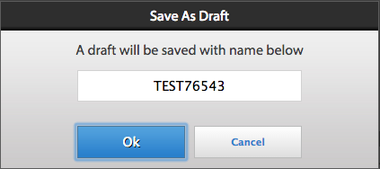

# Trabalhar com listas de tarefas{#working-with-to-do-lists}

Ao exibir suas listas de tarefas pendentes, você pode ver tarefas de um processo de negócios atribuídas a você, a qualquer grupo ao qual você pertença ou que sejam tarefas compartilhadas de outros usuários. É possível abrir, trabalhar e concluir as tarefas conforme necessário, como aprovar ou rejeitar uma solicitação ou adicionar mais informações. Após concluir uma tarefa, ela será enviada para a próxima pessoa no processo de negócios,

## Sobre as listas de tarefas {#about-todo-lists}

O espaço de trabalho do AEM Forms tem três tipos de listas de tarefas a seguir:

* Listas individuais, que contêm tarefas atribuídas diretamente a você.
* Listas de grupos, que contêm tarefas atribuídas a um grupo. Qualquer membro do grupo pode abrir e concluir as tarefas. Para abrir uma tarefa, um membro de um grupo deve reivindicar a tarefa primeiro.
* Listas compartilhadas, que contêm tarefas atribuídas a um usuário que compartilhou sua lista de tarefas com você e possivelmente outros usuários. Qualquer um dos usuários que compartilham uma lista pode reivindicar, abrir e concluir tarefas compartilhadas.

Você pode executar algumas ações sem abrir a tarefa clicando nos ícones que aparecem quando você passa o mouse sobre uma tarefa.

>[!NOTE]
>
>Um ícone de exclamação indica que a tarefa é de alta prioridade.

## Tarefas típicas {#typical-tasks}

Ao abrir e trabalhar em uma tarefa, as ferramentas que estão disponíveis para você dependem da tarefa. Tarefas diferentes exigem que você execute ações diferentes e, por esse motivo, algumas ferramentas podem ou não estar disponíveis para você. As tarefas típicas que você pode receber estão descritas abaixo.

* **Fornecer informações**: Você recebe uma tarefa que requer o preenchimento e o envio de um formulário.

* **Revisar informações**: Você receberá uma tarefa que requer que você revise as informações e faça logoff no conteúdo.

* **Análise multiusuário**: Você recebe uma tarefa ao mesmo tempo em que outros usuários a recebem. Você e os outros usuários devem fornecer informações ou revisar o conteúdo, ou ambos. As seguintes ferramentas podem estar disponíveis com este tipo de tarefa:

   * Exibir as instruções da tarefa
   * Visualização do status de conclusão de todos os usuários atribuídos à tarefa
   * Exibir os comentários de todos os usuários atribuídos à tarefa
   * Adicionar comentários à tarefa

As ferramentas adicionais que podem estar disponíveis com qualquer uma das tarefas acima incluem:

* Encaminhar
* Compartilhar
* Consultar
* Retornar
* Notas
* Anexos

## Abrir tarefas {#opening-tasks}

Você pode abrir e bloquear tarefas da sua lista de tarefas ou reivindicar e abrir tarefas de um grupo ou lista de tarefas compartilhadas. Quando você abre uma tarefa, ela é exibida no painel principal. As outras tarefas são exibidas na lista de tarefas ao lado da Lista de tarefas.

Se existir um URL de Resumo da Tarefa, o modo de exibição Resumo da Tarefa será aberto por padrão, em vez do formulário associado a uma tarefa. Mesmo quando um usuário ativa a opção ‘Abrir o formulário no modo maximizado&#39; em Atribuir tarefa, o formulário não abre no modo maximizado.

>[!NOTE]
>
>Ao abrir uma tarefa, dependendo dos padrões da tarefa, o formulário associado pode ser exibido na exibição completa.

### Abrir e bloquear uma tarefa da sua lista {#open-and-lock-a-task-from-your-list}

Ao abrir uma tarefa da sua lista de tarefas pendentes, se a lista estiver compartilhada, você poderá bloquear a tarefa para impedir que outro usuário com acesso à lista trabalhe nela.

1. Na página Por- fazer, no painel esquerdo, selecione a sua lista de itens por- fazer individual. Todas as tarefas são exibidas no painel do meio.

   >[!NOTE]
   >
   >Você pode filtrar as tarefas selecionando o tipo de processo na Lista de tarefas pendentes. Você pode selecionar sua lista de tarefas para exibir todas as tarefas na lista de tarefas novamente.

1. Se necessário, bloqueie sua tarefa. Para bloquear uma tarefa, clique no ícone Todas as opções na tarefa e selecione Bloquear. Passe o mouse sobre a tarefa para que a opção fique disponível.

   >[!NOTE]
   >
   >Você também pode bloquear ou desbloquear uma tarefa em qualquer guia quando a tarefa estiver aberta.

   

   Menu Todas as opções em uma tarefa

1. Abra a tarefa clicando nela.

### Abrir e reivindicar uma tarefa de uma lista compartilhada ou de grupo {#open-and-claim-a-task-from-a-shared-or-group-list}

Quando você abre e reivindica uma tarefa de um grupo ou lista compartilhada, a tarefa é movida do grupo ou lista compartilhada para sua lista de tarefas individual. Outros usuários com acesso à lista são impedidos de trabalhar na tarefa.

1. Na página Tarefas, no painel esquerdo, selecione um grupo ou lista de tarefas compartilhada. Todas as tarefas são exibidas no painel do meio.
1. Execute uma destas etapas:

   * Para reivindicar uma tarefa, sem abri-la, de um grupo ou lista de tarefas compartilhada, clique em  **Reclamação** passando o ponteiro sobre a tarefa. Como alternativa, quando a tarefa for aberta, o botão Reclamação estará disponível na barra de ações abaixo do painel de tarefas. Na solicitação, uma tarefa é movida da lista de tarefas pendentes compartilhadas ou do grupo para a sua lista.
   * Para reivindicar e abrir uma tarefa de um grupo ou lista de tarefas compartilhada, clique em **Reclamação e abertura**.

## Trabalhar com tarefas {#working-with-tasks}

Depois de abrir uma tarefa, as guias exibidas no painel principal e as ferramentas disponíveis para você dependem da tarefa. As guias que você pode ver estão descritas abaixo:

* **Resumo da tarefa**: quando uma tarefa é aberta, o painel Resumo da tarefa permite mostrar informações sobre a tarefa, se existir, usando um URL especificado no processo na etapa Atribuir tarefa. Usando o Painel de resumo de tarefas, informações adicionais e relevantes para uma tarefa podem ser exibidas para adicionar mais valor ao usuário final do espaço de trabalho do AEM Forms. Essa guia não estará disponível se o URL de Resumo da Tarefa não existir.

* **Detalhes**: fornece algumas informações sobre a tarefa e o processo atuais aos quais ela pertence.

* **Formulário**: exibe o formulário associado à tarefa. O formulário pode ser de vários tipos de arquivos, incluindo PDF, HTML, Guia e SWF. O formulário pode ter a aparência de um formulário comum imprimível ou baseado na Web, ou orientá-lo por uma série de painéis no estilo de assistente para coletar informações.

* **Histórico**: lista as tarefas que fazem parte da instância do processo e o formulário associado, as atribuições de tarefas e os anexos de cada tarefa.

* **Anexos**: exibe anexos existentes que estão associados à tarefa e adiciona anexos, se necessário.

* **Notas**: exibe as notas existentes associadas à tarefa e adiciona notas, se necessário.

Ao trabalhar em uma tarefa, as ferramentas que você pode ver e as ações que você pode realizar estão descritas abaixo.

### Encaminhar, compartilhar ou consultar uma tarefa {#forward-share-or-consult-on-a-task}

Você pode encaminhar uma tarefa juntamente com quaisquer notas ou anexos para outro usuário ou compartilhar a tarefa ou consultá-la com outro usuário. Se você alterar os dados de formulário associados a uma tarefa, salve o formulário como rascunho antes de encaminhar, compartilhar ou consultar a tarefa. Caso contrário, a tarefa será enviada sem o formulário atualizado. Depois que você encaminhar e compartilhar uma tarefa, o usuário que a receber poderá reivindicá-la e concluí-la ou devolvê-la a você. Se você consultar uma tarefa, o usuário só poderá retorná-la para você.

1. Se você alterar um formulário associado a uma tarefa que deseja manter, clique em **Salvar**. A opção Salvar está disponível na barra de ação na parte inferior de cada guia. Caso contrário, a tarefa será enviada sem o formulário atualizado.

   >[!NOTE]
   >
   >O botão Salvar não está disponível para alguns formulários, dependendo da tarefa em que você está trabalhando.

1. Em qualquer guia, clique em um destes botões:

   * **Encaminhar**
   * **Compartilhar**
   * **Consultar**

   >[!NOTE]
   >
   >Dependendo da tarefa, você também poderá executar essas ações a partir da lista de tarefas pendentes sem abrir a tarefa.

1. Na janela pop-up, pesquise e selecione o nome do usuário para encaminhar, compartilhar ou consultar a tarefa.

### Retornar uma tarefa {#return-a-task}

1. Em qualquer guia, clique em **Retornar**. A tarefa é retornada à lista de tarefas do usuário que a encaminhou anteriormente para você ou compartilhou ou consultou a tarefa com você.

### Colocar uma tarefa offline {#take-a-task-offline}

Você pode ter permissão para trabalhar em uma tarefa off-line e depois enviar o formulário do Adobe® Reader® ou Adobe® Acrobat® Professional ou Adobe® Acrobat® Standard. Quando o formulário for enviado, seu cliente de email será iniciado com o endereço de email do servidor apropriado. Em seguida, você pode enviar o formulário preenchido por email para o servidor.

1. Em qualquer guia, clique em **Offline**.
1. Especifique um nome de arquivo para salvar o formulário e clique em **Salvar**. O formulário associado à tarefa é salvo localmente e a tarefa permanece na lista de tarefas até que o formulário seja enviado.

### Trabalhar com anexos {#work-with-attachments}

Você pode ter permissão para adicionar, atualizar, excluir ou salvar quaisquer anexos localmente.

**Adicionar um anexo**

1. No **Anexos** clique em **Procurar** para selecionar o arquivo a ser anexado.
1. Selecione o **Permissões** nível do anexo para outros usuários que participam do processo. Se você selecionar **Ler**, outros usuários poderão salvar o arquivo localmente. Se você selecionar uma das permissões de edição, outros usuários também poderão fazer upload de um novo arquivo para substituir seu anexo.

   >[!NOTE]
   >
   >Você também pode adicionar comentários juntamente com seus anexos.

1. Clique em **Carregar**. O arquivo é anexado ao formulário.

**Exibir um anexo**

1. No **Anexos** clique no nome do arquivo do anexo a ser exibido.

**Salvar um anexo localmente**

1. Clique em um anexo para abri-lo. Salve o anexo aberto localmente.

**Atualizar um anexo**

1. Clique em **Editar** para o anexo. Selecione o arquivo para substituir o anexo existente, clicando em **Procurar**.

**Excluir um anexo**

1. Clique em **Excluir** para um anexo.

### Salve seu trabalho sem concluir a tarefa {#save-your-work-without-completing-the-task}

1. Em qualquer guia, selecione **Salvar**.

   A caixa de diálogo Salvar como rascunho será exibida. O nome padrão do rascunho é o nome da tarefa do modelo de tarefa.

   

   >[!NOTE]
   >
   >Você pode configurar o espaço de trabalho para salvar automaticamente periodicamente as informações inseridas por um usuário como rascunho. Se o salvamento automático estiver ativado e um usuário estiver trabalhando em um rascunho, ele será salvo periodicamente. Se houver salvamento automático, o nome padrão da tarefa será usado automaticamente.
   >
   >
   >Para obter mais informações, consulte Salvar rascunho periodicamente em [Gerenciamento de preferências](/help/forms/using/getting-started-livecycle-html-workspace.md).

1. No diálogo Salvar como rascunho, especifique um nome exclusivo para a tarefa e selecione **OK**.

   

   O rascunho é salvo com o nome especificado. A tarefa permanece na lista de tarefas e todas as alterações feitas no formulário são salvas na pasta Rascunhos. Além disso, na lista de tarefas, você pode pesquisar o rascunho usando o nome do rascunho para continuar trabalhando nele.

   

## Concluir tarefas {#completing-tasks}

A forma como você conclui uma tarefa depende da própria tarefa e da sua função no processo. Você pode ser solicitado a aprovar ou negar uma solicitação, fornecer conteúdo, revisar e verificar informações ou indicar que você agiu.

É possível concluir uma tarefa de várias maneiras:

* Usar as ações disponíveis em qualquer uma das guias
* Usar as ações criadas no próprio formulário
* Da sua lista de tarefas pendentes, sem abrir a tarefa

>[!NOTE]
>
>Essa opção estará disponível se `isMustOpenToComplete` o campo não está selecionado na variável `Assign Task` etapa no Workbench, ao projetar um processo.

* Por email, se você receber notificações por email

Quando você conclui uma tarefa, dependendo da tarefa, uma caixa de diálogo de confirmação pode aparecer reafirmando sua ação. Por exemplo, você pode ver uma caixa de diálogo que solicita que você ateste a validade das informações fornecidas.

>[!NOTE]
>
>Se você tiver alterado uma tarefa, mas não estiver pronto para concluí-la, poderá salvar seu trabalho como rascunho clicando em Salvar e retornar a ela posteriormente.

### Concluir uma tarefa {#complete-a-task}

1. Execute uma das seguintes etapas:

   * Selecione a tarefa e clique no botão apropriado para a próxima etapa necessária no processo na parte inferior da lista.
   * Se o formulário não tiver botões e o botão Concluído no espaço de trabalho do AEM Forms estiver disponível, clique em **Concluído**.
   * Se o formulário tiver botões e o botão Concluído no espaço de trabalho do AEM Forms não estiver disponível, clique no botão apropriado no formulário para a próxima etapa necessária no processo.

   Se o formulário não tiver botões e o botão Concluído no espaço de trabalho do AEM Forms não estiver disponível, uma mensagem será exibida indicando que o formulário não pode ser enviado.

1. Se uma caixa de diálogo de Confirmação for exibida, execute uma destas ações:

   * Clique em **OK** se você concluiu a tarefa e está pronto para aprová-la.
   * Clique em **Cancelar** se quiser voltar à tarefa e não estiver pronto para aprová-la.

>[!NOTE]
>
>Você pode ver um botão Enviar dentro de formulários HTML quando as Propriedades do processo forem usadas em um formulário. Esse botão não é visível quando o mesmo formulário é renderizado como PDF. Para concluir uma tarefa, clique no botão Submit disponível na parte inferior do espaço de trabalho do AEM Forms, fora do formulário e não no botão Submit dentro do formulário.

### Aprovar tarefas em massa {#bulk-approve-tasks}

Você pode enviar várias tarefas a partir da sua lista de Tarefas Pendentes. Somente tarefas do mesmo processo, com os mesmos nomes de tarefa e as mesmas opções de rota podem ser enviadas juntas.

>[!NOTE]
>
>Essa opção estará disponível se o campo isMustOpenToComplete não estiver selecionado na etapa Atribuir tarefa no Workbench durante a criação de um processo.

1. Na página Por- fazer, no painel esquerdo, selecione a sua lista de itens por- fazer individual. Todas as tarefas são exibidas no painel do meio.
1. Selecionar **Ativar modo em massa**. As caixas de seleção aparecem na frente das tarefas na lista.

   >[!NOTE]
   >
   >Essa opção não está disponível para tarefas para as quais o campo isMustOpenToComplete esteja selecionado na etapa Atribuir tarefa no Workbench, ao projetar um processo. As caixas de seleção dessas tarefas na lista de tarefas pendentes permanecem sempre desativadas.

1. Selecione tarefas para aprovação em massa. É possível selecionar várias tarefas do mesmo processo, com os mesmos nomes de tarefa e as mesmas opções de roteiro. Depois de selecionar uma tarefa para aprovação, somente as tarefas com o mesmo processo, com os mesmos nomes de tarefa e as mesmas opções de roteiro permanecerão ativadas. O restante está desativado.

   

1. Clique na opção Enviar disponível. As tarefas selecionadas são enviadas.

   

## Participar de tarefas por email {#participating-in-tasks-through-email}

Você pode receber e concluir tarefas por email. Participar de tarefas por meio de emails elimina a necessidade de verificar rotineiramente se há novas tarefas em sua lista de tarefas ou verificar o status de uma tarefa na página Rastreamento.

Primeiro, defina as preferências do espaço de trabalho do AEM Forms para receber notificações por email. O espaço de trabalho do AEM Forms pode enviar notificações por email sobre tarefas em sua lista de tarefas ou em qualquer lista de tarefas de grupos à qual você pertença. O administrador determina quando as mensagens de notificação por email são enviadas e quem as recebe.

As mensagens de email podem conter um link que abre a tarefa no espaço de trabalho do AEM Forms, um anexo do formulário usado para a tarefa ou ações para concluir a tarefa por meio de email. Se um formulário for incluído na mensagem de email, você poderá abrir o formulário e concluir a tarefa se os botões para concluí-la forem criados no formulário. Se ações para concluir a tarefa forem incluídas na mensagem de email, você poderá concluir a tarefa clicando nas ações no email ou respondendo ao email com a ação digitada como a primeira linha no corpo do email.

>[!NOTE]
>
>* Para configurar o espaço de trabalho para usar os modelos de e-mail apropriados, consulte a [Guia do administrador do AEM Forms JEE](https://help.adobe.com/en_US/AEMForms/6.1/AdminHelp/).
>
>* Se os rascunhos forem encaminhados após o envio da tarefa no espaço de trabalho do AEM Forms, as notificações por email serão enviadas. Se os rascunhos forem encaminhados do ponto de partida do espaço de trabalho do AEM Forms, nenhuma notificação será enviada por email.

Quando você conclui uma tarefa por email, ela é removida da lista de tarefas pendentes no espaço de trabalho do AEM Forms.

>[!NOTE]
>
>Se o usuário não estiver conectado ao espaço de trabalho do AEM Forms no navegador e abrir um link para uma tarefa pendente, o link direto para tarefa falhará ao ser aberto e exibirá uma exceção. Faça logon no espaço de trabalho do AEM Forms antes de clicar nos links dos emails.

>[!NOTE]
>
>Você não pode encaminhar uma notificação por e-mail para atribuir uma tarefa a outra pessoa. Você só pode encaminhar tarefas para outros usuários a partir do espaço de trabalho do AEM Forms.

### Receber mensagens de notificação por email {#receive-email-notification-messages}

1. Clique em **Preferências**.
1. No **Notificar eventos de tarefa por e-mail** selecione **Sim**.
1. Para incluir o formulário e os dados na mensagem de email, na variável **Anexar o Forms no email** selecione **Sim**.

## Participar de tarefas por meio de dispositivos móveis {#participating-in-tasks-through-mobile-devices}

Você pode usar o aplicativo AEM Forms workspace para participar de tarefas de seu dispositivo móvel. Antes de instalar o aplicativo, verifique com o administrador de sistemas se sua organização oferece suporte ao uso do aplicativo do espaço de trabalho do AEM Forms.

## Sobre prazos e lembretes {#about-deadlines-and-reminders}

A *prazo* determina a data e a hora em que você deve concluir uma tarefa. Quando um prazo passa, o servidor direciona a tarefa para a próxima etapa do processo (que pode ser a lista de tarefas de outro usuário) e, em seguida, o ícone de prazo aparece na tarefa. O ícone de prazo é exibido independentemente das regras associadas ao processo.

A *lembrete* O notifica sobre uma tarefa que requer sua atenção. Os lembretes ocorrem em um horário predeterminado e em intervalos regulares até que você conclua a tarefa associada. Quando você recebe um lembrete, o ícone de lembrete é exibido na tarefa.

O processo de negócios determina o comportamento e o momento dos prazos e lembretes. Nem todos os processos têm prazos e lembretes. O administrador especifica se as notificações por email são enviadas para prazos e lembretes. Você pode definir suas preferências para receber ou não notificações por email.

## Trabalhar com tarefas de filas de grupo e compartilhadas {#working-with-tasks-from-group-and-shared-queues}

Todas as tarefas atribuídas a você aparecerão em sua Lista de tarefas pendentes (fila).

Todos os grupos e listas de tarefas compartilhadas aos quais você tem acesso também aparecerão no painel esquerdo da página Tarefas. Você pode concluir tarefas de qualquer lista de tarefas a que tenha acesso.

Uma lista de tarefas do grupo pode ter mais de um membro. Um administrador configura listas de tarefas do grupo com base nos requisitos específicos de sua organização. As listas de itens por- fazer em grupo oferecem uma forma de distribuir o trabalho entre várias pessoas que partilham responsabilidades semelhantes.

Por exemplo, cada membro da sua equipe processa formulários de pedido de empréstimo. Todas essas tarefas são enviadas para uma lista de tarefas pendentes do grupo à qual todos os membros do seu grupo têm acesso. Cada membro do seu grupo pode acessar as tarefas dessa lista de tarefas.

Uma lista de tarefas compartilhada é exibida quando outro usuário compartilha sua lista de tarefas com você ou compartilha explicitamente uma tarefa com você. Você pode exibir as tarefas na lista de tarefas pendentes desse usuário e concluí-las em nome dele. Por exemplo, se você estiver tirando férias, poderá optar por compartilhar sua lista de tarefas pendentes com um colega de trabalho que conclua suas tarefas enquanto estiver fora.

>[!NOTE]
>
>Você também pode especificar configurações de ausência temporária para encaminhar tarefas a outros usuários enquanto estiver ausente.

Para trabalhar em uma tarefa a partir de um grupo ou lista de tarefas compartilhadas, reclame a tarefa primeiro. Em seguida, você se torna o proprietário da tarefa até concluí-la ou encaminhá-la para outro usuário.

### Compartilhamento de filas {#sharing-queues}

Você pode compartilhar sua lista de tarefas com outro usuário, que pode então visualizar as novas tarefas em sua lista de tarefas e agir sobre elas para você. Se existir alguma tarefa em sua Lista de tarefas antes de você compartilhá-la, o outro usuário não poderá visualizá-la. O usuário pode exibir e reivindicar somente as tarefas que chegam em sua lista de tarefas pendentes depois que você conceder acesso à sua lista de tarefas.

Lembre-se de que, para que um usuário veja uma tarefa em uma fila compartilhada, o designer de processo deve ativar a opção Adicionar ACL para Fila compartilhada na guia Lista de controle de acesso (ACL) da tarefa do Serviço do usuário.

>[!NOTE]
>
>Se você planeja ficar ausente do escritório, também poderá especificar as configurações de ausência temporária para encaminhar tarefas a outros usuários enquanto estiver ausente, em vez de compartilhar toda a lista de tarefas pendentes.

**Compartilhar sua fila**

1. No **Filas** na guia **Preferências** clique no ícone &quot;+&quot; para &quot;Usuários compartilhando minha fila no momento&quot;.
1. Pesquise e selecione o nome do usuário.
1. Clique em **Compartilhar** para compartilhar sua fila com o usuário selecionado.
1. Selecione o nome do usuário e clique em **Compartilhar**.

   >[!NOTE]
   >
   >Você pode remover um usuário do compartilhamento da sua lista de tarefas clicando em **X** ícone no final da linha na qual o usuário está listado.

### Acesso a outras filas {#accessing-other-queues}

Você pode solicitar acesso à lista de tarefas pendentes de outro usuário para visualizar e reivindicar qualquer nova tarefa na lista de tarefas pendentes do usuário.

Quando você solicita acesso à lista de tarefas de outro usuário, ele recebe uma tarefa em sua lista de tarefas para aprovar ou negar sua solicitação. Depois que o usuário concluir a tarefa, você receberá uma notificação na lista de tarefas pendentes.

Se você tiver acesso à lista de tarefas pendentes de outro usuário, não poderá visualizar nenhuma tarefa que exista na lista de tarefas pendentes do usuário antes de ter o acesso concedido. Você pode exibir somente as tarefas que chegam na lista de tarefas pendentes do usuário depois de ter acesso à lista de tarefas pendentes.

**Acessar outra fila**

1. No **Preferências** , abra a guia **Filas** guia.
1. Clique em &quot;+&quot; para as &quot;Filas de usuários às quais tenho acesso&quot;. Procure o nome do usuário na caixa de diálogo pop-up.
1. Selecione o nome do usuário e clique em **Solicitação**.

   >[!NOTE]
   >
   >Você pode remover seu acesso a outra lista de tarefas selecionando o nome de usuário na lista Usuários Filas às quais tenho acesso e clicando em **X** no final da linha que menciona o nome do usuário. Você não pode remover seu acesso a outra lista de tarefas quando a solicitação para acessar a lista ainda está pendente.

## Definição das preferências de ausência temporária {#setting-out-of-office-preferences}

Se você planeja ficar fora do escritório, é possível especificar o que acontece com as tarefas atribuídas a você nesse período.

Você tem a opção de especificar uma data e hora de início e uma data e hora de término para que suas configurações de ausência temporária entrem em vigor. Se você estiver em um fuso horário diferente do servidor, o fuso horário usado será o do servidor.

Você pode definir uma pessoa padrão para a qual todas as suas tarefas serão enviadas. Você também pode especificar exceções para tarefas de processos específicos a serem enviadas para um usuário diferente ou para permanecer na lista de tarefas pendentes até retornar. Se a pessoa designada também estiver fora do escritório, a tarefa será encaminhada ao usuário designado. Se a tarefa não puder ser atribuída a um usuário que não esteja fora do escritório, ela permanecerá na lista de tarefas pendentes.

>[!NOTE]
>
>Quando você estiver fora do escritório, todas as tarefas que estavam anteriormente na lista de tarefas pendentes permanecerão lá e não serão encaminhadas a outros usuários.

### Definir preferências de ausência temporária {#set-out-of-office-preferences}

1. Clique em **Preferências** e clique em **Fora do escritório**.
1. Para especificar quando estiver fora do escritório, execute uma destas etapas:

   * Para especificar que você está fora do escritório agora por um período indefinido, na caixa **Estou no momento** selecione **Fora do escritório** mas não adicione um intervalo de datas.
   * Para especificar uma data e hora de início em que você está fora do escritório e clique em &quot;+&quot; para **Agendamento de Ausência Temporária**. Use a lista de calendário e hora para especificar a data e hora de início. Se você não especificar uma data e hora de término, será considerado ausente do escritório indefinidamente a partir da data e hora de início até que altere suas preferências.

1. Para especificar como suas tarefas devem ser tratadas por padrão, selecione uma dessas opções na **Quando Ausente: Usuário Padrão para tarefas de Ausência Temporária** lista:

   * Selecionar **Não atribuir** para manter as tarefas em sua lista de tarefas até você retornar.
   * Selecionar **Localizar usuário** para procurar um usuário ao qual atribuir suas tarefas. Ao selecionar um usuário, você também pode exibir sua programação de ausência temporária.

1. Para definir exceções ao padrão, clique em + para **Exceções do processo**, selecione o processo para o qual criar uma exceção e selecione um usuário diferente ou selecione **Não atribuir** do **está atribuído a** lista.

   >[!NOTE]
   >
   >O projetista de processos pode especificar que as tarefas de alguns processos sejam sempre mantidas privadas e não encaminhadas a outros usuários. Essa configuração substitui todas as configurações que você fizer.

1. Quando terminar de definir as preferências, clique em **Salvar**. Se suas configurações indicarem que você está fora do escritório, suas alterações entrarão em vigor imediatamente. Caso contrário, elas entrarão em vigor na data e hora de início especificadas. Se você fizer logon enquanto estiver fora do escritório, não será considerado como estando no escritório até que altere suas configurações.
