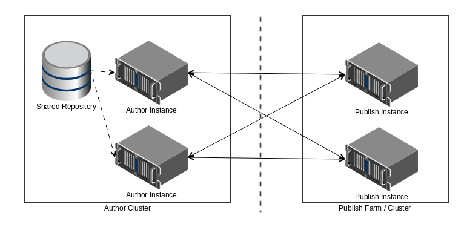

# Visão Geral dos Relatórios de Transação{#transaction-reports-overview}

## Introdução {#introduction}

Os relatórios de transação no AEM Forms permitem que você mantenha uma contagem de todas as transações realizadas desde uma data especificada na implantação do AEM Forms. O objetivo é fornecer informações sobre o uso do produto e ajudar as partes interessadas da empresa a entender seus volumes de processamento digital. Exemplos de uma transação incluem:

* Envio de um formulário adaptável, um formulário HTML5 ou um conjunto de formulários
* Execução de uma versão impressa ou da Web de uma comunicação interativa
* Conversão de um documento de um formato de arquivo para outro

Para obter mais informações sobre o que é considerado uma transação, consulte [APIs faturáveis](../../forms/using/transaction-reports-billable-apis.md).

A gravação de transações está desativada por padrão. Você pode [ativar a gravação de transações](../../forms/using/viewing-and-understanding-transaction-reports.md#setting-up-transaction-reports) AEM Web Console. Você pode visualização relatórios de transação em instâncias de autor, processamento ou publicação. Relatórios de transação de visualização em instâncias de autor ou processamento para obter uma soma agregada de todas as transações. Relatórios de transação de visualização nas instâncias de publicação para uma contagem de todas as transações que ocorrem somente na instância de publicação a partir da qual o relatório é executado.

Não crie conteúdo (Crie formulários adaptáveis, comunicação interativa, temas e outras atividades de criação) e documentos de processo (Use workflows, serviços de documento e outras atividades de processamento) na mesma instância AEM. Mantenha a gravação de transações desativada para os servidores AEM Forms usados para criar conteúdo. Mantenha a gravação de transações ativada para os servidores AEM Forms usados para processar documentos.

Uma transação permanece no buffer por um período especificado (tempo de buffer de liberação + tempo de replicação inversa). Por padrão, leva aproximadamente 90 segundos para a contagem de transações refletir no relatório de transações.

Ações como enviar um formulário PDF, usar a interface do usuário do agente para pré-visualização de uma comunicação interativa ou usar métodos de envio de formulário não padrão não são contabilizadas como transações. A AEM Forms fornece uma API para registrar tais transações. Chame a API de suas implementações personalizadas para registrar uma transação.

## Topologia suportada {#supported-topology}

Os relatórios de transação estão disponíveis somente no AEM Forms no ambiente OSGi. Ele oferece suporte para as topologias de autoria, autor-processamento-publicação e processamento apenas. Por exemplo, topologias, consulte [Arquitetura e topologias de implantação para AEM Forms](../../forms/using/transaction-reports-overview.md).

A contagem de transações é revertida replicada das instâncias de publicação para as instâncias de autor ou processamento. Uma topologia indicativa de publicação do autor é exibida abaixo:

>[!NOTE]
>
>Os relatórios de transação da AEM Forms não oferecem suporte a topologias que contêm apenas instâncias de publicação.

### Diretrizes para usar relatórios de transação {#guidelines-for-using-transaction-reports}

* Desative os relatórios de transação em todas as instâncias do autor, pois os relatórios em instâncias do autor incluem transações registradas durante a criação de atividades.
* Ative a opção **Mostrar transações de apenas** na instância do autor para visualização transações cumulativas de todas as instâncias de publicação. Você também pode visualização relatórios de transação em cada instância de publicação para transações reais apenas nessa instância de publicação específica.
* Não use instâncias do autor para executar workflows e processar documentos.
* Antes de usar o relatórios de transação, se você tiver uma topologia com os servidores de publicação, verifique se a replicação reversa está ativada para todas as instâncias de publicação.
* Os dados de transação são replicados revertidas de uma instância de publicação para somente a instância correspondente do autor ou do processamento. A instância de autor ou processamento não pode replicar mais os dados para outra instância. Por exemplo, se você tiver topologia author-processing-publish, os dados de transação agregados serão replicados somente para a instância de processamento.

## Artigos relacionados {#related-articles}

* [Exibindo e Entendendo um Relatório de Transação](../../forms/using/viewing-and-understanding-transaction-reports.md)
* [Relatórios de transação APIs faturáveis](../../forms/using/transaction-reports-billable-apis.md)
* [Registrar uma transação para implementações personalizadas](/help/forms/using/record-transaction-custom-implementation.md)

