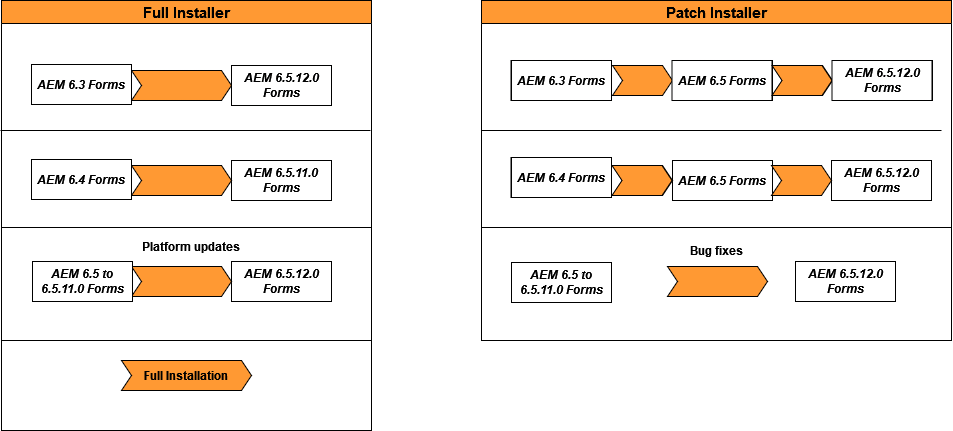

# Atualizar para AEM 6.5 Forms no JEE {#upgrade-to-aem-forms-jee}

O AEM 6.5.12.0 Forms no JEE fornece dois tipos de instaladores: Instalador completo e instalador de patch.

**Instalador completo**: Você pode usar o [AEM 6.5.12.0 no instalador completo JEE](https://experienceleague.adobe.com/docs/experience-manager-release-information/aem-release-updates/forms-updates/aem-forms-releases.html) para configurar novas instâncias do AEM Forms ou executar atualizações do AEM 6.3 Forms no JEE, AEM 6.4 no JEE e atualização fora do local do AEM 6.5.x.x Forms no JEE para o AEM 6.5.12.0 Forms no JEE.

**Instalador de patches**: [AEM 6.5.12.0 no instalador de patch JEE](https://experienceleague.adobe.com/docs/experience-manager-release-information/aem-release-updates/forms-updates/aem-forms-releases.html) é para clientes que já usam as versões AEM 6.5.x.x. Você pode usar o instalador de patches para atualizar para a versão mais recente do AEM Forms.

A tabela a seguir descreve os cenários para usar o instalador completo e de patch.

Execute o procedimento a seguir para usar o instalador completo para atualizar o AEM 6.3 Forms existente no JEE ou o AEM 6.4 Forms no JEE para AEM 6.5.12.0 Forms no JEE:

1. Baixe o AEM 6.5 Forms no JEE no instalador [Distribuição de software](https://experience.adobe.com/#/downloads/content/software-distribution/br/aem.html). Você precisa de um contrato válido de Manutenção e Suporte para usar o instalador.
1. Consulte [Atualizar lista de verificação e planejamento](https://www.adobe.com/go/learn_aemforms_upgrade_checklist_65) para saber mais sobre as verificações a serem executadas para garantir uma atualização bem-sucedida.
1. Consulte [Preparação para atualizar para o AEM Forms](https://www.adobe.com/go/learn_aemforms_prepareupgrade_65) para aprender e executar as tarefas que garantem que a atualização seja executada corretamente com o mínimo de tempo de inatividade do servidor.
1. Dependendo do ambiente e do servidor de aplicativos existentes, escolha um dos documentos a seguir e siga as instruções.

   * [Atualização do AEM 6.3 ou AEM 6.4 Forms para AEM 6.5 Forms para JBoss](https://www.adobe.com/go/learn_aemforms_upgradeJBoss_65)
   * [Atualização do AEM 6.3 ou AEM 6.4 Forms para AEM 6.5 Forms para WebSphere](https://www.adobe.com/go/learn_aemforms_upgradeWebSphere_65)
   * [Atualização do AEM 6.3 ou AEM 6.4 Forms para AEM 6.5 Forms para JBoss Turnkey](https://www.adobe.com/go/learn_aemforms_upgradeTurnkey_65)

A atualização direta do LiveCycle ES2, LiveCycle ES3, AEM 6.0 Forms, AEM 6.1 Forms, AEM 6.2 Forms para AEM 6.5 Forms não está disponível. Você pode executar uma atualização intermediária para uma ou mais versões do LiveCycle ou AEM Forms e, em seguida, atualizar para AEM Forms 6.5. Para obter a lista de versões intermediárias e as instruções de atualização correspondentes, consulte [Escolha um caminho de atualização](upgrade.md).
