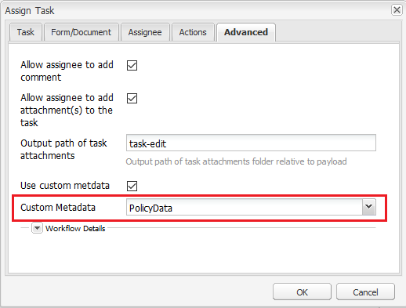

# Usar metadados em uma notificação por email {#use-metadata-in-an-email-notification}

Você pode usar a etapa Atribuir tarefa para criar e atribuir tarefas a um usuário ou grupo. Quando uma tarefa é atribuída a um usuário ou grupo, uma notificação por email é enviada ao usuário definido ou a cada membro do grupo definido. Um típico [notificação por e-mail](../../forms/using/use-custom-email-template-assign-task-step.md) contém o link da tarefa atribuída e informações relacionadas à tarefa.

Você pode usar metadados em um modelo de email para preencher dinamicamente as informações em uma notificação por email. Por exemplo, o valor do título, a descrição, a data de vencimento, a prioridade, o fluxo de trabalho e a última data na notificação de email a seguir são selecionados dinamicamente no tempo de execução (quando uma notificação de email é gerada).


Os metadados são armazenados em pares de valores chave. Você pode especificar a chave no template de email e a chave é substituída por um valor no tempo de execução (quando uma notificação por email é gerada). Por exemplo, na amostra de código abaixo, &quot;$ {workitem_title} &quot; é uma chave. Ele é substituído pelo valor &quot;Loan-Request&quot; no tempo de execução.

```html
subject=Task Assigned - ${workitem_title}

message=<html><body>\n\
 <table style="width: 480px; font-family: Helvetica, Arial, sans-serif; border: 0; padding: 0; vertical-align: top; text-align: left; word-wrap: break-word; margin: 16px auto; color:#323232; background-color:#FFFCF9; border-collapse: collapse;">\n\
  <tbody>\n\
   <tr>\n\
    <td style="height: 100px; width: 480px; background-color: #FFE0CB; border-top: 5pt solid black; font-family: Helvetica, Arial, sans-serif; font-weight: bold; font-size: 15px; line-height: 20px; padding: 12px; color: #707070;">\n\
      Sample Company\n\
    </td>\n\
   </tr>\n\
   <tr>\n\
    <td style="font-family: Helvetica, Arial, sans-serif; height: auto; background-color: #FFFCF9; padding: 32px 16px 20px 16px; ">\n\
     <pre style="font-size: 13px; font-family: Helvetica, Arial, sans-serif;  font-weight: normal; color: #323232;"> Hello ${workitem_assignee},\n\
 The following task has been assigned to you:</pre>\n\
    </td>\n\
   </tr>\n\
   <tr>\n\
    <td style="width: 480px;">\n\
     <table style="height: auto; width: 480px; background-color:#FFFBF9; font-family: Helvetica, Arial, sans-serif; border-collapse: collapse;">\n\
      <tbody>\n\
       <tr style="border-bottom: solid 2px #FFFCF9;">\n\
        <td style="font-family: Helvetica, Arial, sans-serif; width: auto; height: auto; background-color:#FFF5EF; font-weight: bold; font-size: 11px; line-height: 20px; padding: 12px; color: #707070;"> TITLE</td>\n\
        <td style="font-family: Helvetica, Arial, sans-serif; background-color:#FFF5EF; text-align: left; vertical-align: middle; height: auto; font-weight: normal; font-size: 13px; line-height: 20px; padding: 10px 16px 10px 32px; color: #323232;">\n\
         <p>${workitem_title}</p>\n\
        </td>\n\
       </tr>\n\
                            <tr style="border-bottom: solid 2px #FFFCF9;">\n\
        <td style="font-family: Helvetica, Arial, sans-serif; width: auto; height: auto; background-color:#FFF5EF; font-weight: bold; font-size: 11px; line-height: 20px; padding: 12px; color: #707070;"> DESCRIPTION</td>\n\
        <td style="font-family: Helvetica, Arial, sans-serif; background-color:#FFF5EF; text-align: left; vertical-align: middle; height: auto; font-weight: normal; font-size: 13px; line-height: 20px; padding: 10px 16px 10px 32px; color: #323232;">\n\
         <p>${workitem_description}</p>\n\
        </td>\n\
       </tr>\n\
       <tr style="border-bottom: solid 2px #FFFCF9;">\n\
        <td style="font-family: Helvetica, Arial, sans-serif; width: auto; height: auto; background-color:#FFF5EF; font-weight: bold; font-size: 11px; line-height: 20px; padding: 12px; color: #707070;"> DUE DATE</td>\n\
        <td style="font-family: Helvetica, Arial, sans-serif; background-color:#FFF5EF; text-align: left; vertical-align: middle; height: auto; font-weight: normal; font-size: 13px; line-height: 20px; padding: 10px 16px 10px 32px; color: #323232;">\n\
         <p>${workitem_due_date}</p>\n\
        </td>\n\
       </tr>\n\
       <tr style="border-bottom: solid 2px #FFFCF9;">\n\
        <td style="font-family: Helvetica, Arial, sans-serif; width: auto; height: auto; background-color:#FFF5EF; font-weight: bold; font-size: 11px; line-height: 20px; padding: 12px; color: #707070;"> PRIORITY</td>\n\
        <td style="font-family: Helvetica, Arial, sans-serif; background-color:#FFF5EF; text-align: left; vertical-align: middle; height: auto; font-weight: normal; font-size: 13px; line-height: 20px; padding: 10px 16px 10px 32px; color: #323232;">\n\
         <p>${workitem_priority}</p>\n\
        </td>\n\
       </tr>\n\
       <tr>\n\
        <td style="font-family: Helvetica, Arial, sans-serif; width: auto; height: auto; background-color:#FFF5EF; font-weight: bold; font-size: 11px; line-height: 20px; padding: 12px; color: #707070;"> WORKFLOW</td>\n\
        <td style="font-family: Helvetica, Arial, sans-serif; background-color:#FFF5EF; text-align: left; vertical-align: middle; height: auto; font-weight: normal; font-size: 13px; line-height: 20px; padding: 10px 16px 10px 32px; color: #323232;">\n\
         <p>${workitem_workflow}</p>\n\
        </td>\n\
       </tr>\n\
      </tbody>\n\
     </table>\n\
    </td>\n\
   </tr>\n\
   <tr style = "text-align: center; vertical-align: middle;">\n\
    <td style="padding:48px 0 72px 0;"> \n\
     <a href="${workitem_url}" target="_blank" style="background-color: #1EBBBB; font-size: 18px; line-height: 25px; font-weight: bold; color: #FFFFFF; text-decoration: none; padding: 15px 15px 15px 15px;">Open Task</a>\n\
    </td>\n\
   </tr>\n\
   <tr>\n\
    <td style="border-top: solid 1px #EDEAE7; padding: 16px;">\n\
     <p><span style="font-size: 12px; font-weight: normal; font-style: italic; color: #919191;">This is an automatically generated email. Do not reply to this email.</code></p>\n\
    </td>\n\
   </tr>\n\
  </tbody>\n\
 </table>\n\
</body>\n\
</html>\n\
```

## Uso de metadados gerados pelo sistema em uma notificação por email {#using-system-generated-metadata-in-an-email-notification}

Um aplicativo do AEM Forms fornece várias variáveis de metadados (pares de valores chave) prontas para uso. É possível usar essas variáveis em um template de email. O valor da variável é baseado no aplicativo de formulários associado. A tabela a seguir lista todas as variáveis de metadados disponíveis prontas para uso:

<table>
 <tbody> 
  <tr> 
   <td>Chave</td> 
   <td>Descrição</td> 
  </tr> 
  <tr> 
   <td>workitem_title</td> 
   <td>Título do aplicativo de formulários associado.</td> 
  </tr> 
  <tr> 
   <td>workitem_url</td> 
   <td>URL para acessar o aplicativo de formulários associado.</td> 
  </tr> 
  <tr> 
   <td>workitem_description</td> 
   <td>Descrição do aplicativo de formulários associado.</td> 
  </tr> 
  <tr> 
   <td>item_de_trabalho</td> 
   <td>Prioridade especificada para o aplicativo de formulários associado.</td> 
  </tr> 
  <tr> 
   <td>workitem_due_date</td> 
   <td>Última data para agir no aplicativo de formulários associado.</td> 
  </tr> 
  <tr> 
   <td>workitem_workflow</td> 
   <td>Nome do fluxo de trabalho associado ao aplicativo de formulários.</td> 
  </tr> 
  <tr> 
   <td>workitem_assign_timestamp</td> 
   <td>Data e hora em que o item de fluxo de trabalho foi atribuído ao destinatário atual.</td> 
  </tr> 
  <tr> 
   <td>workitem_assignee</td> 
   <td>Nome do destinatário atual.</td> 
  </tr> 
  <tr> 
   <td>host_prefix</td> 
   <td>URL do servidor do autor. Por exemplo, https://10.41.42.66:4502<br /> </td> 
  </tr> 
  <tr> 
   <td>publish_prefix</td> 
   <td>URL do servidor de publicação. Por exemplo, https://10.41.42.66:4503</td> 
  </tr> 
 </tbody> 
</table>

## Uso de metadados personalizados em uma notificação por e-mail {#using-custom-metadata-in-an-email-notification}

Você também pode usar metadados personalizados em uma notificação por email. Os metadados personalizados contêm informações adicionais aos metadados gerados pelo sistema. Por exemplo, detalhes da política recuperados de um banco de dados. Você pode usar um pacote ECMAScript ou OSGi para adicionar metadados personalizados no repositório crx:

### Usar ECMAScript para adicionar metadados personalizados  {#use-ecmascript-to-add-custom-metadata}

[ECMAScript](https://en.wikipedia.org/wiki/ECMAScript) é uma linguagem de script. Ele é usado para aplicativos de script e servidor do lado do cliente. Execute as seguintes etapas para usar o ECMAScript e adicionar metadados personalizados a um modelo de e-mail:

1. Faça logon no CRX DE com uma conta administrativa. O URL é https://&#39;[server]:[porta]&#39;/crx/de/index.jsp

1. Navegue até /apps/fd/dashboard/scripts/metadataScripts. Crie um arquivo com a extensão .ecma. Por exemplo, usermetadata.ecma

   Se o caminho mencionado acima não existir, crie-o.

1. Adicione código ao arquivo .ecma que tenha a lógica para gerar metadados personalizados em pares de valores chave. Por exemplo, o código ECMAScript a seguir gera metadados personalizados para uma apólice de seguro:

   ```javascript
   function getUserMetaData()  {
       //Commented lines below provide an overview on how to set user metadata in map and return it.
       var HashMap = Packages.java.util.HashMap;
       var valuesMap = new HashMap();
       valuesMap.put("policyNumber", "2017568972695");
       valuesMap.put("policyHolder", "Adobe Systems");
   
       return valuesMap;
   }
   ```

1. Clique em Salvar tudo. Agora, o script está disponível para seleção no modelo de fluxo de trabalho AEM.

   

1. (Opcional) Especifique o título do script:

   Se você não especificar o título, o campo Metadados personalizados exibirá o caminho completo do arquivo ECMAScript. Execute as seguintes etapas para especificar um título significativo para o script:

   1. Expanda o nó do script e clique com o botão direito do mouse no **[!UICONTROL jcr:content]** e clique em **[!UICONTROL Mixins]**.
   1. Digite mix:título na caixa de diálogo Editar misturas e clique em **+**.
   1. Adicione uma propriedade com os seguintes valores.

      | Nome | jcr:title |
      |---|---|
      | Tipo | String |
      | Valor | Especifique o título do script. Por exemplo, metadados personalizados para o detentor da apólice. O valor especificado é exibido na etapa atribuir tarefa. |

### Use um pacote OSGi e a interface Java para adicionar metadados personalizados {#use-an-osgi-bundle-and-java-interface-to-add-custom-metadata}

Você pode usar a interface Java WorkitemUserMetadataService para adicionar metadados personalizados a modelos de email. Você pode criar um pacote OSGi que use a interface Java WorkitemUserMetadataService e implantá-lo no servidor do AEM Forms. Ele disponibiliza os metadados para seleção na etapa Atribuir tarefa.

Para criar um pacote OSGi com interface Java, adicione [AEM Forms Client SDK](https://helpx.adobe.com/aem-forms/kb/aem-forms-releases.html) jar e [jar de granito](https://repo1.maven.org/maven2/com/adobe/granite/com.adobe.granite.workflow.api/1.0.2/) arquivos como dependências externas para o projeto de pacote OSGi. Você pode usar qualquer Java IDE para criar um pacote OSGi. O procedimento a seguir fornece etapas para usar o Eclipse para criar um pacote OSGi:

1. Abra o Eclipse IDE. Navegue até Arquivo > Novo projeto.

1. Na tela Selecionar um assistente, selecione Projeto Maven e clique em Próximo.

1. No Novo projeto Maven, mantenha os padrões e clique em Próximo. Selecione um arquétipo e clique em Próximo. Por exemplo, maven-archetype-quickstart. Especifique a ID do Grupo, a ID do Artefato, a versão e o pacote do projeto e clique em Concluir. O projeto é criado.

1. Abra o arquivo pom.xml para edição e substitua todo o conteúdo do arquivo pelo seguinte:

1. Adicione o código-fonte que usa a interface Java WorkitemUserMetadataService para adicionar metadados personalizados a modelos de email. Um código de amostra está listado abaixo:

   ```java
   package com.aem.impl;
   
   import com.adobe.fd.workspace.service.external.WorkitemUserMetadataService;
   import org.apache.felix.scr.annotations.Component;
   import org.apache.felix.scr.annotations.Properties;
   import org.apache.felix.scr.annotations.Property;
   import org.apache.felix.scr.annotations.Service;
   import org.osgi.framework.Constants;
   
   import java.util.HashMap;
   import java.util.Map;
   
   @Component
   @Service
   @Properties({
           @Property(name = Constants.SERVICE_DESCRIPTION, value = "A sample implementation of a user metadata service."),
           @Property(name = WorkitemUserMetadataService.SERVICE_PROPERTY_LABEL, value = "Default User Metadata Service")})
   
   public class WorkitemUserMetadataServiceImpl
     implements WorkitemUserMetadataService
   {
     public WorkitemUserMetadataServiceImpl() {}
   
     public Map<String, String> getUserMetadataMap()
     {
       HashMap<String, String> metadataMap = null;
       metadataMap = new HashMap();
       metadataMap.put("test_metadata", "tested-interface implementation");
       return metadataMap;
     }
   }
   ```

1. Abra um prompt de comando e navegue até o diretório que contém o projeto de pacote OSGi. Use o seguinte comando para criar o pacote OSGi:

   `mvn clean install`

1. Faça upload do pacote para um servidor do AEM Forms. Você pode usar o Gerenciador de pacotes AEM para importar o pacote para o servidor do AEM Forms.

Depois que o pacote for importado, é possível selecionar os metadados na etapa Atribuir tarefa e usá-los como um template de email.
