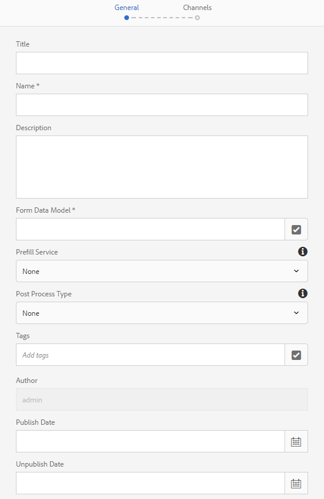

# Usar modelo de dados de formulário{#use-form-data-model}

A integração de dados do AEM Forms permite usar diferentes fontes de dados de backend para criar um modelo de dados de formulário que você pode usar como schema em vários formulários adaptáveis e workflows de comunicação interativos. Ela exige a configuração de fontes de dados e a criação de um modelo de dados de formulário com base em objetos de modelo de dados e serviços disponíveis em fontes de dados. Para obter mais informações, consulte:

* [Integração de dados do AEM Forms](../../forms/using/data-integration.md)
* [Configurar fontes de dados](../../forms/using/configure-data-sources.md)
* [Criar modelo de dados de formulário](../../forms/using/create-form-data-models.md)
* [Trabalhar com modelo de dados de formulário](../../forms/using/work-with-form-data-model.md)

Um modelo de dados de formulário é uma extensão do schema JSON que você pode usar para:

* [Criar formulários e fragmentos adaptáveis](#create-af)
* [Criar comunicações interativas e blocos de construção como fragmentos de texto, lista e condição](#create-ic)
* [Pré-visualização de comunicações interativas com dados de amostra](#preview-ic)
* [Preencher previamente formulários adaptáveis e comunicações interativas](#prefill)
* [Gravar dados de formulário adaptativo enviados em fontes de dados](#write-af)
* [Invocar serviços usando regras de formulário adaptáveis](#invoke-services)

## Criar formulários e fragmentos adaptáveis {#create-af}

É possível criar formulários  adaptáveis e fragmentos [de formulário](../../forms/using/adaptive-form-fragments.md) adaptáveis com base em um modelo de dados de formulário. Faça o seguinte para usar um modelo de dados de formulário ao criar um formulário adaptável ou fragmento de formulário adaptável:

1. Na guia Modelo de formulário na tela Adicionar propriedades, selecione Modelo **[!UICONTROL de dados de]** formulário na lista suspensa **[!UICONTROL Selecionar]** .

   

1. Toque em para expandir **[!UICONTROL Selecionar modelo]** de dados do formulário. Todos os modelos de dados de formulário disponíveis são listados.

   Selecione um a partir do modelo de dados.

   

1. (Somente **fragmentos de formulário** adaptáveis) É possível criar um fragmento de formulário adaptável com base em apenas um objeto de modelo de dados em um modelo de dados de formulário. Expanda o menu suspenso Definições **[!UICONTROL do modelo de dados de]** formulário. Ele lista todos os objetos de modelo de dados no modelo de dados de formulário especificado. Selecione um objeto de modelo de dados na lista.

   

Depois que o formulário adaptável ou o fragmento de formulário adaptável com base em um modelo de dados de formulário é criado, os objetos de modelo de dados de formulário aparecem na guia Objetos **[!UICONTROL do Modelo de]** dados do navegador Conteúdo no editor de formulário adaptável.

>[!NOTE]
>
>Para um fragmento de formulário adaptável, somente o objeto de modelo de dados selecionado no momento da criação e seus objetos de modelo de dados associados são exibidos na guia Objetos de modelo de dados.

É possível arrastar e soltar objetos de modelo de dados no formulário ou fragmento adaptável para adicionar campos de formulário. Os campos de formulário adicionados retêm as propriedades de metadados e vinculam-se às propriedades de objetos de modelo de dados. O vínculo garante que os valores de campo sejam atualizados nas fontes de dados correspondentes no envio do formulário e pré-preenchidos quando o formulário for renderizado.

## Criar comunicações interativas {#create-ic}

Você pode criar uma comunicação interativa com base em um modelo de dados de formulário que pode ser usado para pré-preencher a comunicação interativa com dados de fontes de dados configuradas. Além disso, os elementos básicos de uma comunicação interativa, como fragmentos de texto, lista e documento de condição, podem ser baseados em um modelo de dados de formulário.

É possível escolher um modelo de dados de formulário ao criar uma comunicação interativa ou um fragmento de documento. A imagem a seguir mostra a guia Geral da caixa de diálogo Criar comunicação interativa.

Guia Geral da caixa de diálogo Criar comunicação interativa

Para obter mais informações, consulte:

[Criar uma comunicação interativa](../../forms/using/create-interactive-communication.md)

[Texto em Comunicações Interativas](/help/forms/using/texts-interactive-communications.md)

[Condições em comunicações interativas](/help/forms/using/conditions-interactive-communications.md)

[Fragmentos de Lista](/help/forms/using/lists.md)

## Pré-visualização com dados de amostra {#preview-ic}

O editor de modelo de dados de formulário permite gerar e editar dados de amostra para objetos de modelo de dados no modelo de dados de formulário. Você pode usar esses dados para pré-visualização e teste comunicações interativas e formulários adaptativos. Você deve gerar os dados de amostra antes de visualizar conforme descrito em [Trabalhar com modelo](../../forms/using/work-with-form-data-model.md#sample)de dados de formulário.

Para pré-visualização de uma comunicação interativa com dados de exemplo do modelo de dados do formulário:

1. Na instância do autor de AEM, navegue até **[!UICONTROL Formulários > Formulários e Documentos]**.
1. Selecione uma comunicação interativa e toque em **[!UICONTROL Pré-visualização]** na barra de ferramentas para selecionar Canal **[!UICONTROL da]** Web, Canal **** Imprimir ou **[!UICONTROL Ambos os Canais]** para pré-visualização da comunicação interativa.
1. Na caixa de diálogo Pré-visualização [*canal*] , verifique se **[!UICONTROL Testar dados do modelo]** de dados do formulário está selecionado e toque em **[!UICONTROL Pré-visualização]**.

A comunicação interativa é aberta com dados de amostra pré-preenchidos.

Da mesma forma, para pré-visualização um formulário adaptável com dados de amostra, abra o formulário adaptável no modo de autor e toque em **[!UICONTROL Pré-visualização]**.

## Preencher previamente usando o serviço de modelo de dados de formulário {#prefill}

O AEM Forms fornece o serviço de preenchimento prévio do modelo de dados de formulário pronto para uso que você pode ativar para formulários adaptáveis e comunicações interativas com base no modelo de dados de formulário. O serviço de preenchimento prévio query fontes de dados para objetos de modelo de dados no formulário adaptável e comunicação interativa e, portanto, preenche os dados antecipadamente ao renderizar o formulário ou a comunicação.

Para habilitar o serviço de preenchimento prévio do modelo de dados de formulário para um formulário adaptável, abra as propriedades do Container de formulário adaptável e selecione o serviço **[!UICONTROL Preenchimento prévio do modelo de dados de]** formulário no menu suspenso Serviço **[!UICONTROL de]** preenchimento prévio na opção Básico. Em seguida, salve as propriedades.

Para configurar o serviço de preenchimento prévio do modelo de dados de formulário em uma comunicação interativa, é possível selecionar o serviço de preenchimento prévio do modelo de dados de formulário no menu suspenso Serviço de preenchimento prévio ao criá-lo ou mais recente modificando as propriedades.

Caixa de diálogo Editar propriedades para uma comunicação interativa

## Gravar dados de formulário adaptativo enviados em fontes de dados {#write-af}

Quando um usuário envia um formulário com base em um modelo de dados de formulário, é possível configurar o formulário para gravar dados enviados de um objeto de modelo de dados em suas fontes de dados. Para obter esse caso de uso, os AEM Forms fornecem uma ação [de envio do Modelo de dados de](../../forms/using/configuring-submit-actions.md)formulário, disponível prontamente apenas para formulários adaptáveis baseados em um modelo de dados de formulário. Ele grava dados enviados para um objeto de modelo de dados em sua fonte de dados.

Para configurar a ação de envio do Modelo de dados de formulário, abra as propriedades do Container de formulário adaptável e selecione **[!UICONTROL Enviar usando o Modelo]** de dados de formulário no menu suspenso Enviar ação na opção Enviar. Em seguida, procure e selecione um objeto de modelo de dados no **[!UICONTROL Nome do objeto de modelo de dados a ser submetido]** . Salve as propriedades.

No envio do formulário, os dados do objeto de modelo de dados configurado são gravados na respectiva fonte de dados.

Também é possível enviar anexos de formulário para uma fonte de dados usando a propriedade de objeto de modelo de dados binários. Faça o seguinte para enviar anexos a uma fonte de dados JDBC:

1. Adicione um objeto de modelo de dados que inclua uma propriedade binária ao modelo de dados de formulário.
1. No formulário adaptável, arraste e solte o componente Anexo **[!UICONTROL de]** arquivo do navegador Componentes para o formulário adaptável.
1. Toque em para selecionar o componente adicionado e toque em  para abrir o navegador Propriedades do componente.
1. No campo Vincular referência, toque em  e navegue para selecionar a propriedade binária adicionada no modelo de dados do formulário. Configure outras propriedades, conforme apropriado.

   Toque em  para salvar as propriedades. O campo de anexo agora está vinculado à propriedade binária do modelo de dados de formulário.

1. Na seção Enviar das propriedades do Container de formulário adaptável, ative **[!UICONTROL Enviar anexos]** de formulário. Ele envia o anexo no campo de propriedade binária para a fonte de dados no envio do formulário.

## Invocar serviços em formulários adaptáveis usando regras {#invoke-services}

Em um formulário adaptável com base em um modelo de dados de formulário, é possível [criar regras](../../forms/using/rule-editor.md) para chamar os serviços configurados no modelo de dados de formulário. A operação **[!UICONTROL Invocar serviços]** em uma regra lista todos os serviços disponíveis no modelo de dados de formulário e permite selecionar campos de entrada e saída para o serviço. Você também pode usar o tipo de regra **Definir valor** para chamar um serviço de modelo de dados de formulário e definir o valor de um campo para a saída retornada pelo serviço.

Por exemplo, a regra a seguir chama um serviço get que utiliza a ID do Funcionário como entrada e os valores retornados são preenchidos nos campos Id Dependente, Sobrenome, Nome e Gênero correspondentes no formulário.

Além disso, você pode usar a `guidelib.dataIntegrationUtils.executeOperation` API para gravar um JavaScript no editor de código para o editor de regras. Para obter detalhes da API, consulte [API para chamar o serviço](/help/forms/using/invoke-form-data-model-services.md)de modelo de dados de formulário.
