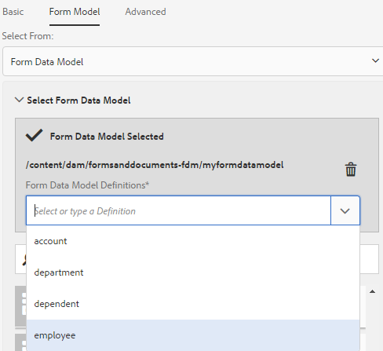
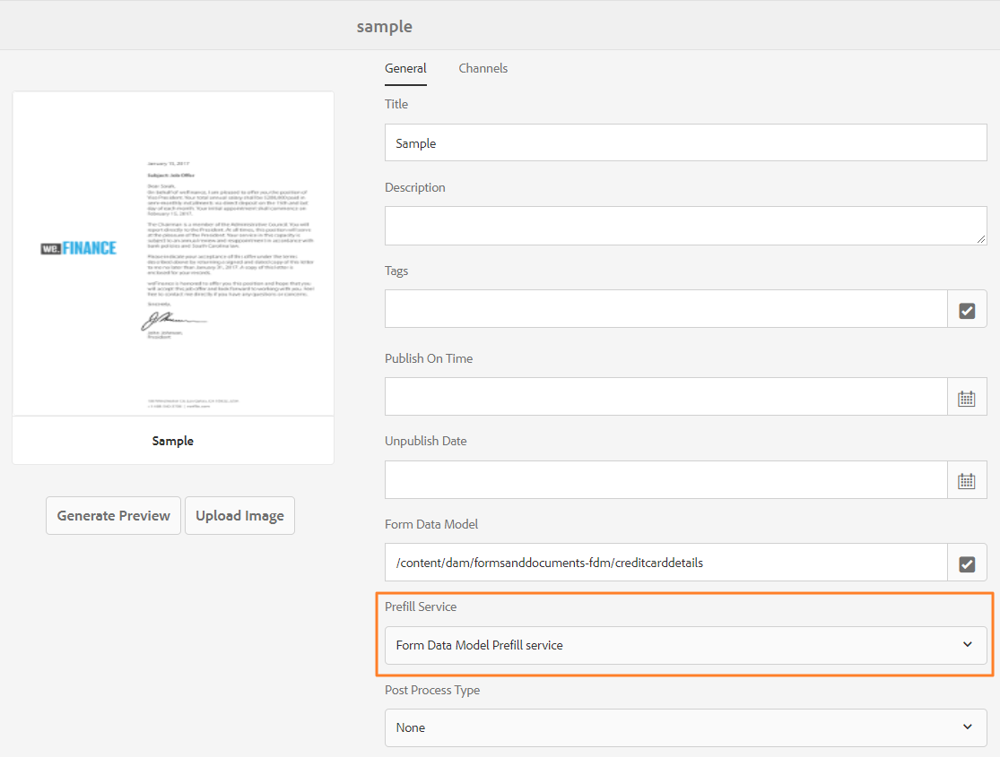
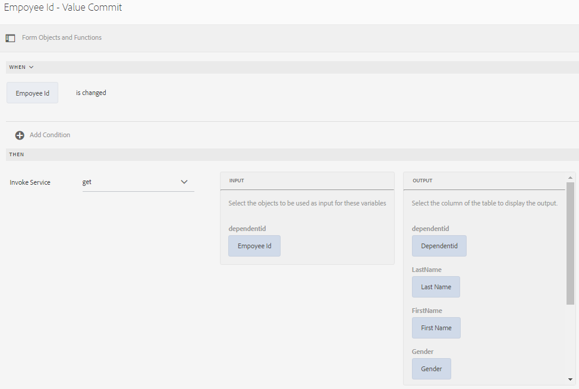

# Usar modelo de dados de formulário{#use-form-data-model}

| Versão | Link do artigo |
| -------- | ---------------------------- |
| AEM as a Cloud Service | [Clique aqui](https://experienceleague.adobe.com/docs/experience-manager-cloud-service/content/forms/integrate/use-form-data-model/using-form-data-model.html) |
| AEM 6.5 | Este artigo |

A integração de dados do AEM Forms permite usar fontes de dados de back-end diferentes para criar um modelo de dados de formulário que você pode usar como esquema em vários formulários adaptáveis e workflows de comunicações interativas. Ele requer a configuração de fontes de dados e a criação de um modelo de dados de formulário com base nos objetos e serviços do modelo de dados disponíveis nas fontes de dados. Para obter mais informações, consulte o seguinte:

* [Integração de dados do AEM Forms](../../forms/using/data-integration.md)
* [Configurar fontes de dados](../../forms/using/configure-data-sources.md)
* [Criar modelo de dados de formulário](../../forms/using/create-form-data-models.md)
* [Trabalhar com o modelo de dados de formulário](../../forms/using/work-with-form-data-model.md)

Um modelo de dados de formulário é uma extensão do esquema JSON que você pode usar para:

* [Criar formulários e fragmentos adaptáveis](#create-af)
* [Criar comunicações interativas e blocos de construção como texto, lista e fragmentos de condição](#create-ic)
* [Pré-visualizar comunicações interativas com dados de amostra](#preview-ic)
* [Preencher formulários adaptáveis e comunicações interativas](#prefill)
* [Gravar dados de formulário adaptável enviados de volta nas fontes de dados](#write-af)
* [Chamar serviços usando regras de formulário adaptáveis](#invoke-services)

## Criar formulários e fragmentos adaptáveis {#create-af}

Você pode criar [formulários adaptáveis](../../forms/using/creating-adaptive-form.md) e [fragmentos de formulários adaptáveis](../../forms/using/adaptive-form-fragments.md) com base em um modelo de dados de formulário. Faça o seguinte para usar um modelo de dados de formulário ao criar um formulário adaptável ou fragmento de formulário adaptável:

1. Na guia Modelo de formulário na tela Adicionar propriedades, selecione **[!UICONTROL Modelo de dados de formulário]** na lista suspensa **[!UICONTROL Selecionar de]**.

   

1. Selecione para expandir **[!UICONTROL Selecionar modelo de dados de formulário]**. Todos os modelos de dados de formulário disponíveis estão listados.

   Selecione um do modelo de dados.

   

1. (**Somente fragmentos de formulário adaptáveis**) É possível criar um fragmento de formulário adaptável com base em apenas um objeto de modelo de dados em um modelo de dados de formulário. Expanda **[!UICONTROL o menu suspenso Definições do Modelo de Dados de Formulário]**. Ele lista todos os objetos do modelo de dados no modelo de dados de formulário especificado. Selecione um objeto de modelo de dados na lista.

   

Depois que o formulário adaptável ou o fragmento de formulário adaptável com base em um modelo de dados de formulário for criado, os objetos de modelo de dados de formulário aparecerão na guia **[!UICONTROL Objetos de modelo de dados]** do navegador de conteúdo no editor de formulário adaptável.

>[!NOTE]
>
>Para um fragmento de formulário adaptável, somente o objeto de modelo de dados selecionado no momento da criação e seus objetos de modelo de dados associados aparecem na guia Objetos do modelo de dados.

Você pode arrastar e soltar objetos de modelo de dados no formulário ou fragmento adaptável para adicionar campos de formulário. Os campos de formulário adicionados retêm as propriedades de metadados e a vinculação com as propriedades do objeto de modelo de dados. O vínculo garante que os valores de campo sejam atualizados nas fontes de dados correspondentes no envio do formulário e preenchidos previamente quando o formulário for renderizado.

## Criar comunicações interativas {#create-ic}

Você pode criar uma comunicação interativa com base em um modelo de dados de formulário que pode ser usado para preencher previamente a comunicação interativa com dados de fontes de dados configuradas. Além disso, os blocos de construção de uma comunicação interativa, como texto, lista e fragmentos de documento de condição podem ser baseados em um modelo de dados de formulário.

Você pode escolher um modelo de dados de formulário ao criar uma comunicação interativa ou um fragmento de documento. A imagem a seguir mostra a guia Geral da caixa de diálogo Criar comunicação interativa.

Guia Geral da caixa de diálogo Criar comunicação interativa

Para obter mais informações, consulte:

[Criar uma comunicação interativa](../../forms/using/create-interactive-communication.md)

[Texto em comunicações interativas](/help/forms/using/texts-interactive-communications.md)

[Condições em comunicações interativas](/help/forms/using/conditions-interactive-communications.md)

[Listar fragmentos](/help/forms/using/lists.md)

## Visualizar com dados de amostra {#preview-ic}

O editor do modelo de dados de formulário permite gerar e editar dados de amostra para objetos de modelo de dados no modelo de dados de formulário. Você pode usar esses dados para pré-visualizar e testar comunicações interativas e formulários adaptáveis. Gere os dados de exemplo antes de visualizar como descrito em [Trabalhar com o modelo de dados de formulário](../../forms/using/work-with-form-data-model.md#sample).

Para visualizar uma comunicação interativa com dados de modelo de dados de formulário de amostra:

1. Na instância do autor do AEM, navegue até **[!UICONTROL Forms > Forms e Documentos]**.
1. Selecione uma comunicação interativa e selecione **[!UICONTROL Visualizar]** na barra de ferramentas para selecionar **[!UICONTROL Canal da Web]**, **[!UICONTROL Canal de Impressão]** ou **[!UICONTROL Ambos os Canais]** para visualizar a comunicação interativa.
1. Na caixa de diálogo Visualizar [*canal*], verifique se **[!UICONTROL Testar Dados do Modelo de Dados de Formulário]** está selecionado e selecione **[!UICONTROL Visualizar]**.

A comunicação interativa é aberta com dados de amostra pré-preenchidos.

Da mesma forma, para visualizar um formulário adaptável com dados de amostra, abra o formulário adaptável no modo de autor e selecione **[!UICONTROL Visualizar]**.

## Preencher previamente usando o serviço de modelo de dados de formulário {#prefill}

A AEM Forms fornece o Serviço de preenchimento prévio do modelo de dados de formulário pronto para uso que você pode habilitar para formulários adaptáveis e comunicações interativas com base no modelo de dados de formulário. O serviço de preenchimento prévio consulta fontes de dados para objetos de modelo de dados no formulário adaptável e na comunicação interativa e, portanto, preenche os dados enquanto renderiza o formulário ou a comunicação.

Para habilitar o Serviço de Preenchimento de Modelo de Dados de Formulário para um formulário adaptável, abra as propriedades do Contêiner de Formulário Adaptável e selecione **[!UICONTROL Serviço de Preenchimento de Modelo de Dados de Formulário]** no menu suspenso **[!UICONTROL Serviço de Preenchimento Prévio]** na opção Básico. Em seguida, salve as propriedades.

Para configurar o serviço de preenchimento do modelo de dados de formulário em uma comunicação interativa, você pode selecionar o Serviço de preenchimento do modelo de dados de formulário no menu suspenso Serviço de preenchimento ao criá-lo ou posteriormente, modificando as propriedades.

Caixa de diálogo Editar propriedades para uma comunicação interativa

## Gravar dados de formulário adaptável enviados nas fontes de dados {#write-af}

Quando um usuário envia um formulário com base em um modelo de dados de formulário, você pode configurar o formulário para gravar dados enviados de um objeto de modelo de dados em suas fontes de dados. Para obter esse caso de uso, a AEM Forms fornece a [ação de envio do Modelo de dados de formulário](../../forms/using/configuring-submit-actions.md), disponível e pronta para uso somente para formulários adaptáveis com base em um modelo de dados de formulário. Ele grava dados enviados para um objeto de modelo de dados em sua fonte de dados.

Para configurar a ação de envio do Modelo de dados de formulário, abra as propriedades do Contêiner de formulário adaptável e selecione **[!UICONTROL Enviar usando o Modelo de dados de formulário]** no menu suspenso Enviar ação na opção Enviar. Em seguida, procure e selecione um objeto de modelo de dados no menu suspenso **[!UICONTROL Name of the data model object to submit]**. Salve as propriedades.

No envio do formulário, os dados do objeto de modelo de dados configurado são gravados na respectiva fonte de dados.

Você também pode enviar anexos de formulário para uma fonte de dados usando a propriedade de objeto de modelo de dados binários. Faça o seguinte para enviar anexos para uma origem de dados JDBC:

1. Adicione um objeto de modelo de dados que inclua uma propriedade binária ao modelo de dados de formulário.
1. No formulário adaptável, arraste e solte o componente **[!UICONTROL Anexo de arquivo]** do navegador Componentes no formulário adaptável.
1. Selecione para selecionar o componente adicionado e selecione  para abrir o navegador Propriedades do componente.
1. No campo Referência de Ligação, selecione  e navegue para selecionar a propriedade binária adicionada no modelo de dados de formulário. Configure outras propriedades, conforme apropriado.

   Selecione o  para salvar as propriedades. O campo de anexo agora está associado à propriedade binária do modelo de dados de formulário.

1. Na seção Envio das propriedades do Contêiner de formulário adaptável, habilite **[!UICONTROL Enviar anexos do formulário]**. Ele envia o anexo no campo de propriedade binária para a fonte de dados no envio do formulário.

## Chamar serviços em formulários adaptáveis usando regras {#invoke-services}

Em um formulário adaptável baseado em um modelo de dados de formulário, você pode [criar regras](../../forms/using/rule-editor.md) para chamar serviços configurados no modelo de dados de formulário. A operação **[!UICONTROL Invocar Serviços]** em uma regra lista todos os serviços disponíveis no modelo de dados de formulário e permite selecionar campos de entrada e saída para o serviço. Você também pode usar o tipo de regra **Definir Valor** para invocar um serviço de modelo de dados de formulário e definir o valor de um campo para a saída retornada pelo serviço.

Por exemplo, a regra a seguir chama um serviço get que usa a ID do Funcionário como entrada e os valores retornados são preenchidos nos campos ID do Dependente, Sobrenome, Nome e Gênero correspondentes no formulário.

Além disso, você pode usar a API `guidelib.dataIntegrationUtils.executeOperation` para escrever uma JavaScript no editor de códigos do editor de regras. Para obter detalhes sobre API, consulte [API para invocar o serviço de modelo de dados de formulário](/help/forms/using/invoke-form-data-model-services.md).
