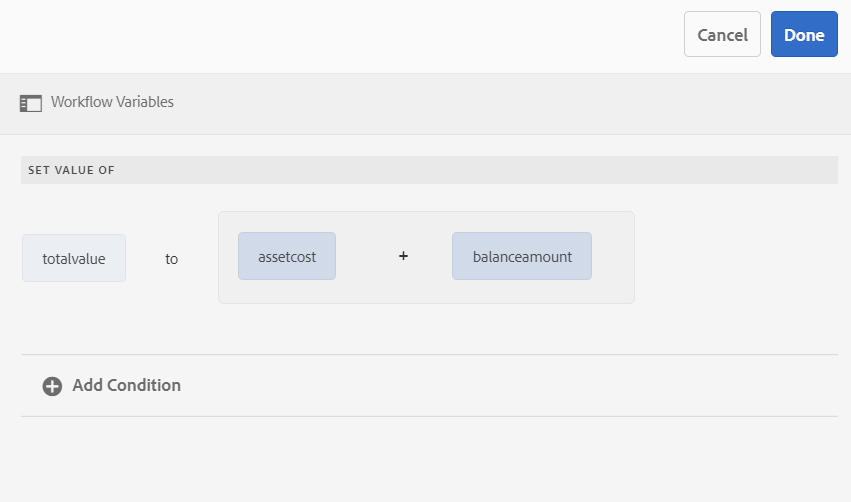

# Variáveis em workflows AEM Forms{#variables-in-aem-forms-workflows}

Uma variável em um modelo de fluxo de trabalho é uma forma de armazenar um valor com base em seu tipo de dados. Você pode usar o nome da variável em qualquer etapa do fluxo de trabalho para recuperar o valor armazenado na variável. Também é possível usar nomes de variáveis para definir expressões para tomar decisões de roteamentos.

Em modelos de fluxo de trabalho do AEM, você pode:

* [Crie uma variável](../../forms/using/variable-in-aem-workflows.md#create-a-variable) de um tipo de dados com base no tipo de informações que deseja armazenar nele.
* [Defina um valor para a variável](../../forms/using/variable-in-aem-workflows.md#set-a-variable) usando a etapa de fluxo de trabalho Definir variável.
* [Use a variável](../../forms/using/variable-in-aem-workflows.md#use-a-variable) em todas as etapas do fluxo de trabalho do AEM Forms para recuperar o valor armazenado e nas etapas OU Dividir e Ir para para definir uma expressão de roteamento.

O vídeo a seguir demonstra como você pode criar, definir e usar variáveis em modelos de fluxo de trabalho do AEM:

>[!VIDEO](https://helpx.adobe.com/content/dam/help/en/experience-manager/6-5/forms/using/variables_introduction_1_1.mp4)

As variáveis são uma extensão da interface [MetaDataMap](https://helpx.adobe.com/experience-manager/6-5/sites/developing/using/reference-materials/javadoc/com/adobe/granite/workflow/metadata/MetaDataMap.html) existente. Você pode usar [MetaDataMap](https://helpx.adobe.com/experience-manager/6-5/sites/developing/using/reference-materials/javadoc/com/adobe/granite/workflow/metadata/MetaDataMap.html) no ECMAScript para acessar metadados salvos usando variáveis.

## Criar uma variável {#create-a-variable}

Você cria variáveis usando a seção Variáveis disponível no sidekick do modelo de fluxo de trabalho. As variáveis de fluxo de trabalho do AEM são compatíveis com os seguintes tipos de dados:

* **Tipos** de dados primitivos: Longo, Duplo, booliano, data e string
* **Tipos** de dados complexos: [Documento](https://helpx.adobe.com/experience-manager/6-5/forms/javadocs/com/adobe/aemfd/docmanager/Document.html), [XML](https://docs.oracle.com/javase/8/docs/api/org/w3c/dom/Document.html), [JSON](https://static.javadoc.io/com.google.code.gson/gson/2.3/com/google/gson/JsonObject.html)e instância do Form Data Model.

>[!NOTE]
>
>Workflows suportam apenas o formato ISO8601 para variáveis do tipo Data.

Você precisa de um pacote [complementar de](https://helpx.adobe.com/br/aem-forms/kb/aem-forms-releases.html) AEM Forms para tipos de dados de Documento e Modelo de dados de formulário.  Use o tipo de dados ArrayList para criar coleções de variáveis. Você pode criar uma variável ArrayList para todos os tipos de dados primitivos e complexos. Por exemplo, crie uma variável ArrayList e selecione String como subtipo para armazenar vários valores de string usando a variável.

Execute as seguintes etapas para criar uma variável:

1. Em uma instância do AEM, navegue até Ferramentas  > Fluxo de trabalho > Modelos.
1. Toque em **[!UICONTROL Criar]** e especifique o título e um nome opcional para o modelo de fluxo de trabalho. Selecione o modelo e toque em **[!UICONTROL Editar]**.
1. Toque no ícone de variáveis disponível no sidekick do modelo de fluxo de trabalho e toque em **[!UICONTROL Adicionar variável]**.

   

1. Na caixa de diálogo Adicionar variável, especifique o nome e selecione o tipo da variável.
1. Selecione o tipo de dados na lista suspensa **[!UICONTROL Tipo]** e especifique os seguintes valores:

   * Tipo de dados primitivo - especifique um valor padrão opcional para a variável.
   * JSON ou XML - especifique um caminho de schema JSON ou XML opcional. O sistema valida o caminho do schema enquanto mapeia e armazena as propriedades disponíveis neste schema para outra variável.
   * Modelo de dados de formulário - especifique um caminho para o Modelo de dados de formulário.
   * ArrayList - especifique um subtipo para a coleção.

1. Especifique uma descrição opcional para a variável e toque em  para salvar as alterações. A variável é exibida na lista disponível no painel esquerdo.

Ao criar variáveis, considere as seguintes práticas:

* Crie quantas variáveis forem necessárias para um fluxo de trabalho. No entanto, para conservar os recursos do banco de dados, use o número mínimo de variáveis necessárias e reutilize variáveis, quando possível.
* As variáveis fazem distinção entre maiúsculas e minúsculas. Certifique-se de referenciar variáveis usando o mesmo caso no fluxo de trabalho.
* Evite usar caracteres especiais no nome da variável

## Definir uma variável {#set-a-variable}

Você pode usar a etapa Definir variável para definir o valor de uma variável e definir a ordem na qual os valores são definidos. A variável é definida na ordem em que os mapeamentos de variável são listados na etapa de variável definida.

As alterações nos valores da variável afetam apenas a instância do processo em que a alteração ocorre. Por exemplo, quando um fluxo de trabalho é iniciado e os dados variáveis são alterados, as alterações afetam somente essa instância do fluxo de trabalho. As alterações não afetam outras instâncias do fluxo de trabalho que foram iniciadas anteriormente ou foram iniciadas subsequentemente.

Dependendo do tipo de dados da variável, você pode usar as seguintes opções para definir o valor de uma variável:

* **Literal:** Use a opção quando souber o valor exato a ser especificado.

* **Expressão:** Use a opção quando o valor a ser usado for calculado com base em uma expressão. A expressão é criada no editor de expressões fornecido.

* **Notação de ponto JSON:** Use a opção para recuperar um valor de uma variável do tipo JSON ou FDM.
* **XPATH:** Use a opção para recuperar um valor de uma variável de tipo XML.

* **Em relação à carga:** Use a opção quando o valor a ser salvo na variável estiver disponível em um caminho relativo à carga.

* **Caminho absoluto:** Use a opção quando o valor a ser salvo na variável estiver disponível em um caminho absoluto.

Você também pode atualizar elementos específicos de uma variável de tipo JSON ou XML usando notação JSON DOT ou notação XPATH.

### Adicionar mapeamento entre variáveis {#add-mapping-between-variables}

Execute as seguintes etapas para adicionar o mapeamento entre as variáveis:

1. Na página de edição do fluxo de trabalho, toque no ícone Etapas disponível no sidekick do modelo do fluxo de trabalho.
1. Arraste e solte a etapa **Definir variável** no editor de fluxo de trabalho, toque na etapa e selecione  (Configurar).
1. Na caixa de diálogo Definir variável, selecione **[!UICONTROL Mapeamento]** > **[!UICONTROL Adicionar mapeamento]**.
1. Na seção Variável **de** mapa, selecione a variável para armazenar dados, selecione o modo de mapeamento e especifique um valor para armazenar na variável. Os modos de mapeamento variam com base no tipo de variável.
1. Mapeie mais variáveis para fazer uma expressão significativa. Toque em  para salvar as alterações.

### Exemplo 1: Query de uma variável XML para definir o valor de uma variável de string {#example-query-an-xml-variable-to-set-value-for-a-string-variable}

Selecione uma variável do tipo XML para armazenar um arquivo XML. Query a variável XML para definir o valor de uma variável de string para a propriedade disponível no arquivo XML. Use **Especificar XPATH para o campo de variável** XML para definir a propriedade a ser armazenada na variável de string.

Neste exemplo, selecione uma variável XML **formdata** para armazenar o arquivo **cc-app.xml** . Query a variável **formdata** para definir o valor da variável da string **email** para armazenar o valor da propriedade **emailAddress** disponível no arquivo **cc-app.xml** .

>[!VIDEO](https://helpx.adobe.com/content/dam/help/en/experience-manager/6-5/forms/using/set_variable_example1.mp4 "Definir valor de uma variável")

### Exemplo 2: Usar uma expressão para armazenar valor com base em outras variáveis {#example2}

Use uma expressão para calcular a soma das variáveis e armazenar o resultado em uma variável.

Neste exemplo, use o editor de expressões para definir uma expressão para calcular a soma das variáveis de **ativos custo** e **valor** do saldo e armazenar o resultado na variável **valor total** .

>[!VIDEO](https://helpx.adobe.com/content/dam/help/en/experience-manager/6-5/forms/using/variables_expression.mp4)

## Usar editor de expressões {#use-expression-editor}

Você também usa expressões para calcular o valor de uma variável no tempo de execução. As variáveis fornecem um editor de expressões para definir expressões.

Use o editor de expressões para:

* Defina o valor das variáveis usando outras variáveis de fluxo de trabalho, números ou expressões matemáticas.
* Usar variáveis de fluxo de trabalho, sequência, número ou uma expressão em uma expressão matemática
* Adicione condições para definir valores de variáveis.
* Adicione operadores entre condições.



Ele é baseado no editor de regras de formulários adaptáveis com as seguintes alterações. Editor de regras em variáveis:

* Não suporta funções.
* Não fornece uma interface para o resumo de visualização das regras
* Não tem editor de código.
* Não suporta ativar e desativar o valor de um objeto.
* Não suporta a definição da propriedade de um objeto.
* Não suporta chamar um serviço da Web.

Para obter mais informações, consulte o editor [de regras para formulários](../../forms/using/rule-editor.md)adaptáveis.

## Usar uma variável {#use-a-variable}

Você pode usar variáveis para recuperar entradas e saídas ou salvar o resultado de uma etapa. O editor de fluxo de trabalho fornece dois tipos de etapas de fluxo de trabalho:

* Etapas de fluxo de trabalho com suporte para variáveis
* Etapas de fluxo de trabalho sem suporte para variáveis

### Etapas de fluxo de trabalho com suporte para variáveis {#workflow-steps-with-support-for-variables}

A etapa Ir para, OU a etapa Dividir e todas as etapas do fluxo de trabalho do AEM Forms suportam variáveis.

#### OU Etapa de divisão {#or-split-step}

A Divisão OR cria uma divisão no fluxo de trabalho, após a qual apenas uma ramificação está ativa. Esta etapa permite que você introduza caminhos de processamento condicional no seu fluxo de trabalho. Você adiciona etapas de fluxo de trabalho a cada ramificação, conforme necessário.

É possível definir a expressão de roteamento para uma ramificação usando uma definição de regra, um script ECMA ou um script externo.

Você pode usar variáveis para definir a expressão do roteamento usando o editor de expressões. Para obter mais informações sobre como usar expressões do roteamento para a etapa OU Dividir, consulte [OU a etapa](/help/sites-developing/workflows-step-ref.md#or-split)Dividir.

Neste exemplo, antes de definir a expressão do roteamento, use o [exemplo 2](../../forms/using/variable-in-aem-workflows.md#example2) para definir o valor para a variável **valor total** . A Ramificação 1 estará ativa se o valor da variável **total** for maior que 50000. Da mesma forma, é possível definir uma regra para tornar a Ramificação 2 ativa se o valor da variável **total** for menor que 50000.

>[!VIDEO](https://helpx.adobe.com/content/dam/help/en/experience-manager/6-5/forms/using/variables_orsplit_example.mp4)

Da mesma forma, selecione um caminho de script externo ou especifique o script ECMA para expressões de roteamentos para avaliar a ramificação ativa. Toque em **[!UICONTROL Renomear ramificação]** para especificar um nome alternativo para a ramificação.

Para obter mais exemplos, consulte [Criar um modelo](../../forms/using/aem-forms-workflow.md#create-a-workflow-model)de fluxo de trabalho.

#### Ir para a etapa {#go-to-step}

A Etapa **** Ir para permite especificar a próxima etapa no modelo de fluxo de trabalho a ser executada, dependendo do resultado de uma expressão de roteamento.

Semelhante à etapa OU Dividir, é possível definir a expressão do roteamento para a etapa Ir para usando uma definição de regra, um script ECMA ou um script externo.

Você pode usar variáveis para definir a expressão do roteamento usando o editor de expressões. Para obter mais informações sobre como usar expressões de roteamentos para a etapa Ir para, consulte [Etapa](/help/sites-developing/workflows-step-ref.md#goto-step)Ir para.


Neste exemplo, a etapa Ir para especifica a opção Revisar aplicativo de cartão de crédito como a próxima etapa se o valor da variável **actiondone** for igual a **Precisa de mais informações**.

Para obter mais exemplos sobre como usar a definição de regra na etapa Ir para, consulte [Simular um loop](/help/sites-developing/workflows-step-ref.md#simulateforloop)For.

#### Etapas do fluxo de trabalho centradas no fluxo de trabalho de formulários {#forms-workflow-centric-workflow-steps}

Todas as etapas do fluxo de trabalho do AEM Forms suportam variáveis. Para obter mais informações, consulte Fluxo de trabalho centrado em [formulários no OSGi](../../forms/using/aem-forms-workflow-step-reference.md).

### Etapas de fluxo de trabalho sem suporte para variáveis {#workflow-steps-without-support-for-variables}

Você pode usar a interface [MetaDataMap](https://helpx.adobe.com/experience-manager/6-5/sites/developing/using/reference-materials/javadoc/com/adobe/granite/workflow/metadata/MetaDataMap.html) para acessar variáveis em etapas de fluxo de trabalho que não suportam variáveis.

#### Recuperar o valor da variável {#retrieve-the-variable-value}

Use as seguintes APIs no script ECMA para recuperar valores para variáveis existentes com base no tipo de dados:

| Tipo de dados de variável | API |
|---|---|
| Primitivo (Longo, Duplo, Booliano, Data e Cadeia) | workItem.getWorkflowData().getMetaDataMap().get(variableName, type) |
| Documento | Packages.com.adobe.aemfd.docmanager.Documento doc = workItem.getWorkflowData().getMetaDataMap().get(&quot;docVar&quot;, Packages.com.adobe.aemfd.docmanager.Documento.class); |
| XML | Packages.org.w3c.dom.Documento xmlObject = workItem.getWorkflowData().getMetaDataMap().get(variableName, Packages.org.w3c.dom.Documento.class); |
| Modelo de dados do formulário | Packages.com.adobe.aem.dermis.api.FormDataModelInstance fdm = workItem.getWorkflowData().getMetaDataMap().get(variableName, Packages.com.adobe.aem.dermis.api.FormDataModelInstance.class); |
| JSON  | Packages.com.google.gson.JsonObject jsonObject = workItem.getWorkflowData().getMetaDataMap().get(variableName, Packages.com.google.gson.JsonObject.class); |

Você precisa de um pacote [complementar de](https://helpx.adobe.com/br/aem-forms/kb/aem-forms-releases.html) AEM Forms para tipos de dados variáveis de Documento e Modelo de dados de formulário.

**Exemplo**

Recupere o valor do tipo de dados de string usando a seguinte API:

```javascript
workItem.getWorkflowData().getMetaDataMap().get(accname, Packages.java.lang.String)
```

#### Atualizar o valor da variável {#update-the-variable-value}

Use a seguinte API no script ECMA para atualizar o valor de uma variável:

```javascript
workItem.getWorkflowData().getMetaDataMap().put(variableName, value)
```

**Exemplo**

```javascript
workItem.getWorkflowData().getMetaDataMap().put(salary, 50000)
```

atualiza o valor da variável de **salário** para 50000.

### Definir variáveis para chamar workflows {#apiinvokeworkflow}

Você pode usar uma API para definir variáveis e passá-las para chamar instâncias de fluxo de trabalho.

[workflowSession.startWorkflow](https://helpx.adobe.com/experience-manager/6-5/sites/developing/using/reference-materials/javadoc/com/adobe/granite/workflow/WorkflowSession.html#startWorkflow-com.adobe.granite.workflow.model.WorkflowModel-com.adobe.granite.workflow.exec.WorkflowData-java.util.Map-) usa modelo, wfData e metaData como argumentos. Use o MetaDataMap para definir o valor da variável.

Nesta API, a variável **variableName** é definida como **valor** usando metaData.put(variableName, value);

```javascript
import com.adobe.granite.workflow.model.WorkflowModel;
import com.adobe.granite.workflow.metadata.MetaDataMap;
import com.adobe.aemfd.docmanager.Document;

/*Assume that you already have a workflowSession and modelId along with the payloadType and payload*/
WorkflowData wfData = workflowSession.newWorkflowData(payloadType, payload);
MetaDataMap metaData = wfData.getMetaDataMap();
metaData.put(variableName, value); //Create a variable "variableName" in your workflow model
WorkflowModel model = workflowSession.getModel(modelId);
workflowSession.startWorkflow(model, wfData, metaData);
```

**Exemplo**

Inicialize o objeto de documento **doc** em um caminho (&quot;a/b/c&quot;) e defina o valor da variável **docVar** como o caminho armazenado no objeto de documento.

```javascript
import com.adobe.granite.workflow.WorkflowSession;
import com.adobe.granite.workflow.exec.WorkflowData;
import com.adobe.granite.workflow.model.WorkflowModel;
import com.adobe.granite.workflow.metadata.MetaDataMap;
import com.adobe.aemfd.docmanager.Document;

/*This example assumes that you already have a workflowSession and modelId along with the payloadType and payload */
WorkflowData wfData = workflowSession.newWorkflowData(payloadType, payload);
MetaDataMap metaData = wfData.getMetaDataMap();
Document doc = new Document("/a/b/c");// initialize a document object
metaData.put("docVar",doc); //Assuming that you have created a variable "docVar" of type Document in your workflow model
WorkflowModel model = workflowSession.getModel(modelId);
workflowSession.startWorkflow(model, wfData, metaData);
```

## Editar uma variável {#edit-a-variable}

1. Na página editar fluxo de trabalho, toque no ícone Variáveis disponível no sidekick do modelo de fluxo de trabalho. A seção Variáveis no painel esquerdo exibe todas as variáveis existentes.
1. Toque no ícone  (Editar) ao lado do nome da variável que você deseja editar.
1. Edite as informações da variável e toque  para salvar as alterações. Não é possível editar os campos **[!UICONTROL Nome]** e **[!UICONTROL Tipo]** para uma variável.

## Excluir uma variável {#delete-a-variable}

Antes de excluir a variável, remova todas as referências da variável do fluxo de trabalho. Certifique-se de que a variável não seja usada no fluxo de trabalho.

Execute as seguintes etapas para excluir uma variável:

1. Na página editar fluxo de trabalho, toque no ícone Variáveis disponível no sidekick do modelo de fluxo de trabalho. A seção Variáveis no painel esquerdo exibe todas as variáveis existentes.
1. Toque no ícone Excluir ao lado do nome da variável que deseja excluir.
1. Toque em  para confirmar e excluir a variável.

## Referências {#references}

Para obter mais exemplos sobre como usar variáveis em etapas de fluxo de trabalho do AEM Forms, consulte [Variáveis em workflows](https://helpx.adobe.com/experience-manager/kt/forms/using/authoring_variables_in_aem_forms-workflow1.html)AEM.
