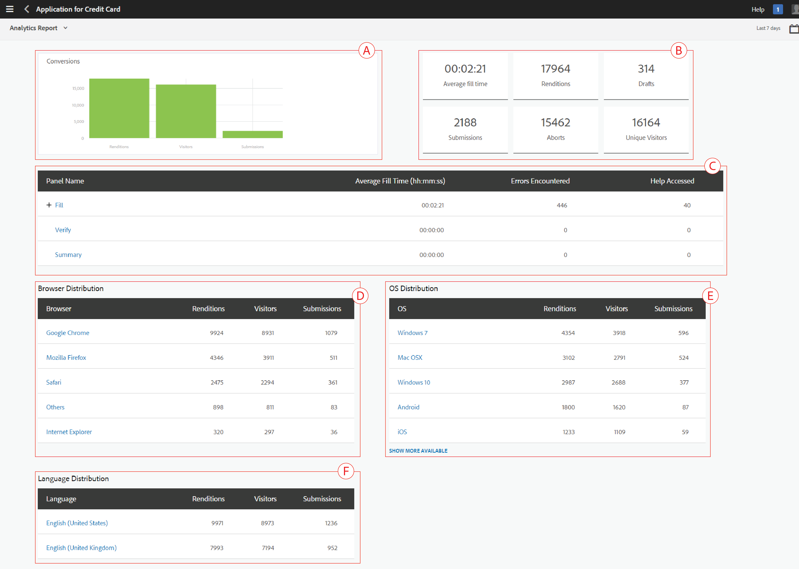
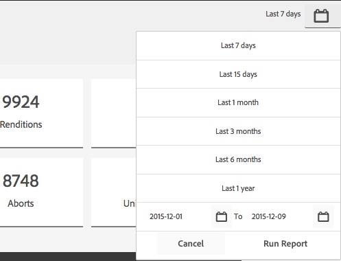
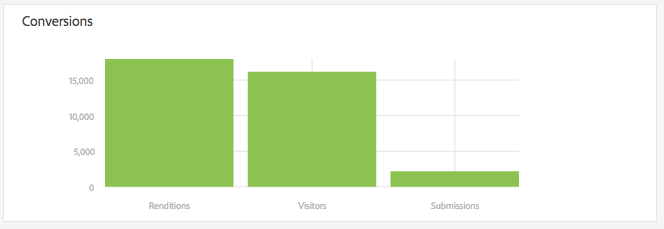

# Exibir e entender relatórios de análise do AEM Forms {#view-and-understand-aem-forms-analytics-reports}

O Adobe Experience Manager Forms é integrado ao Adobe Analytics, que permite capturar e rastrear métricas de desempenho para formulários e documentos publicados. O objetivo da análise dessas métricas é tomar decisões informadas com base nos dados sobre as alterações necessárias para tornar os formulários ou documentos mais utilizáveis.

## Configurar análises {#setting-up-analytics}

O recurso de análise no AEM Forms está disponível como parte do pacote complementar do AEM Forms. Para obter informações sobre como instalar o pacote complementar, consulte [Instalação e configuração do AEM Forms](../../forms/using/installing-configuring-aem-forms-osgi.md).

Além do pacote complementar, você precisa de uma conta do Adobe Analytics. Para obter informações sobre a solução, consulte [Adobe Analytics](https://www.adobe.com/solutions/digital-analytics.html).

Depois que você tiver o pacote complementar AEM Forms e uma conta do Adobe Analytics, integre a conta do Adobe Analytics ao AEM Forms e ative o rastreamento em seus formulários ou documentos, conforme descrito em [Configurar análises e relatórios](../../forms/using/configure-analytics-forms-documents.md).

### Como as informações de interação do usuário são registradas {#how-user-interaction-information-is-recorded}

Quando um usuário interage com o formulário, as interações são registradas e enviadas para o servidor do Analytics. A lista a seguir indica chamadas de servidor para várias atividades do usuário:

* 2 chamadas por campo por visita
* 1 para visita ao painel
* 1 para salvar
* 2 para apresentação
* 2 para salvar
* 1 para obter ajuda
* 1 para cada erro de validação
* 1 para execução de formulário + 1 para visita ao painel padrão + 1 para a primeira visita de campo padrão
* 2 para abandono de formulário

>[!NOTE]
>
>Esta lista não é exaustiva.

### Exibição de relatórios de análise {#summary-report}

Execute as seguintes etapas para exibir os relatórios de análise:

1. Faça logon no portal do AEM em `https://[hostname]:[port]`
1. Clique em **Formulários > Formulários e documentos**.
1. Selecione o formulário para o qual deseja exibir os relatórios de análise.
1. Selecione **Mais > Relatórios** do Analytics.

**** A. comando Relatório do Analytics

O AEM Forms exibe relatórios de análise para o formulário e para cada painel no formulário, como mostrado abaixo.

************ A. Conversões **B. Resumo no nível do formulário** C.**Resumo no nível do painel** D. Navegadores de visitantes - filtrar **E. SO dos visitantes - filtro** F. Idioma dos visitantes - filtro

Por padrão, o relatório de análise dos últimos sete dias é exibido. Você pode exibir relatórios dos últimos 15 dias, do último mês e assim por diante, ou especificar um intervalo de datas.

>[!NOTE]
>
>As opções como Últimos 7 dias e Últimos 15 dias não incluem dados do dia em que você está gerando o relatório de análise. Para incluir os dados do dia atual, é necessário especificar o intervalo de datas, incluindo o dia atual, e executar o relatório.

### Gráfico de conversões para formulários adaptáveis e HTML5 {#conversions-graph-for-adaptive-and-html-forms}

O gráfico de conversões em nível de formulário fornece um insight sobre o desempenho do formulário nos seguintes KPIs:

* **Representações**: O número de vezes que um formulário é aberto
* **Visitantes**: O número de visitantes do formulário
* **Envios**: Número de vezes que o formulário é enviado

### Relatório do Analytics para formulários adaptáveis e HTML5 {#analytics-report-for-adaptive-and-html-forms}

A seção de resumo no nível do formulário fornece um insight sobre o desempenho do formulário nos seguintes KPIs:

* **Tempo** médio de preenchimento: Tempo médio gasto no preenchimento do formulário. Quando os usuários passam tempo no formulário, mas não enviam, esse tempo não é incluído neste cálculo.
* **Representações**: Número de vezes que o formulário foi renderizado ou aberto
* **Rascunhos**: Número de vezes que o formulário foi salvo como rascunho
* **Envios**: Número de vezes que o formulário foi enviado
* **Abortar**: Número de vezes que os usuários começaram a preencher o formulário e foram deixados sem preencher o formulário
* **Visitantes**&#x200B;únicos: Número de vezes que o formulário é &quot;renderizado por visitantes únicos&quot;. Para obter mais informações sobre visitantes únicos, consulte Visitantes [únicos, Visitas e comportamento](https://helpx.adobe.com/analytics/kb/unique-visitors-visitor-behavior.html)do cliente.

### Panel report {#bottom-summary-report}

A seção de resumo no nível do painel fornece as seguintes informações sobre cada painel no formulário:

* **Tempo** médio de preenchimento: Tempo médio gasto no painel, independentemente de o formulário ser enviado ou não
* **Erros encontrados**: Número médio de erros encontrados pelos usuários nos campos em um painel. Os erros encontrados são obtidos pela divisão dos erros totais em um campo pelo número de representações do formulário.
* **Ajuda Acessada**: Número médio de vezes que os usuários acessaram a ajuda no contexto dos campos no painel. A Ajuda Acessada é obtida dividindo o número total de vezes que a Ajuda é acessada para um campo por número de representações do formulário.

#### Relatório detalhado do painel {#detailed-panel-report}

Você também pode exibir detalhes de cada painel clicando no nome de um painel no Relatório do painel.

O relatório detalhado mostra valores para todos os campos no painel.

O Relatório do painel tem três guias:

* **Relatório** de tempo (padrão): Exibe o tempo, em número de segundos, gasto no preenchimento de cada um dos campos no painel
* **Relatório** de erro: Exibe o número de erros encontrados pelos usuários ao preencher os campos
* **Relatório** de ajuda: Número de vezes que a ajuda para um campo específico foi acessada

É possível navegar entre os painéis, se houver vários painéis disponíveis.

### Filtros: Navegador, SO e idioma {#filters-browser-os-and-language}

As tabelas de Distribuição do navegador, Distribuição do SO e Distribuição de idiomas exibem as execuções, visitantes e envios de acordo com os navegadores, SO e Idioma dos usuários do formulário. Essas tabelas exibem no máximo cinco entradas, por padrão. Você pode clicar em Mostrar mais para exibir mais entradas e clicar em Mostrar menos para voltar às cinco entradas normais ou menos.

Para filtrar mais os dados de análise, clique em uma entrada em qualquer uma das tabelas. Por exemplo, se você clicar em Google Chrome na tabela de distribuição do navegador, o relatório será renderizado novamente com dados relevantes para o navegador Google Chrome da seguinte forma:

Se você exibir o relatório do painel depois de aplicar um filtro, os dados do relatório do painel também serão exibidos de acordo com o filtro aplicado.

Depois que um filtro é aplicado:

* As tabelas de distribuição se tornam somente leitura, pois apenas um filtro pode ser aplicado de cada vez.
* A tabela do filtro aplicado desaparece.
* Você pode clicar no botão Fechar (destacado abaixo) para remover o filtro aplicado.

### A/B Testing {#a-b-testing}

Se você tiver o teste A/B ativado e configurado para o formulário, a página do relatório terá um menu suspenso que pode ser usado para exibir o relatório de teste A/B. O relatório de teste A/B exibe o desempenho comparativo de duas versões do formulário conforme você configurou.

Para obter mais informações sobre o teste A/B, consulte [Criar e gerenciar o teste A/B para formulários](../../forms/using/ab-testing-adaptive-forms.md)adaptáveis.
