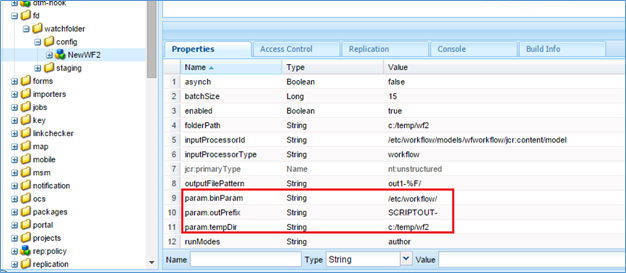

# Pasta assistida no AEM Forms{#watched-folder-in-aem-forms}

Um administrador pode configurar uma pasta de rede, conhecida como Pasta assistida, para que quando um usuário coloca um arquivo (como um arquivo PDF) na Pasta assistida, uma operação de fluxo de trabalho, serviço ou script pré-configurado seja iniciada para processar o arquivo adicionado. Depois que o serviço executa a operação especificada, ele salva o arquivo de resultado em uma pasta de saída especificada. Para obter mais informações sobre fluxo de trabalho, serviço e script, consulte [Vários métodos de processamento de arquivos](#variousmethodsforprocessingfiles).

## Criar uma pasta assistida {#create-a-watched-folder}

Você pode usar um dos seguintes métodos para criar uma Pasta assistida no sistema de arquivos:

* Ao configurar as propriedades de um nó de configuração de Pasta assistida, digite o caminho completo do diretório pai na propriedade folderPath e anexe o nome da Pasta assistida a ser criada, como mostrado no exemplo a seguir: `C:/MyPDFs/MyWatchedFolder`A `MyWatchedFolder`pasta não existe, o AEM Forms tenta criar a pasta no caminho especificado.

* Crie uma pasta no sistema de arquivos antes de configurar um ponto final de Pasta assistida e forneça o caminho completo na propriedade folderPath. Para obter informações detalhadas sobre a propriedade folderPath, consulte Propriedades [da pasta](#watchedfolderproperties)assistida.

>[!NOTE]
>
>Em um ambiente clusterizado, a pasta usada como uma Pasta monitorada deve ser acessível, gravável e compartilhada no sistema de arquivos ou na rede. Cada instância do servidor de aplicativos do cluster deve ter acesso à mesma pasta compartilhada. No Windows, crie uma unidade de rede mapeada em todos os servidores e especifique o caminho da unidade de rede mapeada na propriedade folderPath.

## Criar nó de configuração de pasta assistida {#create-watched-folder-configuration-node}

Para configurar uma Pasta assistida, crie um nó de configuração de Pasta assistida. Execute as seguintes etapas para criar o nó de configuração:

1. Faça logon no CRX-DE lite como administrador e navegue até a pasta /etc/fd/watchfolder/config.

1. Crie um nó do tipo `nt:unstructured`. Por exemplo, watchedfolder

   >[!NOTE]
   >
   >O nome do nó Pasta assistida não pode incluir espaços e caracteres especiais.

1. Adicione as seguintes propriedades ao nó:

   * `folderPath`
   * `inputProcessorType`
   * `inputProcessorId`
   * `outputFilePattern`
   Para obter a lista completa das propriedades compatíveis, consulte Propriedades [da pasta](#watchedfolderproperties)assistida.

1. Clique em **Salvar tudo**. Depois que o nó é criado e as propriedades são salvas. As `input`pastas, `result`, `failure`e `preserve`são criadas no caminho especificado na `stage``folderPath` propriedade.

   Os start do job de varredura estão digitalizando a Pasta assistida em um intervalo de tempo definido.

## Propriedades da pasta assistida {#watchedfolderproperties}

Você pode configurar as seguintes propriedades para uma Pasta assistida.

* **folderPath (String)**: O caminho da pasta a ser digitalizada em intervalos de tempo definidos. Para um ambiente clusterizado, a pasta deve estar em um local compartilhado, com todos os servidores com acesso total ao servidor. É uma propriedade obrigatória.
* **inputProcessorType (String)**: O tipo do processo a ser start. Você pode especificar fluxo de trabalho, script ou serviço. É uma propriedade obrigatória.
* **inputProcessorId (String)**: O comportamento da propriedade inputProcessorId é baseado no valor especificado para a propriedade inputProcessorType. É uma propriedade obrigatória. A lista a seguir detalha todos os valores possíveis da propriedade inputProcessorType e o requisito correspondente para a propriedade inputProcessorType:

   * Para fluxo de trabalho, especifique o modelo de fluxo de trabalho a ser executado. Por exemplo, /etc/workflow/models/&lt;nome_do_fluxo de trabalho>/jcr:content/model
   * Para o script, especifique o caminho JCR do script a ser executado. Por exemplo, /etc/fd/watchfolder/test/testScript.ecma
   * Para serviço, especifique o filtro usado para localizar um serviço OSGi. O serviço é registrado como uma implementação da interface com.adobe.aemfd.watchfolder.service.api.ContentProcessor.

* **runModes (String)**: Uma lista separada por vírgulas de modos de execução permitidos para execução do fluxo de trabalho. Alguns exemplos são:

   * author

   * publicação

   * autor,publicação

   * publicar, autor

**Observação**: *Se o servidor que hospeda a Pasta monitorada não tiver um dos modos de execução especificados, a Pasta monitorada sempre será ativada independentemente dos modos de execução no servidor.*

* **outputFilePattern (String)**: Padrão do arquivo de saída. Você pode especificar uma pasta ou um padrão de arquivo. Se um padrão de pasta for especificado, os arquivos de saída terão nomes como descrito em workflows. Se um padrão de arquivo for especificado, os arquivos de saída terão nomes como descrito no padrão de arquivo. [O padrão](../../forms/using/watched-folder-in-aem-forms.md#p-file-and-folder-patterns-p) de arquivo e pasta também pode especificar uma estrutura de diretório para os arquivos de saída. É uma propriedade obrigatória.

* **stageFileExpirationDuration (Long, default -1)**: O número de segundos de espera antes de um arquivo/pasta de entrada que já foi selecionado para processamento deve ser tratado como tendo o tempo limite expirado e marcado como uma falha. Esse mecanismo de expiração só é ativado quando o valor dessa propriedade é um número positivo.

   **Observação:** *Mesmo quando uma entrada é marcada como tendo expirado usando esse mecanismo, ainda pode estar sendo processada em segundo plano, mas apenas levando mais tempo do que o esperado. Se o conteúdo de entrada foi consumido antes do mecanismo de tempo limite ser iniciado, o processamento pode até mesmo continuar a ser concluído mais tarde e a saída ser despejada na pasta de resultados. Se o conteúdo não foi consumido antes do tempo limite, é muito provável que o processamento falhe mais tarde ao tentar consumir o conteúdo, e esse erro também será registrado na pasta de falha da mesma entrada. Por outro lado, se o processamento para a entrada nunca tiver sido ativado devido a um erro intermitente de trabalho/fluxo de trabalho (que é o cenário que o mecanismo de expiração pretende resolver), então, claro, nenhuma destas duas situações ocorrerá. Assim, para quaisquer entradas na pasta de falha que foram marcadas como falhas devido a um tempo limite (procure mensagens do formulário &quot;Arquivo não processado após um tempo significativo, marcando como falha!&quot; no registro de falhas), é aconselhável verificar a pasta de resultados (e também a própria pasta de falhas para outra entrada para a mesma entrada) para verificar se algum dos casos descritos anteriormente ocorreu de fato.*

* 
* **deleteExpiredStageFileOnlyWhenThrottled (Booliano, padrão true):** Se o mecanismo de expiração deve ser ativado somente quando a pasta monitorada for limitada. O mecanismo é mais relevante para as pastas monitoradas limitadas, já que um pequeno número de arquivos que permanecem em um estado não processado (devido a falhas intermitentes de trabalho/fluxo de trabalho) tem o potencial de reduzir o processamento para todo o lote quando a limitação está ativada. Se essa propriedade for mantida como true (o padrão), o mecanismo de expiração não será ativado para pastas monitoradas que não são limitadas. Se a propriedade for mantida como falsa, o mecanismo sempre será ativado, desde que a propriedade stageFileExpirationDuration seja um número positivo.

* **pollInterval (Longo)**: O intervalo em segundos para verificar a entrada da Pasta assistida. A menos que a configuração de aceleração esteja ativada, o Intervalo de pesquisa deve ser maior que o tempo para processar um trabalho médio; caso contrário, o sistema poderá ficar sobrecarregado. O valor padrão é 5. Consulte a descrição do Tamanho do lote para obter mais informações. O valor do intervalo de polling deve ser maior ou igual a um.
* **excludeFilePattern (String)**: Uma lista delimitada por ponto-e-vírgula (;) de padrões que uma Pasta assistida usa para determinar quais arquivos e pastas serão examinados e coletados. Nenhum arquivo ou pasta com esse padrão é verificado para processamento. Essa configuração é útil quando a entrada é uma pasta com vários arquivos. O conteúdo da pasta pode ser copiado em uma pasta com um nome que é selecionado pela Pasta assistida. Isso evita que a Pasta assistida pegue uma pasta para processamento antes que ela seja completamente copiada para a pasta de entrada. O valor padrão é nulo.
Você pode usar padrões [de](../../forms/using/watched-folder-in-aem-forms.md#p-file-and-folder-patterns-p) arquivo para excluir:

   * Arquivos com extensões de nome de arquivo específicas; por exemplo, *.dat, *.xml, .pdf, *.*
   * Arquivos com nomes específicos; por exemplo, data* excluiria arquivos e pastas chamados data1, data2 e assim por diante.
   * Arquivos com expressões compostas no nome e na extensão, como nestes exemplos:

      * Dados[0-9][0-9][0-9].[dD][aA]&#39;port&#39;
      * *.[dD][Aa]&#39;port&#39;
      * *.[Xx][Mm][Ll]

Para obter mais informações sobre padrões de arquivo, consulte [Sobre padrões](../../forms/using/watched-folder-in-aem-forms.md#p-file-and-folder-patterns-p)de arquivo.

* **includeFilePattern (String)**: Uma lista delimitada por ponto-e-vírgula (;) de padrões que a Pasta assistida usa para determinar quais pastas e arquivos serão examinados e coletados. Por exemplo, se IncludeFilePattern for input*, todos os arquivos e pastas que correspondem input* serão coletados. Isso inclui arquivos e pastas chamados input1, input2 e assim por diante. O valor padrão é * e indica todos os arquivos e pastas. Você pode usar padrões de arquivo para incluir:

   * Arquivos com extensões de nome de arquivo específicas; por exemplo, *.dat, *.xml, .pdf, *.*
   * Arquivos com nomes específicos; por exemplo, dados.* incluiria arquivos e pastas chamados data1, data2 e assim por diante.

* Arquivos com expressões compostas no nome e na extensão, como nestes exemplos:

   * Dados[0-9][0-9][0-9].[dD][aA]&#39;port&#39;

      * *.[dD][Aa]&#39;port&#39;
      * *.[Xx][Mm][Ll]

Para obter mais informações sobre padrões de arquivo, consulte [Sobre padrões de arquivo](../../forms/using/watched-folder-in-aem-forms.md#p-file-and-folder-patterns-p)

* **waitTime (Longo)**: O tempo, em milissegundos, para aguardar antes de digitalizar uma pasta ou um arquivo após sua criação. Por exemplo, se o tempo de espera for de 3.600.000 milissegundos (uma hora) e o arquivo tiver sido criado há um minuto, esse arquivo será coletado depois de 59 minutos ou mais. O valor padrão é 0. Essa configuração é útil para garantir que um arquivo ou pasta seja completamente copiado para a pasta de entrada. Por exemplo, se você tiver um arquivo grande para processar e o arquivo levar dez minutos para ser baixado, defina o tempo de espera para 10*60 *1000 milissegundos. Isso evita que a Pasta monitorada digitalize o arquivo se ele não tiver dez minutos.
* **purgeDuration (Long)**: Os arquivos e pastas na pasta de resultados são removidos quando são mais antigos que esse valor. Esse valor é medido em dias. Essa configuração é útil para garantir que a pasta de resultados não fique cheia. Um valor de -1 dias indica que a pasta de resultados nunca será excluída. O valor padrão é -1.
* **resultFolderName (String)**: A pasta onde os resultados salvos são armazenados. Se os resultados não forem exibidos nessa pasta, verifique a pasta de falha. Arquivos somente leitura não são processados e são salvos na pasta de falha. Esse valor pode ser um caminho absoluto ou relativo com os seguintes padrões de arquivo:

   * %F = prefixo de nome de arquivo
   * %E = extensão de nome de arquivo
   * %Y = ano (completo)
   * %y = ano (últimos dois dígitos)
   * %M = mês
   * %D = dia do mês
   * %d = dia do ano
   * %H = hora (relógio de 24 horas)
   * %h = hora (relógio de 12 horas)
   * %m = minuto
   * %s = segundo
   * %l = milissegundos
   * %R = número aleatório (entre 0 e 9)
   * %P = id de processo ou tarefa
   Por exemplo, se for 8 PM em 17 de julho de 2009 e você especificar C:/Test/WF0/failure/%Y/%M/%D/%H/, a pasta de resultados será C:/Test/WF0/failure/2009/07/17/20

   Se o caminho não for absoluto, mas relativo, a pasta será criada dentro da Pasta assistida. O valor padrão é result/%Y/%M/%D/, que é a pasta Result dentro da Pasta Monitorada. Para obter mais informações sobre padrões de arquivo, consulte [Sobre padrões](../../forms/using/watched-folder-in-aem-forms.md#p-file-and-folder-patterns-p)de arquivo.

>[!NOTE]
>
>Quanto menor for o tamanho das pastas de resultados, melhor será o desempenho da Pasta assistida. Por exemplo, se o carregamento estimado para a Pasta monitorada for de 1.000 arquivos a cada hora, tente um padrão como resultado/%Y%M%D%H para que uma nova subpasta seja criada a cada hora. Se a carga for menor (por exemplo, 1000 arquivos por dia), você poderá usar um padrão como resultado/%Y%M%D.

* **failureFolderName (String)**: A pasta onde os arquivos de falha são salvos. Esse local é sempre relativo à Pasta assistida. Você pode usar padrões de arquivo, conforme descrito para a Pasta de resultados. Arquivos somente leitura não são processados e são salvos na pasta de falha. O valor padrão é falha/%Y/%M/%D/.
* **preserveFolderName (String):** O local onde os arquivos são armazenados após o processamento bem-sucedido. O caminho pode ser absoluto, relativo ou nulo. Você pode usar padrões de arquivo, conforme descrito para a Pasta de resultados. O valor padrão é preserve/%Y/%M/%D/.
* **batchSize (Longo)**: O número de arquivos ou pastas a serem coletados por varredura. Utilização para evitar sobrecargas no sistema; a verificação de muitos arquivos ao mesmo tempo pode causar uma falha. O valor padrão é 2.

   As configurações Intervalo de pesquisa e Tamanho do lote determinam quantos arquivos a Pasta assistida seleciona em cada verificação. A Pasta assistida usa um pool de threads do Quartz para verificar a pasta de entrada. O pool de threads é compartilhado com outros serviços. Se o intervalo de digitalização for pequeno, os threads normalmente digitalizam a pasta de entrada. Se os arquivos forem descartados com frequência na Pasta monitorada, você deve manter o intervalo de verificação pequeno. Se os arquivos forem descartados com pouca frequência, use um intervalo de verificação maior para que os outros serviços possam usar os threads.

   Se houver um grande volume de arquivos sendo descartados, torne o tamanho do lote grande. Por exemplo, se o serviço iniciado pelo endpoint de Pasta monitorada puder processar 700 arquivos por minuto, e os usuários soltarem arquivos na pasta de entrada na mesma taxa, em seguida, configurar o Tamanho do lote para 350 e o Intervalo de pesquisa para 30 segundos ajudará o desempenho da Pasta assistida sem incorrer no custo de digitalização da Pasta assistida com muita frequência.

   Quando os arquivos são soltos na Pasta assistida, ele lista os arquivos na entrada, o que pode reduzir o desempenho se a varredura estiver acontecendo a cada segundo. O aumento do intervalo de varredura pode melhorar o desempenho. Se o volume de arquivos que está sendo descartado for pequeno, ajuste o Tamanho do lote e o Intervalo de pesquisa de acordo. Por exemplo, se 10 arquivos forem descartados a cada segundo, tente definir pollInterval como 1 segundo e o Tamanho do lote como 10

* **throttleOn (Booleano)**: Quando essa opção é selecionada, ela limita o número de trabalhos de Pasta assistida processados pelo AEM Forms em um determinado momento. O número máximo de trabalhos é determinado pelo valor Tamanho do Lote. O valor padrão é verdadeiro. (Consulte [Sobre limitação](../../forms/using/watched-folder-in-aem-forms.md#p-about-throttling-p).)

* **overwriteDuplicateFilename (Booleano)**: Quando definido como Verdadeiro, os arquivos na pasta de resultados e na pasta de preservação são substituídos. Quando definido como Falso, arquivos e pastas com um sufixo de índice numérico são usados para o nome. O valor padrão é Falso.
* **preserveOnFailure (Booliano)**: Preservar arquivos de entrada em caso de falha ao executar a operação em um serviço. O valor padrão é true.
* **inputFilePattern (String)**: Especifica o padrão dos arquivos de entrada para uma Pasta assistida. Cria uma lista de permissões dos arquivos.
* **asynch (Booleano)**: Identifica o tipo de invocação como assíncrono ou síncrono. O valor padrão é true (assíncrono). O processamento de arquivos é uma tarefa que consome recursos, mantenha o valor do sinalizador asynch como verdadeiro para evitar que o thread principal do trabalho de varredura seja bloqueado. Em um ambiente clusterizado, é importante manter o sinalizador true para permitir o balanceamento de carga dos arquivos processados nos servidores disponíveis. Se o sinalizador for falso, o trabalho de varredura tentará executar o processamento para cada arquivo/pasta de nível superior sequencialmente em seu próprio thread. Não defina o sinalizador como falso sem um motivo específico, como processamento baseado em fluxo de trabalho em uma configuração de servidor único.

>[!NOTE]
>
>Por padrão, os workflows são assíncronos. Mesmo se você definir o valor como falso, os workflows serão iniciados no modo assíncrono.

* **ativado (booleano)**: Desativa e ativa a varredura de uma Pasta assistida. Defina ativado como true para start digitalizando a Pasta assistida. O valor padrão é true.
* **payloadMapperFilter:** Quando uma pasta é configurada como pasta assistida, uma estrutura de pasta é criada dentro da pasta assistida. A estrutura tem pastas para fornecer entradas, receber saídas (resultados), salvar dados para falhas, preservar dados para processos de longa duração e salvar dados para vários estágios. A estrutura de pastas de uma Pasta assistida pode servir como uma carga de workflows centrados no Forms. Um mapeador de carga permite definir a estrutura de uma carga que usa uma Pasta assistida para entrada, saída e processamento. Por exemplo, se você usar o mapeador padrão, ele mapeará o conteúdo da Pasta assistida com a pasta [carga]\entrada e [carga]\saída. Duas implementações prontas para uso do mapeador de carga estão disponíveis. Se você não tiver [uma implementação](../../forms/using/watched-folder-in-aem-forms.md#creating-a-custom-payload-mapper-filter)personalizada, use uma implementação pronta para uso:

   * **Mapeador padrão:** Use o mapeador de carga padrão para manter o conteúdo de entrada e saída das pastas monitoradas em pastas de entrada e saída separadas na carga. Além disso, no caminho de carga de um fluxo de trabalho, use os caminhos de [carga]/entrada/ [carga]/saída para recuperar e salvar o conteúdo.

   * **Mapeador de carga simples baseado em arquivo:** Use o mapeador de carga baseado em Arquivo simples para manter o conteúdo de entrada e saída diretamente na pasta de carga. Ela não cria nenhuma hierarquia extra, como o mapeador padrão.

### Parâmetros de configuração personalizados {#custom-configuration-parameters}

Juntamente com as propriedades de configuração da Pasta assistida listadas acima, também é possível especificar parâmetros de configuração personalizados. Os parâmetros personalizados são passados para o código de processamento de arquivos. Ele permite que o código altere seu comportamento com base no valor do parâmetro. Para especificar um parâmetro:

1. Faça logon no CRXDE-Lite e navegue até o nó de configuração Pasta assistida.
1. Adicione um parâmetro de propriedade.&lt;property_name> para o nó de configuração Pasta assistida. O tipo da propriedade só pode ser Booliano, Date, Decimal, Duplo, Long e String. É possível especificar propriedades de valor único e múltiplo.

**Observação:** Se o tipo de dados da propriedade for Duplo, especifique um ponto decimal no valor dessas propriedades. Para todas as propriedades, onde o tipo de dados é Duplo e nenhum ponto decimal é especificado no valor, o tipo é convertido em Longo.

Essas propriedades são passadas como um mapa imutável do tipo Map&lt;String, Object> para o código de processamento. O código de processamento pode ser um ECMAScript, Fluxo de trabalho ou um Serviço. Os valores fornecidos para as propriedades estão disponíveis como pares de valores chave no mapa. Chave é o nome da propriedade e o valor é o valor da propriedade. Para obter mais informações sobre parâmetros de configuração personalizados, consulte a seguinte imagem:



Um exemplo de nó de configuração de pasta de observação com propriedades obrigatórias, algumas propriedades opcionais, alguns parâmetros de configuração.

#### Variáveis mutáveis para fluxos de trabalho {#mutable-variables-for-workflows}

É possível criar variáveis mutáveis para métodos de processamento de arquivos baseados em fluxo de trabalho. Essas variáveis servem como container para o fluxo de dados entre as etapas de um fluxo de trabalho. Para criar essas variáveis:

1. Faça logon no CRXDE-Lite e navegue até o nó de configuração Pasta assistida.

1. Adicione uma propriedade workflow.var.&lt;nome_variável> para o nó de configuração Pasta assistida.

   O tipo da propriedade só pode ser Booliano, Date, Decimal, Duplo, Long e String. Propriedades de vários valores também são suportadas. Para propriedades de vários valores, o valor disponível para a etapa do fluxo de trabalho é uma matriz de tipo especificado.

   >[!NOTE]
   >
   >Se o tipo de dados da propriedade for Duplo, especifique um ponto decimal no valor dessas propriedades. Para todas as propriedades, onde o tipo de dados é Duplo e nenhum ponto decimal é especificado no valor, o tipo é convertido em Longo.

>[!NOTE]
>
>A especificação JCR determina um valor padrão para as propriedades. Os valores padrão estão disponíveis para as etapas de um fluxo de trabalho para processamento. Portanto, especifique os valores padrão apropriados.


## Vários métodos de processamento de arquivos {#variousmethodsforprocessingfiles}

Você pode start um fluxo de trabalho, serviço ou script para processar os documentos colocados em uma pasta monitorada.

### Uso de um serviço para processar arquivos de uma pasta assistida {#using-a-service-to-process-files-of-a-watched-folder-nbsp}

Um Serviço é uma implementação personalizada da `com.adobe.aemfd.watchfolder.service.api.ContentProcessor` interface. Está registrado no OSGi junto com algumas propriedades personalizadas. As propriedades personalizadas da implementação tornam-na única e ajudam a identificar a implementação.

#### Implementação personalizada da interface ContentProcessor {#custom-implementation-of-the-contentprocessor-interface}

A implementação personalizada aceita um contexto de processamento (um objeto do tipo com.adobe.aemfd.watchfolder.service.api.ProcessorContext), lê documentos de entrada e parâmetros de configuração do contexto, processa as entradas e adiciona a saída de volta ao contexto. O ProcessorContext tem as seguintes APIs:

* **getWatchFolderId**: Retorna a ID da pasta assistida.
* **getInputMap**: Retorna um mapa do tipo Mapa. As chaves do mapa são o nome do arquivo de entrada e um objeto de documento que contém o conteúdo do arquivo. Use a API getinputMap para ler os arquivos de entrada.
* **getConfigParameters**: Retorna um mapa imutável do tipo Mapa. O mapa contém os parâmetros de configuração de uma Pasta monitorada.

* **setResult**: A implementação ContentProcessor usa a API para gravar o documento de saída na pasta de resultados. Você pode fornecer um nome para o arquivo de saída para a API setResult. A API pode optar por usar ou ignorar o arquivo fornecido, dependendo da pasta de saída/padrão de arquivo especificado. Se um padrão de pasta for especificado, os arquivos de saída terão nomes como descrito em workflows. Se um padrão de arquivo for especificado, os arquivos de saída terão nomes como descrito no padrão de arquivo.

Por exemplo, o código a seguir é uma implementação personalizada da interface ContentProcessor com uma propriedade foo=bar personalizada.

```java
@Component(metatype = true, immediate = true, label = "WF Test Service", description = "WF Test Service")
@Service(value = {OutputWriter.class, ContentProcessor.class})
@Property(name = "foo", value = "bar")
public class OutputWriter implements ContentProcessor {
```

Ao [configurar uma Pasta](../../forms/using/watched-folder-in-aem-forms.md#p-create-watched-folder-configuration-node-p)monitorada, se você especificar a propriedade inputProcessorId como (foo=bar) e a propriedade inputProcessorType como Serviço, o Serviço mencionado acima (implementação personalizada) será usado para processar os arquivos de entrada da Pasta monitorada.

O exemplo a seguir também é uma implementação personalizada da interface ContentProcessor. No exemplo, o Serviço aceita arquivos de entrada, copia os arquivos para um local temporário e retorna um objeto de documento com o conteúdo do arquivo. O conteúdo do objeto de documento é salvo na pasta de resultados. O caminho físico da pasta resultante é configurado no nó [de configuração Pasta](../../forms/using/watched-folder-in-aem-forms.md#p-create-watched-folder-configuration-node-p)assistida.

```java
@Component(immediate = true)
@Service(value = ContentProcessor.class)
@Property(name = "serviceSelector", value = "testProcessor1")
public class TestContentProcessor1 implements ContentProcessor {
    @Override
    public void processInputs(ProcessorContext context) throws Exception {
        Map.Entry<String, Document> e = context.getInputMap().entrySet().iterator().next();
        File f = new File((String) context.getConfigParameters().get("tempDir"),
                context.getConfigParameters().get("outPrefix") + e.getKey());
        e.getValue().copyToFile(f);
        context.setResult(f.getName(), new Document(f, true));
    }
}
```

### Uso de scripts para processar arquivos de uma pasta assistida {#using-scripts-to-process-files-of-a-watched-folder}

Scripts são o código personalizado de reclamação do ECMAScript gravado em documentos de processamento colocados na Pasta assistida. Um script é representado como um nó JCR. Além das variáveis padrão do ECMAScript (log, sling e muito mais), o Script tem uma variável processorContext. A variável é do tipo ProcessorContext. O ProcessorContext tem as seguintes APIs:

* **getWatchFolderId**: Retorna a ID da pasta assistida.
* **getInputMap**: Retorna um mapa do tipo Mapa. As chaves do mapa são o nome do arquivo de entrada e um objeto de documento que contém o conteúdo do arquivo. Use a API getinputMap para ler os arquivos de entrada.
* **getConfigParameters**: Retorna um mapa imutável do tipo Mapa. O mapa contém os parâmetros de configuração de uma Pasta assistida.
* **setResult**: A implementação ContentProcessor usa a API para gravar o documento de saída na pasta de resultados. Você pode fornecer um nome para o arquivo de saída para a API setResult. A API pode optar por usar ou ignorar o arquivo fornecido, dependendo da pasta de saída/padrão de arquivo especificado. Se um padrão de pasta for especificado, os arquivos de saída terão nomes como descrito em workflows. Se um padrão de arquivo for especificado, os arquivos de saída terão nomes como descrito no padrão de arquivo.

O código a seguir é um exemplo de ECMAScript. Ele aceita arquivos de entrada, copia os arquivos para um local temporário e retorna um objeto de documento com o conteúdo do arquivo. O conteúdo do objeto de documento é salvo na pasta de resultados. O caminho físico da pasta resultante é configurado no nó [de configuração Pasta](../../forms/using/watched-folder-in-aem-forms.md#p-create-watched-folder-configuration-node-p)assistida.

>[!NOTE]
>
>A pasta de saída e o prefixo de nome de arquivo são decididos com base nos parâmetros de configuração da Pasta assistida.

```java
var inputMap = processorContext.getInputMap();
var params = processorContext.getConfigParameters();
var entry = inputMap.entrySet().iterator().next();
var tempFile = new Packages.java.io.File(params.get("tempDir"), params.get("outPrefix") + entry.getKey());
entry.getValue().copyToFile(tempFile);
processorContext.setResult(tempFile.getName(), new Packages.com.adobe.aemfd.docmanager.Document(tempFile, true));
```

#### Localização dos scripts e considerações de segurança {#location-of-scripts-and-security-considerations}

Por padrão, uma pasta de container (/etc/fd/watchfolder/scripts) é fornecida onde os clientes podem colocar seus scripts, e o usuário do serviço padrão usado pela estrutura da pasta de monitoramento tem as permissões necessárias para ler scripts desse local.

Se você planeja colocar seus scripts em um local personalizado, é provável que o usuário-serviço padrão não tenha permissões de leitura sobre o local personalizado. Para esse cenário, execute as seguintes etapas para fornecer as permissões necessárias para o local personalizado:

1. Crie um usuário do sistema de forma programática ou por meio do console https://&#39;[server]:[port]&#39;/crx/explorer. Você também pode usar um usuário existente do sistema. É importante trabalhar com usuários do sistema aqui, em vez de usuários normais.
1. Forneça permissões de leitura para o usuário do sistema recém-criado ou existente no local personalizado onde os scripts são armazenados. Você pode ter vários locais personalizados. Forneça pelo menos permissões de leitura para todos os locais personalizados.
1. No console de configuração do Felix (/system/console/configMgr), localize o mapeamento do usuário do serviço para as pastas monitoradas. Este mapeamento parece com &quot;Mapeamento: adobe-aemds-core-watch-folder=...&#39;.
1. Clique no mapeamento. Para a entrada &#39;adobe-aemds-core-watch-folder:scripts=fd-service&#39;, altere fd-service para a ID do usuário do sistema personalizado. Clique em Salvar.

Agora, você pode usar o local personalizado configurado para salvar os scripts.

### Usando um fluxo de trabalho para processar arquivos de uma pasta assistida {#using-a-workflow-to-process-files-of-a-watched-folder}

Os Workflows permitem que você automatize as atividades do Experience Manager. Os Workflows consistem em uma série de etapas executadas em uma ordem específica. Cada etapa executa uma atividade distinta, como ativar uma página ou enviar uma mensagem de email. Os Workflows podem interagir com ativos no repositório, contas de usuário e serviços do Experience Manager. Portanto, workflows podem coordenar coisas complicadas.

* Antes de criar um fluxo de trabalho, considere os seguintes pontos:
* A saída de uma etapa deve estar disponível para todas as etapas subsequentes.
As etapas devem ser capazes de atualizar (ou mesmo excluir) as saídas existentes geradas pelas etapas anteriores.
* As variáveis mutáveis são usadas para continuar os dados dinâmicos personalizados entre as etapas.

Execute as seguintes etapas para processar arquivos usando workflows:

1. Crie uma implementação da `com.adobe.aemfd.watchfolder.workflow.api.WorkflowContextProcessor` interface. É semelhante à implementação criada para um Serviço.

   >[!NOTE]
   >
   >É possível criar a implementação completa totalmente no ECMAScript.

1. Em uma etapa do Workflow, localize o serviço OSGi do tipo com.adobe.aemfd.watchfolder.workflow.api.WorkflowContextService e chame o método execute() do serviço com os seguintes argumentos.

   * Sua implementação personalizada da interface WorkflowContextProcessor
   * workItem
   * workflowSession
   * metadata

Se você usar a linguagem de programação Java para implementar o fluxo de trabalho, o motor de workflow AEM fornece valor para as variáveis workItem, workflowSession e metadata. Essas variáveis são passadas como argumentos para o método execute() de sua implementação WorkflowProcess personalizada.

Se você usar o ECMAScript para implementar o fluxo de trabalho, o motor de workflow AEM fornece valor para graniteWorkItem, graniteWorkflowSession e variáveis de metadados. Essas variáveis são passadas como argumentos para o método WorkflowContextService.execute().

O argumento para processWorkflowContext() é um objeto do tipo com.adobe.aemfd.watchfolder.workflow.api.WorkflowContext. A interface WorkflowContext tem as seguintes APIs para facilitar as considerações específicas do fluxo de trabalho mencionadas acima:

* getWorkItem: Retorna o valor da variável WorkItem. As variáveis são passadas para o método WorkflowContextService.execute().
* getWorkflowSession: Retorna o valor da variável WorkflowSession. As variáveis são passadas para o método WorkflowContextService.execute().
* getMetadata: Retorna o valor da variável Metadados. As variáveis são passadas para o método WorkflowContextService.execute().
* getCommitedVariables: Retorna um mapa de objetos somente leitura que representa variáveis definidas por etapas anteriores. Se uma variável não for modificada em nenhuma das etapas anteriores, o valor padrão especificado durante a configuração da Pasta monitorada será retornado.
* getCommitedResults: Retorna um mapa de Documentos somente leitura. O mapa representa os arquivos de saída gerados pelas etapas anteriores.
* setVariable: A implementação WorkflowContextProcessor usa a variável para manipular as variáveis que representam os dados dinâmicos personalizados que fluem entre as etapas. O nome e o tipo das variáveis são idênticos ao nome das variáveis especificadas durante a [configuração da Pasta](../../forms/using/watched-folder-in-aem-forms.md#p-configure-the-watched-folder-p)assistida. Para alterar o valor de uma variável, chame a API setVariable com um valor não nulo. Para remover uma variável, chame setVariable() com um valor nulo.

As seguintes APIs ProcessorContext também estão disponíveis:

* getWatchFolderId: Retorna a ID da pasta assistida.
* getInputMap: Retorna um mapa do tipo Map&lt;String, Documento>. As chaves do mapa são o nome do arquivo de entrada e um objeto de documento que contém o conteúdo do arquivo. Use a API getinputMap para ler os arquivos de entrada.
* getConfigParameters: Retorna um mapa imutável do tipo Map&lt;String, Object>. O mapa contém os parâmetros de configuração de uma Pasta assistida.
* setResult: A implementação ContentProcessor usa a API para gravar o documento de saída na pasta de resultados. Você pode fornecer um nome para o arquivo de saída para a API setResult. A API pode optar por usar ou ignorar o arquivo fornecido, dependendo da pasta de saída/padrão de arquivo especificado. Se um padrão de pasta for especificado, os arquivos de saída terão nomes como descrito em workflows. Se um padrão de arquivo for especificado, os arquivos de saída terão nomes como descrito no padrão de arquivo

Consideração para a API setResult, quando usada em workflows:

* Para adicionar um novo documento de saída que contribua para a saída geral do fluxo de trabalho, chame a API setResult com um nome de arquivo que não tenha sido usado como nome de arquivo de saída por nenhuma etapa anterior.
* Para atualizar uma saída gerada por uma etapa anterior, chame a API setResult com um nome de arquivo já usado por uma etapa anterior.
* Para excluir uma saída gerada por uma etapa anterior, chame setResult com um nome de arquivo já usado por uma etapa anterior e nulo como conteúdo.

>[!NOTE]
>
>Chamar a API setResult com conteúdo nulo em qualquer outro cenário resultaria em um erro.

O exemplo a seguir é implementado como uma etapa de fluxo de trabalho. No exemplo, o ECMAscript usa uma variável stepCount para rastrear o número de vezes que uma etapa é chamada na instância de fluxo de trabalho atual.
O nome da pasta de saída é uma combinação do número da etapa atual, do nome do arquivo original e do prefixo especificado no parâmetro outPrefix.

O ECMAScript recebe uma referência do serviço de contexto do fluxo de trabalho e cria uma implementação da interface WorkflowContextProcessor. A implementação WorkflowContextProcessor aceita arquivos de entrada, copia o arquivo para um local temporário e retorna um documento representando o arquivo copiado. Com base no valor da variável Booliana purgePrevious, a etapa atual exclui a saída gerada pela última vez pela mesma etapa quando a etapa foi iniciada na instância de fluxo de trabalho atual. No final, o método wfSvc.execute é chamado para executar a implementação WorkflowContextProcessor. O conteúdo do documento de saída é salvo na pasta de resultados no caminho físico mencionado no nó de configuração Pasta assistida.

```java
log.error("Watch-folder workflow script called for step: " + graniteWorkItem.getNode().getTitle());
var wfSvc = sling.getService(Packages.com.adobe.aemfd.watchfolder.workflow.api.WorkflowContextService);
// Custom WorkflowContextProcessor implementation which defines the processWorkflowContext() method purely in JS
var impl = { processWorkflowContext: function (wfContext) {
    var wfId = wfContext.getWatchFolderId();
    var inputMap = wfContext.getInputMap();
    var paramMap = wfContext.getConfigParameters();
    var preResults = wfContext.getCommittedResults();
    var preVars = wfContext.getCommittedVariables();
    log.info("WF ID: " + wfId); // workflowId of type String
    log.info("Inputs: " + inputMap); // Input map of type Map<String, Document>
    log.info("Params: " + paramMap); // Config params of type Map<String, Object>
    log.info("Old results: " + preResults);
    log.info("Old variables: " + preVars);
    var currStepNumber = new Packages.java.lang.Long(new Packages.java.lang.Long(preVars.get("stepCount")).longValue() + 1);
    log.info("Current step number: " + currStepNumber);
    wfContext.setVariable("stepCount", currStepNumber);
    var entry = inputMap.entrySet().iterator().next();
    var tempFile = new Packages.java.io.File(paramMap.get("tempDir"), paramMap.get("outPrefix") + "STEP-" + currStepNumber + "-" + entry.getKey());
    entry.getValue().copyToFile(tempFile);
    var fName = tempFile.getName();
    var outDoc = new Packages.com.adobe.aemfd.docmanager.Document(tempFile, true);
    wfContext.setResult(tempFile.getName(), outDoc);
    var prevStepOutName = paramMap.get("outPrefix") + "STEP-" + (currStepNumber - 1) + "-" + entry.getKey();
    if (preResults.containsKey(prevStepOutName) && paramMap.get("purgePrevious").booleanValue()) {
        log.info("Purging previous step output " + prevStepOutName);
        wfContext.setResult(prevStepOutName, null);
    }
} }
wfSvc.execute(impl, graniteWorkItem, graniteWorkflowSession, metaData);
log.info("Exiting workflow script!")
```

### Criar filtro do mapeador de carga para mapear a estrutura de uma pasta assistida para a carga de um fluxo de trabalho {#create-payload-mapper-filter-to-map-structure-of-a-watched-folder-to-the-payload-of-a-workflow}

Quando você cria uma pasta assistida, ela cria uma estrutura de pasta dentro da pasta que está sendo assistida. A estrutura de pastas tem pastas stage, result, preserve, input e failure. A estrutura de pastas pode servir como carga de entrada para o fluxo de trabalho e aceitar saída de um fluxo de trabalho. Ele também pode lista pontos de falha, se houver.

Se a estrutura de uma carga for diferente da estrutura da pasta assistida, você poderá gravar scripts personalizados para mapear a estrutura da pasta assistida para a carga. Esse script é chamado de filtro de mapeador de carga. O AEM Forms fornece um filtro mapeador de carga para mapear a estrutura da pasta assistida para uma carga.

#### Criação de um filtro personalizado de mapeador de carga {#creating-a-custom-payload-mapper-filter}

1. Baixe o SDK [do cliente](https://repo.adobe.com/nexus/content/groups/public/com/adobe/aemfd/aemfd-client-sdk/6.3.0/aemfd-client-sdk-6.3.0.jar)Adobe.
1. Configure o SDK do cliente no caminho de compilação do projeto baseado em maven. Para começar, você pode baixar e abrir o seguinte projeto baseado em maven no IDE de sua escolha.
1. Edite o código de filtro do mapeador de carga disponível no conjunto de amostras para atender às suas necessidades.
1. Use maven para criar um pacote do Filtro do Mapeador de Carga personalizado.
1. Use o console [](https://localhost:4502/system/console/bundles) AEM bundles para instalar o pacote.

   Agora, o Filtro personalizado do mapeador de carga está listado na interface do usuário da pasta assistida pelo AEM. Você pode usá-lo com seu fluxo de trabalho.

   O código de exemplo a seguir implementa um mapeador simples baseado em arquivo para os arquivos salvos em relação a uma carga. Você pode usá-lo para começar.

   ```java
   package com.adobe.aemfd.watchfolder.workflow;
   import com.adobe.aemfd.docmanager.Document;
   import com.adobe.aemfd.watchfolder.workflow.api.payload.PayloadMapper;
   import com.adobe.aemfd.watchfolder.workflow.api.payload.WorkflowExecutionContext;
   import com.adobe.aemfd.watchfolder.workflow.api.payload.WorkflowInitializationContext;
   import com.adobe.aemfd.watchfolder.workflow.api.payload.WorkflowVariable;
   import com.adobe.granite.workflow.exec.Workflow;
   import org.apache.felix.scr.annotations.Component;
   import org.apache.felix.scr.annotations.Service;
   import org.apache.sling.api.resource.ResourceResolver;
   import javax.jcr.Binary;
   import javax.jcr.Node;
   import java.util.Collection;
   import java.util.HashMap;
   import java.util.Map;
   @Component(immediate = true)
   @Service(value = PayloadMapper.class)
   public class SimpleFileBasedPayloadMapper implements PayloadMapper {
   @Override
   public Node createPayload(WorkflowInitializationContext wfInitCtxt, Node stagingFolder, String uniquePayloadName,
   Map<String, Binary> inputs, Collection<WorkflowVariable> variableDefs) throws Exception {
   Node dirNode = stagingFolder.addNode(uniquePayloadName, "sling:Folder");
   for (Map.Entry<String, Binary> bins: inputs.entrySet()) {
   Node fileNode = dirNode.addNode(bins.getKey(), "nt:file");
   Node resNode = fileNode.addNode ("jcr:content", "nt:resource");
   resNode.setProperty("jcr:data", bins.getValue());
   }
   return dirNode;
   }
   @Override
   public Map<String, Document> getInputs(WorkflowInitializationContext wfInitCtxt, WorkflowExecutionContext wfExecCtxt,
   Node payload, ResourceResolver resourceResolver) throws Exception {
   return null; //To change body of implemented methods use File | Settings | File Templates.
   }
   @Override
   public void setOutput(WorkflowInitializationContext wfInitCtxt, WorkflowExecutionContext wfExecCtxt, Node payload,
   String fileName, Binary contents, int outputMode) throws Exception {
   //To change body of implemented methods use File | Settings | File Templates.
   }
   @Override
   public Map<String, Document> getIntermediateOutputs(WorkflowInitializationContext wfInitCtxt,
   WorkflowExecutionContext wfExecCtxt, Node payload,
   ResourceResolver resourceResolver) throws Exception {
   return null; //To change body of implemented methods use File | Settings | File Templates.
   }
   @Override
   public Map<String, Document> getFinalOutputs(WorkflowInitializationContext wfInitCtxt, Workflow workflow, Node payload,
   ResourceResolver resourceResolver) throws Exception {
   Map<String, Object> params = wfInitCtxt.getConfigParameters();
   Map<String, Document> result = new HashMap<String, Document>();
   for (Map.Entry<String, Object> me: params.entrySet()) {
   String key = me.getKey();
   if (key.startsWith("pm.outfile.")) {
   String fName = (String) me.getValue();
   Document d = new Document(payload.getPath() + "/" + fName, resourceResolver);
   result.put(fName, d);
   }
   }
   return result;
   }
   @Override
   public void setVariable(WorkflowInitializationContext wfInitCtxt, WorkflowExecutionContext wfExecCtxt, Node payload,
   WorkflowVariable variable) throws Exception {
   //To change body of implemented methods use File | Settings | File Templates.
   }
   @Override
   public Map<String, Object> getVariables(WorkflowInitializationContext wfInitCtxt, WorkflowExecutionContext wfExecCtxt,
   Node payload) throws Exception {
   return null; //To change body of implemented methods use File | Settings | File Templates.
   }
   }
   ```

## Como os usuários interagem com uma pasta assistida {#how-users-interact-with-a-watched-folder}

Para um endpoint de Pasta assistida, os usuários podem start operações de processamento de arquivos copiando ou arrastando arquivos ou pastas de entrada de suas áreas de trabalho para uma Pasta assistida. Os arquivos são processados na ordem de chegada.

Para pontos de extremidade de Pasta assistida, se um trabalho exigir apenas um arquivo de entrada, o usuário poderá copiar esse arquivo para a raiz da Pasta assistida.

Se o trabalho contiver mais de um arquivo de entrada, o usuário deverá criar uma pasta fora da hierarquia Pastas monitoradas que contenha todos os arquivos necessários. Essa nova pasta deve incluir os arquivos de entrada (e, opcionalmente, um arquivo DX, se exigido pelo processo). Depois que a pasta de trabalho é construída, o usuário a copia para a pasta de entrada da Pasta monitorada.

>[!NOTE]
>
>Verifique se o servidor de aplicativos excluiu o acesso aos arquivos na Pasta assistida. Se o AEM Forms não puder excluir os arquivos da pasta de entrada depois que eles forem verificados, o processo associado será iniciado indefinidamente.

## Informações adicionais sobre as Pastas Monitoradas {#additional-information-about-the-watched-folders}

### Sobre a limitação {#about-throttling}

Quando a limitação está ativada para um ponto de extremidade de pasta monitorada, ela limita o número de trabalhos de Pastas Monitoradas que são processados em um determinado momento. O número máximo de trabalhos é determinado pelo valor Tamanho do lote, também configurável no ponto final da Pasta assistida. Quando o limite de limitação for atingido, os documentos recebidos no diretório de entrada da Pasta monitorada não serão pesquisados. O documento também permanece no diretório de entrada até que outros trabalhos da Pasta monitorada sejam concluídos e outra tentativa de pesquisa seja feita. Para processamento síncrono, todas as tarefas processadas em uma única pesquisa são contadas em direção ao limite de limitação, mesmo que as tarefas sejam processadas consecutivamente em um único thread.

>[!NOTE]
>
>A limitação não é dimensionada com um cluster. Quando a limitação estiver ativada, o cluster como um todo não processará mais do que o número de trabalhos especificados no Tamanho do Lote em um determinado momento. Esse limite é todo o cluster e não específico para cada nó no cluster. Por exemplo, com um Tamanho em lote de 2, o limite de limitação poderia ser atingido com um único nó processando duas tarefas, e nenhum outro nó sondaria o diretório de entrada até que uma das tarefas fosse concluída.

#### Como a limitação funciona {#how-throttling-works}

A Pasta assistida verifica a pasta de entrada em cada pollInterval, seleciona o número de arquivos especificados no Tamanho do lote e chama o serviço de público alvo para cada um desses arquivos. Por exemplo, se o Tamanho do lote for quatro, em cada verificação, a Pasta assistida selecionará quatro arquivos, criará quatro solicitações de invocação e chamará o serviço de público alvo. Antes de essas solicitações serem concluídas, se a Pasta assistida for invocada, ela start novamente quatro trabalhos, independentemente de as quatro tarefas anteriores serem concluídas ou não.

A limitação impede que a Pasta assistida chame novas tarefas quando as tarefas anteriores não estiverem concluídas. A Pasta assistida detecta trabalhos em andamento e processa novos trabalhos com base no tamanho do lote menos trabalhos em andamento. Por exemplo, na segunda invocação, se o número de trabalhos concluídos for apenas três e uma tarefa ainda estiver em andamento, a Pasta monitorada chamará apenas mais três trabalhos.

* A Pasta assistida depende do número de arquivos presentes na pasta stage para descobrir quantas tarefas estão em andamento. Se os arquivos permanecerem não processados na pasta stage, a Pasta assistida não chamará mais trabalhos. Por exemplo, se o tamanho do lote for quatro e três trabalhos estiverem parados, a Pasta assistida chamará apenas um trabalho em invocações subsequentes. Há vários cenários que podem fazer com que os arquivos permaneçam não processados na pasta stage. Quando os trabalhos estão parados, o administrador pode encerrar o processo na página de administração do Process Management para que a Pasta monitorada mova os arquivos para fora da pasta de estágio.
* Se o servidor do AEM Forms falhar antes de a Pasta assistida chamar os trabalhos, o administrador poderá mover os arquivos para fora da pasta stage. Para obter informações, consulte Pontos de [falha e recuperação](../../forms/using/watched-folder-in-aem-forms.md#p-failure-points-and-recoveryfailure-points-and-recovery-p).
* Se o servidor de Formulários AEM estiver em execução, mas a Pasta monitorada não estiver em execução quando o serviço Gerenciador de trabalhos retornar, o que ocorre quando os serviços não são start na sequência ordenada, o administrador pode mover os arquivos para fora da pasta do palco. Para obter informações, consulte Pontos de [falha e recuperação](../../forms/using/watched-folder-in-aem-forms.md#p-failure-points-and-recoveryfailure-points-and-recovery-p).

### Pontos de falha e recuperaçãoPontos de falha e recuperação {#failure-points-and-recoveryfailure-points-and-recovery}

Em cada evento de pesquisa, a Pasta assistida bloqueia a pasta de entrada, move os arquivos que correspondem ao padrão de arquivo de inclusão para a pasta de palco e, em seguida, desbloqueia a pasta de entrada. O bloqueio é necessário para que dois processos não captem o mesmo conjunto de arquivos e os processem duas vezes. As chances de isso acontecer aumentam com um pequeno pollInterval e um grande lote. Depois que os arquivos são movidos para a pasta stage, a pasta de entrada é desbloqueada para que outros threads possam digitalizar a pasta. Esta etapa ajuda a fornecer alta throughput, pois outros processos podem digitalizar enquanto um segmento está processando os arquivos.

Depois que os arquivos são movidos para a pasta stage, as solicitações de invocação são criadas para cada arquivo e o serviço de público alvo é chamado. Pode haver casos em que a Pasta assistida não possa recuperar os arquivos na pasta stage:

* Se o servidor falhar antes que a Pasta assistida possa criar a solicitação de invocação, os arquivos na pasta stage permanecerão na pasta stage e não serão recuperados.

* Se a Pasta assistida tiver criado com êxito a solicitação de invocação para cada um dos arquivos na pasta stage e o servidor falhar, há dois comportamentos com base no tipo de invocação:

   * **Síncrono**: Se a Pasta assistida estiver configurada para chamar o serviço de forma síncrona, todos os arquivos na pasta stage permanecerão não processados na pasta stage.
   * **Assíncrono**: Nesse caso, a Pasta monitorada depende do serviço Gerenciador de tarefas. Se o Serviço do Gerenciador de tarefas retornar a Pasta monitorada, os arquivos na pasta stage serão movidos para a pasta preserve ou failure com base nos resultados da invocação. Se o serviço Gerenciador de trabalhos não retornar a chamada de Pasta assistida, os arquivos permanecerão não processados na pasta stage. Essa situação ocorre quando a Pasta monitorada não está sendo executada quando o Gerenciador de tarefas chama novamente.

#### Recuperar arquivos de origem não processados na pasta stage {#recover-unprocessed-source-files-in-the-stage-folder}

Quando a Pasta assistida não puder processar os arquivos de origem na pasta stage, você poderá recuperar os arquivos não processados.

1. Reinicie o servidor ou nó do aplicativo.

1. Impedir a pasta assistida de processar novos arquivos de entrada. Se você ignorar esta etapa, será muito mais difícil determinar quais arquivos são não processados na pasta stage. Para impedir que a Pasta assistida processe novos arquivos de entrada, execute uma das seguintes tarefas:

   * Altere a propriedade includeFilePattern da Pasta assistida para algo que não corresponda a nenhum dos novos arquivos de entrada (por exemplo, insira NOMATCH).
   * Suspenda o processo que está criando novos arquivos de entrada.
   Aguarde até que o AEM Forms recupere e processe todos os arquivos. A maioria dos arquivos deve ser recuperada e todos os novos arquivos de entrada processados corretamente. O tempo que você espera que a Pasta assistida recupere e processe os arquivos dependerá da duração da operação a ser chamada e do número de arquivos a serem recuperados.

1. Determine quais arquivos não podem ser processados. Se você esperou um tempo adequado e concluiu a etapa anterior, e ainda houver arquivos não processados restantes na pasta stage, vá para a próxima etapa.

   >[!NOTE]
   >
   >Você pode verificar a data e a hora dos arquivos no diretório stage. Dependendo do número de arquivos e do tempo de processamento normal, você pode determinar quais arquivos são antigos o suficiente para serem considerados presos.

1. Copie os arquivos não processados do diretório stage para o diretório de entrada.

1. Se você impediu a Pasta monitorada de processar novos arquivos de entrada na etapa 2, altere a opção Incluir padrão de arquivo para seu valor anterior ou reative o processo que você desativou.

### Pastas monitoradas em cadeia juntas {#chain-watched-folders-together}

As Pastas monitoradas podem ser encadeadas juntas para que o documento de resultado de uma Pasta assistida seja o documento de entrada da próxima Pasta assistida. Cada pasta assistida pode chamar um serviço diferente. Ao configurar Pastas monitoradas dessa maneira, vários serviços podem ser chamados. Por exemplo, uma Pasta assistida pode converter arquivos PDF em Adobe PostScript® e uma segunda Pasta assistida pode converter os arquivos PostScript em formato PDF/A. Para fazer isso, basta definir a pasta de resultados da Pasta assistida definida pelo seu primeiro ponto de extremidade para apontar para a pasta de entrada da Pasta assistida definida pelo seu segundo ponto de extremidade.

A saída da primeira conversão iria para \path\result. A entrada para a segunda conversão seria \path\result, e a saída da segunda conversão seria enviada para \path\result\result (ou para o diretório definido na caixa Pasta de resultados para a segunda conversão).

### Padrões de arquivos e pastas {#file-and-folder-patterns}

Os administradores podem especificar o tipo de arquivo que pode chamar um serviço. Vários padrões de arquivo podem ser estabelecidos para cada Pasta assistida. Um padrão de arquivo pode ser uma das seguintes propriedades de arquivo:

* Arquivos com extensões de nome de arquivo específicas; por exemplo, *.dat, *.xml, .pdf, *.*
* Arquivos com nomes específicos; por exemplo, dados.*
* Arquivos com expressões compostas no nome e na extensão, como nestes exemplos:

   * Dados[0-9][0-9][0-9].[dD][aA]&#39;port&#39;
   * *.[dD][Aa]&#39;port&#39;
   * *.[Xx][Mm][Ll]

* O administrador pode definir o padrão de arquivo da pasta de saída para armazenar os resultados. Para as pastas de saída (resultado, preservação e falha), o administrador pode especificar qualquer um destes padrões de arquivo:
* %Y = ano (completo)
* %y = ano (últimos dois dígitos)
* %M = mês,
* %D = dia do mês,
* %d = dia do ano,
* %h = hora,
* %m = minuto,
* %s = segundo,
* %R = número aleatório entre 0 e 9
* %J = Nome do trabalho

Por exemplo, o caminho para a pasta de resultados pode ser C:\Adobe\Adobe LiveCycle ES4\BarcodedForms\%y\%m\%d.

Mapeamentos de parâmetros de saída também podem especificar padrões adicionais, como estes:

* %F = Nome do Arquivo de Origem
* %E = Extensão do Nome de Arquivo de Origem

Se o padrão de mapeamento do parâmetro de saída terminar com &quot;File.separator&quot; (que é o separador de caminho), uma pasta será criada e o conteúdo será copiado para essa pasta. Se o padrão não terminar com &quot;File.separator&quot;, o conteúdo (arquivo ou pasta de resultado) será criado com esse nome.

## Uso do Gerador de PDF com uma pasta assistida {#using-pdf-generator-with-a-watched-folder}

Você pode configurar uma Pasta assistida para iniciar um fluxo de trabalho, serviço ou script para processar os arquivos de entrada. Na seção a seguir, configuraremos uma Pasta monitorada para iniciar um ECMAScript. O ECMAScript usaria o Gerador de PDF para converter documentos do Microsoft Word (.docx) em documentos PDF.

Execute as seguintes etapas para configurar uma Pasta assistida com o Gerador de PDF:

1. [Criar um ECMAScript](../../forms/using/watched-folder-in-aem-forms.md#p-create-an-ecmascript-p)
1. [Criar um fluxo de trabalho](../../forms/using/watched-folder-in-aem-forms.md#p-create-a-workflow-p)
1. [Configurar a pasta assistida](../../forms/using/watched-folder-in-aem-forms.md#p-configure-the-watched-folder-p)

### Criar um ECMAScript {#create-an-ecmascript}

O ECMAScript usaria a API createPDF do Gerador de PDF para converter documentos do Microsoft Word (.docx) em documentos PDF. Execute as seguintes etapas para criar o script:

1. Abra o CRXDE lite em uma janela do navegador. O URL é https://&#39;[server]:[port]&#39;/crx/de.

1. Navegue até /etc/workflow/scripts e crie uma pasta chamada PDFG.

1. Na pasta PDFG, crie um arquivo chamado pdfg-openOffice-sample.ecma e adicione o seguinte código ao arquivo:

   ```java
   var wfSvc = sling.getService(Packages.com.adobe.aemfd.watchfolder.workflow.api.WorkflowContextService);
   // Custom ContentProcessor implementation which defines the processInputs() method purely in JS
   var impl = { processWorkflowContext: function (wrkfContext) {
   
     //  var logger = Packages.org.slf4j.LoggerFactory.getLogger("cmb-mergeandprint-sample.ecma");
                   var inputMap=wrkfContext.getInputMap();
   
                   var distiller = sling.getService(com.adobe.pdfg.service.api.DistillerService);
                   var generatePDF = sling.getService(com.adobe.pdfg.service.api.GeneratePDFService);
                   var pdfgConfig = sling.getService(com.adobe.pdfg.service.api.PDFGConfigService);
       var result = new Packages.java.util.HashMap();
       var entry = inputMap.entrySet().iterator().next();
       var pdfgOut = generatePDF.createPDF(entry.getValue(), ".docx", "Standard OpenOffice", "Standard", "No Security", null, null);
                   var convertedDoc = pdfgOut.get("ConvertedDoc");
   //   logger.info("SuccessFully saved the document to Ouput Node");
       wrkfContext.setResult(entry.getKey().substring(0, entry.getKey().lastIndexOf('.'))+".pdf",convertedDoc); // Ownership flag set to true for auto temp-file deletion.
   
   } }
   
   wfSvc.execute(impl, graniteWorkItem, graniteWorkflowSession, metaData);
   ```

1. Salve e feche o arquivo.

### Criar um fluxo de trabalho {#create-a-workflow}

1. Abra a interface do usuário do fluxo de trabalho do AEM em uma janela do navegador.
https://[do servidor]:&#39;porta&#39;/worklow

1. Na visualização Modelos, clique em **Novo**. Na caixa de diálogo Novo fluxo de trabalho, especifique **Título** e clique em **OK**.

   

1. Selecione o fluxo de trabalho recém-criado e clique em **Editar**. O fluxo de trabalho é aberto em uma nova janela.

1. Exclua a etapa padrão do fluxo de trabalho. Arraste e solte a Etapa do processo do Sidekick para o fluxo de trabalho.

   

1. Clique com o botão direito do mouse na Etapa do processo e selecione **Editar**. A janela Propriedades da etapa é exibida.

1. Na guia Processo, selecione o ECMAScript. Por exemplo, o script pdfg-openOffice-sample.ecma criado em [Criar um ECMAScript](#p-create-an-ecmascript-p). Ative a opção **Handler Advance** e clique em **OK**.

   

### Configurar a pasta assistida {#configure-the-watched-folder}

1. Abra o CRXDE lite em uma janela do navegador. https://&#39;[server]:[port]&#39;/crx/de/

1. Navegue até a pasta /etc/fd/watchfolder/config/ e crie um nó do tipo nt:unstructed.

   

1. Adicione as seguintes propriedades ao nó:

   * folderPath (String): O caminho da pasta a ser digitalizada em intervalos de tempo definidos. A pasta deve estar em um local compartilhado com todos os servidores com acesso total ao servidor.
inputProcessorType (String): O tipo do processo a ser start. Neste tutorial, especifique o fluxo de trabalho.

   * inputProcessorId (String): O comportamento da propriedade inputProcessorId é baseado no valor especificado para a propriedade inputProcessorType. Neste exemplo, o valor da propriedade inputProcessorType é workflow. Portanto, para a propriedade inputProcessorId, especifique o seguinte caminho do fluxo de trabalho PDFG: /etc/workflow/models/pdfg/jcr:content/model

   * outputFilePattern (String): Padrão do arquivo de saída. Você pode especificar uma pasta ou um padrão de arquivo. Se um padrão de pasta for especificado, os arquivos de saída terão nomes como descrito em workflows. Se um padrão de arquivo for especificado, os arquivos de saída terão nomes como descrito no padrão de arquivo.
   Além das propriedades obrigatórias mencionadas acima, as Pastas monitoradas também oferecem suporte para algumas propriedades opcionais. Para obter a lista completa e a descrição das propriedades opcionais, consulte Propriedades [da pasta](#watchedfolderproperties)assistida.

