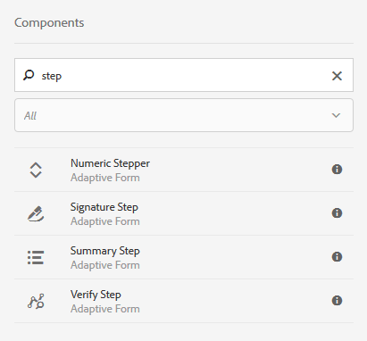
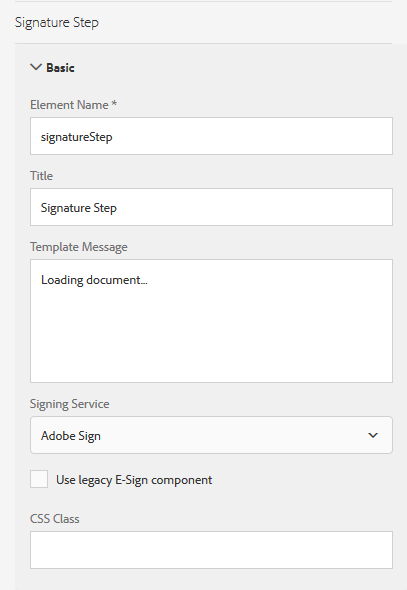

# Usando [!DNL Adobe Sign] em um formulário adaptável{#using-adobe-sign-in-an-adaptive-form}

[!DNL Adobe Sign] ativa fluxos de trabalho de assinatura eletrônica para formulários adaptáveis. As assinaturas eletrônicas melhoram os fluxos de trabalho para processar documentos para áreas legais, de vendas, de folha de pagamento, de gerenciamento de recursos humanos e outras.

Em um [!DNL Adobe Sign] e formulários adaptáveis, um usuário preenche um formulário adaptável para se candidatar a um serviço. Por exemplo, um pedido de hipoteca e de cartão de crédito requer assinaturas legais de todos os mutuários e co-requerentes. Para ativar workflows de assinatura eletrônica para cenários semelhantes, é possível integrar [!DNL Adobe Sign] com AEM [!DNL Forms]. Mais alguns exemplos são: você pode usar [!DNL Adobe Sign] para:

* Feche negócios de qualquer dispositivo com processos de proposta, cotação e contrato totalmente automatizados.
* Termine os processos de recurso humano mais rapidamente e dê aos seus funcionários as experiências digitais.
* Reduza mais rapidamente os tempos de ciclo do contrato e integre seus fornecedores.
* Crie workflows digitais que automatizam processos comuns.

[!DNL Adobe Sign] integração com AEM [!DNL Forms] suporta:

* Fluxos de trabalho de assinatura de um e vários usuários
* Fluxos de trabalho de assinatura sequenciais e simultâneos
* Experiências de assinatura no formulário e fora do formulário
* Assinar formulários como um usuário anônimo ou conectado
* Processos de assinatura dinâmica (integração com AEM [!DNL Forms] workflow)
* Autenticação por meio de uma base de conhecimento, telefone e perfis sociais

Saiba mais sobre o [práticas recomendadas para usar o Adobe Sign com formulários adaptáveis](https://medium.com/adobetech/using-adobe-sign-to-e-sign-an-adaptive-form-heres-the-best-way-to-do-it-dc3e15f9b684) para criar experiências de assinatura melhores.

## Pré-requisitos {#prerequisites}

Antes de usar [!DNL Adobe Sign] em forma adaptável:

* Garantir AEM [!DNL Forms] o serviço em nuvem está configurado para usar [!DNL Adobe Sign]. Para obter detalhes, consulte [Integrar o Adobe Sign ao AEM Forms](../../forms/using/adobe-sign-integration-adaptive-forms.md).
* Mantenha a lista de signatários pronta. Você precisa de pelo menos um endereço de email para cada assinante.

## Configurar [!DNL Adobe Sign] para um formulário adaptável {#configure-adobe-sign-for-an-adaptive-form}

Execute as etapas a seguir para configurar [!DNL Adobe Sign] para um formulário adaptável:

1. [Editar propriedades de formulário adaptável para sinal de Adobe](../../forms/using/working-with-adobe-sign.md#enableadobesign)
1. [Adicionar campos Adobe Sign a um formulário adaptável](../../forms/using/working-with-adobe-sign.md#addadobesignfieldstoanadaptiveform)
1. [Ativar o Adobe Sign para um formulário adaptável](../../forms/using/working-with-adobe-sign.md#enableadobsignforanadaptiveform)
1. [Selecione Adobe Sign Cloud Service para um formulário adaptável](../../forms/using/working-with-adobe-sign.md#selectadobesigncloudserviceforanadaptiveform)

1. [Adicionar signatários do Adobe Sign a um formulário adaptável](../../forms/using/working-with-adobe-sign.md#addsignerstoanadaptiveform)
1. [Selecione Enviar ação para um formulário adaptável](../../forms/using/working-with-adobe-sign.md#selectsubmitactionforanadaptiveform)

### Edite as propriedades adaptáveis do formulário para [!DNL Adobe Sign] {#enableadobesign}

Configure as propriedades de formulário adaptável para [!DNL Adobe Sign] para um formulário adaptável existente ou novo.

[Criar um formulário adaptável para o Adobe Sign](../../forms/using/working-with-adobe-sign.md#create-an-adaptive-form-for-adobe-sign) descreve as etapas para criar um formulário adaptável básico. Consulte [Criação de um formulário adaptável](../../forms/using/creating-adaptive-form.md) para outras opções disponíveis ao criar um formulário adaptável.

#### Crie um formulário adaptável para [!DNL Adobe Sign] {#create-an-adaptive-form-for-adobe-sign}

Execute as etapas a seguir para criar um formulário adaptável habilitado para assinatura:

1. Navegar para **[!UICONTROL Adobe Experience Manager]** > **[!UICONTROL Forms]** > **[!UICONTROL Forms &amp; Documents]**.
1. Toque **[!UICONTROL Criar]** e selecione **[!UICONTROL Formulário adaptável]**. Uma lista de modelos é exibida. Selecione o modelo e toque em **[!UICONTROL Próximo]**.
1. No **[!UICONTROL Básico]** guia :

   1. Especifique a **[!UICONTROL Nome]** e **[!UICONTROL Título]** para o formulário adaptável.

   1. Selecione o [contêiner de configuração](../../forms/using/adobe-sign-integration-adaptive-forms.md#configure-adobe-sign-with-aem-forms) criado ao configurar [!DNL Adobe Sign] com AEM [!DNL Forms].

      >[!NOTE]
      >
      >O **[!UICONTROL Adobe Sign Cloud Service]** a lista suspensa exibe os serviços de nuvem configurados no contêiner de configuração selecionado por você nesse campo. O **[!UICONTROL Adobe Sign Cloud Service]** a lista suspensa está disponível na variável **[!UICONTROL Assinatura eletrônica]** seção das propriedades do formulário adaptável ao selecionar o **[!UICONTROL Ativar o Adobe Sign]** opção.

1. No **[!UICONTROL Modelo de formulário]** selecione uma das seguintes opções:

   * Selecione o **[!UICONTROL Associar modelo de formulário como o modelo Documento de registro]** e selecione um modelo Document of Record . Se você usar um formulário adaptável baseado em modelo de formulário, os documentos enviados para assinatura exibirão apenas os campos que se baseiam no modelo de formulário associado. Não exibe todos os campos do formulário adaptável.

   * Selecione o **[!UICONTROL Gerar Documento de Registro]** opção. Se você usar uma opção Documento de registro ativada no formulário adaptável, o documento enviado para assinatura exibirá todos os campos do formulário adaptável.

1. Toque **[!UICONTROL Criar.]** É criado um formulário adaptável habilitado para assinatura, que pode ser usado para adicionar [!DNL Adobe Sign] campos.

#### Edite um formulário adaptável para [!DNL Adobe Sign] {#editafsign}

Execute as seguintes etapas para usar [!DNL Adobe Sign] em um formulário adaptável existente:

1. Navegar para **[!UICONTROL Adobe Experience Manager]** > **[!UICONTROL Forms]** > **[!UICONTROL Forms &amp; Documents]**.
1. Selecione o formulário adaptável e toque em **[!UICONTROL Propriedades]**.
1. No **[!UICONTROL Básico]** selecione a guia [contêiner de configuração](../../forms/using/adobe-sign-integration-adaptive-forms.md#configure-adobe-sign-with-aem-forms) criado ao configurar [!DNL Adobe Sign] com AEM [!DNL Forms].
1. No **[!UICONTROL Modelo de formulário]** selecione uma das seguintes opções:

   * Selecione o **[!UICONTROL Associar modelo de formulário como o modelo Documento de registro]** e selecione um modelo Document of Record . Se você usar um formulário adaptável baseado em modelo de formulário, os documentos enviados para assinatura exibirão apenas os campos que se baseiam no modelo de formulário associado. Não exibe todos os campos do formulário adaptável.

   * Selecione o **[!UICONTROL Gerar Documento de Registro]** opção. Se você usar uma opção Documento de registro ativada no formulário adaptável, o documento enviado para assinatura exibirá todos os campos do formulário adaptável.

1. Toque **[!UICONTROL Salvar e fechar]**. O formulário adaptável está habilitado para [!DNL Adobe Sign].

### Adicionar campos Adobe Sign a um formulário adaptável {#addadobesignfieldstoanadaptiveform}

[!DNL Adobe Sign] tem vários campos que podem ser colocados em um formulário adaptável. Esses campos aceitam vários tipos de dados, como assinaturas, iniciais, empresa ou título, e ajudam a coletar informações adicionais durante a assinatura, juntamente com as assinaturas. Você pode usar o [!DNL Adobe Sign] Bloquear componente a ser posicionado [!DNL Adobe Sign] campos em vários locais em um formulário adaptável.

Execute as etapas a seguir para adicionar campos a um formulário adaptável e personalizar várias opções relacionadas a esses campos:

1. Arrastar e soltar **[!UICONTROL Bloco Adobe Sign]** componente do navegador de componentes para o formulário adaptável. O [!DNL Adobe Sign] O componente Bloqueio tem todos os [!DNL Adobe Sign] campos. Por padrão, ele adiciona uma **Assinatura** para o formulário adaptável.

   

   Por padrão, a variável [!DNL Adobe Sign] O bloco não é visível no formulário adaptável publicado. Ela é visível somente nos documentos de assinatura. Você pode alterar a visibilidade de [!DNL Adobe Sign] Bloquear nas propriedades da [!DNL Adobe Sign] Bloquear componente.

   >[!NOTE]
   >
   >    * Usando [!DNL Adobe Sign] o bloco não é obrigatório para usar [!DNL Adobe Sign] em um formulário adaptável. Se não utilizar [!DNL Adobe Sign] bloqueie e adicione campos para os signatários, então o campo de assinatura padrão é exibido na parte inferior dos documentos de assinatura.
   >    * Use [!DNL Adobe Sign] bloquear somente para os formulários adaptáveis que geram automaticamente o Documento de registro. Se estiver usando um XDP personalizado para gerar o Documento de registro ou um formulário adaptável baseado em modelo de formulário, [!DNL Adobe Sign] não há suporte para bloqueio.

1. Selecione o **[!UICONTROL Bloco Adobe Sign]** e toque no **Editar**  ícone . Ele exibe opções para adicionar campos e formatar a aparência de um campo.

   

   **A.** Selecionar e adicionar [!DNL Adobe Sign] campos. **B.** Expanda o [!DNL Adobe Sign] bloquear para exibição em tela cheia

1. Toque no **[!UICONTROL Adobe Sign] Campo**  ícone . Ele exibe opções para selecionar e adicionar [!DNL Adobe Sign] campos.

   Expanda o **[!UICONTROL Tipo]** campo suspenso para selecionar uma [!DNL Adobe Sign] e toque em Concluído  ícone para adicionar o campo selecionado ao [!DNL Adobe Sign] bloco. O **[!UICONTROL Tipo]** O campo suspenso inclui os tipos de campo Assinatura, Informações do assinante e Dados . [!DNL Adobe Sign] integração com AEM [!DNL Forms] campos de suporte listados no [!UICONTROL Tipo] somente caixa suspensa. Para obter informações detalhadas sobre [!DNL Adobe Sign] campos, consulte [Documentação do Adobe Sign](https://helpx.adobe.com/sign/help/field-types.html).

   

   É obrigatório fornecer um nome exclusivo para um campo. Também é possível selecionar a opção obrigatória para marcar um campo como obrigatório. Além do **[!UICONTROL Nome]** e **[!UICONTROL Obrigatório]** opção, alguns [!DNL Adobe Sign] têm mais opções. Por exemplo, máscara e várias linhas. Além disso, especifique um nome exclusivo para cada [!DNL Adobe Sign] se os campos residem no mesmo campo ou em um campo diferente [!DNL Adobe Sign] blocos.

   Se você selecionar **[!UICONTROL Assinatura digital]** na lista suspensa, é possível aplicar assinaturas digitais ao formulário adaptável:

   * Online usando assinaturas de nuvem para assinar com uma [ID digital](https://helpx.adobe.com/sign/kb/digital-certificate-providers.html) hospedado por um provedor de serviços de confiança.
   * Localmente, baixando o documento com o Adobe Acrobat ou Reader usando um cartão inteligente, um token USB ou uma ID digital baseada em arquivo.

### Habilitar [!DNL Adobe Sign] para um formulário adaptável {#enableadobsignforanadaptiveform}

Pronto para uso, [!DNL Adobe Sign] não está habilitado para um formulário adaptável. Execute as seguintes etapas para habilitá-lo:

1. No navegador Conteúdo, toque em **[!UICONTROL Contêiner de formulário]** e toque no **[!UICONTROL Configurar]**  ícone . Ele abre o navegador de propriedades e exibe as propriedades do contêiner do Formulário adaptável.
1. No navegador de propriedades, expanda a **[!UICONTROL Assinatura eletrônica]** e selecione a opção **[!UICONTROL Ativar o Adobe Sign]** opção. Ela ativa [!DNL Adobe Sign] para um formulário adaptável.

### Selecionar [!DNL Adobe Sign] Cloud Service e ordem de assinatura {#selectadobesigncloudserviceforanadaptiveform}

Você pode configurar vários [!DNL Adobe Sign] serviços para uma instância de AEM [!DNL Forms]. É aconselhável ter um conjunto separado de serviços para cada função (Recursos Humanos, Finanças e muito mais). Isso facilita o rastreamento e o relatório de documentos assinados. Por exemplo, um banco tem vários departamentos. Você pode ter uma configuração separada para cada departamento para melhorar o rastreamento dos documentos.

Um documento também pode ter vários signatários. Por exemplo, um pedido de cartão de crédito pode ter vários candidatos. Um banco requer assinaturas de todos os candidatos antes de iniciar o processamento do pedido. Em cenários com vários signatários, você pode optar por assinar o documento em ordem sequencial ou simultânea.

Execute as seguintes etapas para selecionar um serviço em nuvem e a ordem de assinatura:

1. No navegador Conteúdo, toque em **[!UICONTROL Contêiner de formulário]** e toque no **[!UICONTROL Configurar]**  ícone . Ele abre o navegador de propriedades e exibe as propriedades do contêiner do Formulário adaptável.
1. No navegador de propriedades, expanda a **[!UICONTROL Assinatura eletrônica]** e selecione a opção **[!UICONTROL Ativar o Adobe Sign]** opção. Ela ativa [!DNL Adobe Sign] para um formulário adaptável.
1. Selecione um serviço em nuvem na lista de [!DNL Adobe Sign] Cloud Services.

   Se a variável **[!UICONTROL Adobe Sign Cloud Service]** estiver vazia, siga o [Configurar o Adobe Sign com o AEM Forms](../../forms/using/adobe-sign-integration-adaptive-forms.md) artigo para configurar o serviço.

   A lista suspensa lista os serviços em nuvem que existem na `global` em Ferramentas > **[!UICONTROL Cloud Services]** > **[!UICONTROL Adobe Sign]**. Além disso, a lista suspensa também lista os serviços de nuvem que existem na pasta selecionada na **[!UICONTROL Contêiner de configuração]** ao criar um formulário adaptável.

1. Selecione a ordem de assinatura no **[!UICONTROL Os assinantes podem assinar]** caixa de diálogo. [!DNL Adobe Sign] os cantores podem assinar um formulário adaptável **[!UICONTROL Sequencialmente]** - um depois de outro signatário, ou **[!UICONTROL Simultaneamente]** - em qualquer ordem.

   Em ordem sequencial, um assinante recebe o formulário para assinatura, de cada vez. Depois que um assinante concluir a assinatura do documento, o formulário será enviado para o assinante seguinte e assim por diante.

   Em ordem simultânea, vários signatários podem assinar um formulário de cada vez.

1. [Adicionar signatários a um formulário adaptável](../../forms/using/working-with-adobe-sign.md#addsignerstoanadaptiveform) e toque em Concluído  para salvar as alterações.

### Adicionar signatários a um formulário adaptável {#addsignerstoanadaptiveform}

Você pode ter apenas um ou vários signatários para um formulário adaptável. Ao adicionar um assinante, você também pode configurar os detalhes de autenticação do assinante. Você também pode selecionar se o usuário e o cantor do formulário são a mesma pessoa. Execute as seguintes etapas para adicionar e fornecer vários detalhes sobre um assinante:

1. No navegador Conteúdo, toque em **[!UICONTROL Contêiner de formulário]** e toque no **[!UICONTROL Configurar]**  ícone . Ele abre o navegador de propriedades com as propriedades do contêiner do Formulário adaptativo.
1. No navegador de propriedades, expanda a **[!UICONTROL Assinatura eletrônica]** e selecione a opção **[!UICONTROL Ativar o Adobe Sign]** opção. Ela ativa [!DNL Adobe Sign] para um formulário adaptável.
1. Toque **[!UICONTROL Adicionar Assinante]** under **[!UICONTROL Configuração do assinante]**. Ele adiciona um assinante ao formulário adaptável. Você pode adicionar vários [!DNL Adobe Sign] signatários em um formulário adaptável.
   

1. Clique no botão **Editar**  ícone para especificar as seguintes informações sobre o assinante:

   * **[!UICONTROL Título]:** Especifique um título para identificar exclusivamente um assinante.

   * **[!UICONTROL A pessoa que assina e que preenche o formulário são a mesma pessoa?]:** Selecionar **Sim**, se o usuário e o primeiro assinante forem a mesma pessoa. Se a opção estiver definida como **Não,** em seguida, não use o componente etapa de assinatura no formulário adaptável. Se o formulário contiver um componente Etapa de assinatura, o campo será automaticamente definido como Sim.

   * **[!UICONTROL Endereço de email do assinante]:** Especifique o endereço de email do assinante. O signatário recebe para ser documentos/formulários assinados no endereço de email especificado. Você pode optar por usar um endereço de email fornecido em um campo de formulário, AEM perfil de usuário do usuário conectado ou inserir manualmente um endereço de email. É uma etapa obrigatória. Certifique-se de que o endereço de email do primeiro assinante ou do único assinante (no caso de um único assinante) não seja idêntico a [!DNL Adobe Sign] conta usada para configurar os serviços em nuvem do AEM.

   * **[!UICONTROL Método de Autenticação do Assinante]:** Especifique o método para autenticar um usuário antes de abrir um formulário para assinatura. Você pode escolher entre telefone, base de conhecimento e autenticação baseada em identidade social.
   >[!NOTE]
   >
   >    * Por padrão, a autenticação baseada em identidade social fornece uma opção para autenticação usando Facebook, Google e LinkedIn. Você pode entrar em contato [!DNL Adobe Sign] suporte para ativar outros provedores de autenticação social.

   * **[!DNL Adobe Sign]campos para preencher ou assinar:** Selecionar [!DNL Adobe Sign] campos para o assinante. Um formulário adaptável pode ter vários [!DNL Adobe Sign] campos. Você pode optar por ativar campos específicos para um assinante. O campo exibe todas as informações disponíveis [!DNL Adobe Sign] Blocos. Ao selecionar um bloco, todos os campos do bloco são selecionados. Você pode usar o ícone X para desmarcar um campo.

   

   A imagem acima tem dois exemplos [!DNL Adobe Sign] Blocos: Informações pessoais e detalhes do escritório

   Toque em Concluído  ícone . O assinante é adicionado e configurado.

### Selecione Enviar ação para um formulário adaptável {#selectsubmitactionforanadaptiveform}

Depois de adicionar [!DNL Adobe Sign] para um formulário adaptável, habilite [!DNL Adobe Sign] no contêiner do formulário, selecione [!DNL Adobe Sign] Cloud Service e adicionar [!DNL Adobe Sign] Assinantes, selecione uma ação de envio apropriada para o formulário adaptável. Para obter informações detalhadas sobre ações de envio de formulários adaptáveis, consulte [Configuração da ação Enviar](../../forms/using/configuring-submit-actions.md).

Além disso, uma [!DNL Adobe Sign] o formulário adaptável ativado é enviado somente após todos os signatários assinarem o formulário. Você pode encontrar formulários parcialmente assinados na seção Assinatura pendente do portal de formulários. [!DNL Adobe Sign] O Serviço de Configuração mantém a pesquisa [!DNL Adobe Sign] servidor em [intervalos regulares](../../forms/using/adobe-sign-integration-adaptive-forms.md) para verificar o status das assinaturas. Se todos os signatários concluírem a assinatura do formulário, o serviço de ação de envio será iniciado e o formulário será enviado. Se você estiver usando uma ação de envio personalizado e o formulário usar [!DNL Adobe Sign], atualize sua ação de envio personalizado para usar o serviço de envio de ação.

<!-- Remove when forms portal goes live
>[!NOTE]
>
>Data of the adaptive form is stored temporarily on Forms Portal. It is recommended to use [custom storage for Forms Portal](/help/forms/using/configuring-draft-submission-storage.md). It ensures that the PII (personally identifiable information) data is not stored on AEM servers. 
-->

Sua experiência de assinatura de formulário está pronta. É possível visualizar o formulário para verificar a experiência de assinatura. No formulário publicado, [!DNL Adobe Sign] Campos de bloco são exibidos quando um assinante recebe o formulário para assinatura por meio de um email. Essa experiência também é conhecida como experiência de assinatura fora de formulário. Você também pode configurar uma experiência de assinatura no formulário para o primeiro assinante, para etapas detalhadas, consulte [Criar experiência de assinatura no formulário](../../forms/using/working-with-adobe-sign.md#create-in-form-signing-experience).

## Configurar assinaturas em nuvem para um formulário adaptável {#configure-cloud-signatures-for-an-adaptive-form}

Assinaturas digitais baseadas em nuvem ou assinaturas remotas são uma nova geração de assinaturas digitais que funcionam em computadores, dispositivos móveis e na Web — e atendem aos mais altos níveis de conformidade e garantia para autenticação de assinante. Você pode assinar um formulário adaptável com assinaturas digitais baseadas em nuvem.

Depois [edição de propriedades de formulário adaptável para assinatura de Adobe](../../forms/using/working-with-adobe-sign.md#enableadobesign), execute as seguintes etapas para adicionar um campo de assinatura de nuvem a um formulário adaptável:

1. Arrastar e soltar **[!UICONTROL Bloco Adobe Sign]** componente do navegador de componentes para o formulário adaptável. O [!UICONTROL Bloco Adobe Sign] tem todos os [!DNL Adobe Sign] campos. Por padrão, ele adiciona uma **[!UICONTROL Assinatura]** para o formulário adaptável.

   

1. Selecione o **[!UICONTROL Bloco Adobe Sign]** e toque no **Editar**  ícone . Ele exibe opções para adicionar campos e formatar a aparência de um campo.

   

   **A.** Selecionar e adicionar [!DNL Adobe Sign] campos. **B.** Expanda o [!DNL Adobe Sign] bloquear para exibição em tela cheia

1. Toque no **[!UICONTROL Campo Adobe Sign]**  ícone . Ele exibe opções para selecionar e adicionar [!DNL Adobe Sign] campos.

   Expanda o **[!UICONTROL Tipo]** campo suspenso a ser selecionado **[!UICONTROL Assinatura digital]** e toque no **Concluído** ícone para adicionar o campo selecionado ao [!DNL Adobe Sign] bloco.

   

   É obrigatório fornecer um nome exclusivo para um campo.

   Aplique assinaturas digitais ao formulário adaptável usando:

   * Assinaturas da nuvem: Assinar com um [ID digital](https://helpx.adobe.com/sign/kb/digital-certificate-providers.html) hospedado por um provedor de serviços de confiança.
   * Adobe Acrobat ou Reader: Baixe e abra o documento com Adobe Acrobat ou Reader para assinar usando um cartão inteligente, um token USB ou uma ID digital baseada em arquivo.

   Depois de adicionar o campo de assinatura da nuvem ao formulário adaptável, execute as seguintes etapas para concluir o processo de configuração:

   * [Ativar o Adobe Sign para um formulário adaptável](../../forms/using/working-with-adobe-sign.md#enableadobsignforanadaptiveform)
   * [Selecione Adobe Sign Cloud Service para um formulário adaptável](../../forms/using/working-with-adobe-sign.md#selectadobesigncloudserviceforanadaptiveform)
   * [Adicionar signatários do Adobe Sign a um formulário adaptável](../../forms/using/working-with-adobe-sign.md#addsignerstoanadaptiveform)
   * [Selecione Enviar ação para um formulário adaptável](../../forms/using/working-with-adobe-sign.md#selectsubmitactionforanadaptiveform)

## Criar experiência de assinatura no formulário {#create-in-form-signing-experience}

Um usuário também pode assinar um formulário adaptável durante o preenchimento do formulário. Essa experiência também é conhecida como experiência de assinatura no formulário. A experiência de assinatura no formulário está disponível somente para o primeiro cantor em um ambiente com vários signatários. Execute as seguintes etapas para criar uma experiência de assinatura no formulário para um formulário adaptável:

1. [Adicionar e configurar o componente Etapa de assinatura](../../forms/using/working-with-adobe-sign.md#add-and-configure-the-signature-step-component).
1. [Adicionar o componente Etapa de resumo](../../forms/using/working-with-adobe-sign.md#configure-the-thank-you-page-or-summary-step-component).

### Adicionar e configurar o componente Etapa de assinatura {#add-and-configure-the-signature-step-component}

Use o componente Etapa de assinatura para fornecer uma área para assinar eletronicamente o formulário preenchido. Quando a seção que contém o componente Etapa de assinatura é renderizada, ela exibe uma versão PDF assinável do formulário preenchido. O componente Etapa de assinatura ocupa a largura total disponível para o formulário. É recomendável não ter nenhum outro componente na seção que contenha o componente Etapa de assinatura.

Execute as seguintes etapas para configurar o componente Etapa de assinatura:

1. Arraste e solte a **[!UICONTROL Etapa de assinatura]** componente do navegador Componentes para o formulário.
1. Selecione o componente de etapa Assinatura recém-adicionado e toque no **Configurar**  ícone . Ele abre o navegador de propriedades e exibe as propriedades da etapa Assinatura. Configure as seguintes propriedades:

   * **[!UICONTROL Nome]**: Especifique o nome do componente.

   * **[!UICONTROL Título]:** Especifique o título exclusivo do componente.
   * **[!UICONTROL Mensagem de modelo]:** Especifique a mensagem a ser exibida enquanto o PDF de assinatura está sendo carregado. [!DNL Adobe Sign] Os serviços levam algum tempo para preparar e carregar o PDF de assinatura.
   * **[!UICONTROL Serviço de assinatura]:** Selecione o **[!DNL Adobe Sign]** opção.

   * **[!UICONTROL Usar componente herdado de assinatura eletrônica]**: Se você estiver usando o respectivo formulário adaptável em [AEM Forms Workspace](../../forms/using/introduction-html-workspace.md)AEM [!DNL Forms] aplicativo, ou o formulário adaptável subjacente tem o componente de assinatura eletrônica herdado, selecione o **Usar componente herdado de assinatura eletrônica** opção.

   * **[!UICONTROL Configuração]**: Selecione uma configuração ([!DNL Adobe Sign] Cloud Service). A caixa suspensa só estará disponível se a variável **Usar componente herdado de assinatura eletrônica** está ativada.

   * **[!UICONTROL Classe CSS]**: Especifique a classe CSS do componente.

   Toque em Concluído  para salvar as alterações.

   

   >[!NOTE]
   >
   > * Quando você arrasta e solta a variável **[!UICONTROL Etapa de assinatura]** componente do formulário, a variável **[!UICONTROL O signatário e o preenchedor do formulário são os mesmos?]** é automaticamente definida como **Sim**. É necessário manter o funcionamento do formulário.
   >
   > * Use o componente Etapa de resumo após o componente Etapa de assinatura para obter a melhor experiência. A etapa Resumo envia automaticamente e imediatamente o formulário após a conclusão da assinatura de um formulário no componente Etapa de assinatura. Se você não usar a etapa de resumo, um envio automático será acionado somente após o intervalo definido usando o [Serviço de configuração do Adobe Sign](../../forms/using/adobe-sign-integration-adaptive-forms.md#configure-adobe-sign-scheduler-to-sync-the-signing-status).
      > Algumas práticas recomendadas são:
   > * O painel de formulário adaptável que contém a etapa Assinatura está sempre no último ou no segundo painel de um formulário adaptável. Ele só pode ser o segundo último painel quando o último painel contiver a etapa Resumo .
   > * O painel que contém o componente da etapa Assinatura ou Resumo não pode conter nenhum outro componente.
   > * Os formulários adaptáveis que contêm a Etapa de assinatura não podem ter o botão Enviar.
   > * O envio dos formulários adaptáveis contendo a etapa Assinatura é feito por meio de um serviço em segundo plano ou da etapa Resumo. Se houver um assinante configurado que também esteja preenchendo o formulário, a vantagem de manipular o envio do formulário adaptável usando a etapa Resumo é que ele imediatamente avalia que o assinante assinou o formulário e chama a ação de envio. Um serviço em segundo plano leva mais tempo para avaliar se todos os signatários configurados assinaram o formulário e atrasam o envio do formulário adaptável.
   > * Projete o formulário para não permitir que um usuário navegue de volta de um painel que contém a etapa Assinatura ou Resumo.

### Configurar a página de agradecimento ou o componente da etapa de resumo {#configure-the-thank-you-page-or-summary-step-component}

O **Etapa de resumo** O componente envia automaticamente o formulário, preenche as informações dentro da página Resumo personalizada e exibe o resumo do formulário enviado. Também obtém as informações necessárias no mapa de retorno. O componente Etapa de resumo ocupa a largura total disponível para o formulário. É recomendável não ter nenhum outro componente na seção que contém o componente Etapa de resumo .

Agora, a experiência de assinatura no formulário está pronta. É possível visualizar o formulário para verificar a experiência de assinatura.

## Perguntas frequentes {#frequently-asked-questions}

**P:** É possível incorporar um formulário adaptável em outro formulário adaptável. O formulário adaptável incorporado pode ser [!DNL Adobe Sign] habilitado?
**Ans:** Não, AEM [!DNL Forms] não suporta o uso de um formulário adaptável que incorpora um [!DNL Adobe Sign] formulário adaptável habilitado para assinatura

**P:** Quando eu crio um formulário adaptável usando o modelo avançado e o abro para edição, uma mensagem de erro &quot;Assinaturas ou assinantes eletrônicos não estão configurados corretamente&quot;. é exibido. Como resolver a mensagem de erro?
**Ans:** O formulário adaptável criado usando o modelo avançado está configurado para usar [!DNL Adobe Sign]. Para resolver o erro, crie e selecione um [!DNL Adobe Sign] configuração da nuvem e configuração de um [!DNL Adobe Sign] assinante do formulário adaptável.

**P:** Posso usar [!DNL Adobe Sign] tags de texto em um componente de texto estático de um formulário adaptável?
**Ans:** Sim, você pode usar tags de texto em um componente de texto para adicionar [!DNL Adobe Sign] para [Documento de registro](../../forms/using/generate-document-of-record-for-non-xfa-based-adaptive-forms.md) (Somente o documento gerado automaticamente da opção de registro) ativou o formulário adaptável. Para saber mais sobre o procedimento e as regras para criar uma tag de texto, consulte [Documentação do Adobe Sign](https://helpx.adobe.com/sign/using/text-tag.html). Além disso, observe que os formulários adaptáveis têm suporte limitado para tags de texto. Você pode usar as tags de texto para criar apenas os campos que [Bloco Adobe Sign](../../forms/using/working-with-adobe-sign.md#configure-cloud-signatures-for-an-adaptive-form) suporta.

**P:** AEM [!DNL Forms] fornece ambos [!UICONTROL Bloco Adobe Sign] componentes da etapa de assinatura e . Eles podem ser usados simultaneamente em um formulário adaptável?
**Ans:** É possível usar ambos os componentes simultaneamente em um formulário. Estas são algumas recomendações para usar esses componentes:

**Bloco Adobe Sign:** Você pode usar o [!UICONTROL Bloco Adobe Sign] para adicionar [!UICONTROL Adobe Sign] em qualquer lugar do formulário adaptável. Também ajuda a atribuir campos específicos aos signatários. Quando um formulário adaptável é visualizado ou publicado [!UICONTROL Adobe Sign] O bloco não está visível, por padrão. Esses blocos são ativados somente no documento de assinatura. No documento de assinatura, somente os campos atribuídos a um assinante são ativados. [!UICONTROL Adobe Sign] pode ser usado com assinantes originais e subsequentes.

**Componente de etapa de assinatura:** Você pode usar o componente etapa de assinatura para criar uma experiência de assinatura no formulário. Ele permite que somente o primeiro assinante assine enquanto o formulário está sendo preenchido. Quando a seção que contém o componente Etapa de assinatura é renderizada, ela exibe uma versão PDF assinável do formulário. Geralmente, é a última ou penúltima seção seguida pelo componente de resumo de um formulário.

## Solução de problemas {#troubleshoot}

### [!DNL Adobe Sign] falhas do acordo {#adobe-sign-agreement-failures}

**Problema**
When [!DNL Adobe Sign] estiver configurado para um formulário adaptável, o serviço não criará um [!DNL Adobe Sign] acordo para o formulário adaptável subjacente.

**Resolução**

* Verifique a [configuração do serviço em nuvem Adobe Sign](../../forms/using/adobe-sign-integration-adaptive-forms.md) usado no formulário adaptável.
* Verifique se o aplicativo de API em [!DNL Adobe Sign] servidor usado para configurar [!DNL Adobe Sign] O serviço em nuvem tem permissões necessárias.
* Se estiver usando vários [!DNL Adobe Sign] Serviços em nuvem, aponte o **[!UICONTROL URL de oAuth]** de todos os serviços ao mesmo tempo **[!UICONTROL Adobe Sign Shard]**.

* Usar endereços de email separados para configurar [!DNL Adobe Sign] e para o primeiro assinante e o signatário único. O endereço de email do primeiro assinante ou do único assinante (no caso do assinante único) não pode ser idêntico ao [!DNL Adobe Sign] conta usada para configurar os serviços em nuvem do AEM.

### AEM [!DNL Forms] fluxo de trabalho configurado para um [!DNL Adobe Sign] o formulário adaptável ativado não inicia {#adobe-sign-aem-form-workflow-failures}

**Problema**
When [!DNL Adobe Sign] for configurado para um formulário adaptável, o fluxo de trabalho configurado usando o Invoke [!DNL Forms] A opção de fluxo de trabalho não é iniciada.

**Resolução**

* Ao utilizar [!DNL Adobe Sign] sem a etapa Assinatura ou o formulário requer assinaturas de várias pessoas, AEM [!DNL Forms] O servidor aguarda o agendador para confirmar que todas as pessoas assinaram o formulário. O scheduler envia o formulário adaptável somente depois que toda a pessoa conclui a assinatura e o workflow começa somente após um envio bem-sucedido do formulário adaptável. Você pode encurtar o intervalo da variável [scheduler](adobe-sign-integration-adaptive-forms.md) para verificar o status da assinatura do formulário em intervalos rápidos e apertar o envio do formulário.

## Artigos relacionados {#related-articles}

* [Integrar o Adobe Sign ao AEM Forms](../../forms/using/adobe-sign-integration-adaptive-forms.md)
* [Práticas recomendadas para usar o Adobe Sign com formulários adaptáveis](https://medium.com/adobetech/using-adobe-sign-to-e-sign-an-adaptive-form-heres-the-best-way-to-do-it-dc3e15f9b684)
* [Uso do Adobe Sign com AEM Forms (Vídeo)](https://helpx.adobe.com/experience-manager/kt/forms/using/adobe-sign-integration-feature-video.html)
