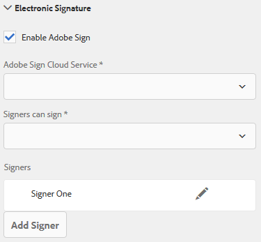

# Usar [!DNL Adobe Sign] em um formulário adaptável{#using-adobe-sign-in-an-adaptive-form}

[!DNL Adobe Sign] habilita fluxos de trabalho de assinatura eletrônica para formulários adaptáveis. As assinaturas eletrônicas melhoram os fluxos de trabalho para processar documentos para áreas jurídicas, de vendas, de folha de pagamento, de gerenciamento de recursos humanos e muito mais.

Em um [!DNL Adobe Sign] e o cenário de formulários adaptáveis, um usuário preenche um formulário adaptável para solicitar um serviço. Por exemplo, um pedido de hipoteca e cartão de crédito requer assinaturas legais de todos os mutuários e corequerentes. Para habilitar workflows de assinatura eletrônica para cenários semelhantes, você pode integrar [!DNL Adobe Sign] com AEM [!DNL Forms]. Alguns outros exemplos são, você pode usar [!DNL Adobe Sign] para:

* Feche negócios de qualquer dispositivo com processos totalmente automatizados de propostas, cotações e contratos.
* Conclua os processos de Recursos humanos com mais rapidez e ofereça aos seus funcionários as experiências digitais.
* Reduza os tempos de ciclo do contrato e integre seus fornecedores mais rapidamente.
* Crie fluxos de trabalho digitais que automatizam processos comuns.

[!DNL Adobe Sign] integração com AEM [!DNL Forms] suporta:

* Workflows de assinatura de um ou vários usuários
* Workflows de assinatura sequencial e simultânea
* Experiências de assinatura no formulário e fora do formulário
* Assinatura de formulários como usuário anônimo ou conectado
* Processos dinâmicos de assinatura (integração com o AEM) [!DNL Forms] workflow)
* Autenticação por meio de uma base de conhecimento, telefone e perfis sociais

Saiba mais sobre [práticas recomendadas de uso do Adobe Sign com formulários adaptáveis](https://medium.com/adobetech/using-adobe-sign-to-e-sign-an-adaptive-form-heres-the-best-way-to-do-it-dc3e15f9b684) para criar melhores experiências de assinatura.

## Pré-requisitos {#prerequisites}

Antes de usar [!DNL Adobe Sign] em um formulário adaptável:

* Garantir AEM [!DNL Forms] o cloud service está configurado para usar [!DNL Adobe Sign]. Para obter detalhes, consulte [Integrar o Adobe Sign com o AEM Forms](../../forms/using/adobe-sign-integration-adaptive-forms.md).
* Mantenha a lista de signatários pronta. Você precisa de pelo menos um endereço de email para cada signatário.

## Configurar [!DNL Adobe Sign] para um formulário adaptável {#configure-adobe-sign-for-an-adaptive-form}

Execute as seguintes etapas para configurar o [!DNL Adobe Sign] para um formulário adaptável:

1. [Editar propriedades do formulário adaptável para o sinal de Adobe](../../forms/using/working-with-adobe-sign.md#enableadobesign)
1. [Adicionar campos do Adobe Sign a um formulário adaptável](../../forms/using/working-with-adobe-sign.md#addadobesignfieldstoanadaptiveform)
1. [Ativar o Adobe Sign para um formulário adaptável](../../forms/using/working-with-adobe-sign.md#enableadobsignforanadaptiveform)
1. [Selecione Adobe Sign Cloud Service para obter um formulário adaptável](../../forms/using/working-with-adobe-sign.md#selectadobesigncloudserviceforanadaptiveform)

1. [Adicionar signatários do Adobe Sign a um formulário adaptável](../../forms/using/working-with-adobe-sign.md#addsignerstoanadaptiveform)
1. [Selecione Enviar ação para um formulário adaptável](../../forms/using/working-with-adobe-sign.md#selectsubmitactionforanadaptiveform)

### Editar propriedades do formulário adaptável para [!DNL Adobe Sign] {#enableadobesign}

Configurar propriedades do formulário adaptável para [!DNL Adobe Sign] para um formulário adaptável existente ou novo.

[Criar um formulário adaptável do Adobe Sign](../../forms/using/working-with-adobe-sign.md#create-an-adaptive-form-for-adobe-sign) descreve as etapas para criar um formulário adaptável básico. Consulte [Criação de um formulário adaptável](../../forms/using/creating-adaptive-form.md) para outras opções disponíveis ao criar um formulário adaptável.

#### Crie um formulário adaptável para [!DNL Adobe Sign] {#create-an-adaptive-form-for-adobe-sign}

Execute as seguintes etapas para criar um formulário adaptável habilitado para assinatura:

1. Navegue até **[!UICONTROL Adobe Experience Manager]** > **[!UICONTROL Forms]** > **[!UICONTROL Forms e documentos]**.
1. Toque **[!UICONTROL Criar]** e selecione **[!UICONTROL Formulário adaptável]**. Uma lista de modelos é exibida. Selecione o modelo e toque em **[!UICONTROL Próxima]**.
1. No **[!UICONTROL Básico]** guia:

   1. Especifique a **[!UICONTROL Nome]** e **[!UICONTROL Título]** para o formulário adaptável.

   1. Selecione o [contêiner de configuração](../../forms/using/adobe-sign-integration-adaptive-forms.md#configure-adobe-sign-with-aem-forms) criado durante a configuração [!DNL Adobe Sign] com AEM [!DNL Forms].

      >[!NOTE]
      >
      >A variável **[!UICONTROL Adobe Sign Cloud Service]** A lista suspensa exibe os serviços em nuvem configurados no contêiner de configuração selecionado neste campo. A variável **[!UICONTROL Adobe Sign Cloud Service]** A lista suspensa está disponível na **[!UICONTROL Assinatura eletrônica]** seção das propriedades do formulário adaptável ao selecionar a variável **[!UICONTROL Ativar o Adobe Sign]** opção.

1. No **[!UICONTROL Modelo de formulário]** selecione uma das seguintes opções:

   * Selecione o **[!UICONTROL Associar o modelo de formulário como o documento de modelo de registro]** e selecione um modelo de Documento de registro. Se você usar um modelo de formulário com base no formulário adaptável, os documentos enviados para assinatura exibirão apenas os campos que se baseiam no modelo de formulário associado. Ele não exibe todos os campos do formulário adaptável.

   * Selecione o **[!UICONTROL Gerar documento de registro]** opção. Se você usar um formulário adaptável com a opção Documento de registro ativada, o documento enviado para assinatura exibirá todos os campos do formulário adaptável.

1. Toque **[!UICONTROL Criar.]** Um formulário adaptável habilitado para assinatura é criado, e pode ser usado para adicionar [!DNL Adobe Sign] campos.

#### Editar um formulário adaptável para [!DNL Adobe Sign] {#editafsign}

Execute as seguintes etapas para usar [!DNL Adobe Sign] em um formulário adaptável existente:

1. Navegue até **[!UICONTROL Adobe Experience Manager]** > **[!UICONTROL Forms]** > **[!UICONTROL Forms e documentos]**.
1. Selecione o formulário adaptável e toque em **[!UICONTROL Propriedades]**.
1. No **[!UICONTROL Básico]** , selecione a [contêiner de configuração](../../forms/using/adobe-sign-integration-adaptive-forms.md#configure-adobe-sign-with-aem-forms) criado durante a configuração [!DNL Adobe Sign] com AEM [!DNL Forms].
1. No **[!UICONTROL Modelo de formulário]** selecione uma das seguintes opções:

   * Selecione o **[!UICONTROL Associar o modelo de formulário como o documento de modelo de registro]** e selecione um modelo de Documento de registro. Se você usar um modelo de formulário com base no formulário adaptável, os documentos enviados para assinatura exibirão apenas os campos que se baseiam no modelo de formulário associado. Ele não exibe todos os campos do formulário adaptável.

   * Selecione o **[!UICONTROL Gerar documento de registro]** opção. Se você usar um formulário adaptável com a opção Documento de registro ativada, o documento enviado para assinatura exibirá todos os campos do formulário adaptável.

1. Toque **[!UICONTROL Salvar e fechar]**. O formulário adaptável é ativado para [!DNL Adobe Sign].

### Adicionar campos do Adobe Sign a um formulário adaptável {#addadobesignfieldstoanadaptiveform}

[!DNL Adobe Sign] O tem vários campos que podem ser colocados em um formulário adaptável. Esses campos aceitam vários tipos de dados, como assinaturas, iniciais, empresa ou título e ajudam a coletar informações adicionais durante a assinatura, juntamente com as assinaturas. Você pode usar o [!DNL Adobe Sign] Bloquear componente para posicionar [!DNL Adobe Sign] em vários locais em um formulário adaptável.

Execute as seguintes etapas para adicionar campos a um formulário adaptável e personalizar várias opções relacionadas a esses campos:

1. Arrastar e soltar **[!UICONTROL Bloco do Adobe Sign]** componente do navegador de componentes para o formulário adaptável. A variável [!DNL Adobe Sign] O componente de Bloqueio tem todos os componentes compatíveis [!DNL Adobe Sign] campos. Por padrão, ele adiciona um **Assinatura** ao formulário adaptável.

   

   Por padrão, a variável [!DNL Adobe Sign] O bloco não está visível no formulário adaptável publicado. É visível apenas nos documentos de assinatura. É possível alterar a visibilidade de [!DNL Adobe Sign] Bloquear nas propriedades de [!DNL Adobe Sign] Componente de bloco.

   >[!NOTE]
   >
   >    * Usar [!DNL Adobe Sign] o bloco não é obrigatório [!DNL Adobe Sign] em um formulário adaptável. Se você não usar [!DNL Adobe Sign] bloquear e adicionar campos para os signatários, o campo de assinatura padrão será exibido na parte inferior dos documentos de assinatura.
   >    * Uso [!DNL Adobe Sign] bloquear somente para formulários adaptáveis que geram automaticamente Documento de registro. Se estiver usando um XDP personalizado para gerar um Documento de registro ou um formulário adaptável baseado em modelo de formulário, [!DNL Adobe Sign] bloco não é suportado.
   >
   >

1. Selecione o **[!UICONTROL Bloco do Adobe Sign]** e toque no botão **Editar**  ícone. Ele exibe opções para adicionar campos e a aparência do formato de um campo.

   

   **A.** Selecionar e adicionar [!DNL Adobe Sign] campos. **B.** Expanda a [!DNL Adobe Sign] bloquear para exibição em tela cheia

1. Toque no **[!UICONTROL Adobe Sign] Campo**  ícone. Ele exibe opções para selecionar e adicionar [!DNL Adobe Sign] campos.

   Expanda a **[!UICONTROL Tipo]** para selecionar um [!DNL Adobe Sign] e toque no botão Concluído  ícone para adicionar o campo selecionado a [!DNL Adobe Sign] bloco. A variável **[!UICONTROL Tipo]** O campo suspenso inclui Assinatura, Informações do assinante e Tipos de campo de dados. [!DNL Adobe Sign] integração com AEM [!DNL Forms] campos de suporte listados no [!UICONTROL Tipo] somente na caixa suspensa. Para obter informações detalhadas sobre [!DNL Adobe Sign] campos, consulte [Documentação do Adobe Sign](https://helpx.adobe.com/sign/help/field-types.html).

   

   É obrigatório fornecer um nome exclusivo para um campo. Você também pode selecionar a opção obrigatório para marcar um campo. Além do **[!UICONTROL Nome]** e **[!UICONTROL Obrigatório]** opção, alguns [!DNL Adobe Sign] tem mais opções. Por exemplo, máscara e várias linhas. Além disso, especifique nomes exclusivos para cada [!DNL Adobe Sign] se os campos residem no mesmo campo ou em campos diferentes [!DNL Adobe Sign] blocos.

   Se você selecionar **[!UICONTROL Assinatura digital]** na lista suspensa, é possível aplicar assinaturas digitais ao formulário adaptável:

   * Online usando assinaturas em nuvem para assinar com um [ID digital](https://helpx.adobe.com/sign/kb/digital-certificate-providers.html) hospedado por um provedor de serviços de confiança.
   * Localmente, baixando o documento com Adobe Acrobat ou Reader usando um cartão inteligente, token USB ou ID digital baseada em arquivo.

### Ativar [!DNL Adobe Sign] para um formulário adaptável {#enableadobsignforanadaptiveform}

Pronto para uso, [!DNL Adobe Sign] não está ativado para um formulário adaptável. Execute as seguintes etapas para ativá-la:

1. No Navegador de conteúdo, toque em **[!UICONTROL Contêiner de formulário]** e toque no **[!UICONTROL Configurar]**  ícone. Ela abre as propriedades do navegador e exibe as propriedades do contêiner do Formulário adaptável.
1. No navegador de propriedades, expanda a variável **[!UICONTROL Assinatura eletrônica]** e selecione a opção **[!UICONTROL Ativar o Adobe Sign]** opção. Ele permite [!DNL Adobe Sign] para um formulário adaptável.

### Selecionar [!DNL Adobe Sign] Cloud Service e ordem de assinatura {#selectadobesigncloudserviceforanadaptiveform}

É possível configurar vários [!DNL Adobe Sign] serviços para uma instância de AEM [!DNL Forms]. É aconselhável ter um conjunto separado de serviços para cada função (Recursos Humanos, Finanças e muito mais). Isso facilita o rastreamento e os relatórios de documentos assinados. Por exemplo, um banco tem vários departamentos. Você pode ter uma configuração separada para cada departamento para um melhor rastreamento dos documentos.

Um documento também pode ter vários signatários. Por exemplo, uma solicitação de cartão de crédito pode ter vários candidatos. Um banco requer assinaturas de todos os candidatos antes de iniciar o processamento da solicitação. Para cenários com vários signatários, você pode optar por assinar o documento em ordem sequencial ou simultânea.

Execute as seguintes etapas para selecionar um serviço em nuvem e a ordem de assinatura:

1. No Navegador de conteúdo, toque em **[!UICONTROL Contêiner de formulário]** e toque no **[!UICONTROL Configurar]**  ícone. Ela abre as propriedades do navegador e exibe as propriedades do contêiner do Formulário adaptável.
1. No navegador de propriedades, expanda a variável **[!UICONTROL Assinatura eletrônica]** e selecione a opção **[!UICONTROL Ativar o Adobe Sign]** opção. Ele permite [!DNL Adobe Sign] para um formulário adaptável.
1. Selecione um serviço em nuvem na lista já configurada de [!DNL Adobe Sign] Cloud Services.

   Se a variável **[!UICONTROL Adobe Sign Cloud Service]** estiver vazia, siga as instruções [Configurar o Adobe Sign com o AEM Forms](../../forms/using/adobe-sign-integration-adaptive-forms.md) artigo para configurar o serviço.

   A lista suspensa lista os serviços de nuvem existentes no `global` pasta em Ferramentas > **[!UICONTROL Cloud Services]** > **[!UICONTROL Adobe Sign]**. Além disso, a lista suspensa também lista os serviços de nuvem que existem na pasta selecionada no **[!UICONTROL Contêiner de configuração]** ao criar um formulário adaptável.

1. Selecione a ordem de assinatura na **[!UICONTROL Os signatários podem assinar]** caixa de diálogo. [!DNL Adobe Sign] os cantores podem assinar um formulário adaptável **[!UICONTROL Sequencialmente]** - um após o outro signatário, ou **[!UICONTROL Simultaneamente]** - em qualquer ordem.

   Em ordem sequencial, um signatário recebe o formulário para assinatura de cada vez. Depois que um signatário concluir a assinatura do documento, o formulário será enviado para o próximo signatário e assim por diante.

   Em ordem simultânea, vários signatários podem assinar um formulário de cada vez.

1. [Adicionar signatários a um formulário adaptável](../../forms/using/working-with-adobe-sign.md#addsignerstoanadaptiveform) e toque no botão Concluído  ícone para salvar as alterações.

### Adicionar signatários a um formulário adaptável {#addsignerstoanadaptiveform}

Você pode ter apenas um ou vários signatários para um formulário adaptável. Ao adicionar um signatário, você também pode configurar os detalhes de autenticação do signatário. Você também pode selecionar se o preenchimento do formulário e o cantor são a mesma pessoa. Execute as seguintes etapas para adicionar e fornecer vários detalhes sobre um signatário:

1. No Navegador de conteúdo, toque em **[!UICONTROL Contêiner de formulário]** e toque no **[!UICONTROL Configurar]**  ícone. Ela abre o navegador de propriedades com as propriedades do contêiner do Formulário adaptável.
1. No navegador de propriedades, expanda a variável **[!UICONTROL Assinatura eletrônica]** e selecione a opção **[!UICONTROL Ativar o Adobe Sign]** opção. Ele permite [!DNL Adobe Sign] para um formulário adaptável.
1. Toque **[!UICONTROL Adicionar signatário]** em **[!UICONTROL Configuração do assinante]**. Ele adiciona um signatário ao formulário adaptável. É possível adicionar vários [!DNL Adobe Sign] signatários para um formulário adaptável.
   

1. Clique em **Editar**  ícone para especificar as seguintes informações sobre o signatário:

   * **[!UICONTROL Título]:** Especifique um título para identificar exclusivamente um signatário.

   * **[!UICONTROL A pessoa que assina e que preenche o formulário são a mesma pessoa?]:** Selecionar **Sim**, se o preenchimento do formulário e o primeiro signatário forem a mesma pessoa. Se a opção estiver definida como **Não,** em seguida, não use o componente etapa de assinatura no formulário adaptável. Se o formulário contiver um componente Etapa de assinatura, o campo será automaticamente definido como Sim.

   * **[!UICONTROL Endereço de e-mail do assinante]:** Especifique o endereço de email do signatário. O signatário recebe para ser assinados documentos/formulários no endereço de email especificado. Você pode optar por usar um endereço de email fornecido em um campo de formulário, no perfil de usuário AEM do usuário conectado ou inserir manualmente um endereço de email. É uma etapa obrigatória. Verifique se o endereço de email do primeiro signatário ou do único signatário (no caso de um signatário único) não é idêntico a [!DNL Adobe Sign] conta usada para configurar os serviços em nuvem do AEM.

   * **[!UICONTROL Método de autenticação do assinante]:** Especifique o método para autenticar um usuário antes de abrir um formulário para assinatura. Você pode escolher entre telefone, base de conhecimento e autenticação com base na identidade social. Para o Adobe Acrobat Sign Solutions for Government, somente as opções de autenticação por telefone e com base em conhecimento estão disponíveis.

   >[!NOTE]
   >
   >    * Por padrão, a autenticação com base na identidade social fornece uma opção para autenticar usando o Facebook, o Google e o LinkedIn. Você pode entrar em contato [!DNL Adobe Sign] suporte para habilitar outros provedores de autenticação social.
   >
   >

   * **[!DNL Adobe Sign]campos a serem preenchidos ou assinados:** Selecionar [!DNL Adobe Sign] para o signatário. Um formulário adaptável pode ter vários [!DNL Adobe Sign] campos. Você pode optar por ativar campos específicos para um signatário. O campo exibe todas as [!DNL Adobe Sign] Blocos. Ao selecionar um bloco, todos os campos do bloco são selecionados. Você pode usar o ícone X para desmarcar um campo.

   

   A imagem acima tem dois exemplos [!DNL Adobe Sign] Blocos: Personal-Information e Office-details

   Toque no botão Concluído  ícone. O signatário é adicionado e configurado.

### Selecione Enviar ação para um formulário adaptável {#selectsubmitactionforanadaptiveform}

Depois de você, adicione [!DNL Adobe Sign] para um formulário adaptável, ativar [!DNL Adobe Sign] em contêiner de formulário, selecione [!DNL Adobe Sign] Cloud Service e adicione [!DNL Adobe Sign] Para os signatários, selecione uma ação de envio apropriada para o formulário adaptável. Para obter informações detalhadas sobre ações de envio de formulários adaptáveis, consulte [Configuração da ação Enviar](../../forms/using/configuring-submit-actions.md).

Além disso, um [!DNL Adobe Sign] o formulário adaptável ativado é enviado somente depois que todos os signatários assinam o formulário. Você pode encontrar o formulário parcialmente assinado na seção Pending Sign do portal de formulários. [!DNL Adobe Sign] O Serviço de Configuração continua sondando [!DNL Adobe Sign] servidor em [intervalos regulares](../../forms/using/adobe-sign-integration-adaptive-forms.md) para verificar o status das assinaturas. Se todos os signatários concluírem a assinatura do formulário, o serviço de ação de envio será iniciado e o formulário será enviado. Se você estiver usando uma ação de envio personalizada e o formulário usar [!DNL Adobe Sign], atualize sua ação enviar personalizada para usar o serviço de ação enviar.

<!-- Remove when forms portal goes live
>[!NOTE]
>
>Data of the adaptive form is stored temporarily on Forms Portal. It is recommended to use [custom storage for Forms Portal](/help/forms/using/configuring-draft-submission-storage.md). It ensures that the PII (personally identifiable information) data is not stored on AEM servers. 
-->

Sua experiência de assinatura de formulário está pronta. Você pode visualizar o formulário para verificar a experiência de assinatura. No formulário publicado, [!DNL Adobe Sign] Os campos de bloco são exibidos quando um signatário recebe o formulário para assinar por meio de um email. Essa experiência também é conhecida como experiência de assinatura fora de formulário. Você também pode configurar uma experiência de assinatura no formulário para o primeiro signatário. Para obter etapas detalhadas, consulte [Criar experiência de assinatura no formulário](../../forms/using/working-with-adobe-sign.md#create-in-form-signing-experience).

## Configurar assinaturas em nuvem para um formulário adaptável {#configure-cloud-signatures-for-an-adaptive-form}

As assinaturas digitais ou remotas baseadas em nuvem são uma nova geração de assinaturas digitais que funcionam no desktop, nos dispositivos móveis e na Web — e atendem aos mais altos níveis de conformidade e garantia para autenticação de assinante. Você pode assinar um formulário adaptável com assinaturas digitais baseadas em nuvem.

Depois [edição de propriedades de formulário adaptável para o sinal de Adobe](../../forms/using/working-with-adobe-sign.md#enableadobesign), execute as seguintes etapas para adicionar o campo de assinatura em nuvem a um formulário adaptável:

1. Arrastar e soltar **[!UICONTROL Bloco do Adobe Sign]** componente do navegador de componentes para o formulário adaptável. A variável [!UICONTROL Bloco do Adobe Sign] tem todos os componentes compatíveis [!DNL Adobe Sign] campos. Por padrão, ele adiciona um **[!UICONTROL Assinatura]** ao formulário adaptável.

   

1. Selecione o **[!UICONTROL Bloco do Adobe Sign]** e toque no botão **Editar**  ícone. Ele exibe opções para adicionar campos e a aparência do formato de um campo.

   

   **A.** Selecionar e adicionar [!DNL Adobe Sign] campos. **B.** Expanda a [!DNL Adobe Sign] bloquear para exibição em tela cheia

1. Toque no **[!UICONTROL Campo do Adobe Sign]**  ícone. Ele exibe opções para selecionar e adicionar [!DNL Adobe Sign] campos.

   Expanda a **[!UICONTROL Tipo]** selecione o campo suspenso **[!UICONTROL Assinatura digital]** e toque na guia **Concluído** ícone para adicionar o campo selecionado a [!DNL Adobe Sign] bloco.

   

   É obrigatório fornecer um nome exclusivo para um campo.

   Aplique assinaturas digitais ao formulário adaptável usando:

   * Assinaturas na nuvem: assine com um [ID digital](https://helpx.adobe.com/sign/kb/digital-certificate-providers.html) hospedado por um provedor de serviços de confiança. A opção Assinatura na nuvem não está disponível para o Adobe Acrobat Sign Solutions para o governo.

   * Adobe Acrobat ou Reader: baixe e abra o documento com o Adobe Acrobat ou Reader para assinar usando um cartão inteligente, token USB ou ID digital baseada em arquivo.

   Depois de adicionar o campo de assinatura em nuvem ao formulário adaptável, execute as seguintes etapas para concluir o processo de configuração:

   * [Ativar o Adobe Sign para um formulário adaptável](../../forms/using/working-with-adobe-sign.md#enableadobsignforanadaptiveform)
   * [Selecione Adobe Sign Cloud Service para obter um formulário adaptável](../../forms/using/working-with-adobe-sign.md#selectadobesigncloudserviceforanadaptiveform)
   * [Adicionar signatários do Adobe Sign a um formulário adaptável](../../forms/using/working-with-adobe-sign.md#addsignerstoanadaptiveform)
   * [Selecione Enviar ação para um formulário adaptável](../../forms/using/working-with-adobe-sign.md#selectsubmitactionforanadaptiveform)

## Criar experiência de assinatura no formulário {#create-in-form-signing-experience}

Um usuário também pode assinar um formulário adaptável ao preencher o formulário. Essa experiência também é conhecida como experiência de assinatura no formulário. A experiência de assinatura no formulário está disponível apenas para o primeiro cantor em um ambiente com vários signatários. Execute as seguintes etapas para criar uma experiência de assinatura no formulário para um formulário adaptável:

1. [Adicionar e configurar o componente Etapa de assinatura](../../forms/using/working-with-adobe-sign.md#add-and-configure-the-signature-step-component).
1. [Adicionar o componente da etapa de resumo](../../forms/using/working-with-adobe-sign.md#configure-the-thank-you-page-or-summary-step-component).

### Adicionar e configurar o componente Etapa de assinatura {#add-and-configure-the-signature-step-component}

Use o componente Etapa de assinatura para fornecer uma área para assinar eletronicamente o formulário preenchido. Quando a seção que contém o componente Etapa de assinatura é renderizada, ela exibe uma versão de PDF assinável do formulário preenchido. O componente Etapa de assinatura ocupa toda a largura disponível para o formulário. É recomendável não ter nenhum outro componente na seção que contém o componente Etapa de assinatura.

Execute as seguintes etapas para configurar o componente Etapa de assinatura:

1. Arraste e solte a variável **[!UICONTROL Etapa de assinatura]** componente do navegador Componentes para o formulário.
1. Selecione o componente de etapa de Assinatura recém-adicionado e toque em **Configurar**  ícone. Ele abre o navegador de propriedades e exibe as propriedades da etapa Assinatura. Configure as seguintes propriedades:

   * **[!UICONTROL Nome]**: especifique o nome do componente.

   * **[!UICONTROL Título]:** Especifique o título exclusivo do componente.
   * **[!UICONTROL Mensagem de modelo]:** Especifique a mensagem a ser exibida enquanto o PDF de assinatura estiver sendo carregado. [!DNL Adobe Sign] Os serviços da levam algum tempo para preparar e carregar o PDF de assinatura.
   * **[!UICONTROL Serviço de assinatura]:** Selecione o **[!DNL Adobe Sign]** opção.

   * **[!UICONTROL Usar componente E-Sign herdado]**: Se estiver usando o respectivo formulário adaptável no [Espaço de trabalho AEM Forms](../../forms/using/introduction-html-workspace.md), AEM [!DNL Forms] ou o formulário adaptável subjacente tiver o componente de assinatura eletrônica herdado, selecione o **Usar componente E-Sign herdado** opção.

   * **[!UICONTROL Configuração]**: selecione uma configuração ([!DNL Adobe Sign] Cloud Service). A caixa suspensa está disponível somente se a variável **Usar componente E-Sign herdado** está ativada.

   * **[!UICONTROL Classe CSS]**: especifique a classe CSS para o componente.

   Toque no botão Concluído  ícone para salvar as alterações.

   

   >[!NOTE]
   >
   >* Ao arrastar e soltar a variável **[!UICONTROL Etapa de assinatura]** componente ao formulário, a variável **[!UICONTROL O signatário e a pessoa que preenche o formulário são a mesma pessoa?]** é automaticamente definida para **Sim**. É necessário manter o formulário funcionando.
   >* Use o componente Etapa de resumo após o componente Etapa de assinatura para obter a melhor experiência. A etapa Resumo envia o formulário automática e imediatamente após você concluir a assinatura de um formulário no componente Etapa de assinatura. Se você não usar a etapa de resumo, um envio automático será acionado somente após o intervalo definido usando o [Serviço de configuração do Adobe Sign](../../forms/using/adobe-sign-integration-adaptive-forms.md#configure-adobe-sign-scheduler-to-sync-the-signing-status).
   >
   >Algumas práticas recomendadas são:
   >
   >* O painel Formulário adaptável que contém a etapa Assinatura está sempre no último ou no segundo último painel de um formulário adaptável. Ele pode ser o segundo último painel somente quando o último painel contém a etapa Resumo.
   >* O painel que contém o componente da etapa Assinatura ou Resumo não pode conter nenhum outro componente.
   >* Os formulários adaptáveis que contêm a Etapa de assinatura não podem ter o botão enviar.
   >* O envio para os formulários adaptáveis que contêm a etapa Assinatura é feito por meio de um serviço em segundo plano ou da etapa Resumo. Se houver um signatário configurado que também esteja preenchendo o formulário, a vantagem de lidar com o envio do formulário adaptável usando a etapa Resumo é que ele avalia imediatamente se o signatário assinou o formulário e invoca a ação de envio. Um serviço em segundo plano leva mais tempo para avaliar se todos os signatários configurados assinaram o formulário e atrasa o envio do formulário adaptável.
   >* Crie o formulário para não permitir que um usuário volte de um painel que contém a etapa Assinatura ou Resumo.

### Configurar a página de agradecimento ou o componente da etapa de resumo {#configure-the-thank-you-page-or-summary-step-component}

A variável **Etapa de resumo** O componente envia automaticamente o formulário, preenche as informações dentro da página Resumo personalizado e exibe o resumo do formulário enviado. Ele também obtém as informações necessárias no mapa de retorno. O componente Etapa de resumo ocupa toda a largura disponível para o formulário. É recomendável não ter nenhum outro componente na seção que contém o componente Etapa de resumo.

Agora, a experiência de assinatura no formulário está pronta. Você pode visualizar o formulário para verificar a experiência de assinatura.

## Perguntas frequentes {#frequently-asked-questions}

**P:** Você pode incorporar um formulário adaptável em outro formulário adaptável. O formulário adaptável incorporado pode ser [!DNL Adobe Sign] habilitado?
**Ans:** Não, AEM [!DNL Forms] não suporta o uso de um formulário adaptável que incorpora um [!DNL Adobe Sign] formulário adaptável habilitado para assinatura

**P:** Quando eu criar um formulário adaptável usando o modelo avançado e abri-lo para edição, uma mensagem de erro &quot;Assinatura eletrônica ou Signatários não estão configurados corretamente&quot;. é exibida. Como resolver a mensagem de erro?
**Ans:** O formulário adaptável criado usando o modelo avançado está configurado para usar [!DNL Adobe Sign]. Para resolver o erro, crie e selecione um [!DNL Adobe Sign] configuração da nuvem e configurar um [!DNL Adobe Sign] signatário do formulário adaptável.

**P:** Posso usar [!DNL Adobe Sign] tags de texto em um componente de texto estático de um formulário adaptável?
**Ans:** Sim, você pode usar tags de texto em um componente de texto para adicionar [!DNL Adobe Sign] campos para um [Documento do registro](../../forms/using/generate-document-of-record-for-non-xfa-based-adaptive-forms.md) (Somente a opção de documento de registro gerado automaticamente) formulário adaptável habilitado. Para saber mais sobre o procedimento e as regras para criar uma tag de texto, consulte [Documentação do Adobe Sign](https://helpx.adobe.com/sign/using/text-tag.html). Observe também que os formulários adaptáveis têm suporte limitado para tags de texto. Você pode usar as tags de texto para criar apenas os campos que [Bloco do Adobe Sign](../../forms/using/working-with-adobe-sign.md#configure-cloud-signatures-for-an-adaptive-form) suporta.

**P:** AEM [!DNL Forms] fornece ambos [!UICONTROL Bloqueio do Adobe Sign] e componentes da etapa Assinatura. Eles podem ser usados simultaneamente em um formulário adaptável?
**Ans:** Você pode usar ambos os componentes simultaneamente em um formulário. Estas são algumas recomendações para usar esses componentes:

**Bloco do Adobe Sign:** Você pode usar o [!UICONTROL Bloco do Adobe Sign] para adicionar [!UICONTROL Adobe Sign] em qualquer lugar no formulário adaptável. Também ajuda a atribuir campos específicos aos signatários. Quando um formulário adaptável é visualizado ou publicado [!UICONTROL Adobe Sign] O bloco não está visível, por padrão. Esses blocos são ativados somente no documento de assinatura. No documento de assinatura, somente os campos atribuídos a um signatário são ativados. [!UICONTROL Adobe Sign] O bloco pode ser usado com o primeiro e os subsequentes signatários.

**Componente da etapa de assinatura:** Você pode usar o componente da etapa de assinatura para criar uma experiência de assinatura no formulário. Permite que apenas o primeiro signatário assine enquanto o formulário está sendo preenchido. Quando a seção que contém o componente Etapa de assinatura é renderizada, ela exibe uma versão de PDF assinável do formulário. É geralmente a última ou penúltima seção seguida pelo componente de resumo de um formulário.

## Solução de problemas {#troubleshoot}

### [!DNL Adobe Sign] falhas do contrato {#adobe-sign-agreement-failures}

**Problema**
Quando [!DNL Adobe Sign] for configurado para um formulário adaptável, o serviço não criará um [!DNL Adobe Sign] contrato para o formulário adaptável subjacente.

**Resolução**

* Verifique a [configuração do Adobe Sign cloud service](../../forms/using/adobe-sign-integration-adaptive-forms.md) usado no formulário adaptável.
* Verifique se o aplicativo da API está ativado [!DNL Adobe Sign] servidor usado para configurar [!DNL Adobe Sign] O serviço em nuvem tem as permissões necessárias.
* Se você estiver usando vários [!DNL Adobe Sign] Cloud Services, aponte para **[!UICONTROL URL do OAuth]** de todos os serviços para a mesma **[!UICONTROL Fragmento do Adobe Sign]**.

* Use endereços de email separados para configurar [!DNL Adobe Sign] e para o primeiro signatário e o signatário único. O endereço de email do primeiro signatário ou do único signatário (no caso do signatário único) não pode ser idêntico a [!DNL Adobe Sign] conta usada para configurar os serviços em nuvem do AEM.

### AEM [!DNL Forms] fluxo de trabalho configurado para um [!DNL Adobe Sign] o formulário adaptável ativado não inicia {#adobe-sign-aem-form-workflow-failures}

**Problema**
Quando [!DNL Adobe Sign] for configurado para um formulário adaptável, o workflow configurado usando a função Chamar [!DNL Forms] A opção de fluxo de trabalho não é iniciada.

**Resolução**

* Quando você usa [!DNL Adobe Sign] sem a etapa Assinatura ou o formulário requer assinaturas de várias pessoas, AEM [!DNL Forms] O servidor aguarda que o scheduler confirme que todas as pessoas assinaram o formulário. O scheduler envia o formulário adaptável somente depois que todas as pessoas concluem a assinatura e o fluxo de trabalho começa somente após um envio bem-sucedido do formulário adaptável. É possível encurtar o intervalo do [scheduler](adobe-sign-integration-adaptive-forms.md) para verificar o status da assinatura do formulário em intervalos rápidos e agilizar o envio do formulário.

## Artigos relacionados {#related-articles}

* [Integrar o Adobe Sign com o AEM Forms](../../forms/using/adobe-sign-integration-adaptive-forms.md)
* [Práticas recomendadas para usar o Adobe Sign com formulários adaptáveis](https://medium.com/adobetech/using-adobe-sign-to-e-sign-an-adaptive-form-heres-the-best-way-to-do-it-dc3e15f9b684)
* [Utilização do Adobe Sign com o AEM Forms (Vídeo)](https://helpx.adobe.com/experience-manager/kt/forms/using/adobe-sign-integration-feature-video.html)
