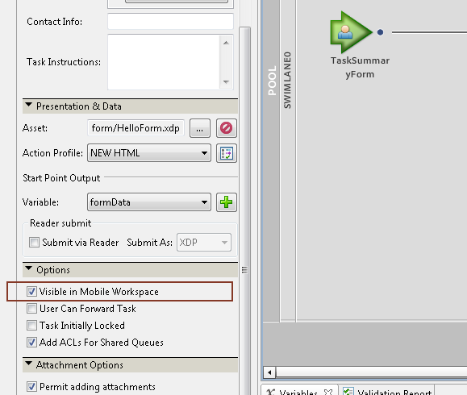

# Trabalhar com pontos de partida{#working-with-startpoints}

Um ponto de partida chama um processo criado no Workbench. Ele é associado a um formulário que chama o processo quando o formulário é enviado.

>[!NOTE]
>
>Os termos pontos de partida, processo de início e formulário são usados alternadamente quando se refere a esse conceito.

Para iniciar um processo a partir do aplicativo AEM Forms, é necessário ter um ponto de partida do tipo **Workspace** em seu processo. Além disso, é necessário selecionar a variável **[!UICONTROL Visível no Mobile Workspace]** para o ponto de partida.

**Para iniciar um processo definido no Workbench**

1. Para exibir os Pontos de partida disponíveis no aplicativo AEM Forms, acesse [Tela inicial](../../forms/using/home-screen.md).
1. No **[!UICONTROL Início]** por padrão, a variável **[!UICONTROL Todos os Forms]** é exibida.

   O ponto de partida está associado a um formulário. Toque no formulário associado ao ponto de partida na lista para abri-lo.

   O formulário associado ao ponto de partida é aberto.

1. Insira os detalhes na **[!UICONTROL Ponto de partida]** formulário.

   Você pode adicionar anotações para essa tarefa usando o [anexo](../../forms/using/add-attachments.md) botão.

1. Depois de preencher o formulário, toque no **[!UICONTROL Enviar]** botão.

Se o aplicativo estiver offline, o formulário e seus dados serão salvos na pasta Caixa de saída.

Se o aplicativo estiver online, a tarefa será sincronizada com o servidor do AEM Forms e atribuída ao usuário especificado no processo.

Para trabalhar com a tarefa na lista de tarefas, consulte [Abrir uma tarefa](/help/forms/using/open-task.md).
