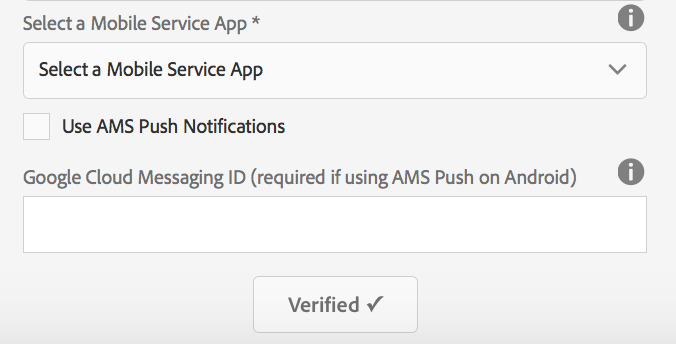
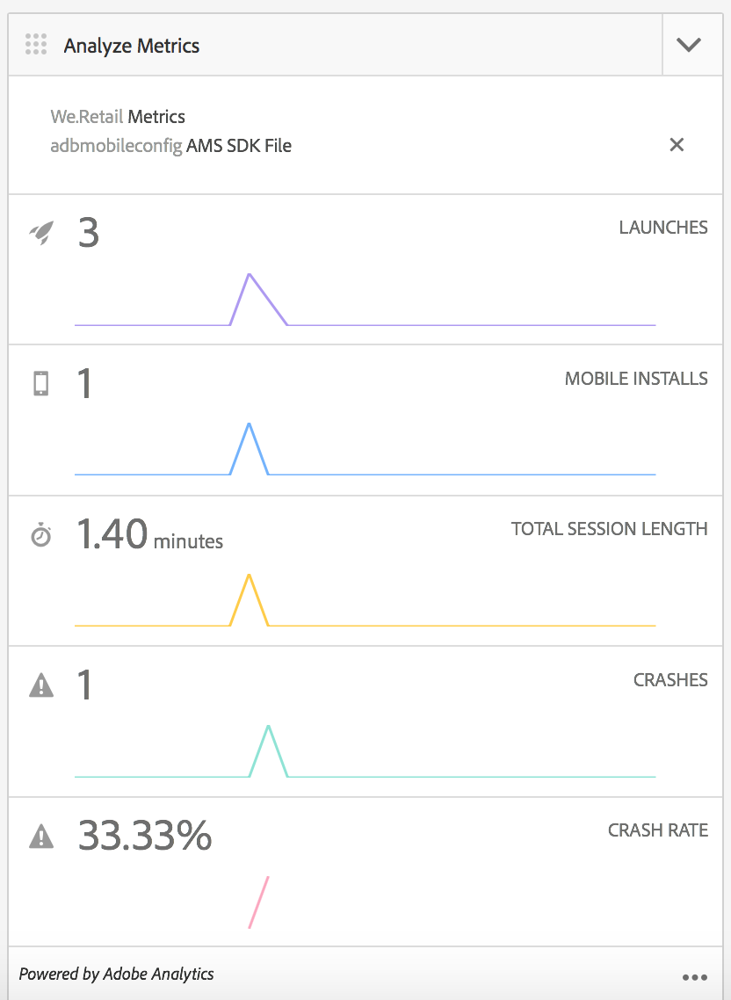

# Configure seu Cloud Service do Adobe Mobile Services {#configure-your-adobe-mobile-services-cloud-service}

>[!NOTE]
>
>A Adobe recomenda o uso do Editor de SPA para projetos que exigem renderização do cliente baseada em estrutura de aplicativo de página única (por exemplo, Reagir). [Saiba mais](/help/sites-developing/spa-overview.md).

O bloco **Métricas móveis** no centro de comando fornece análises em tempo real para seu aplicativo móvel.

O SDK [Adobe Mobile Analytics](https://www.adobe.com/ca/solutions/digital-analytics/mobile-web-apps-analytics.html) é disponibilizado por meio de um plug-in PhoneGap. As métricas são coletadas e armazenadas em cache no dispositivo até que o dispositivo esteja conectado, e então os dados são encaminhados para a Adobe Mobile Services Cloud para relatórios e análise.

O SDK do Adobe Mobile Analytics oferece o seguinte:

1. **Coleta de dados para canais**  móveis - Colete dados abrangentes para seus sites e aplicativos móveis em todos os principais sistemas operacionais.
1. **Análise**  de envolvimento móvel - Entenda o envolvimento do usuário em seu aplicativo móvel, site ou vídeo, incluindo a frequência com que os consumidores iniciam o canal, se eles fazem compras a partir dele e muito mais.
1. **Painéis e relatórios**  do aplicativo móvel - Obtenha relatórios de uso que incluem medições de ciclo de vida para seus aplicativos e métricas da app store. consulte as tendências para usuários, inicializações, duração média da sessão, duração da retenção e falhas.
1. **Análise**  de campanha móvel - Quantifica a eficácia de campanhas específicas para dispositivos móveis, como SMS, anúncios de pesquisa móvel, anúncios de exibição móvel e códigos QR.
1. **Análise**  de localização geográfica - Descubra onde os usuários do aplicativo iniciam e interagem com suas experiências móveis por localização GPS ou pontos de interesse.
1. **Análise**  de definição de caminho - Veja como os usuários navegam pelo aplicativo para determinar quais telas e elementos da interface estão envolvendo os usuários e quais fazem com que os usuários sejam excluídos.

>[!CAUTION]
>
>O bloco **Analisar métricas** é exibido no painel, somente se você tiver configurado serviços em nuvem.

Bloco de métricas do centro de comando AEM

## Configuração do Cloud Service {#configuring-the-cloud-service}

Para aproveitar as vantagens do Adobe Mobile Services Analytics, é necessário configurar o AEM Mobile Analytics Cloud Service com as informações de sua conta Adobe Analytics.

1. Clique no ícone superior direito para adicionar ou editar as Cloud Services do bloco **Gerenciar Cloud Services** do painel do aplicativo.

   

1. A tela **Adicionar ou Editar Cloud Services** é exibida. Selecione **Adobe Mobile Services** e clique em **Avançar**.

   

1. Escolha uma configuração existente do **Mobile Services** ou escolha **Criar configuração** para criar uma nova.

   Para uma nova configuração, digite **Propriedades do Mobile Services** e clique em **Verificar.**

   

   Se as credenciais forem verificadas, o botão **Verify** mudará para **Verified**. Você pode escolher um aplicativo de serviço móvel de **Selecione um serviço de aplicativo móvel**.

   Clique em **Enviar** para configurar sua configuração.

   

1. Depois de configurar uma configuração em nuvem, você pode visualização o mesmo no seu painel.

   

   >[!NOTE]
   >
   >Depois de configurar sua configuração em nuvem, você pode visualização o bloco **Analisar métricas** no painel do aplicativo.

   

