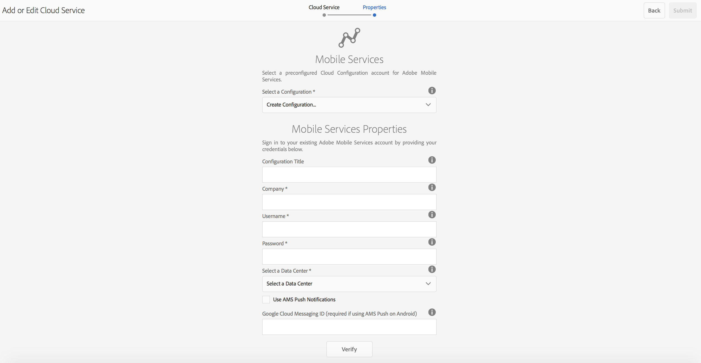

# Configurar o Cloud Service do Adobe Mobile Services {#configure-your-adobe-mobile-services-cloud-service}

>[!NOTE]
>
>A Adobe recomenda usar o Editor de SPA para projetos que exigem renderização do lado do cliente com base em estrutura de aplicativo de página única (por exemplo, React). [Saiba mais](/help/sites-developing/spa-overview.md).

O **Bloco de métricas móveis** no centro de comando fornece análises em tempo real para seu aplicativo móvel.

O [Adobe Mobile Analytics](https://www.adobe.com/ca/solutions/digital-analytics/mobile-web-apps-analytics.html) O SDK é disponibilizado por meio de um plug-in PhoneGap. As métricas são coletadas e armazenadas em cache no dispositivo até que o dispositivo esteja conectado, momento em que os dados são enviados para a Adobe Mobile Services Cloud para relatório e análise.

O SDK do Adobe Mobile Analytics oferece o seguinte:

1. **Coleta de dados para canais móveis** - Colete dados abrangentes para seus sites e aplicativos móveis em todos os principais sistemas operacionais.
1. **Análise de engajamento móvel** - Entenda o engajamento do usuário em seu aplicativo móvel, site ou vídeo, incluindo a frequência com que os consumidores inicializam o canal, independentemente de fazerem compras com ele e muito mais.
1. **Painéis e relatórios do aplicativo móvel** - Obtenha relatórios de uso que incluem medições de ciclo de vida para seus aplicativos e métricas da loja de aplicativos — consulte tendências para usuários, inicializações, duração média da sessão, duração da retenção e falhas.
1. **Análise de campanha móvel** - Quantificar a eficácia de campanhas específicas para dispositivos móveis, como SMS, anúncios de pesquisa para dispositivos móveis, anúncios para exibição para dispositivos móveis e códigos QR.
1. **Análise de geolocalização** - Descubra onde seus usuários do aplicativo são iniciados e interagem com suas experiências móveis por localização do GPS ou pontos de interesse.
1. **Análise de definição de caminho** - Veja como os usuários navegam pelo seu aplicativo para determinar quais telas e elementos da interface do usuário estão envolvendo usuários e quais fazem com que os usuários saiam.

>[!CAUTION]
>
>O **Analisar métricas** O mosaico é exibido no painel, somente se você tiver configurado os serviços em nuvem.

Bloco de Métricas do Centro de Comando AEM

## Configuração do Cloud Service {#configuring-the-cloud-service}

Para aproveitar as vantagens do Adobe Mobile Services Analytics, você precisa configurar o AEM Mobile Analytics Cloud Service com suas informações de conta do Adobe Analytics.

1. Clique no ícone superior direito para adicionar ou editar a Cloud Services da **Gerenciar Cloud Services** bloco do painel do aplicativo.

   

1. O **Adicionar ou editar Cloud Services** será exibida. Selecionar **Adobe Mobile Services** e clique em **Próximo**.

   

1. Escolha uma configuração existente no **Mobile Services** ou escolha **Criar configuração** para criar um novo.

   Para novas configurações, insira o **Propriedades do Mobile Services** e clique em **Verificar.**

   

   Se as credenciais forem verificadas, a variável **Verificar** botão muda para **Verificado**. Você pode escolher um aplicativo de serviço móvel de **Selecionar um serviço de aplicativo móvel**.

   Clique em **Enviar** para configurar sua configuração.

   

1. Depois de configurar uma configuração de nuvem, você pode exibir o mesmo no painel.

   

   >[!NOTE]
   >
   >Depois de configurar a configuração da nuvem, é possível exibir a variável **Analisar métricas** Mosaico no painel do aplicativo.

   
