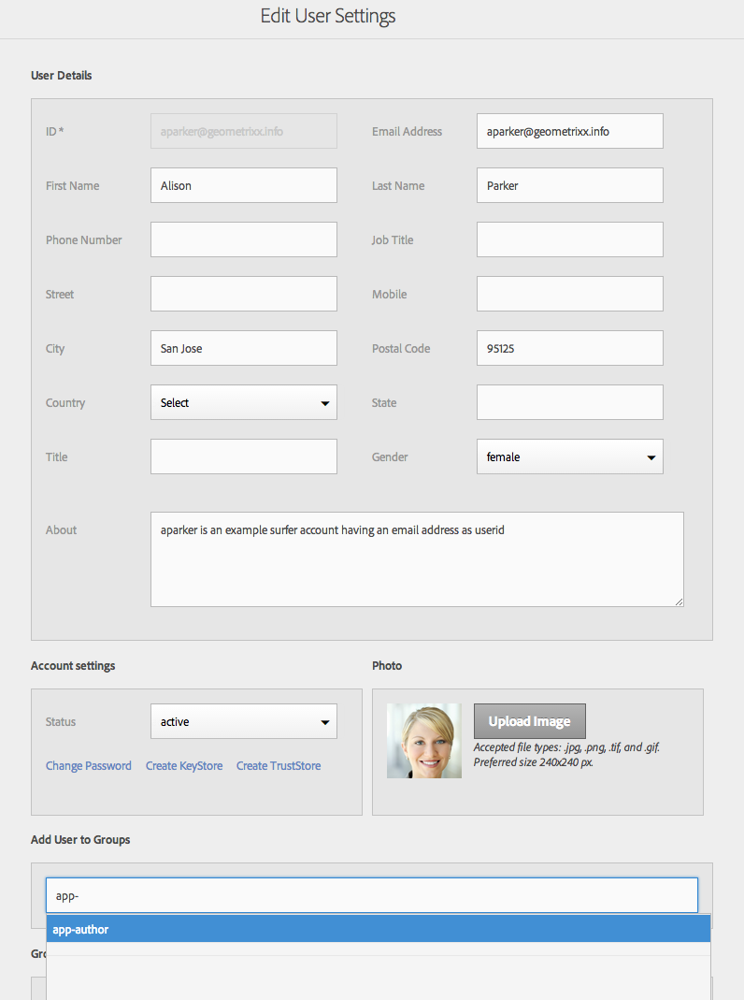

# Configurar usuários e grupos de usuários {#configure-your-users-and-user-groups}

>[!NOTE]
>
>A Adobe recomenda usar o Editor de SPA para projetos que exigem renderização do lado do cliente com base em estrutura de aplicativo de página única (por exemplo, React). [Saiba mais](/help/sites-developing/spa-overview.md).

Este capítulo descreve as funções do usuário e como configurar usuários e grupos para dar suporte à criação e ao gerenciamento de seus aplicativos móveis.

## Usuários e administração de grupo do aplicativo AEM Mobile {#aem-mobile-application-users-and-group-administration}

Para ajudar a organizar e gerenciar o modelo de permissão para AEM aplicativos, os dois grupos a seguir estão disponíveis:

* app-admins para administradores de aplicativos
* autores de aplicativos para autores de aplicativos

### Autores de conteúdo do aplicativo AEM Mobile (grupo de autores do aplicativo) {#aem-mobile-application-content-authors-app-author-group}

Os membros do grupo de autores do aplicativo são responsáveis pela criação AEM conteúdo do aplicativo móvel, incluindo páginas, texto, imagens e vídeos.

#### Configuração de grupo - autores de aplicativos {#group-configuration-app-authors}

1. Crie um novo grupo de usuários chamado &quot;autores de aplicativos&quot;:

   Navegue até o Admin Console do usuário: [http://localhost:4502/libs/granite/security/content/groupadmin.html](http://localhost:4502/libs/granite/security/content/groupadmin.html)

   No console do grupo de usuários, selecione o botão &quot;+&quot; para criar um grupo.

   Defina a ID desse grupo como &quot;autores de aplicativos&quot; para indicar que é um tipo específico de grupo de usuários de criação específico para a criação de aplicativos móveis no AEM.

1. Adicionar membro ao grupo: Autores

   

   Adicionar autores de aplicativos ao grupo Autores

1. Agora que você criou o Grupo de usuários autores de aplicativos, é possível adicionar membros individuais da equipe a esse novo grupo por meio do [Console de administração do usuário](http://localhost:4502/libs/granite/security/content/useradmin.md).

   

   Editar grupos de usuários

1. Navegue até o [Console de permissões](http://localhost:4502/useradmin) e adicionar permissões para administrar cloudservices

   * (Leitura) em /etc/cloudservices
   >[!NOTE]
   >
   >Os Autores do aplicativo estende o grupo de autores de conteúdo padrão (Autores) do AEM, herdando assim a capacidade de criar conteúdo em /content/phonegap

### Grupo de administradores de aplicativos do AEM Mobile (grupo de administradores de aplicativos) {#aem-mobile-application-administrators-group-app-admins-group}

Membros do grupo app-admins podem criar conteúdo do aplicativo com as mesmas permissões incluídas com autores de aplicativos **E** além disso, são também responsáveis por:

* Configuração dos serviços em nuvem do PhoneGap Build e Adobe Mobile Services no AEM
* Armazenamento temporário, publicação e limpeza de atualizações de OTA de sincronização de conteúdo do aplicativo

>[!NOTE]
>
>As permissões determinam a disponibilidade de algumas ações do usuário no AEM App Command Center.
>
>Você observará que algumas opções não estão disponíveis para autores de aplicativos que estão disponíveis para administradores de aplicativos.

#### Configuração de grupo - app-admins {#group-configuration-app-admins}

1. Crie um novo grupo chamado app-admins.
1. Adicione os seguintes grupos ao seu novo grupo de administradores de aplicativos:

   * autores de conteúdo
   * usuários de fluxo de trabalho

   

1. Navegue até o [Console de permissões](http://localhost:4502/useradmin) e adicionar permissões para administrar cloudservices

   * (Ler, Modificar, Criar, Excluir, Replicar) em /etc/cloudservices/mobileservices
   * (Ler, Modificar, Criar, Excluir, Replicar) em /etc/cloudservices/phonegap-build

1. No mesmo console Permissões, adicione permissões para preparar, publicar e limpar atualizações de conteúdo do aplicativo

   * (Ler, Modificar, Criar, Excluir, Replicar) em /etc/packages/mobileapp
   * (Leia) em /var/contentsync

   >[!NOTE]
   >
   >A replicação de pacotes é usada para publicar atualizações de aplicativos da instância de autor na instância de publicação

   >[!CAUTION]
   >
   >O acesso a /var/contentsync é negado ao OOTB.
   >
   >A omissão da permissão READ pode resultar na criação e replicação de pacotes de atualização vazios.

1. Adicionar membros a este grupo, conforme necessário

## Permissões do mosaico do painel {#dashboard-tile-permissions}

Os blocos de painel podem expor ações diferentes com base nas permissões que o usuário tem. A tabela a seguir descreve quais ações estão disponíveis para cada bloco.

Além dessas permissões, uma ação também pode ser exibida/oculta com base em como o aplicativo atual está configurado. Por exemplo, não adianta expor a ação &quot;Compilação remota&quot;, se uma configuração de nuvem PhoneGap não tiver sido atribuída ao aplicativo. Elas serão listadas abaixo em &quot;**Condição de configuração**&quot;.

### Gerenciar mosaico do aplicativo {#manage-app-tile}

No momento, o bloco não tem ações que exijam permissões, no entanto, a página de detalhes do aplicativo tem as seguintes ações:

* *Editar* para app-author e app-admin (Acionador da interface do usuário - jcr:write - em /content/phonegap/{suffix})
* *Baixar* para app-author e app-admin (Acionador da interface do usuário - em /content/phonegap/{suffix})

A imagem abaixo mostra as opções Download e Editar para um aplicativo:

