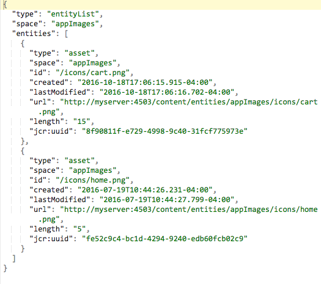

# Entrega de conteúdo{#content-delivery}

>[!NOTE]
>
>A Adobe recomenda usar o Editor SPA para projetos que exigem renderização do lado do cliente baseada em estrutura de aplicativo de página única (por exemplo, Reagir). [Saiba mais](/help/sites-developing/spa-overview.md).

Os aplicativos móveis devem poder usar todo e qualquer conteúdo no AEM, conforme necessário, para oferecer a experiência do aplicativo direcionado.

Isso inclui o uso de ativos, conteúdo do site, conteúdo de CaaS (over-the-air) e conteúdo personalizado que pode ter sua própria estrutura.

>[!NOTE]
>
>**O conteúdo** Over-the-Air pode vir de qualquer um dos itens acima por meio de manipuladores ContentSync. Ele pode ser usado para o pacote em lote e a entrega via zips, além de manter atualizações ou esses pacotes.

Há três tipos principais de material que os Serviços de conteúdo fornecem:

1. **Assets**
1. **Conteúdo HTML empacotado (HTML/CSS/JS)**
1. **Conteúdo independente de canal**

## Assets {#assets}

Coleções de ativos são construções do AEM que contêm referências a outras coleções.

Uma coleção de ativos pode ser exposta por meio do Content Services. Chamar uma coleção de ativos em uma solicitação retorna um objeto que é uma lista dos ativos - incluindo seus URLs. Os ativos são acessados por meio de um URL. O URL é fornecido em um objeto. Por exemplo:

* Uma entidade de página retorna JSON (objeto de página) que inclui uma referência de imagem. A referência de imagem é um URL usado para obter o binário de ativo da imagem.
* Uma solicitação para uma lista de ativos em uma pasta retorna JSON com detalhes sobre todas as entidades dessa pasta. Essa lista é um objeto. O JSON tem referências de URL que são usadas para obter o binário de ativos para cada ativo nessa pasta.

### Otimização de ativos {#asset-optimization}

Um valor importante dos Serviços de conteúdo é a capacidade de retornar ativos otimizados para o dispositivo. Isso reduz as necessidades de armazenamento de dispositivos locais e melhora o desempenho do aplicativo.

A otimização de ativos será uma função do lado do servidor, com base nas informações fornecidas na solicitação da API. Sempre que possível, as representações de ativos devem ser armazenadas em cache, de modo que solicitações semelhantes não exijam uma regeração da representação de ativos.

### Fluxo de trabalho de ativos {#assets-workflow}

O fluxo de trabalho do ativo é o seguinte:

1. Referência de ativos disponível no AEM pronto para uso
1. Criar entidade de referência de ativo, considerando seu modelo
1. Editar entidade

   1. Selecionar ativo ou coleção de ativos
   1. Personalizar renderização JSON

O diagrama a seguir mostra o fluxo de trabalho **de referência de** ativos:

### Gerenciar ativos {#managing-assets}

Os Serviços de conteúdo fornecem acesso a ativos gerenciados pelo AEM que podem não ser referenciados por meio de outro conteúdo do AEM.

#### Ativos gerenciados existentes {#existing-managed-assets}

Um usuário existente do AEM Sites e Assets está usando os ativos AEM para gerenciar todo o material digital para todos os canais. Eles estão desenvolvendo um aplicativo móvel nativo e precisam usar vários ativos gerenciados pelos ativos AEM. Por exemplo, logotipos, imagens de fundo, ícones de botão etc.

Atualmente, esses valores são distribuídos no repositório Ativos. Os arquivos que o aplicativo precisa referenciar estão em:

* /content/dam/geometrixx-outdoors/brand/logo_light.png
* /content/dam/geometrixx-outdoors/brand/logo_dark.png
* /content/dam/geometrixx-outdoors/styles/backgrounds/gray_blue.jpg
* /content/dam/geometrixx-outdoors/brand/icons/app/cart.png
* /content/dam/geometrixx-outdoors/brand/icons/app/home.png

#### Acessar entidades de ativos do CS {#accessing-cs-asset-entities}

Vamos deixar de lado as etapas de como a página é disponibilizada pela API por enquanto (ela será coberta pela descrição da interface do usuário do AEM) e assumir que foi feita. As entidades de ativos foram criadas e adicionadas ao espaço &quot;appImages&quot;. Pastas adicionais foram criadas no espaço para fins de organização. Portanto, as entidades de ativos são armazenadas no JCR AEM como:

* /content/entity/appImages/logos/logo_light
* /content/entity/appImages/logos/logo_escuro
* /content/entity/appImages/bkgnd/gray_blue
* /content/entity/appImages/icons/carrinho
* /content/entity/appImages/icons/home

#### Obtendo uma lista de entidades de ativos disponíveis {#getting-a-list-of-available-asset-entities}

Um desenvolvedor de aplicativos pode obter uma lista de quais ativos estão disponíveis, recuperando as entidades de ativos. O terminal de espaço do Content Services pode fornecer essas informações por meio do SDK da API do serviço da Web.

O resultado seria um objeto em um formato JSON que forneceria uma lista dos ativos na pasta &quot;ícones&quot;.

#### Obtendo uma imagem {#getting-an-image}

O JSON fornece um URL para cada imagem, gerada pelos Serviços de conteúdo para a imagem.

Para obter o binário para a imagem do &quot;carrinho&quot;, a biblioteca do cliente é usada novamente.

## Conteúdo HTML empacotado {#packaged-html-content}

O conteúdo HTML é necessário para clientes que precisam manter o layout do conteúdo. Isso é útil para aplicativos nativos que estão usando um contêiner da Web - como uma visualização da Web do Cordova - para exibir o conteúdo.

Os AEM Content Services poderão fornecer conteúdo HTML ao aplicativo móvel por meio da API. Os clientes que desejam expor o conteúdo do AEM como HTML criarão uma entidade de página HTML que aponte para a fonte de conteúdo do AEM.

As seguintes opções são consideradas:

* **** Arquivo Zip: Para ter a melhor chance de exibir corretamente no dispositivo, todo o material referenciado da página - css, JavaScript, ativos etc. - será incluído em um único arquivo compactado com a resposta. As referências na página HTML serão ajustadas para usar um caminho relativo para esses arquivos.
* **** Streaming: Obtendo um manifesto dos arquivos necessários do AEM. Em seguida, use esse manifesto para solicitar todos os arquivos (HTML, CSS, JS etc.) com solicitações subsequentes.

## Conteúdo independente do canal {#channel-independent-content}

O conteúdo independente de canal é uma forma de expor construções de conteúdo do AEM - como páginas - sem se preocupar com layout, componentes ou outras informações específicas de canal.

Essas entidades de conteúdo são geradas usando um modelo de conteúdo para traduzir as estruturas do AEM em um formato JSON. Os dados JSON resultantes contêm informações sobre os dados do conteúdo, que são dissociados do repositório do AEM. Isso inclui o retorno de metadados e links de referência do AEM para ativos, bem como as relações entre estruturas de conteúdo - incluindo hierarquia de entidades.

### Gerenciamento de conteúdo independente de canal {#managing-channel-independent-content}

O conteúdo pode acessar o aplicativo de várias maneiras.

1. OBTENHA ZIPS de conteúdo via AEM Over-the-Air

   * Os manipuladores de Sincronização de conteúdo podem atualizar o pacote zip diretamente ou chamando os renderizadores de conteúdo existentes

      * Manipuladores de plataforma
      * Manipuladores de AEMM
      * Manipuladores personalizados

1. OBTER conteúdo diretamente por meio de renderizadores de conteúdo

   * Renderizadores padrão prontos para uso
   * Renderizadores de conteúdo do AEM Mobile/Content Services
   * Renderizações personalizadas

