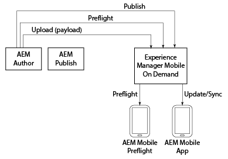

# AEM Mobile On-Demand{#aem-mobile-on-demand}

{{ue-over-mobile}}

>[!NOTE]
>
>Se você não estiver usando o Adobe Experience Manager (AEM) como fonte de gerenciamento de conteúdo, consulte a [Ajuda do AEM Mobile On-demand Services](https://helpx.adobe.com/digital-publishing-solution/topics.html).

O AEM fornece várias ferramentas que permitem integrar seu conteúdo em aplicativos móveis.

O diagrama a seguir ilustra como os vários componentes do AEM Mobile e dos serviços por demanda se encaixam para fornecer conteúdo aos aplicativos móveis.

O aplicativo AEM Preflight pode ser considerado um ambiente de teste para visualizar o aplicativo e o conteúdo antes da publicação, enquanto o aplicativo AEM Mobile é o aplicativo final criado para distribuição.

>[!NOTE]
>
>Para saber mais detalhes sobre o aplicativo Comprovação, consulte [Usar o aplicativo Comprovação do AEM](https://helpx.adobe.com/digital-publishing-solution/help/preflight-app.html) na Ajuda do AEM Mobile On-demand Services.

>[!NOTE]
>
>No diagrama acima, a instância de publicação do AEM não é necessária para um cenário de implantação típico no AEM Mobile On-demand Services.

## Iniciar um novo aplicativo móvel {#starting-a-new-mobile-app}

O AEM Mobile é apenas um pilar que compõe a plataforma completa do AEM.

Para iniciar uma nova experiência de aplicativo AEM Mobile, é necessário ter várias funções antes que ela esteja pronta para edição de conteúdo. As seguintes funções fornecem um ponto de partida para a criação de um aplicativo do AEM Mobile:

* **Administrador**
* **Desenvolvedor**
* **Autor**

>[!NOTE]
>
>Antes de trabalhar com o AEM Mobile e seguir as etapas deste guia de introdução, os usuários devem se familiarizar com o AEM. Saiba mais sobre as noções básicas do AEM [aqui](/help/sites-deploying/deploy.md).

### Noções básicas sobre o AEM Mobile Application Dashboard {#understanding-the-aem-mobile-application-dashboard}

Antes de entender as funções e responsabilidades, o usuário deve ter conhecimento profundo do **Centro de Controle do AEM Mobile** ou do **Painel de Aplicativos**. Clique [aqui](/help/mobile/mobile-apps-ondemand-application-dashboard.md) para obter um entendimento detalhado.

### Admin do AEM {#aem-administrator}

Um ***administrador do AEM*** é responsável por adicionar um aplicativo ao catálogo do AEM Mobile, criando um aplicativo usando o assistente de criação ou importando um aplicativo existente. Os administradores do AEM que criam um aplicativo usando o *assistente de criação* do AEM Mobile normalmente selecionam um dos modelos de aplicativo desejados nas amostras de referência prontas para uso da Adobe ou (geralmente) um modelo de aplicativo personalizado criado por *desenvolvedores do AEM.*

Um administrador do AEM é responsável pelas seguintes tarefas ao criar um aplicativo usando o AEM Mobile On-demand Services:

* [Configuração do AEM Mobile](/help/mobile/aem-mobile-setup.md)
* [Configurar usuários e grupos de usuários](/help/mobile/aem-mobile-configure-users.md)
* [Visualização com simulação](/help/mobile/aem-mobile-manage-ondemand-services.md)
* [Administração dos serviços de conteúdo](/help/mobile/developing-content-services.md)

Para começar a usar as funções e responsabilidades de um Administrador, consulte [Administração de Conteúdo para Usar o AEM Mobile On-demand Services](/help/mobile/aem-mobile.md).

## Desenvolvedor do AEM {#aem-developer}

Um **desenvolvedor do AEM** estende e cria modelos e componentes personalizados da Web para permitir que o *Autor do AEM *crie experiências móveis atraentes. Esses modelos e componentes não são otimizados apenas para o mundo do aplicativo móvel, mas se comunicam com o dispositivo e com o servidor do AEM (qualquer servidor remoto) para pontos de extremidade de serviço omnicanal. O editor de conteúdo integrado do AEM é usado pelos *AEM Author* para criar experiências avançadas e relevantes no aplicativo, incluindo a integração com o restante da Adobe Experience Cloud.

Um desenvolvedor do AEM é responsável pelas seguintes tarefas ao criar um aplicativo usando o AEM Mobile On-demand Services:

* [Modelos e componentes do aplicativo](/help/mobile/app-templates-and-components1.md)
* [Dispositivo móvel com sincronização de conteúdo](/help/mobile/mobile-ondemand-contentsync.md)
* [Propriedades de conteúdo e exportação de conteúdo](/help/mobile/on-demand-content-properties-exporting.md)
* [Desenvolvimento dos serviços de conteúdo do AEM Mobile](/help/mobile/developing-content-services.md)

Para começar a usar as funções e responsabilidades do desenvolvedor, consulte [Desenvolvendo conteúdo do AEM para AEM Mobile On-demand Services](/help/mobile/aem-mobile-on-demand.md).

>[!NOTE]
>
>A função de *desenvolvedor do AEM* não inicia nem termina com o desenvolvimento de modelos e componentes. Um *desenvolvedor do AEM* pode criar um aplicativo totalmente novo, em vez de simplesmente estender a amostra de implementação de referência pronta para uso.

## Autor do AEM {#aem-author}

Um ***Autor do AEM* (ou *Profissional de marketing*)**&#x200B;usa modelos e componentes personalizados, desenvolvidos ou prontos para uso, para adicionar e editar páginas, arrastar e soltar componentes e adicionar mídia de todos os tipos do DAM, incluindo imagens, vídeos e fragmentos de texto (fragmentos de conteúdo). O editor de conteúdo integrado do AEM é usado pelos *AEM Author* para criar experiências avançadas e relevantes no aplicativo, incluindo a integração com o restante da Adobe Experience Cloud.

Um autor do AEM deve entender os seguintes tópicos ao criar um aplicativo usando o AEM Mobile On-demand Services:

* [Painel de aplicativos do AEM Mobile](/help/mobile/mobile-apps-ondemand-application-dashboard.md)
* [Ações de Criação e Configuração de Aplicativo](/help/mobile/mobile-apps-ondemand-application-create-configure-action.md)
* [Configuração de nuvem](/help/mobile/mobile-on-demand-associating-an-on-demand-app-to-cloud-configuration.md)
* [Gerenciamento de conteúdo](/help/mobile/mobile-apps-ondemand-manage-content-ondemand.md)
* [Visão geral dos serviços de conteúdo](/help/mobile/develop-content-as-a-service.md)

Para começar a usar as funções e responsabilidades de um Autor, consulte [Criação de conteúdo do AEM para o aplicativo AEM Mobile On-demand Services](/help/mobile/mobile-apps-ondemand.md).

>[!NOTE]
>
>Um autor do AEM também é responsável por configurar os direitos do, criar cartões e layouts e enviar notificações por push. Além disso, para obter mais informações sobre métodos de criação de conteúdo, gerenciamento de artigos e coleções, criação de banners, cartões e layouts no AEM Mobile, consulte o [AEM Mobile On-Demand Portal](https://helpx.adobe.com/digital-publishing-solution/topics.html#dynamicpod_reference_2).
