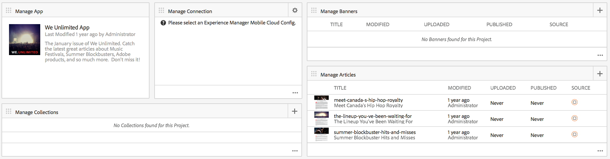

# Painel do aplicativo AEM Mobile {#aem-mobile-application-dashboard}

>[!NOTE]
>
>A Adobe recomenda usar o Editor SPA para projetos que exigem renderização do lado do cliente baseada em estrutura de aplicativo de página única (por exemplo, Reagir). [Saiba mais](/help/sites-developing/spa-overview.md).

Você pode gerenciar o conteúdo do aplicativo e do aplicativo móvel no Painel de aplicativos do AEM Mobile ou no Centro de controle.

Você pode detalhar cada bloco no Centro de Controle para exibir ou editar detalhes clicando em &#39;...&#39; no canto inferior direito.

>[!NOTE]
>
>É possível reorganizar a ordem dos blocos clicando no ícone de apropriação do bloco (9 pontos principais à esquerda). A alteração da ordem é específica do usuário - diferente para usuários individuais.

O gerenciamento de conteúdo do aplicativo requer um esforço coletivo de desenvolvedores, autores de conteúdo e administradores. Os autores manipulam as páginas, que por sua vez são baseadas em modelos e componentes gerados pelos desenvolvedores do aplicativo.

Finalmente, os administradores publicam estrategicamente o conteúdo atualizado do aplicativo.

## O bloco Gerenciar aplicativo {#the-manage-app-tile}

O bloco **Gerenciar aplicativo** exibe as informações disponíveis do aplicativo:

* Título
* Descrição
* Ícone
* Última modificação
* Última modificação por

## O bloco Gerenciar conexão {#the-manage-connection-tile}

O bloco **Gerenciar conexão** exibe as informações de conexão do AEM Mobile On-Demand Services:

* Nome da configuração de pod
* Nome e ID do projeto
* Status da conexão

>[!NOTE]
>
>Clique na engrenagem na parte superior direita para configurar uma configuração da Mobile On-Demand Cloud.
>
>Consulte [Configuração de Mobile On-Demand Services](/help/mobile/mobile-on-demand-associating-an-on-demand-app-to-cloud-configuration.md) para obter detalhes.

## Gerenciando Entidades {#managing-entities}

Esses 3 blocos fornecem uma visão geral do estado do conteúdo de um aplicativo:

* **Banners**
* **artigos**
* **coleções**

Cada bloco pode ser expandido para fornecer uma exibição de lista mais detalhada clicando nas reticências (...) no canto inferior direito. Essas exibições de lista fornecem uma maneira alternativa de acessar ações comuns do Mobile On Demand, como excluir, carregar e editar propriedades.

### O bloco Gerenciar banners {#the-manage-banners-tile}

O bloco **Gerenciar banners** permite gerenciar o conteúdo de um banner. As seguintes informações são exibidas para um banner:

* imagem
* **TÍTULO**: nome do banner
* **MODIFICADO**: última modificação no AEM
* **CARREGADO**: último upload do AEM
* **PUBLICADO**: último formulário de solicitação publicado AEM
* **ORIGEM**: origem (AEM local ou remoto do Mobile On Demand)

A imagem a seguir mostra o bloco **Gerenciar banners** no painel do aplicativo AEM Mobile:

>[!NOTE]
>
>Consulte **[Gerenciamento de banners](/help/mobile/mobile-on-demand-managing-banners.md)**para criar, excluir ou atualizar os banners.

### O bloco Gerenciar artigos {#the-manage-articles-tile}

O bloco **Gerenciar artigos** permite gerenciar o conteúdo de um artigo. As seguintes informações são exibidas para um artigo:

* imagem
* **TÍTULO**: nome do artigo
* **MODIFICADO**: última modificação no AEM
* **CARREGADO**: último upload do AEM
* **PUBLICADO**: último formulário de solicitação publicado AEM
* **ORIGEM**: origem (AEM local ou remoto do Mobile On-Demand)

A imagem a seguir mostra o bloco **Gerenciar artigos** no Painel de aplicativos do AEM Mobile:

>[!NOTE]
>
>Consulte [**Gerenciar artigos **](/help/mobile/mobile-on-demand-managing-articles.md)para criar, excluir ou atualizar os artigos.

### O bloco Gerenciar coleções {#the-manage-collections-tile}

O bloco **Gerenciar coleções** permite gerenciar o conteúdo de uma coleção. As seguintes informações são exibidas para uma coleção:

* imagem
* **TÍTULO**: nome da coleção
* **MODIFICADO**: última modificação no AEM
* **CARREGADO**: último upload do AEM
* **PUBLICADO**: último formulário de solicitação publicado AEM
* **ORIGEM**: origem (AEM local ou remoto do Mobile On-Demand)

A imagem a seguir mostra o bloco **Gerenciar coleções** no painel de aplicativos do AEM Mobile:

>[!NOTE]
>
>Consulte **[Gerenciar coleções](/help/mobile/mobile-on-demand-managing-collections.md)**para criar, excluir ou atualizar as coleções.

### Próximas etapas {#the-next-steps}

Depois de conhecer o painel do aplicativo, consulte os seguintes recursos para criar um aplicativo móvel:

* [Ações de criação e configuração do aplicativo](/help/mobile/mobile-apps-ondemand-application-create-configure-action.md)
* [Associando um aplicativo sob demanda a uma configuração na nuvem](/help/mobile/mobile-on-demand-associating-an-on-demand-app-to-cloud-configuration.md)
* [Ações de gerenciamento de conteúdo](/help/mobile/mobile-apps-ondemand-manage-content-ondemand.md)

### Additional Resources {#additional-resources}

Para saber mais sobre as funções e responsabilidades de um Administrador e Desenvolvedor, consulte os recursos abaixo:

* [Desenvolver conteúdo do AEM para serviços sob demanda do AEM Mobile](/help/mobile/aem-mobile-on-demand.md)
* [Administração de conteúdo para usar os serviços sob demanda do AEM Mobile](/help/mobile/aem-mobile.md)

