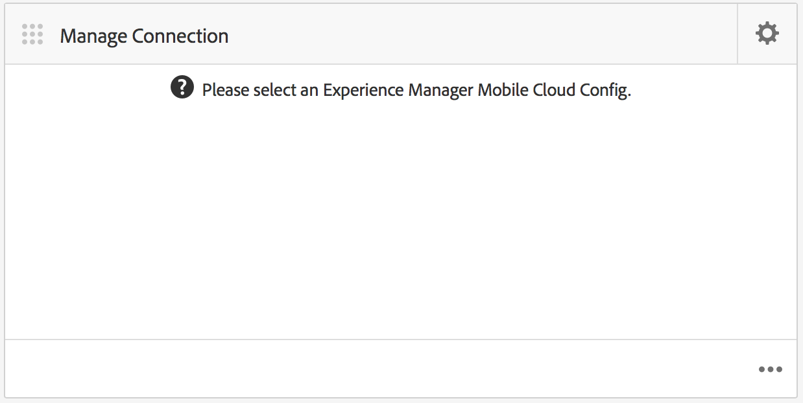

# Configuração na nuvem{#cloud-configuration}

>[!NOTE]
>
>A Adobe recomenda o uso do Editor de SPA para projetos que exigem renderização do cliente baseada em estrutura de aplicativo de página única (por exemplo, Reagir). [Saiba mais](/help/sites-developing/spa-overview.md).

Associar um aplicativo sob demanda a uma configuração na nuvem permite que a Adobe Experience Manager (AEM) se comunique diretamente com um projeto hospedado no Mobile On-Demand estabelecendo um link bidirecional. Ao vincular seu aplicativo a um projeto Mobile On-Demand, você poderá realizar a criação de conteúdo, como artigos, banners e coleções no AEM, mas também fornecer esse conteúdo para Mobile On-Demand.

Daí, a publicação, visualização e gerenciamento de conteúdo se torna possível. Também é possível importar conteúdo Mobile On-Demand existente para AEM e realizar a edição de conteúdo.

## Configuração da nuvem configurada {#setting-up-cloud-configuration}

>[!CAUTION]
>
>Antes de configurar a configuração em nuvem para seu aplicativo sob demanda, você deve estar familiarizado com o AEM Mobile Provisioning e a configuração do AEM Mobile On-demand Services Client.
>
>Para obter detalhes, consulte [Configuração do AEM Mobile On-demand Services](/help/mobile/aem-mobile-setup.md) na seção Administração.

Para configurar Cloud Services Mobile On-Demand, clique na engrenagem superior no canto superior direito do bloco **Gerenciar conexão** do painel do aplicativo.

Familiarize-se com o painel do aplicativo e os blocos disponíveis. Consulte [Painel de aplicativos AEM Mobile](/help/mobile/mobile-apps-ondemand-application-dashboard.md) para obter mais detalhes.

### Configuração do link para a configuração da nuvem {#setting-up-link-to-cloud-configuration}

>[!CAUTION]
>
>Certifique-se de ter uma configuração de cliente e nuvem sob demanda existente.
>
>Para obter detalhes, consulte [Configuração do AEM Mobile On-demand Services](/help/mobile/aem-mobile-setup.md) na seção Administração.

As etapas a seguir descrevem como configurar o link para a configuração da nuvem:

1. Em **Dispositivo móvel**, escolha **Aplicativos** e depois seu aplicativo Mobile On-Demand do catálogo.
1. Clique no ícone de engrenagem no bloco **Gerenciar conexão**.

   

1. Digite a configuração já existente ou crie uma nova digitando **Título da configuração**, **Id do dispositivo** e **Token do dispositivo**.

   

1. Depois que seu **Id do dispositivo** e **Token do dispositivo** forem verificados, escolha seu projeto sob demanda na lista.

   Clique em **Enviar**.

   

   O bloco **Gerenciar conexão** mostra sua configuração na nuvem.

   

   >[!CAUTION]
   >
   >Se tentar alterar o projeto ao qual este aplicativo está associado, ao mudar o projeto no painel, você receberá um aviso sobre problemas de integridade do conteúdo, como mostrado na figura abaixo:

   

### Próximas etapas {#the-next-steps}

Depois de configurar a configuração em nuvem para o aplicativo, consulte os seguintes recursos para gerenciar o conteúdo:

* [Gerenciamento de artigos](/help/mobile/mobile-on-demand-managing-articles.md)
* [Gerenciamento de banners](/help/mobile/mobile-on-demand-managing-banners.md)
* [Gerenciamento de coleções](/help/mobile/mobile-on-demand-managing-collections.md)
* [Upload de recursos compartilhados](/help/mobile/mobile-on-demand-shared-resources.md)
* [Publicar/desfazer a publicação do conteúdo](/help/mobile/mobile-on-demand-publishing-unpublishing.md)
* [Visualização com o Preflight](/help/mobile/aem-mobile-manage-ondemand-services.md)
