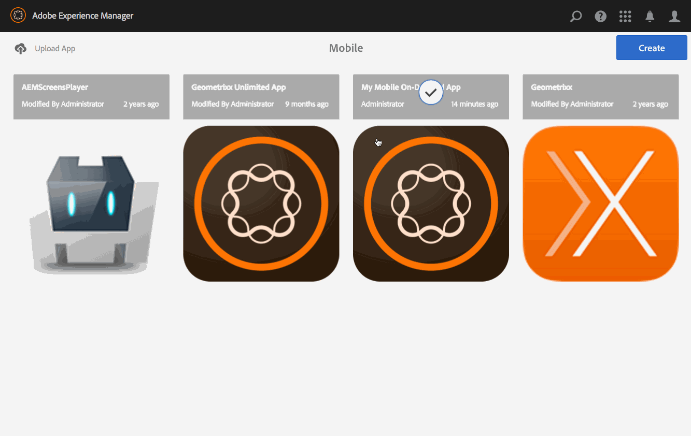

# Gerenciamento de artigos{#managing-articles}

>[!NOTE]
>
>A Adobe recomenda usar o Editor de SPA para projetos que exigem renderização do lado do cliente com base em estrutura de aplicativo de página única (por exemplo, React). [Saiba mais](/help/sites-developing/spa-overview.md).

As ações de Gestão de Conteúdo são os elementos fundamentais que ajudam a criar e gerir artigos numa aplicação. As seguintes ações são executadas nos artigos do aplicativo.

## Visão geral dos artigos {#articles-overview}

Os artigos representam o texto com base na arte para transmitir informações.

>[!NOTE]
>
>Consulte os seguintes recursos na Ajuda online para saber mais sobre os seguintes tópicos em aplicativos AEM Mobile:
>
>* [Considerações de design](https://helpx.adobe.com/digital-publishing-solution/help/design-app.html)
>
>* [Gerenciamento de artigos](https://helpx.adobe.com/digital-publishing-solution/help/creating-articles.html)
>

## Criação de um artigo {#creating-an-article}

O fluxo de trabalho geral para criar um artigo é o seguinte:

1. Selecionar **Celular** no painel lateral.
1. No Mobile, escolha seu aplicativo Mobile On-Demand no catálogo.
1. Clique na seta para baixo no canto superior direito da **Gerenciar artigos** mosaico.
1. Escolha um modelo de artigo e clique em **Próximo**.
1. Execute cada etapa do assistente para continuar criando seu novo artigo.
1. Quando estiver pronto, clique em **Criar**.
1. Seu novo artigo aparece no **Gerenciar artigos** mosaico.

## Importação de um novo artigo {#importing-a-new-article}

O conteúdo móvel sob demanda existente pode ser baixado (importado) do Mobile On-Demand para AEM. Isso permite a edição e a visualização de conteúdo local.

>[!NOTE]
>
>A importação não inclui imagens.

O fluxo de trabalho para importar um novo artigo

1. Em Dispositivo móvel, escolha seu aplicativo móvel sob demanda no catálogo.
1. Clique na seta para baixo no canto superior direito da **Gerenciar artigos** e selecione Importar artigos.
1. Clique em **Importar artigos** na caixa de diálogo, em seguida, em Fechar.
1. Seus artigos sobre dispositivos móveis sob demanda agora aparecem no **Gerenciar artigos** mosaico.

>[!CAUTION]
>
>Você deve associar uma conexão móvel sob demanda primeiro.

## Edição de um artigo {#editing-an-article}

Use o editor arrastar e soltar incorporado AEM adicionar ou alterar um artigo. Componentes como texto e imagens podem ser adicionados/removidos. Imagens de ativos DAM podem ser inseridas.

>[!CAUTION]
>
>Somente os artigos criados no AEM podem ser abertos no editor.

O fluxo de trabalho para editar um artigo:

1. No Mobile, escolha seu aplicativo Mobile On-Demand no catálogo.
1. Selecione um artigo de origem AEM do **Gerenciar artigos** mosaico.
1. Clique no artigo destacado da exibição de lista para abri-lo no editor de conteúdo.
1. Use o editor de conteúdo para arrastar o conteúdo do artigo (manuscritos, imagens, texto etc.).

### Visualização e edição dos metadados em um artigo {#viewing-and-editing-the-metadata-within-an-article}

Conteúdos como artigos, banners etc têm várias propriedades, como títulos, descrições, imagens. Essa ação é usada para exibir e modificar essas propriedades. Como opção, essas alterações podem ser carregadas no Mobile On-Demand ao salvar.

O fluxo de trabalho geral para exibir/editar um artigo:

1. No Mobile, escolha seu aplicativo Mobile On-Demand no catálogo.
1. Escolha um artigo no **Gerenciar artigos** mosaico.

1. Selecionar **Propriedades da exibição** na barra de ações.
1. Exibir todos os metadados disponíveis para esse artigo.
1. Edite os metadados, se desejado, e clique em **Salvar** quando concluído.
1. Como opção, carregue as alterações imediatamente no Mobile On-Demand.

## Upload de um artigo {#uploading-an-article}

A ação de upload copia o conteúdo selecionado e o adiciona a um projeto Mobile On-Demand. O conteúdo Mobile On-Demand já existente é substituído pela nova versão.

O fluxo de trabalho geral para fazer upload de um artigo:

1. De **Celular**, escolha seu aplicativo Mobile On-Demand no catálogo.
1. No **Gerenciar artigos** em bloco, selecione um artigo para upload no Mobile On-Demand.
1. Adicione mais artigos, se necessário, na exibição em lista.
1. Selecionar **Upload** na barra de ações, em seguida, clique em Fazer upload na caixa de diálogo.
1. Seus artigos agora são enviados para o Mobile On-Demand.

## Exclusão de um artigo {#deleting-an-article}

Essa operação exclui o conteúdo selecionado do Mobile On-Demand e, opcionalmente, da instância de AEM local.

O fluxo de trabalho geral para excluir um artigo:

1. No Mobile, escolha seu aplicativo Mobile On-Demand no catálogo.
1. Selecione o artigo a ser excluído no **Gerenciar artigos** mosaico.
1. Certifique-se de que está selecionada na lista (selecione outras pessoas para eliminar conforme necessário).
1. Clique em **Excluir** na barra de ações.
1. Verifique se deseja excluir do AEM, bem como do Mobile On-Demand.
1. Clique em **Excluir**.
1. Seu artigo foi removido da lista.

### Próximas etapas {#the-next-steps}

Uma vez que você aprender sobre como gerenciar artigos, consulte

* [Gerenciamento de banners](/help/mobile/mobile-on-demand-managing-banners.md)
* [Gerenciando Coleções](/help/mobile/mobile-on-demand-managing-collections.md)
* [Upload de recursos compartilhados](/help/mobile/mobile-on-demand-shared-resources.md)
* [Publicar/desfazer a publicação do conteúdo](/help/mobile/mobile-on-demand-publishing-unpublishing.md)
* [Visualização com comprovação](/help/mobile/aem-mobile-manage-ondemand-services.md)
