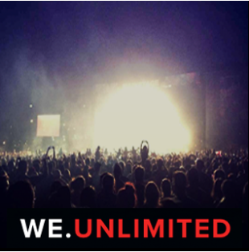
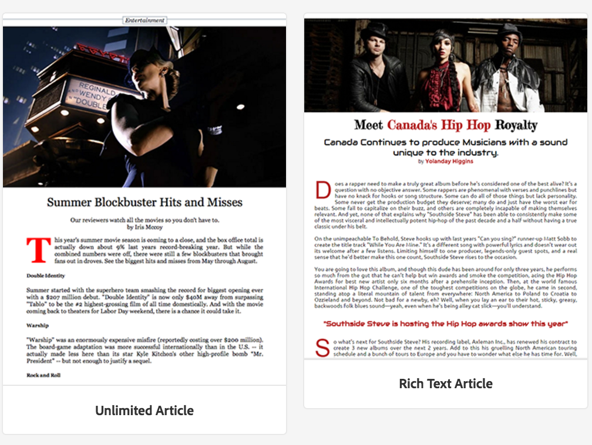

# Criando e Adicionando Modelos e Componentes {#creating-and-adding-templates-and-components}

>[!NOTE]
>
>A Adobe recomenda o uso do Editor de SPA para projetos que exigem renderização do cliente baseada em estrutura de aplicativo de página única (por exemplo, Reagir). [Saiba mais](/help/sites-developing/spa-overview.md).

O AEM Mobile On-Demand oferece um modelo de aplicativo totalmente configurado, um modelo de artigo e componentes de artigo.

O aplicativo We.Unlimited é um modelo de amostra que representa o shell de um aplicativo AEM Mobile On-Demand totalmente configurável e gerenciável.

Selecionar este modelo de exemplo ao criar um novo aplicativo fornece um painel rico em recursos da AEM Mobile.

>[!NOTE]
>
>Para gerenciar o conteúdo do aplicativo e do aplicativo móvel do Centro de controle de aplicativos AEM Mobile, consulte [Painel de aplicativos AEM Mobile](/help/mobile/mobile-apps-ondemand-application-dashboard.md).

## Criação de modelos de aplicativos {#creating-app-templates}

Um modelo de aplicativo é usado para criar um novo aplicativo e atua como uma coleção de modelos de página e componentes que representam uma linha de base ou a base de um aplicativo. O modelo exclui algumas propriedades fundamentais para liderar o aplicativo da maneira apropriada. Em geral, um cliente não criaria muitos aplicativos no total.

Os modelos de aplicativos fornecem uma maneira fácil de aproveitar os designs existentes criados pelos desenvolvedores, usados para a criação de novos aplicativos no AEM.

Ao criar um novo aplicativo com base no modelo de outro aplicativo, você obterá um aplicativo que tenha um representante de ponto de partida do aplicativo no qual ele foi criado.

Etapas para criar um novo aplicativo com base em um modelo de aplicativo:

1. Navegue até o catálogo de aplicativos AEM Mobile: *&lt;server-url>/aem/apps.html/content/mobileapps*
1. Selecione **Criar** —> **Aplicativo** conforme mostrado abaixo

Depois de criar um aplicativo usando esse modelo, você pode adicionar artigos, banners e coleções ao seu aplicativo. Para visitar novamente, criar artigos, banners e coleções, consulte [Ações de Gestão de conteúdo](/help/mobile/mobile-apps-ondemand-manage-content-ondemand.md).

>[!NOTE]
>
>Como alternativa, você também pode selecionar um modelo de aplicativo de exemplo, por exemplo **Aplicativo We.Unlimited**, disponibilizado para você por um desenvolvedor AEM. Se você usar esse modelo de amostra para seu aplicativo, você obterá alguns artigos de amostra e coleções para trabalhar. Você terá a opção de usar os modelos e componentes de amostra, personalizar os existentes ou criar novos modelos para seu aplicativo.

>[!CAUTION]
>
>Configuração da propriedade ***redirectTarget***
>
>Ao usar um dos modelos de aplicativo, o desenvolvedor define o conteúdo do aplicativo. No entanto, o desenvolvedor deve estar ciente de onde o aplicativo é criado no jcr e do valor da propriedade ***redirectTarget***.
>
>O ***redirectTarget*** é calculado como parte da operação de criação de aplicativo e tenta resolver um caminho, se houver uma propriedade redirectTarget disponível como parte do modelo de aplicativo, e o valor do redirectTarget é definido como relativo. Quando o processo de criação de aplicativo encontra um valor relativo para o redirectTarget no modelo de aplicativo, o valor é anexado ao local resolvido de onde o aplicativo foi criado.
>
>Por exemplo, se um modelo de aplicativo definir um ***redirectTarget*** com um valor de &quot;*lanugage-masters/en*&quot;, e o aplicativo tiver sido criado em &quot;*/content/mobileapps/fooApp*&quot;, o valor final do redirectTarget após o aplicativo ter sido criado será &quot;&lt;a a6/>/content/mobileapps/fooApp/language-masters/en *&quot;.*

## Criando Modelos de Conteúdo {#creating-content-templates}

Cada tipo de entidade tem dois modelos prontos para uso. São eles:

* **Modelos padrão:** usados para criação de conteúdo com propriedades/estrutura padrão aplicáveis
* **Modelos importados:** usados para importar conteúdo da AEM Mobile com propriedades/estrutura padrão aplicáveis

### Modelos de artigo {#article-templates}

O Artigo ilimitado é um modelo de amostra que representa um layout de artigo AEM Mobile On-Demand típico.

1. Clique em **+** em **Gerenciar artigos** para criar um novo artigo. Você pode escolher **Artigo ilimitado** ou **Artigo Rich Text**. A imagem abaixo mostra a opção que permite escolher entre qualquer um desses dois modelos de artigo.

1. Clique em **Próximo** para definir metadados do artigo, como Nome/Título do artigo, Descrição, Autor, Resumo, Departamento, Imagem em miniatura, Acesso ao artigo e assim por diante.
1. Clique em **Próximo** para preencher as Propriedades do anúncio.
1. Clique em **Próximo** para inserir a imagem do artigo ou a imagem da mídia social
1. Clique em **Próximo** para escolher um link de coleção para este novo artigo.
1. Clique em **Avançar** para inserir os detalhes do compartilhamento em redes sociais.
1. Clique em **Criar** para concluir o processo de criação de um artigo usando a amostra. Clique em **Concluído** ou **Editar artigo** para editar as propriedades deste artigo.

### Adicionar componentes ao artigo {#adding-components-to-article}

Depois de criado, um autor pode editar o conteúdo de um artigo adicionando componentes como texto e imagens. Os artigos são uma extensão AEM modelos de página.

Selecione um artigo que deseja editar e clique em **Editar** para adicionar componentes ao artigo.

 

Escolha &#39;**+**&#39; no painel esquerdo para adicionar componentes ao artigo.

### Criação de modelos predefinidos {#creating-out-of-the-box-templates}

Não há modelos de artigo predefinidos, no entanto, há um modelo padrão que os modelos personalizados devem estender, consulte a amostra de modelo de artigo [do Geometrixx Unlimited App](http://localhost:4502/crx/de/index.jsp#/apps/geometrixx-unlimited-app/templates/article).

As principais propriedades além do modelo normal AEM propriedades exigidas incluem:

***dps-resourceType=&quot;dps:Article&quot;***

Essa propriedade garante que a página AEM seja reconhecida como uma página de artigo direcionada para a AEM Mobile.

Conforme os modelos de AEM, você pode adicionar quaisquer propriedades padrão ou nós filhos ao ***jcr:content*** do modelo.

### Modelos de banner e coleção {#banner-and-collection-templates}

>[!CAUTION]
>
>Os banners e as coleções não têm conteúdo, portanto, sua criação não oferece suporte a modelos personalizados.

## Criando e Adicionando Componentes {#creating-and-adding-components}

Os componentes usam e permitem o acesso aos Widgets, que são usados para renderizar o Conteúdo.

Um componente simples é incluído no repositório de códigos, cuja fonte pode ser encontrada no AEM. Posteriormente, também pode ser aberto localmente no CRXDE Lite.

>[!NOTE]
>
>Atualmente, não há componentes prontos para uso fornecidos para AEM Mobile.

Você pode adicionar componentes à sua página. Qualquer componente pode ser usado em um aplicativo AEM Mobile, mas quando aplicado, pode não ser renderizado corretamente.

No entanto, os componentes personalizados podem não exportar e carregar corretamente para o AEM Mobile On-demand Services sem um manipulador de sincronização de conteúdo de exportação personalizado que é renderizado no AEM.

Depois que o componente já tiver sido incluído em uma página AEM, juntamente com alguns outros componentes de blocos de construção, você poderá adicionar outro componente à página ou editar um existente.

**Para adicionar outro componente à página:**

1. Escolha essa página e verifique se você está no modo Editar, por meio da lista suspensa na parte superior direita do cabeçalho do Editor
1. Alternar o painel lateral usando o ícone na extremidade esquerda no cabeçalho do Editor
1. Selecione a guia **Componentes**
1. Arraste e solte um dos componentes disponíveis na página

**Para editar um componente existente:**

1. Escolha essa página e verifique se você está no modo **Editar** e selecione o componente
1. Toque no ícone da chave inglesa para configurar o componente

>[!NOTE]
>
>Você pode criar um componente no AEM e personalizar o mesmo usando [Desenvolvimento com CRXDE Lite](/help/sites-developing/developing-with-crxde-lite.md). Depois de personalizar o componente existente como seus requisitos, você pode adicioná-lo à sua página usando a opção **Editar** em **Gerenciar artigos**, conforme mostrado na figura acima.

>[!NOTE]
>
>Consulte [Práticas recomendadas para o desenvolvimento de modelos e componentes](/help/mobile/best-practices-aem-mobile.md) no AEM Mobile.

### Próximas etapas {#the-next-steps}

* [Uso das propriedades do conteúdo para exportar conteúdo](/help/mobile/on-demand-content-properties-exporting.md)
* [Mobile com sincronização de conteúdo](/help/mobile/mobile-ondemand-contentsync.md)