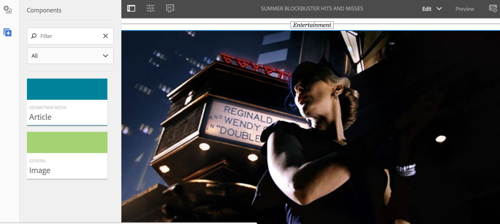

# Criação e adição de modelos e componentes {#creating-and-adding-templates-and-components}

>[!NOTE]
>
>A Adobe recomenda usar o Editor de SPA para projetos que exigem renderização do lado do cliente com base em estrutura de aplicativo de página única (por exemplo, React). [Saiba mais](/help/sites-developing/spa-overview.md).

O AEM Mobile On-Demand fornece um modelo de aplicativo totalmente configurado, um modelo de artigo e componentes do artigo.

O aplicativo We.Unlimited é um modelo de amostra que representa o shell de um aplicativo AEM Mobile On-Demand totalmente configurável e gerenciável.

Selecionar este modelo de amostra ao criar um novo aplicativo fornece um painel rico em recursos do AEM Mobile.

>[!NOTE]
>
>Para gerenciar o conteúdo do aplicativo e do aplicativo móvel no AEM Mobile Apps Control Center, consulte o [Painel de aplicativos do AEM Mobile](/help/mobile/mobile-apps-ondemand-application-dashboard.md).

## Criação de modelos de aplicativo {#creating-app-templates}

Um modelo de Aplicativo é usado para criar um novo aplicativo e atua como uma coleção de modelos de página e componentes que representam uma linha de base ou uma base de um aplicativo. O modelo exclui algumas propriedades fundamentais para liderar o aplicativo da maneira apropriada. Em geral, um cliente não criaria muitos aplicativos no total.

Os modelos de aplicativos fornecem uma maneira fácil de aproveitar os designs existentes criados pelos desenvolvedores, usados para criar novos aplicativos no AEM.

Ao criar um novo aplicativo com base no modelo de outro aplicativo, você obtém um aplicativo que tem um representante de ponto de partida do aplicativo no qual ele foi criado.

Etapas para criar um novo aplicativo com base em um modelo de aplicativo:

1. Navegue até o catálogo de aplicativos do AEM Mobile: *&lt;server-url>/aem/apps.html/content/mobileapps*
1. Selecionar **Criar** —> **Aplicativo** conforme mostrado abaixo

Depois de criar um aplicativo usando este modelo, você pode adicionar artigos, banners e coleções ao seu aplicativo. Para voltar a visitar, criar artigos, banners e coleções, consulte [Ações de gerenciamento de conteúdo](/help/mobile/mobile-apps-ondemand-manage-content-ondemand.md).

>[!NOTE]
>
>Como alternativa, você também pode selecionar um modelo de aplicativo de amostra, por exemplo **We.Unlimited** aplicativo, disponibilizado para você por um desenvolvedor de AEM. Se você usar esse modelo de amostra para seu aplicativo, você obterá alguns artigos e coleções de amostra para funcionar. Você terá a opção de usar os modelos e componentes de amostra, personalizar os existentes ou criar novos para seu aplicativo.

>[!CAUTION]
>
>Configuração ***redirectTarget*** propriedade
>
>Ao usar um dos modelos de aplicativo, o desenvolvedor define o conteúdo do aplicativo. No entanto, o desenvolvedor deve estar ciente de onde o aplicativo é criado no jcr e do valor de ***redirectTarget*** propriedade.
>
>O ***redirectTarget*** O é calculado como parte da operação de criação de aplicativo e tenta resolver um caminho, se houver uma propriedade redirectTarget disponível como parte do modelo de aplicativo, e o valor do redirectTarget é definido como relativo. Quando o processo de criação de aplicativo encontra um valor relativo para o redirectTarget no modelo de aplicativo, o valor é anexado ao local resolvido de onde o aplicativo foi criado.
>
>Por exemplo, se um modelo de aplicativo definir um ***redirectTarget*** com um valor de &quot;*comandantes das línguas/en*&quot; e o aplicativo foi criado em &quot;*/content/mobileapps/fooApp*&quot;, o valor final do redirectTarget após a criação do aplicativo será &quot;*/content/mobileapps/fooApp/language-masters/en*&quot;.

## Criação de modelos de conteúdo {#creating-content-templates}

Cada tipo de entidade tem dois templates prontos para uso. São eles:

* **Modelos padrão:** usado para criação de conteúdo com propriedades/estrutura padrão aplicável
* **Modelos importados:** usado para importar conteúdo do AEM Mobile com propriedades/estrutura padrão aplicável

### Modelos de artigo {#article-templates}

O Artigo ilimitado é um modelo de amostra que representa um layout típico de artigo do AEM Mobile On-Demand.

1. Clique em **+** em **Gerenciar artigos** para criar um novo artigo. Você pode escolher uma **Artigo Ilimitado** ou **Artigo Rich Text**. A imagem abaixo mostra a opção que permite escolher entre esses dois modelos de artigo.

1. Clique em **Próximo** para definir os metadados do artigo, como Nome/Título do artigo, Descrição, Autor, Abstrato, Departamento, Imagem em miniatura, Acesso ao artigo e assim por diante.
1. Clique em **Próximo** para preencher as Propriedades do anúncio.
1. Clique em **Próximo** para inserir a imagem do artigo ou a imagem da mídia social
1. Clique em **Próximo** para escolher um link de coleção para este novo artigo.
1. Clique em **Próximo** para inserir os detalhes do compartilhamento em redes sociais.
1. Clique em **Criar** para concluir o processo de criação de um artigo usando a amostra. Você pode clicar em **Concluído** ou **Editar artigo** para editar as propriedades deste artigo.

### Adicionar componentes ao artigo {#adding-components-to-article}

Depois de criado, um autor pode editar o conteúdo de um artigo adicionando componentes como texto e imagens. Os artigos são uma extensão AEM modelos de página.

Selecione um artigo que deseja editar e clique em **Editar** para adicionar componentes ao artigo.

 

Escolha o &quot;**+** no painel esquerdo para adicionar componentes ao artigo.

### Criação de modelos prontos para uso {#creating-out-of-the-box-templates}

Não há modelos de artigo prontos para uso, no entanto, há um modelo padrão que os modelos personalizados devem estender, consulte Geometrixx Unlimited App [Exemplo de modelo de artigo](http://localhost:4502/crx/de/index.jsp#/apps/geometrixx-unlimited-app/templates/article).

As propriedades principais além das propriedades normais AEM modelo exigidas incluem:

***dps-resourceType=&quot;dps:Article&quot;***

Essa propriedade garante que a página de AEM seja reconhecida como uma página de artigo direcionada para o AEM Mobile.

De acordo com AEM modelos, você pode adicionar propriedades padrão ou nós filhos ao modelo ***jcr:content***.

### Banner e modelos de coleção {#banner-and-collection-templates}

>[!CAUTION]
>
>Banners e Coleções não têm conteúdo, portanto, sua criação não oferece suporte a modelos personalizados.

## Criação e adição de componentes {#creating-and-adding-components}

Os componentes usam e permitem acesso a widgets, e são usados para renderizar o Conteúdo.

Um componente simples é incluído no repositório de código, cuja origem pode ser encontrada em AEM. Posteriormente, também pode ser aberto localmente em CRXDE Lite.

>[!NOTE]
>
>No momento, não há componentes prontos para uso fornecidos para o AEM Mobile.

Você pode adicionar componentes à sua página. Qualquer componente pode ser usado em um aplicativo AEM Mobile, mas, quando aplicado, pode não ser renderizado corretamente.

No entanto, os componentes personalizados podem não exportar e carregar para o AEM Mobile On-demand Services corretamente sem um manipulador de sincronização de conteúdo de exportação personalizado que é renderizado no AEM.

Depois que o componente já tiver sido incluído em uma página de AEM, juntamente com alguns outros componentes de bloco de construção, você poderá adicionar outro componente à página ou editar um existente.

**Para adicionar outro componente à página:**

1. Escolha essa página e verifique se você está no modo de Edição , por meio da lista suspensa na parte superior direita do cabeçalho do Editor
1. Alternar o painel lateral usando o ícone na extremidade esquerda do cabeçalho do Editor
1. Selecione o **Componentes** guia
1. Arraste e solte um dos componentes disponíveis na página

**Para editar um componente existente:**

1. Escolha essa página e verifique se você está em **Editar** e selecione o componente
1. Toque no ícone de chave inglesa para configurar o componente

>[!NOTE]
>
>Você pode criar um componente no AEM e personalizar o mesmo usando [Desenvolvimento com o CRXDE Lite](/help/sites-developing/developing-with-crxde-lite.md). Depois de personalizar o componente existente como seus requisitos, você pode adicioná-lo em sua página usando o **Editar** opção em **Gerenciar artigos** como mostra a figura acima.

>[!NOTE]
>
>Consulte [Práticas recomendadas para desenvolvimento de modelos e componentes](/help/mobile/best-practices-aem-mobile.md) no AEM Mobile.

### Próximas etapas {#the-next-steps}

* [Uso das propriedades de conteúdo para exportar conteúdo](/help/mobile/on-demand-content-properties-exporting.md)
* [Móvel com sincronização de conteúdo](/help/mobile/mobile-ondemand-contentsync.md)
