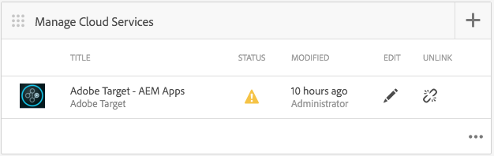

# Personalização de conteúdo do AEM Mobile{#aem-mobile-content-personalization}

>[!NOTE]
>
>A Adobe recomenda usar o Editor de SPA para projetos que exigem renderização do lado do cliente com base em estrutura de aplicativo de página única (por exemplo, React). [Saiba mais](/help/sites-developing/spa-overview.md).

>[!NOTE]
>
>Este documento faz parte do [Introdução ao AEM Mobile](/help/mobile/getting-started-aem-mobile.md) Guia, um ponto de partida recomendado para referência do AEM Mobile.

O recurso de personalização de conteúdo do AEM Mobile permite [Autores do AEM](#author) para personalizar o conteúdo do aplicativo móvel aproveitando [Adobe Target](https://www.adobe.com/ca/marketing-cloud/testing-targeting.html). Isso permite a entrega de ofertas direcionadas a usuários de aplicativos móveis. O Adobe Experience Manager Mobile oferece a capacidade de criar, segmentar e fornecer conteúdo que fornecerá ao usuário conteúdo específico para seus próprios gostos individuais.

Como geralmente ocorre no AEM, para que os autores comecem a criar esse conteúdo, os administradores e desenvolvedores precisam primeiro preparar o ambiente.

[Administradores AEM](#administrator) são necessárias para estabelecer uma conexão entre o AEM Mobile e o Cloud Service Adobe Target.

Enquanto isso, AEM Mobile [desenvolvedores](#developer) precisam modificar seus scripts existentes para facilitar a criação de conteúdo direcionado.

## Para administradores {#for-administrators}

Há várias etapas que precisam ser reunidas para que os autores de conteúdo possam começar a gerar conteúdo direcionado para aplicativos móveis: Está recebendo o conjunto correto de permissões para usuários e grupos, criando serviços em nuvem, configurando o aplicativo para a atividade e finalmente gerando o conteúdo.

Este artigo guiará você pelo processo usado para configurar a variável [Aplicativo de referência híbrido do AEM Mobile](https://github.com/Adobe-Marketing-Cloud-Apps/aem-mobile-hybrid-reference) para direcionamento.

A suposição a partir de agora é que o Aplicativo de referência híbrido do AEM Mobile foi implantado e acessível com êxito por meio do AEM Mobile Dashboard.

Antes que os autores possam gerar conteúdo direcionado em um aplicativo, sua instância do AEM precisa ser [configurado com o Cloud Service Adobe Target.](/help/mobile/aem-mobile-configuring-cloud-service.md)

### Permissões {#permissions}

Os usuários que precisam de acesso ao console de personalização precisam fazer parte do `target-activity-authors` grupo.

Sugere-se que, como parte da configuração de usuários e grupos, o grupo de atividades do target seja adicionado ao grupo de apps-admins. Ao adicionar o grupo target-activity-authors, isso permitirá que os usuários possam ver a entrada do menu Personalization navigation .

>[!NOTE]
>
>Esquecer de adicionar os usuários ou grupos que você deseja que tenham acesso ao Admin Console de personalização ao grupo de autores de atividades de direcionamento impedirá que os usuários vejam o console de personalização.

### Cloud Services {#cloud-services}

Para obter conteúdo direcionado funcionando para aplicativos móveis, há dois serviços que precisam ser configurados: O serviço Adobe Target e o serviço Adobe Mobile Services. O Adobe Target Service fornece o mecanismo para processar solicitações de clientes e retornar o conteúdo personalizado. O serviço Adobe Mobile Services fornece a conexão entre os serviços da Adobe e o aplicativo móvel por meio do arquivo ADBMobileConfig.json que é consumido pelo plug-in AMS Cordova. No AEM Mobile Dashboard, é possível configurar o aplicativo adicionando os dois serviços.

No painel do AEM Mobile, localize a caixa Gerenciar Cloud Services e clique no botão + .


No assistente Adicionar Cloud Service, selecione o cartão de serviço em nuvem &quot;Adobe Target&quot; e clique em Avançar.


Na lista suspensa Selecionar uma configuração , é possível criar uma nova configuração ou selecionar uma existente. Para criar uma nova configuração, selecione &quot;Criar configuração&quot; na lista suspensa. Insira um título para a configuração do Target. Insira o código de cliente, email e senha associados à conta do Target. Caso não saiba os valores desses campos, entre em contato com o suporte do Adobe Target. Clique no botão &quot;Verificar&quot; para validar as credenciais. Depois de verificado, clique no botão Submit para criar o serviço de nuvem.

>[!NOTE]
>
>O serviço em nuvem criado é associado automaticamente ao aplicativo móvel por meio do assistente. O valor da propriedade cq:cloudserviceconfigs é definido no nó jcr:content do nó do grupo de aplicativos. Para o exemplo de aplicativo híbrido, ele é definido em /content/mobileapps/brid-reference-app/jcr:content com o valor apontando para o nó de estrutura gerado automaticamente localizado em /etc/cloudservices/testandtarget/adobe-target—aem-apps/framework. O nó da estrutura tem duas propriedades definidas por padrão, gênero e idade. A estrutura é usada apenas pela pré-visualização AEM e não tem impacto no dispositivo.

Após a conclusão do assistente, o bloco Gerenciar Cloud Service conterá o serviço de nuvem do Target, no entanto, ele contém um aviso sobre uma conta ausente do Adobe Mobile Service.


### Adobe Mobile Services {#adobe-mobile-services}

É necessário vincular uma conta do Adobe Mobile Services (AMS) ao aplicativo, o serviço AMS fornece o arquivo ADBMobileConfig.json necessário, que contém as informações do código de cliente do Target. Antes de criar uma associação com a conta AMS, a conta AMS precisa ser modificada por um usuário com permissões para o AMS.

### Código do cliente {#client-code}

Para fazer logon nos serviços do AMS, visite [https://mobilemarketing.adobe.com](https://mobilemarketing.adobe.com/), selecione o aplicativo móvel e clique nas configurações. Localize o campo Opções de meta do SDK , coloque o código do cliente no campo e clique em Salvar.


Agora que o código de cliente foi associado ao aplicativo móvel, quando o serviço de nuvem AMS é configurado por meio do painel do Adobe Mobile, as configurações do serviço serão fornecidas por meio do arquivo ADBMobileConfig.json .

### Adobe Mobile Service Cloud Service {#adobe-mobile-service-cloud-service}

Agora que o AMS foi configurado, é hora de associar o aplicativo móvel no Adobe Mobile Dashboard. No painel do AEM Mobile, localize a caixa Gerenciar Cloud Services e clique no botão + .



Selecione o cartão do Adobe Mobile Services e clique em Avançar.


Na etapa Criar ou selecionar assistente , selecione a lista suspensa Mobile Service e selecione a entrada Criar configuração . Forneça um título, empresa, nome de usuário, senha e selecione o data center apropriado. Se não souber esses valores, entre em contato com o administrador do Adobe Mobile Service para obtê-los. Depois que todos os campos tiverem sido preenchidos, clique no botão Verify (Verificar). O processo de verificação vai para o AMS e verifica as credenciais da conta, e, após a validação bem-sucedida, uma lista de Aplicativos móveis será preenchida, onde você seleciona o aplicativo móvel associado na lista suspensa. Clique no botão Enviar para concluir o assistente. O processo pode levar algum tempo para obter os dados de configuração e qualquer análise associada com o aplicativo. Quando o processo estiver concluído, clique no botão Concluído no modal para retornar ao Painel do Adobe Mobile.

Retornando ao painel do Mobile, o bloco Gerenciar Cloud Services conterá o serviço de nuvem do AMS. Você também observará que o bloco Analisar métricas será preenchido com relatórios de ciclo de vida.


## Para autores {#for-authors}

**Pré-requisito:** Como mencionado acima, os administradores precisam configurar a conexão com o Adobe Target Service antes que os autores possam gerar um novo conteúdo direcionado.

Depois que o Administrador tiver configurado os dois serviços em nuvem e o desenvolvedor tiver configurado o manipulador mobileappoffers, os autores de conteúdo agora poderão começar a gerar experiências direcionadas.

A criação de conteúdo direcionado em um aplicativo do AEM Mobile segue um procedimento semelhante ao da criação do AEM Sites:

Consulte aqui para obter uma visão geral completa sobre [Criação de conteúdo direcionado no AEM](/help/sites-authoring/personalization.md)

## Para desenvolvedores {#for-developers}

Os desenvolvedores de AEM que criam aplicativos móveis devem continuar a seguir os padrões comumente usados em todo o AEM ao desenvolver componentes. Aqui, nós guiaremos você pelas etapas necessárias para permitir que os autores de conteúdo criem conteúdo direcionado:

### Manipuladores do Adobe Target ContentSync {#adobe-target-contentsync-handlers}

Para fornecer conteúdo ao conteúdo do dispositivo do usuário, é gerado renderizando as ofertas criadas por AEM autores de conteúdo. Para lidar com a renderização das ofertas de destino, há um novo manipulador de sincronização de conteúdo que processará as ofertas. Usando o Aplicativo de referência híbrido como nossa amostra, o pacote de conteúdo en (inglês) contém ContentSyncConfig com um [mobileappoffers](https://github.com/Adobe-Marketing-Cloud-Apps/aem-mobile-hybrid-reference/blob/master/aem-package/content-author/src/main/content/jcr_root/content/mobileapps/hybrid-reference-app/en/_jcr_content/pge-app/app-config-dev/targetOffers/.content.xml) manipulador. A próxima etapa é crucial para renderizar ofertas para o dispositivo. O manipulador mobileappoffers tem uma propriedade path que identifica o caminho para a atividade de personalização que deve ser usada para o aplicativo.

Por exemplo, se houver uma atividade localizada em */content/campanhas/hybridref* copie esse caminho e o cole como o valor para a variável *caminho* propriedade do manipulador mobileappoffers.

>[!NOTE]
>
>Para o Aplicativo de referência híbrido há dois processadores mobileappoffers, um para o desenvolvimento e outro para produções.

Depois que o caminho das atividades for definido na propriedade de caminho do manipulador mobileappoffers, salve o manipulador. O manipulador agora estará pronto para iniciar as ofertas de renderização para nossos dispositivos móveis.

### Modo de renderização {#render-mode}

O manipulador de mobileappoffers é configurado de forma diferente para configurações de publicação e desenvolvimento. Para configurações de publicação, há uma propriedade chamada *renderMode* com um valor de *publicar* definido no nó cq:ContentSyncConfig . O manipulador de mobileappoffers faz referência ao renderMode e, se definido como publicar, modificará a id da mbox que é criada. Por padrão, as mboxes criadas por AEM têm um valor —author anexado à id da mbox. Isso identifica que a atividade não foi publicada e deve usar a campanha não publicada para resoluções de oferta.

Quando o conteúdo é preparado por meio do Adobe Mobile Dashboard, o conteúdo de preparo é considerado conteúdo pronto para produção e é renderizado por meio da Configuração de sincronização de conteúdo não dev. Renderizar dessa forma fará com que o autor do — seja removido de todas as IDs da mbox e espere que uma atividade publicada esteja disponível no servidor do Target. Antes de testar o conteúdo preparado, verifique se a atividade foi publicada.

### Desenvolvimento de aplicativo de personalização {#personalization-app-development}

#### Componentes {#components}

A base de qualquer conteúdo normalmente é um componente de página que estende um dos componentes de página AEM base wcm/foundation/components/page ou foundation/components/page, dependendo se você estiver usando HTL ou JSPs. A duração dessas etapas se concentrará no uso do componente wcm/foundation/components/page . A estrutura básica do componente de página é dividida em vários scripts, com cada script fornecendo a finalidade específica de permitir que o desenvolvedor organize e substitua seu código, se necessário. Os dois scripts de interesse para a Personalização são head.html e body.html. Esses dois scripts fornecem uma área onde o código pode ser inserido para oferecer suporte ao Context Hub, Cloud Services e criação em dispositivos móveis.

Esta é uma visão geral dos dois scripts principais usados para ativar o direcionamento de conteúdo.

#### head.html {#head-html}

Para fornecer ao autor a capacidade de direcionar seu conteúdo, o menu de direcionamento precisa ser adicionado à página para que o autor possa alterar o contexto do modo de edição para o modo de direcionamento. Para ativar esse recurso, o desenvolvedor deve modificar o script head.html para incluir o seguinte trecho de código próximo à parte superior do head.html ou tão próximo da tag &lt;title>&lt;/title> o elemento possível.

```xml
<meta data-sly-test="${!wcmmode.disabled}">
    <div data-sly-call="${clientLib.all @ categories='personalization.kernel'}" data-sly-unwrap></div>
    <div data-sly-resource="${'config' @ resourceType='cq/personalization/components/clientcontext_optimized/config'}" data-sly-unwrap></div>
    <div data-sly-resource="${'contexthub' @ resourceType='granite/contexthub/components/contexthub'}" data-sly-unwrap></div>
</meta>
```

>[!NOTE]
>
>Observe que o script só deve ser incluído quando o Modo WCM não tiver sido desativado, de modo que, quando o Modo WCM estiver desativado (consulte a seção do manipulador ContentSync para obter detalhes), o script não será incluído no código final do aplicativo.

Para fornecer aos autores a capacidade de visualizar o conteúdo direcionado, o editor precisa ser capaz de localizar a configuração do serviço de nuvem do Adobe Target. O bloco de código abaixo adiciona dois scripts importantes. A primeira adição da capacidade da página de localizar o serviço de nuvem do Target associado e realizar as chamadas para o Adobe Target. O segundo é a adição da categoria cq.apps.targeting.

O **cq.apps.targeting** substitui o componente cq/personalization/component/target padrão e usa o componente mobileapps/components/target que renderiza ofertas especificamente para o consumo de aplicativos móveis. Mais detalhes sobre isso serão discutidos na seção Componente de direcionamento .

O código deve ser adicionado em head.html e colocado antes do fim do &lt;/head> elemento.

```xml
<div data-sly-test="${!wcmmode.disabled}">
    <div data-sly-include="/libs/cq/cloudserviceconfigs/components/servicelibs/servicelibs.jsp" data-sly-unwrap></div>
    <meta data-sly-call="${clientLib.all @ categories='cq.apps.targeting'}" data-sly-unwrap></meta>
</div>
```

>[!NOTE]
>
>Observe que o bloco de código está envolvido em um modo WCM que não está sendo desativado, portanto, só entra em ação enquanto o autor de conteúdo está trabalhando na criação de conteúdo. Os scripts do serviço de nuvem não serão adicionados ao código de tempo de execução móvel gerado.

#### body.html {#body-html}

Para permitir que o autor de conteúdo possa testar personas diferentes, o script body.html precisa incluir o seguinte bloco de código como o primeiro filho do elemento de corpo.

```xml
<div data-sly-test="${!wcmmode.disabled}">
    <div data-sly-resource="${'clientcontext' @ resourceType='cq/personalization/components/clientcontext_optimized'}" data-sly-unwrap></div>
</div>
```

O último bit de código necessário está na parte inferior do body.html. Este bit de código procura o serviço de nuvem associado e injeta o código do mecanismo de direcionamento apropriado.

```xml
<div data-sly-test="${!wcmmode.disabled}">
    <div data-sly-resource="${'cloudservices' @ resourceType='cq/cloudserviceconfigs/components/servicecomponents'}" data-sly-unwrap></div>
</div>
```

### Aplicativo de referência {#reference-application}

Exemplos de head.html e body.html podem ser encontrados no [Aplicativo de referência híbrido do AEM Mobile](https://github.com/Adobe-Marketing-Cloud-Apps/aem-mobile-hybrid-reference) mostrar o desenvolvedor onde colocar os blocos de script nos dois scripts.

### Manipuladores de sincronização de conteúdo {#content-sync-handlers}

Quando o autor de conteúdo terminar de criar conteúdo para o aplicativo móvel, a próxima etapa é baixar a fonte e criar o aplicativo ou preparar o conteúdo a ser publicado. Há várias etapas que o desenvolvedor está envolvido para fazer isso acontecer. Para auxiliar na renderização do conteúdo, o AEM Mobile utiliza manipuladores de sincronização de conteúdo para renderizar e empacotar o conteúdo. Um novo manipulador de sincronização de conteúdo foi introduzido no caso de uso de Personalização para renderizar o conteúdo direcionado. O manipulador &quot;mobileappoffers&quot; sabe como renderizar as ofertas de destino associadas que foram criadas pelo autor de conteúdo. O manipulador mobileappoffers estende o manipulador de atualização de páginas abstrato, portanto, muitas das propriedades são semelhantes. Os detalhes do manipulador mobileappoffers têm as seguintes propriedades.

<table>
 <tbody>
  <tr>
   <td><strong>Propriedade</strong></td>
   <td><strong>Valor</strong></td>
   <td><strong>Descrição</strong></td>
  </tr>
  <tr>
   <td>reescrever</td>
   <td>+ relativeParentPath<p> - "/"</p> </td>
   <td>A propriedade rewrite identifica como os caminhos no conteúdo devem ser regravados.</td>
  </tr>
  <tr>
   <td>includedPageTypes</td>
   <td><p>"cq/personalization/components/teaserpage",</p> <p>"cq/personalization/components/offer proxy"</p> </td>
   <td>A propriedade includePageTypes é opcional, com o padrão de páginas que têm tipos de recursos de cq/personalization/components/teaserpage e cq/personalization/components/offer proxy. Esses dois tipos de recursos são os tipos de recurso padrão usados quando o conteúdo é direcionado. Se tipos de recursos adicionais precisarem ser suportados, eles deverão ser adicionados à lista de includePageTypes.</td>
  </tr>
  <tr>
   <td>locationRoot</td>
   <td>/content/mobileapps/&lt;app&gt;</td>
   <td>A localização do aplicativo.</td>
  </tr>
  <tr>
   <td>tipo</td>
   <td>mobileappoffers</td>
   <td>O nome do manipulador que está sendo mobileappoffers.</td>
  </tr>
  <tr>
   <td>seletor</td>
   <td>tandt</td>
   <td>O seletor tandt é usado para renderizar o conteúdo direcionado. </td>
  </tr>
  <tr>
   <td>targetRootDirectory</td>
   <td>www</td>
   <td>O diretório raiz onde o conteúdo renderizado deve persistir.</td>
  </tr>
  <tr>
   <td>includeImages</td>
   <td>true | false</td>
   <td>Se verdadeiro, quaisquer imagens incluídas na oferta serão renderizadas. Se imagens falsas forem ignoradas.</td>
  </tr>
  <tr>
   <td>includeVideos</td>
   <td>true | false</td>
   <td>Se verdadeiro, qualquer vídeo incluído na oferta será renderizado. Se forem ignorados vídeos falsos.</td>
  </tr>
  <tr>
   <td>path</td>
   <td>/content/campanhas/&lt;brand&gt;</td>
   <td>Aponta para a marca da campanha na qual as ofertas participam. Atualmente, todas as ofertas devem vir da mesma campanha.</td>
  </tr>
  <tr>
   <td>profundo</td>
   <td>true | false</td>
   <td>Se verdadeiro, renderize recursivamente todas as páginas filhas, se falso não for recorrente. </td>
  </tr>
  <tr>
   <td>extensão</td>
   <td>html</td>
   <td>Define a extensão do recurso que está sendo renderizado. Defina como html de forma que as páginas tenham uma extensão .html.</td>
  </tr>
 </tbody>
</table>

>[!NOTE]
>
>O [Aplicativo de referência híbrido do AEM Mobile](https://github.com/Adobe-Marketing-Cloud-Apps/aem-mobile-hybrid-reference) O tem a configuração padrão do manipulador mobileappoffer. A propriedade path na amostra está vazia, pois depende do local da campanha. Depois que um autor de Campanha criar uma Campanha, o administrador dos aplicativos deve associar a Campanha ao manipulador especificando a propriedade path a ser apontada para a Campanha.

### Componente de destino {#target-component}

Para ajudar a renderizar o conteúdo especificamente para aplicativos móveis, o AEM Mobile usa o componente mobileapps/components/target. O componente de destino móvel estende o componente cq/personalization/components/target e substitui o script engine_tnt.jsp. Ao substituir engine_tnt.jsp, isso permite que o AEM Mobile controle o HTML gerado para o caso de uso dos aplicativos móveis. Para cada componente direcionado por um autor de conteúdo, uma mbox associada é criada pelo engine_tnt.jsp.

Para cada mbox, um atributo de **cq-targeting** O é adicionado, permitindo que os desenvolvedores de aplicativos gravem código personalizado para consumir e usar como quiserem. O [Aplicativo de referência híbrido do AEM Mobile](https://github.com/Adobe-Marketing-Cloud-Apps/aem-mobile-hybrid-reference) O tem um exemplo de uma diretiva Angular que usa o atributo cq-targeting. O conceito de substituição de conteúdo quando e como ele é feito depende muito do desenvolvedor de aplicativos móveis. Há um SDK móvel que é fornecido via AEM /etc/clientlibs/mobileapps/js/mobileapps.js que fornece uma API para chamar o serviço de Direcionamento de Adobe. Cabe ao desenvolvedor do aplicativo especificar quando essa chamada deve ser feita de acordo com o design de seu aplicativo.

## O que vem a seguir? {#what-s-next}

1. [Iniciar minha experiência com o aplicativo AEM Mobile](/help/mobile/starting-aem-phonegap-app.md)
1. [Gerenciar o conteúdo do meu aplicativo](/help/mobile/phonegap-manage-app-content.md)
1. [Criar meu aplicativo](/help/mobile/building-app-mobile-phonegap.md)
1. [Acompanhe o desempenho do meu aplicativo com o Adobe Mobile Analytics](/help/mobile/phonegap-intro-to-app-analytics.md)
1. [Fornecer uma experiência personalizada com o aplicativo Adobe Target](/help/mobile/phonegap-aem-mobile-content-personalization.md)
1. [Enviar mensagens importantes para meus usuários](/help/mobile/phonegap-push-notifications.md)
