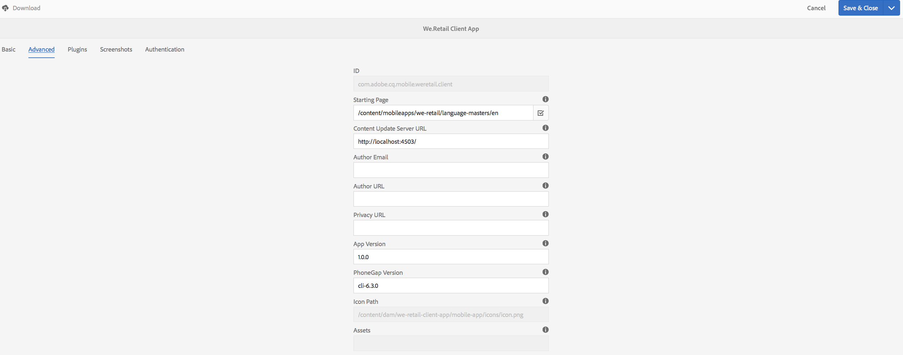

# Gerenciar mosaico do aplicativo{#manage-app-tile}

>[!NOTE]
>
>A Adobe recomenda o uso do Editor de SPA para projetos que exigem renderização do cliente baseada em estrutura de aplicativo de página única (por exemplo, Reagir). [Saiba mais](/help/sites-developing/spa-overview.md).

O bloco **Gerenciar aplicativo** no Painel do aplicativo fornece a capacidade de modificar detalhes sobre o aplicativo. Para abrir a página Detalhes, clique no link de detalhes do bloco Gerenciar aplicativo. Na página Gerenciar aplicativo, você pode editar as configurações de Configuração de aplicativo do PhoneGap (config.xml) e preparar seu aplicativo para submissão aos vários armazenamentos de aplicativos.


## Compreensão do bloco de aplicativos Gerenciar {#understanding-the-manage-app-tile}

Você pode detalhar cada bloco no bloco **Gerenciar aplicativo** para visualização ou editar detalhes clicando em &#39;...&#39; no canto inferior direito.

### A guia Básico {#the-basic-tab}

Você pode editar **Nome**, **Autor**, **Descrição curta** e **Descrição** para seu aplicativo nesta guia.


### A guia Avançado {#the-advanced-tab}

Cada plataforma de aplicativo móvel descreve quais dados são coletados, direcionando cada loja de aplicativos especificamente.

As plataformas exibidas são orientadas pelo conteúdo do PhoneGap config.xml:

```xml
<widget>
<gap:platform name="ios"/>
<gap:platform name="android"/>
</widget>
```

Cada loja de aplicativos de fornecedor, como a Apple App Store ou a Google Play Store, por exemplo, requer uma ou mais capturas de tela do aplicativo móvel para exibir os detalhes do aplicativo aos clientes. Essas capturas de tela podem ter requisitos rígidos em torno de dimensões e conteúdo (basicamente, elas devem realmente representar o aplicativo). AEM Aplicativos oferece suporte para selecionar e gerenciar essas capturas de tela para as plataformas e dimensões de porta de visualização compatíveis, conforme exigido pela loja de aplicativos de cada fornecedor.

>[!NOTE]
>
>O aplicativo AEM Verify fornece a capacidade de enviar capturas de tela diretamente para os detalhes do aplicativo no AEM.
>
>Consulte [Início rápido móvel para AEM Verificar](/help/mobile/phonegap-mobile-quickstart.md) para obter mais detalhes.



### Metadados {#metadata}

>[!NOTE]
>
>Depois de conhecer o bloco **Gerenciar aplicativo**, consulte [Editar metadados do aplicativo](/help/mobile/phonegap-editmetadata.md) para visualização e edição dos metadados.

#### Metadados comuns {#common-metadata}

Cada aplicativo deve ter metadados associados que auxiliam na configuração de diferentes aspectos do aplicativo. A página Gerenciar aplicativo é separada em duas áreas diferentes relacionadas à coleta de metadados. Metadados específicos da plataforma e metadados comuns.

Há configurações e metadados comuns para todas as plataformas.

Nesta seção, você define o URL do Content Update Server, a landing page para seu aplicativo móvel, a versão do PhoneGap para compilação, a versão do aplicativo, o nome, a descrição e muito mais.

**A** versão do aplicativo é a versão em funcionamento do aplicativo. A prática recomendada comum é usar uma notação de 3 decimais e um start abaixo de 1.0.0 antes da primeira versão.

**O PhoneGap** Versiones é a versão na qual você deseja compilar seu aplicativo com o PhoneGap. A prática recomendada é acompanhar a versão atual para garantir que você obtenha os melhores e mais recentes recursos e correções de erros.

**O** URL do Content Update Server é o URL que seu aplicativo usará para chamar atualizações do ContentSync. Ele deve ser definido para o URL do despachante ou, se não estiver usando um despachante, para uma de suas instâncias de publicação que será usada para fornecer atualizações do ContentSync ao seu aplicativo.


>[!NOTE]
>
>Esta seção pode parecer vazia, a menos que haja dados preenchendo os campos.
>
>Na parte superior da visualização de detalhes, você verá Versão do aplicativo, Versão do PhoneGap e URL de atualização, cada um desses valores pode ser definido na seção Metadados comuns. No entanto, o ID da aplicação não pode ser editado.

#### Metadados da plataforma {#platform-metadata}

Todas as plataformas definidas no arquivo config.xml do PhoneGap podem conter propriedades personalizadas da plataforma. Um desenvolvedor AEM deve contribuir com a estrutura de conteúdo para capturar essas propriedades. Um exemplo fornecido de propriedades específicas da plataforma pode ser encontrado para iOS.

Os metadados para todas as plataformas configuradas agora são exibidos ao mesmo tempo na guia Avançado do bloco Gerenciar aplicativo.

>[!NOTE]
>
>As seções de metadados da plataforma não são usadas pelo PhoneGap durante uma compilação CLI ou Remote PhoneGap, mas AEM tentar capturar metadados para plataformas, de modo que possam ser usados posteriormente ao enviar para o repositório de aplicativos do fornecedor direcionado.

Para plataformas que não são entendidas pela AEM, ainda é possível para um desenvolvedor AEM estender a interface para capturar esses metadados que posteriormente poderão ser exportados e usados durante o processo de envio do aplicativo.

#### Metadados do iOS {#ios-metadata}

A Apple AppStore requer metadados adicionais para enviar seu aplicativo para distribuição. A seção de metadados do iOS tenta coletar as informações necessárias que podem ser usadas pela ferramenta iTMSTransporter da Apple para publicar os metadados na conta de desenvolvedor da Apple associada.

Para obter os metadados específicos da Apple, primeiro é necessário criar seu aplicativo em [https://itunesconnect.apple.com](https://itunesconnect.apple.com/). Ao criar seu aplicativo, a Apple gerará metadados exigidos pela seção de metadados do iOS se você quiser usar a ferramenta Apple iTMSTransporter para validar e fazer upload dos metadados para itunesconnect.apple.com. Se você quiser apenas obter os metadados que deseja coletar, não precisa necessariamente preencher os metadados específicos do iOS. Você ainda pode exportar os metadados que mesclarão o iOS e os metadados comuns e coletar todas as capturas de tela em um arquivo zip que pode ser baixado a qualquer momento.

O arquivo zip baixado contém um arquivo itmsp que pode ser inspecionado para localizar o arquivo metadata.xml. O arquivo itmsp contém os metadados exportados (no arquivo metadata.xml), juntamente com todas as capturas de tela associadas.

A funcionalidade de exportação é usada para fornecer uma maneira conveniente de coletar as capturas de tela e os metadados que podem ser passados para o editor do aplicativo para entrada na loja de aplicativos específica do fornecedor.


#### Metadados do Android {#android-metadata}

Ao selecionar a plataforma Android, não há metadados personalizados neste ponto que possam ser definidos. Ao clicar no botão de download como arquivo zip será gerado com um arquivo de propriedades que contém todos os metadados e capturas de tela associadas.

A funcionalidade de exportação é usada para fornecer uma maneira conveniente de coletar as capturas de tela e os metadados que podem ser passados para o editor do aplicativo para entrada na loja de aplicativos específica do fornecedor.


### URL do servidor para atualização de conteúdo {#content-update-server-url}

Um dos principais recursos dos aplicativos AEM é a capacidade de ter um aplicativo móvel solicitando novo conteúdo por meio do ContentSync, onde o conteúdo pode ser recursos html, páginas, vídeo, imagens, texto e muito mais. Depois que um autor de conteúdo tiver atualizado o conteúdo e, em seguida, publicar esse conteúdo, o servidor disponibilizará a atualização de conteúdo para que o aplicativo móvel baixe.

A propriedade Content Update Server URL é o URL que deve apontar para uma instância de publicação; quer diretamente, quer através do expedidor ou da CDN. O formato do URL é simplesmente:

`https://[hostname]:[port]`

>[!NOTE]
>
>Se sua instância do servidor do autor estiver replicando para várias instâncias do servidor de publicação (arquitetura comum para AEM), cada servidor de publicação terá o mesmo conteúdo de atualização, pois a atualização é criada no autor e replicada para todas as instâncias de publicação. Basicamente, o balanceamento de carga e o failover são totalmente compatíveis.

### A guia Plug-ins {#the-plugins-tab}

A guia **Plugins** descreve os plug-ins associados ao seu aplicativo. Essas informações serão usadas para recuperar o plug-in apropriado durante uma compilação.


### A guia Capturas de tela {#the-screenshots-tab}

A guia **Capturas de tela** exibe as resoluções de captura de tela suportadas em diferentes plataformas.


>[!NOTE]
>
>Para adicionar e remover capturas de tela, consulte [Edição de metadados do aplicativo](/help/mobile/phonegap-editmetadata.md).

### A guia Autenticação {#the-authentication-tab}

A guia **Authentication** permite selecionar um cliente OAuth para ser associado ao seu aplicativo e permite que um desenvolvedor utilize a autenticação OAuth Adobe Experience Manager.


### Próximas etapas {#the-next-steps}

Depois de saber mais sobre Gerenciamento de blocos de aplicativos no painel do aplicativo, consulte os seguintes recursos para outras funções de criação:

* [Editar metadados do aplicativo](/help/mobile/phonegap-editmetadata.md)
* [Definições do aplicativo](/help/mobile/phonegap-app-definitions.md)
* [Criar um novo aplicativo usando o Assistente para criação de aplicativo](/help/mobile/phonegap-create-new-app.md)
* [Importar um aplicativo híbrido existente](/help/mobile/phonegap-adding-content-to-imported-app.md)
* [Content Services](/help/mobile/develop-content-as-a-service.md)

### Recursos adicionais {#additional-resources}

Para saber mais sobre as funções e responsabilidades de um Administrador e Desenvolvedor, consulte os recursos abaixo:

* [Desenvolvimento para Adobe PhoneGap Enterprise com AEM](/help/mobile/developing-in-phonegap.md)
* [Administração de conteúdo para Adobe PhoneGap Enterprise com AEM](/help/mobile/administer-phonegap.md)

