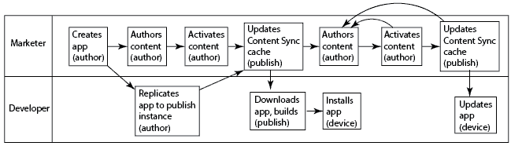
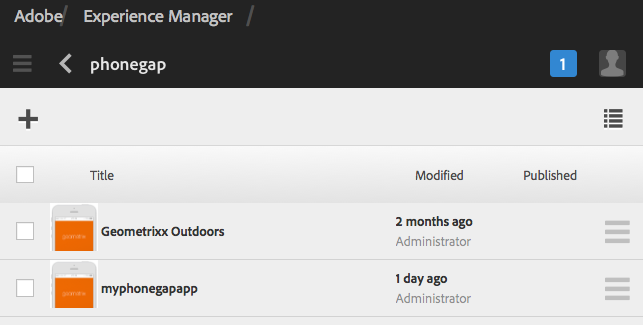

# Criação e edição de aplicativos usando o console Aplicativos{#creating-and-editing-apps-using-the-apps-console}

>[!NOTE]
>
>A Adobe recomenda usar o Editor SPA para projetos que exigem renderização do lado do cliente baseada em estrutura de aplicativo de página única (por exemplo, Reagir). [Saiba mais](/help/sites-developing/spa-overview.md).

O processo de desenvolvimento de aplicativos móveis do AEM reconhece que usuários de diferentes especialidades contribuem para o desenvolvimento de aplicativos móveis. O mapa de processos a seguir ilustra a ordem geral na qual os autores de conteúdo e desenvolvedores de aplicativos executam tarefas.

As informações sobre como executar as tarefas do profissional de marketing são exibidas nessa página. Para obter informações sobre as tarefas de desenvolvedor, consulte Criação de aplicativos PhoneGap.

## A estrutura dos aplicativos móveis {#the-structure-of-mobile-applications}

O AEM Mobile fornece o plano do aplicativo Phonegap para criar aplicativos móveis. O blueprint define a estrutura dos aplicativos que você cria. As candidaturas consistem nos seguintes elementos:

* A página raiz.
* As variações de idioma do aplicativo.
* O home page da variação de idioma.

### A raiz de um aplicativo Phonegap {#the-root-of-a-phonegap-app}

A página raiz dos aplicativos móveis criados no AEM é exibida no console Aplicativos.

A página raiz é armazenada abaixo da propriedade Caminho de destino do aplicativo que foi especificada ao criar o aplicativo (o caminho padrão é /content/phonegap/apps). O nome da página é a propriedade Name do aplicativo. Por exemplo, o URL padrão da página raiz do site nomeado `myphonegapapp` é `http://localhost:4502/content/phonegap/apps/myphonegapapp.html`.

### A variação de idioma de um aplicativo PhoneGap {#the-language-variation-of-a-phonegap-app}

As primeiras páginas secundárias da página raiz são as variações de idioma do aplicativo. O nome de cada página é o idioma para o qual o aplicativo é criado. Por exemplo, inglês é o nome da variação em inglês do aplicativo.

**Observação:** O modelo padrão do PhoneGap cria somente um aplicativo em inglês. Seu desenvolvedor pode modificar o blueprint para que possa criar mais variações de idioma.

A página de idioma tem dois objetivos:

* O conteúdo da página é a página de falhas para a variação de idioma do aplicativo.
* As propriedades da página controlam vários aspectos de design do aplicativo, como o URL a ser usado para solicitar atualizações de conteúdo, e informações sobre a conexão com a criação da nuvem e a integração dos Serviços Analytics da Adobe.

### O Home page {#the-home-page}

A página Home page ou index.html de uma variação de idioma de um aplicativo é exibida quando o aplicativo é aberto. O home page fornece aos usuários um menu de links para várias páginas no aplicativo. O sistema de parágrafo permite que você adicione componentes à página para criar conteúdo.

## Criação de um aplicativo móvel {#creating-a-mobile-application}

Os aplicativos móveis são baseados em um plano que define a estrutura e as propriedades da página. Você pode configurar as seguintes propriedades do aplicativo:

* **Título:** O título do aplicativo.
* **Caminho de destino:** O local no repositório onde o aplicativo é armazenado. Deixe o padrão para criar um caminho com base no nome do aplicativo.

* **Nome:** O valor padrão é o valor da propriedade Title com caracteres de espaço removidos. O nome é usado no CQ para fazer referência ao aplicativo, por exemplo, para o nó do repositório que representa o aplicativo.
* **Descrição:** Uma descrição do aplicativo.
* **URL do servidor:** O URL que fornece atualizações de conteúdo OTA (Over-the-Air) ao aplicativo. O valor padrão é o URL do servidor de publicação da instância usada para criar um aplicativo (retirado do serviço externalizador). Observe que essa deve ser uma instância do servidor de publicação em vez de um autor, o que requer autenticação.

Você também pode fornecer um arquivo de imagem para usar como miniatura do aplicativo, selecionar a configuração do PhoneGap Build a ser usada e selecionar a configuração de análise do aplicativo móvel a ser usada. Essa imagem é usada apenas como uma miniatura para representar seu aplicativo móvel no console de aplicativos móveis no Experience Manager.

Existem guias adicionais (e opcionais) para criar o serviço em nuvem e integrar o plug-in do SDK do Adobe Mobile Services ao seu aplicativo.

* Compilação: Clique em gerenciar configurações e configure seu serviço de compilação.phonegap.com aqui. Em seguida, na lista suspensa, você poderá selecionar o serviço de nuvem de construção PhoneGap recém-criado.
* Analytics: Clique em gerenciar configurações e configure o serviço em nuvem SDK [do](https://docs.adobe.com/content/help/en/mobile-services/using/home.html) Adobe Mobile Services. Em seguida, na lista suspensa, você poderá selecionar o Mobile Service recém-criado para integrar ao seu aplicativo móvel.

>[!NOTE]
>
>Os desenvolvedores podem usar o AEM PhoneGap Starter Kit para criar aplicativos e adicioná-los ao console.

O procedimento a seguir usa a interface de usuário de toque para criar um aplicativo móvel.

1. No painel, clique em Aplicativos.
1. Clique ou toque no ícone Criar.

   

1. (Opcional) Na guia Avançado, forneça uma descrição para o aplicativo e altere o URL do servidor, se necessário.
1. (Opcional) Se você estiver usando o PhoneGap Build para compilar o aplicativo, na guia Criar, selecione a Configuração a ser usada.

   Para criar uma configuração de criação do PhoneGap, clique em Gerenciar configurações.

1. (Opcional) Se você estiver usando o SiteCatalyst para rastrear a atividade do aplicativo, na guia Analytics, selecione a configuração a ser usada.

   Para criar uma Configuração de aplicativo móvel, clique em Gerenciar configurações.

1. (Opcional) Para fornecer um ícone de aplicativo, clique no botão Procurar, selecione o arquivo de imagem do sistema de arquivos e clique em Abrir.
1. Clique em Criar.

### Alteração das propriedades de um aplicativo móvel {#changing-the-properties-of-a-mobile-application}

Depois de criar um aplicativo móvel, você pode alterar as propriedades.

#### Alterar o título, a descrição e o ícone {#change-the-title-description-and-icon}

1. No painel, clique ou toque em Aplicativos.
1. Selecione o aplicativo a ser configurado e clique no ícone Propriedades da página de Visualização.

   

1. Para alterar os valores de propriedade, clique ou toque no ícone Editar.

   

1. Configure as propriedades Básicas e Avançadas e clique ou toque no ícone Concluído.

   

#### Configurar uma variação de idioma do aplicativo {#configure-a-language-variation-of-the-application}

1. No painel, clique ou toque em Aplicativos.
1. Clique para detalhar o aplicativo móvel que deseja editar no console de administração de aplicativos. Selecione a versão do idioma do aplicativo a ser configurado e clique no ícone Propriedades do aplicativo de Visualização.

   

1. Para alterar os valores de propriedade, clique ou toque no ícone Editar.

   

1. Configure as propriedades nas guias Básico, Avançado, Criar e Analytics e clique ou toque no ícone Concluído.

   

### Criação do conteúdo de um aplicativo móvel {#authoring-the-content-of-a-mobile-application}

Depois de criar o aplicativo móvel, adicione o conteúdo que é usado como a interface do usuário do aplicativo.

1. No painel, clique ou toque em Aplicativos.
1. Clique ou toque no aplicativo e, em seguida, clique ou toque em inglês.
1. Edite o Home page ou adicione páginas secundárias conforme necessário.

### Mover conteúdo para aplicativos móveis {#moving-content-to-mobile-applications}

O cache de Sincronização de conteúdo na instância de publicação do AEM é usado como repositório de conteúdo para aplicativos móveis:

* O conteúdo no cache de Sincronização de conteúdo é incluído no aplicativo quando os desenvolvedores compilam o aplicativo.
* O conteúdo no cache está disponível para aplicativos móveis instalados para atualizar o conteúdo do aplicativo.

Aplicativos móveis incluem um comando Atualizações que baixa e instala conteúdo atualizado do aplicativo. Quando uma instância do aplicativo envia uma solicitação de atualização, a Sincronização de conteúdo determina qual conteúdo foi alterado desde a última vez que o aplicativo foi atualizado ou instalado e fornece o novo conteúdo.

Para disponibilizar o conteúdo atualizado para os aplicativos, atualize o cache de Sincronização de conteúdo. Na primeira vez que você atualizar o cache, todo o conteúdo publicado será adicionado. As atualizações subsequentes adicionam somente o conteúdo publicado que foi alterado desde a atualização anterior.

A Sincronização de conteúdo também rastreia quando as atualizações ocorrem. Com essas informações, a Sincronização de conteúdo pode determinar qual atualização de cache será enviada para um aplicativo móvel.

Execute o seguinte procedimento na instância em que deseja atualizar o cache. Por exemplo, se seu aplicativo solicitar atualizações da instância de publicação, execute o procedimento na instância de publicação.

1. No painel, clique ou toque em Aplicativos e, em seguida, clique ou toque em seu aplicativo.
1. Selecione a página inicial e clique ou toque no ícone Atualizar cache.

   

### Uso de modelos de aplicativo {#using-app-templates}

Este é um recurso que está disponível com o Apps 6.1 Feature Pack 2 e fornece uma maneira fácil de aproveitar os modelos de aplicativos existentes para a criação de novos aplicativos no AEM.

O que é um modelo de aplicativo? Pense nele como uma coleção de modelos de página e componentes que representam uma linha de base ou a base de um aplicativo.
Ao criar um novo aplicativo com base no modelo de outro aplicativo, você obterá um aplicativo que tenha um representante de ponto de partida do aplicativo no qual ele foi criado.

É necessário ter um modelo de aplicativo móvel existente (ou um aplicativo instalado que tenha um modelo de aplicativo) para usar esse recurso.

O pacote de amostras mais recente do AEM Apps 6.1 inclui uma versão atualizada do aplicativo Geometrixx com um modelo de aplicativo. Como alternativa, você pode instalar o StarterKit que também fornece um modelo.

Etapas para criar um novo aplicativo com base em um modelo de aplicativo:

1. Verifique se você tem o pacote de recursos e os pacotes de exemplos de referência mais recentes do AEM Apps 6.1 instalados
1. Clique em Aplicativos no painel esquerdo.

1. Clique no botão + Criar na parte superior e selecione Criar aplicativo.
1. Depois de receber a lista de Modelos de aplicativos, selecione um:

1. Clique emAvançar.
1. Forneça uma ID e um título do aplicativo, no entanto, você também pode incluir um Nome e uma Descrição.

   1. Além disso, você pode fornecer um PNG (formato de ícone PhoneGap suportado) como um ícone ao navegar pelos ativos AEM.
   1. Lembre-se de que você pode editar todos esses campos depois que o aplicativo for criado no bloco Gerenciar aplicativo. Com exceção da ID do aplicativo, depois que a ID do aplicativo for definida, não será possível alterá-la.

1. Clique no botão criar e você receberá 2 opções, Concluído (retornar à visualização do catálogo de aplicativos) ou Gerenciar aplicativo (abre o painel do aplicativo).
1. Depois de criado, você deverá ver o novo aplicativo listado no catálogo do aplicativo:

1. Clique no aplicativo para abri-lo e você criou com êxito um novo aplicativo com base no modelo de um aplicativo existente.

>[!NOTE]
>
>Se você desinstalar o pacote de aplicativo de referência do Geometrixx Outdoors do AEM e criar um aplicativo com base em seu modelo, esse aplicativo não estará mais funcionando. O aplicativo Geometrixx Outdoors pode ser removido, no entanto, o modelo de aplicativo deve permanecer se for usado por outros aplicativos móveis.

## Explorar o aplicativo Geometrixx Outdoors de amostra {#exploring-the-sample-geometrixx-outdoors-app}

O aplicativo Geometrixx Outdoors é um exemplo de aplicativo PhoneGap que demonstra os recursos do blueprint padrão do aplicativo PhoneGap e os componentes móveis de amostra.

Para abrir o aplicativo, no painel, clique em Aplicativos móveis e selecione Aplicativo Geometrixx Outdoors.

### Recursos comuns da página - Aplicativo móvel Geometrixx {#common-page-features-geometrixx-mobile-app}

Cada página do aplicativo móvel inclui os seguintes recursos:

* Um botão Voltar para retornar à página pai. Observe que o botão Voltar não aparece no Home page.
* Um painel expansível que oferta um menu de comandos e links:

   * Abra a página Locais.
   * Abra o carrinho.
   * Faça logon.
   * Atualize o aplicativo.

* O sistema de parágrafo, para adicionar componentes e criar conteúdo.

### O Home page - Aplicativo Geometrixx Mobile {#the-home-page-geometrixx-mobile-app}

O conteúdo do Home page é composto pelas seguintes ferramentas de navegação:

* Um componente de Lista de menu que fornece links para as páginas secundárias Arte, Revisões, Notícias e Sobre nós.
* Um componente do carrossel de troca que exibe as páginas secundárias.

### Página de engrenagens - Aplicativo Geometrixx para dispositivos móveis {#the-gear-page-geometrixx-mobile-app}

A página de engrenagens fornece aos usuários acesso às páginas de produtos. Um componente de lista de menu fornece acesso às páginas secundárias da página de engrenagens. As páginas secundárias são categorias de produtos que o site possui.

* Temporada
* Vestuário
* Sexo
* Atividade

Cada página de categoria usa a mesma estrutura de conteúdo que a página de engrenagens. O carrossel fornece acesso a páginas filhas que são subcategorias de produtos. As páginas de subcategoria contêm listas de produtos que fornecem links para páginas de produtos.

### Página Produtos - Aplicativo móvel Geometrixx {#the-products-page-geometrixx-mobile-app}

A página Produtos e sua hierarquia de páginas filhas implementam um sistema de classificação para páginas de produtos. As páginas mais baixas em cada ramificação da hierarquia são uma página de produto que contém um componente ng Produto.

A página Produtos não está disponível para usuários do aplicativo. A página de engrenagens fornece acesso a cada página de produto.

### Página de revisões - Aplicativo móvel Geometrixx {#the-reviews-page-geometrixx-mobile-app}

Contém um botão Voltar. O sistema de parágrafo permite que você adicione componentes.

Ao usar o aplicativo, a página Revisões está disponível no carrossel da página em inglês.

### Página de notícias - Aplicativo móvel Geometrixx {#the-news-page-geometrixx-mobile-app}

Contém um botão Voltar. O sistema de parágrafo permite que você adicione componentes.

Ao usar o aplicativo, a página Notícias está disponível no carrossel da página em inglês.

### A página Sobre nós - Aplicativo Geometrixx Mobile {#the-about-us-page-geometrixx-mobile-app}

A página Sobre nós contém vários componentes de Linha de duas colunas. Cada coluna contém um componente de Imagem ou Texto. Os componentes são editáveis e o sistema de parágrafo permite que você adicione componentes.

Ao usar o aplicativo, a página Sobre nós está disponível no carrossel da página em inglês.

### Página Locais - Aplicativo Geometrixx para dispositivos móveis {#the-locations-page-geometrixx-mobile-app}

A página Locais contém um componente Locais.

Ao usar o aplicativo, a página Locais está disponível na lista de menu na página em inglês.

## Exemplo de componentes móveis {#sample-mobile-components}

Vários componentes estão imediatamente disponíveis no Sidekick ao criar as páginas de um aplicativo móvel. Os componentes pertencem ao grupo de componentes do PhoneGap.

### Carrossel de troca {#swipe-carousel}

O componente do Carrossel de troca é uma ferramenta para mostrar e navegar nas páginas do site. O componente inclui um carrossel que percorre imagens para as páginas acima de uma lista de links de página. Edite o componente para especificar as páginas a serem expostas e o comportamento do carrossel.

Observe que as imagens aparecem no carrossel para páginas que estão associadas a uma imagem de uma maneira específica. Quando as páginas não estão associadas a imagens, somente a lista de links é exibida.

**Guia de propriedades do carrossel**

Configure o comportamento do carrossel:

* Velocidade de reprodução: O tempo, em milissegundos, em que cada imagem é exibida antes de mostrar a próxima imagem.
* Tempo de Transição: A duração em milissegundos da animação para transições de imagem.
* Estilo dos controles: O tipo de controles fornecidos para movimentação entre imagens.

**guia Propriedades da Lista**

Especifique como a lista de página é gerada:

* Criar Lista usando: O método a ser usado para especificar as páginas a serem incluídas no carrossel. Consulte Construção da Lista de página.
* Ordenar por: Selecione uma propriedade de página a ser usada para classificar a lista de página. Por exemplo, selecione jcr:title para classificar páginas alfabeticamente por título.
* Limite: O número máximo de páginas a serem incluídas. Essa propriedade é apropriada para métodos de pesquisa de criação da lista de página.

#### Construção da Lista da página {#building-the-page-list}

O componente do Carrossel de troca fornece os seguintes valores para a propriedade Criar Lista usando. A caixa de diálogo de edição muda de acordo com o valor selecionado:

**Páginas filhas**

O componente lista todas as páginas secundárias de uma página específica. Depois de selecionar esse valor, selecione a página na guia Páginas secundárias ou não especifique nenhum valor para lista os filhos da página atual.

**Lista fixa**

Especifique uma lista de páginas de inclusão. Depois de selecionar esse valor, configure a lista na guia Lista fixa que aparece quando você seleciona Lista fixa:

* Para adicionar uma página, clique em Adicionar item e procure a página.
* Use os ícones de seta para cima e para baixo para mover a página dentro da lista.
* Clique no botão remover para remover uma página da lista.

A propriedade Order By não afeta a ordem das listas fixas.

**Pesquisar**

Preencha a lista usando os resultados de uma pesquisa de palavra-chave. A pesquisa é realizada nos filhos de uma página especificada:

1. Para especificar a página raiz da pesquisa, use a propriedade Start Em para selecionar o caminho da página. Não especifique nenhum caminho para pesquisar abaixo da página atual.
1. Na propriedade Query de pesquisa, digite as palavras-chave de pesquisa.

**Pesquisa avançada**

Preencha a lista usando um query do [Querybuilder](/help/sites-developing/querybuilder-api.md) .

### Imagem {#image}

Adicione uma imagem ao conteúdo do aplicativo.

### Texto {#text}

Adicione rich text ao conteúdo do aplicativo.

### Armazenar locais {#store-locations}

O componente Locais de loja fornece aos usuários ferramentas para encontrar pontos de venda:

* Pesquisar  
* Listas de locais próximos ou distantes das coordenadas GPS do dispositivo.

O componente exige que o repositório contenha informações de localização para cada loja. Os locais de amostra são instalados no nó /etc/commerce/localizações/adobe. 

### Linha de duas colunas {#two-column-row}

Permite que você adicione componentes lado a lado a uma página.

