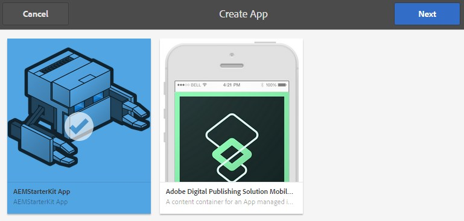

# Criação e edição de aplicativos usando o console Aplicativos{#creating-and-editing-apps-using-the-apps-console}

>[!NOTE]
>
>A Adobe recomenda usar o Editor de SPA para projetos que exigem renderização do lado do cliente com base em estrutura de aplicativo de página única (por exemplo, React). [Saiba mais](/help/sites-developing/spa-overview.md).

O processo AEM de desenvolvimento de aplicativos móveis reconhece que usuários de diferentes competências contribuem para o desenvolvimento de aplicativos móveis. O mapa de processos a seguir ilustra a ordem geral em que os autores de conteúdo e desenvolvedores de aplicativos executam tarefas.

As informações sobre como executar as tarefas do profissional de marketing são exibidas nesta página. Para obter informações sobre as tarefas do desenvolvedor, consulte Criação de aplicativos PhoneGap.

## A estrutura dos aplicativos móveis {#the-structure-of-mobile-applications}

O AEM Mobile fornece o blueprint do aplicativo Phonegap para criar aplicativos móveis. O blueprint define a estrutura dos aplicativos que você cria. As candidaturas consistem nos seguintes elementos:

* A página raiz.
* As variações de idioma do aplicativo.
* A página inicial da variação de idioma.

### A raiz de um aplicativo Phonegap {#the-root-of-a-phonegap-app}

A página raiz dos aplicativos móveis criados no AEM é exibida no console Aplicativos .

A página raiz é armazenada abaixo da propriedade Caminho de destino do aplicativo que foi especificada ao criar o aplicativo (o caminho padrão é /content/phonegap/apps). O nome da página é a propriedade Name do aplicativo. Por exemplo, o URL padrão da página raiz do site chamado `myphonegapapp` é `http://localhost:4502/content/phonegap/apps/myphonegapapp.html`.

### A variação de idioma de um aplicativo PhoneGap {#the-language-variation-of-a-phonegap-app}

As primeiras páginas filhas da página raiz são as variações de idioma do aplicativo. O nome de cada página é o idioma para o qual o aplicativo é criado. Por exemplo, inglês é o nome da variação em inglês do aplicativo.

**Observação:** O blueprint padrão do PhoneGap cria apenas um aplicativo em inglês. Seu desenvolvedor pode modificar o blueprint para criar mais variações de idioma.

A página de idioma tem dois objetivos:

* O conteúdo da página é a página de spash da variação de idioma do aplicativo.
* As propriedades da página controlam vários aspectos de design do aplicativo, como o URL a ser usado para solicitar atualizações de conteúdo e informações sobre como se conectar à build de nuvem e à integração com os Serviços da Adobe Analytics.

### A Página Inicial {#the-home-page}

A página inicial ou a página index.html de uma variação de idioma de um aplicativo é exibida quando o aplicativo é aberto. A página inicial fornece aos usuários um menu de links para várias páginas no aplicativo. O sistema de parágrafo permite adicionar componentes à página para criar conteúdo.

## Criação de um aplicativo móvel {#creating-a-mobile-application}

Os aplicativos móveis são baseados em um blueprint que define a estrutura e as propriedades da página. Você pode configurar as seguintes propriedades do aplicativo:

* **Título:** O título do aplicativo.
* **Caminho de destino:** O local no repositório onde o aplicativo é armazenado. Deixe o padrão para criar um caminho com base no nome do aplicativo.

* **Nome:** O valor padrão é o valor da propriedade Título com caracteres de espaço removidos. O nome é usado no CQ para se referir ao aplicativo, por exemplo, para o nó do repositório que representa o aplicativo.
* **Descrição:** Uma descrição do aplicativo.
* **URL do servidor:** O URL que fornece atualizações de conteúdo OTA (Over-the-Air) para o aplicativo. O valor padrão é o URL do servidor de publicação da instância que é usada para criar um aplicativo (obtido do serviço externalizador). Observe que deve ser uma instância do servidor de publicação, em vez de um autor, o que requer autenticação.

Você também pode fornecer um arquivo de imagem para usar como miniatura do aplicativo, selecionar a configuração do PhoneGap Build a ser usada e selecionar a configuração de análise do aplicativo móvel a ser usada. Essa imagem é usada apenas como uma miniatura para representar seu aplicativo móvel no console de aplicativos móveis no Experience Manager.

Existem guias adicionais (e opcionais) para criar o serviço de nuvem e integrar o plug-in SDK do Adobe Mobile Services ao seu aplicativo.

* Build: Clique em gerenciar configurações e configure o serviço de build.phonegap.com aqui. Em seguida, na lista suspensa, é possível selecionar o serviço de nuvem de build PhoneGap recém-criado.
* Analytics: Clique em gerenciar configurações e configure o [SDK do Adobe Mobile Services](https://experienceleague.adobe.com/docs/mobile-services/using/home.html) serviço em nuvem. Em seguida, na lista suspensa, você poderá selecionar o Mobile Service recém-criado para integrar ao seu aplicativo móvel.

>[!NOTE]
>
>Os desenvolvedores podem usar o AEM PhoneGap Starter Kit para criar aplicativos e adicioná-los ao console.

O procedimento a seguir usa a interface do usuário de toque para criar um aplicativo móvel.

1. No painel , clique em Aplicativos .
1. Clique ou toque no ícone Criar .

   

1. (Opcional) Na guia Avançado , forneça uma descrição para o aplicativo e altere o URL do servidor, se necessário.
1. (Opcional) Se você estiver usando o PhoneGap Build para compilar o aplicativo, na guia Criar , selecione a Configuração a ser usada.

   Para criar uma configuração de build do PhoneGap, clique em Gerenciar configurações.

1. (Opcional) Se você estiver usando o SiteCatalyst para rastrear a atividade do aplicativo, na guia Analytics , selecione a configuração a ser usada.

   Para criar uma Configuração de aplicativo móvel, clique em Gerenciar configurações.

1. (Opcional) Para fornecer um ícone de aplicativo, clique no botão Procurar, selecione o arquivo de imagem do seu sistema de arquivos e clique em Abrir.
1. Clique em Criar.

### Alterar as propriedades de um aplicativo móvel {#changing-the-properties-of-a-mobile-application}

Depois de criar um aplicativo móvel, você pode alterar as propriedades.

#### Alterar o título, a descrição e o ícone {#change-the-title-description-and-icon}

1. No painel , clique ou toque em Aplicativos .
1. Selecione o aplicativo a ser configurado e clique no ícone Propriedades da página de exibição .

   

1. Para alterar os valores da propriedade, clique ou toque no ícone Editar .

   

1. Configure as propriedades Básicas e Avançadas e clique ou toque no ícone Concluído .

   

#### Configurar uma variação de idioma do aplicativo {#configure-a-language-variation-of-the-application}

1. No painel , clique ou toque em Aplicativos .
1. Clique em para detalhar o aplicativo móvel que deseja editar no console de administração de aplicativos. Selecione a versão de idioma do aplicativo a ser configurado e clique no ícone Exibir propriedades do aplicativo .

   

1. Para alterar os valores da propriedade, clique ou toque no ícone Editar .

   

1. Configure as propriedades nas guias Básico, Avançado, Criar e Analytics e clique ou toque no ícone Concluído .

   

### Criação do conteúdo de um aplicativo móvel {#authoring-the-content-of-a-mobile-application}

Após criar o aplicativo móvel, adicione o conteúdo que é usado como a interface do usuário do aplicativo.

1. No painel , clique ou toque em Aplicativos .
1. Clique ou toque no aplicativo e em inglês.
1. Edite a Página inicial ou adicione páginas filhas, conforme necessário.

### Mover conteúdo para aplicativos móveis {#moving-content-to-mobile-applications}

O cache da Sincronização de conteúdo na instância de publicação do AEM é usado como um repositório de conteúdo para aplicativos móveis:

* O conteúdo no cache da Sincronização de conteúdo é incluído no aplicativo quando os desenvolvedores compilam o aplicativo.
* O conteúdo no cache está disponível para os aplicativos móveis instalados para atualizar o conteúdo do aplicativo.

Os aplicativos móveis incluem um comando Atualizações que baixa e instala o conteúdo atualizado do aplicativo. Quando uma instância de aplicativo envia uma solicitação de atualização, a Sincronização de conteúdo determina qual conteúdo foi alterado desde a última vez que o aplicativo foi atualizado ou instalado e fornece o novo conteúdo.

Para disponibilizar conteúdo atualizado para os aplicativos, atualize o cache do Content Sync. Na primeira vez que você atualizar o cache, todo o conteúdo publicado será adicionado. As atualizações subsequentes adicionam somente o conteúdo publicado que foi alterado desde a atualização anterior.

A Sincronização de conteúdo também rastreia quando as atualizações ocorrem. Com essas informações, a Sincronização de conteúdo pode determinar qual atualização de cache enviar para um aplicativo móvel.

Execute o procedimento a seguir na instância em que deseja atualizar o cache. Por exemplo, se seu aplicativo solicitar atualizações da instância de publicação, execute o procedimento na instância de publicação.

1. No painel, clique ou toque em Aplicativos e, em seguida, clique ou toque no aplicativo.
1. Selecione a página inicial e clique ou toque no ícone Atualizar cache .

   

### Usar modelos de aplicativo {#using-app-templates}

Este é um recurso disponível com o Pacote de recursos 2 do Apps 6.1 e oferece uma maneira fácil de aproveitar os modelos de aplicativos existentes para a criação de novos aplicativos no AEM.

O que é um modelo de aplicativo? Pense nisso como uma coleção de modelos de página e componentes que representam uma linha de base ou uma base de um aplicativo.
Ao criar um novo aplicativo com base no modelo de outro aplicativo, você obtém um aplicativo que tem um representante de ponto de partida do aplicativo no qual ele foi criado.

Você deve ter um modelo de aplicativo móvel existente (ou um aplicativo instalado que tenha um modelo de aplicativo) para usar esse recurso.

O pacote de amostras do AEM Apps 6.1 mais recente inclui uma versão atualizada do aplicativo Geometrixx com um modelo de aplicativo. Como alternativa, você pode instalar o StarterKit que também fornece um modelo.

Etapas para criar um novo aplicativo com base em um modelo de aplicativo:

1. Verifique se você tem o pacote de recursos e amostras de referência mais recente do AEM Apps 6.1 instalado
1. Clique em Aplicativos no painel esquerdo.

1. Clique no botão + Criar na parte superior e selecione Criar aplicativo.
1. Depois de receber a lista de Modelos de aplicativo, selecione um:

1. Clique em Avançar.
1. Forneça uma ID e um Título do aplicativo, no entanto, você também pode querer incluir um Nome e uma Descrição.

   1. Além disso, você pode fornecer um PNG (formato de ícone PhoneGap compatível) como um ícone ao navegar pelos ativos AEM.
   1. Lembre-se de que você pode editar todos esses campos depois que o aplicativo for criado no bloco Gerenciar aplicativo . Com exceção da ID do aplicativo, uma vez que a ID do aplicativo tenha sido definida, você não poderá alterá-la.

1. Clique no botão criar, você terá 2 opções, Concluído (retorne à exibição do catálogo de Aplicativos) ou Gerenciar aplicativo (abre o painel do aplicativo).
1. Depois de criado, você deve ver o novo aplicativo listado no catálogo de aplicativos:

1. Clique no aplicativo para abri-lo. Você criou com êxito um novo aplicativo com base no modelo de um aplicativo existente.

>[!NOTE]
>
>Se você desinstalar o pacote de aplicativo de referência do Geometrixx Outdoors do AEM e tiver um aplicativo criado com base em seu modelo, esse aplicativo não funcionará mais. O aplicativo Geometrixx Outdoors pode ser removido, no entanto, o modelo de aplicativo deve permanecer se for usado por outros aplicativos móveis.

## Explorar o aplicativo de exemplo do Geometrixx Outdoors {#exploring-the-sample-geometrixx-outdoors-app}

Geometrixx Outdoors App é um exemplo de aplicativo PhoneGap que demonstra os recursos do blueprint padrão do aplicativo PhoneGap e os componentes móveis de amostra.

Para abrir o aplicativo, no painel , clique em Aplicativos móveis e selecione Geometrixx Outdoors App.

### Recursos de página comuns - Aplicativo móvel do Geometrixx {#common-page-features-geometrixx-mobile-app}

Cada página do aplicativo móvel inclui os seguintes recursos:

* Um botão Voltar para retornar à página principal. Observe que o botão Voltar não é exibido na página inicial.
* Um painel expansível que oferece um menu de comandos e links:

   * Abra a página Localizações .
   * Abra o Carrinho.
   * Faça logon.
   * Atualize o aplicativo.

* O sistema de parágrafo, para adicionar componentes e criar conteúdo.

### Página inicial - Aplicativo móvel do Geometrixx {#the-home-page-geometrixx-mobile-app}

O conteúdo da Página inicial é composto pelas seguintes ferramentas de navegação:

* Um componente de Lista de menus que fornece links para as páginas secundárias Engrenagem, Revisões, Notícias e Sobre nós .
* Um componente do Carrossel de wipe que mostra as páginas filhas.

### A página de engrenagens - Aplicativo móvel do Geometrixx {#the-gear-page-geometrixx-mobile-app}

A página de engrenagem fornece aos usuários acesso às páginas do produto. Um componente de Lista de menus fornece acesso às páginas filhas da página de engrenagens. As páginas filhas são categorias de produtos recursos do site.

* Temporada
* Vestuário
* Sexo
* Atividade

Cada página de categoria usa a mesma estrutura de conteúdo que a página de engrenagem. O carrossel fornece acesso a páginas filhas que são subcategorias de produtos. As páginas de subcategoria contêm listas de produtos que fornecem links para páginas de produtos.

### A página Produtos - Aplicativo móvel do Geometrixx {#the-products-page-geometrixx-mobile-app}

A página Produtos e sua hierarquia de páginas filhas implementam um sistema de classificação para páginas de produtos. As páginas mais baixas em cada ramificação da hierarquia são uma página de produto que contém um componente de produto ng.

A página Produtos não está disponível para os usuários do aplicativo. A página Engrenagem fornece acesso a cada página de produto.

### A página de revisões - Aplicativo móvel do Geometrixx {#the-reviews-page-geometrixx-mobile-app}

Contém um botão Voltar. O sistema de parágrafo permite adicionar componentes.

Ao usar o aplicativo, a página Revisões está disponível no carrossel da página em inglês.

### A página de notícias - Aplicativo móvel do Geometrixx {#the-news-page-geometrixx-mobile-app}

Contém um botão Voltar. O sistema de parágrafo permite adicionar componentes.

Ao usar o aplicativo, a página Notícias está disponível no carrossel da página em inglês.

### A página Sobre Nós - Aplicativo Móvel Do Geometrixx {#the-about-us-page-geometrixx-mobile-app}

A página Sobre nós contém vários componentes de Linha de duas colunas . Cada coluna contém uma Imagem ou um componente de Texto. Os componentes são editáveis e o sistema de parágrafo permite adicionar componentes.

Ao usar o aplicativo, a página Sobre nós está disponível no carrossel da página em inglês.

### A página Localizações - Aplicativo móvel do Geometrixx {#the-locations-page-geometrixx-mobile-app}

A página Localizações contém um componente Localizações .

Ao usar o aplicativo, a página Localizações está disponível na lista de menus na página em inglês.

## Exemplos de componentes móveis {#sample-mobile-components}

Vários componentes ficam imediatamente disponíveis no Sidekick ao criar as páginas de um aplicativo móvel. Os componentes pertencem ao grupo de componentes PhoneGap.

### Carrossel de troca {#swipe-carousel}

O componente de Rastreamento de carrossel é uma ferramenta para mostrar e navegar pelas páginas do site. O componente inclui um carrossel que percorre as imagens das páginas acima de uma lista de links de página. Edite o componente para especificar as páginas a serem expostas e o comportamento do carrossel.

Observe que as imagens aparecem no carrossel para páginas que estão associadas a uma imagem de uma maneira específica. Quando as páginas não estão associadas a imagens, somente a lista de links é exibida.

**Guia de propriedades do carrossel**

Configure o comportamento do carrossel:

* Velocidade de reprodução: O tempo em milissegundos que cada imagem é exibida antes de mostrar a próxima imagem.
* Tempo de transição: A duração, em milissegundos, da animação para transições de imagem.
* Estilo dos controles: O tipo de controles fornecidos para movimentação entre imagens.

**Guia Propriedades da lista**

Especifique como a lista de páginas é gerada:

* Criar lista usando: O método a ser usado para especificar as páginas a serem incluídas no carrossel. Consulte Criação da lista de páginas .
* Ordenar por: Selecione uma propriedade de página para usar na classificação da lista de páginas. Por exemplo, selecione jcr:title para classificar páginas alfabeticamente por título.
* Limite: O número máximo de páginas a serem incluídas. Essa propriedade é apropriada para métodos baseados em pesquisa de criação da lista de páginas.

#### Criar a lista de páginas {#building-the-page-list}

O componente Rastrear carrossel fornece os seguintes valores para a propriedade Criar lista usando . A caixa de diálogo de edição muda de acordo com o valor selecionado:

**Páginas secundárias**

O componente lista todas as páginas filhas de uma página específica. Após selecionar esse valor, selecione a página na guia Páginas secundárias ou não especifique nenhum valor para listar os filhos da página atual.

**Lista fixa**

Especifique uma lista de páginas de inclusão. Após selecionar esse valor, configure a lista na guia Lista fixa que aparece ao selecionar Lista fixa:

* Para adicionar uma página, clique em Adicionar item e procure a página.
* Use os ícones de seta para cima e para baixo para mover a página dentro da lista.
* Clique no botão remover para remover uma página da lista.

A propriedade Order By não afeta a ordem das listas fixas.

**Pesquisar**

Preencha a lista usando os resultados de uma pesquisa por palavra-chave. A pesquisa é executada nos filhos de uma página especificada:

1. Para especificar a página raiz da pesquisa, use a propriedade Start In para selecionar o caminho da página. Não especifique nenhum caminho para pesquisar abaixo da página atual.
1. Na propriedade Consulta de pesquisa , insira as palavras-chave de pesquisa.

**Pesquisa avançada**

Preencha a lista usando um [Querybuilder](/help/sites-developing/querybuilder-api.md) query.

### Imagem {#image}

Adicione uma imagem ao conteúdo do seu aplicativo.

### Texto {#text}

Adicione rich text ao conteúdo do aplicativo.

### Armazenar locais {#store-locations}

O componente Locais da loja fornece aos usuários ferramentas para encontrar pontos de venda:

* Pesquisar
* Listas de locais próximos ou distantes das coordenadas GPS do dispositivo.

O componente requer que o repositório contenha informações de localização para cada loja. Os locais de amostra são instalados no nó /etc/commerce/locations/adobe . 

### Linha de duas colunas {#two-column-row}

Permite adicionar componentes lado a lado a uma página.

