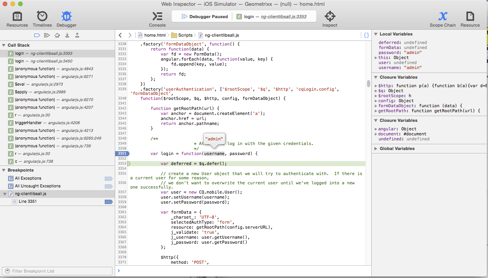

# Desenvolvimento de aplicativos com CLI PhoneGap{#developing-apps-with-phonegap-cli}

>[!NOTE]
>
>A Adobe recomenda usar o Editor de SPA para projetos que exigem renderização do lado do cliente com base em estrutura de aplicativo de página única (por exemplo, React). [Saiba mais](/help/sites-developing/spa-overview.md).

A qualquer momento, como desenvolvedor, você pode executar seu aplicativo em um dispositivo ou em um emulador, desde que tenha configurado seu ambiente de desenvolvimento.

Para executar os exemplos a seguir, você precisará de um sistema que execute o OSx (Mac) com Xcode ou de um sistema Mac/Win/Linux com o Android SDK instalado.

## Bootstrap seu ambiente de desenvolvimento {#bootstrap-your-development-environment}

[Configurar CLI do PhoneGap](https://docs.phonegap.com/en/4.0.0/guide_cli_index.md.html#The%20Command-Line%20Interface)

Para iOS: Para desenvolver para iPhones e iPads, você precisa do Apple Xcode IDE.

* Baixe gratuitamente [here](https://developer.apple.com/xcode/downloads/).
* [Guia da plataforma PhoneGap iOS](https://docs.phonegap.com/en/4.0.0/guide_platforms_ios_index.md.html#iOS%20Platform%20Guide)

Para Android: Para ser desenvolvido para iPhones e iPads, você precisa do Google Android Studio IDE.

* Baixe gratuitamente [here](https://developer.android.com/sdk/index.html).
* [Guia da plataforma PhoneGap Android](https://docs.phonegap.com/en/4.0.0/guide_platforms_android_index.md.html#Android%20Platform%20Guide)

## Baixar a fonte {#download-the-source}

Depois de fazer o reforço do ambiente de desenvolvimento com sucesso, baixe a fonte do bloco AEM App Builder:

* Clique na divisa suspensa do bloco de PhoneGap Build.


* Clique em Baixar fonte.
* Selecione a fonte desejada no modal Fonte de download.


>[!NOTE]
>
>A fonte de desenvolvimento contém o estado mais recente do aplicativo, enquanto inclui alterações não preparadas. Use a origem de armazenamento temporário para criar candidatos de lançamento para enviar a fornecedores da loja de aplicativos.
>
>Se você nunca preparou seu aplicativo, selecionar Preparo acionará o fluxo de trabalho de preparo (dica: isso será exibido como um aplicativo de preparo no aplicativo PhoneGap Enterprise Viewer disponível na AppStore e na Google PlayStore).

* Clique em Baixar e salve o ZIP no computador.
* Extraia o arquivo zip baixado para o espaço de trabalho.

## Criar e carregar o aplicativo (da origem) {#build-and-load-the-app-from-source}

A CLI do PhoneGap pode criar um projeto de plataforma, compilar a fonte e implantar o aplicativo em um único comando.

>[!NOTE]
>
>Você pode executar todas essas etapas separadamente, consulte [Documentos da CLI do PhoneGap](https://phonegap.com/blog/2014/11/13/phonegap-cli-3-6-3/).

1. Verifique se a CLI do PhoneGap foi instalada, veja acima.
1. Em uma janela de console (ou terminal), navegue até o diretório raiz da origem extraída.
1. Digite o seguinte comando:

```xml
phonegap run android

// -- or -- //

phonegap run ios
```

>[!NOTE]
>
>Se tiver problemas neste momento, volte aos conceitos básicos para solucionar problemas -
>
>1. Criar uma nova pasta (teste mkdir)
>1. Navegar nesta nova pasta (teste cd)
>1. Execute &#39;phonegap criar helloWorld&#39;
>1. Navegue até helloWorld (cd helloWorld)
>1. Execute &#39;phonegap run android (ou substitua o android pelo ios como acima).
>1. O emulador abrirá a execução do aplicativo PhoneGap recém-criado, dizendo &quot;Pronto para dispositivo&quot; se a ponte JavaScript para nativo for operacional.

>
>Isso verificará se você é um ambiente de desenvolvimento da CLI PhoneGap em execução corretamente.

## Depurar Javascripts com a depuração do Safari e do IOS {#debug-javascripts-with-safari-and-ios-debug}

Você pode depurar os JavaScripts do aplicativo usando as ferramentas do desenvolvedor do Safari, da mesma forma que faria com um aplicativo da Web.

## Ativar ferramentas de desenvolvedor do Safari {#enable-safari-developer-tools}

Para ativar as ferramentas do desenvolvedor:

* Abrir as preferências do Safari

   * Clique em Safari na barra de menus
   * Clique em Preferências

* Clique em Avançado na janela Preferência


* Marque a opção &quot;Mostrar menu desenvolver na barra de menus&quot;
* Feche a janela Preferência

## Conectar o Safari ao iOS {#connect-safari-to-ios}

Você pode conectar o Safari a um dispositivo ou emulador de iOS.

* Em uma janela do console, navegue até o diretório raiz da origem extraída.
* Digite o seguinte comando para iniciar o aplicativo no dispositivo ou no emulador.

```xml
phonegap run <platform> --device

// -- or -- //

phonegap run <platform> --emulator
```

* Abrir o Safari
* Clique em Desenvolver na barra de menus
* Selecione o submenu do Simulador de iOS
* Clique em home.html


## Depurar o JavaScript com o Inspetor da Web do Safari {#debug-javascript-with-safari-s-web-inspector}

Você pode definir pontos de interrupção em qualquer lugar na sua origem. Quando você interage com o emulador ou dispositivo, a execução do aplicativo é interrompida nesses pontos de interrupção. Você pode percorrer a execução e inspecionar os valores em variáveis.

* Clique em Recursos na janela Inspetor da Web
* Navegue pela árvore de origem e clique no arquivo de origem desejado
* Clique no número da linha adjacente para adicionar um ponto de interrupção
* Interagir com o dispositivo ou emulador



* Use os botões de controle para continuar a execução, passe o mouse sobre eles, passe para dentro e saia dos métodos:


>[!NOTE]
>
>Para ver os valores das variáveis, no método atual, passe o mouse sobre ele.

## Próximas etapas {#the-next-steps}

Depois de saber mais sobre como desenvolver aplicativos com PhoneGap CLI, consulte [Acesso aos recursos do dispositivo](/help/mobile/phonegap-access-device-features.md).
