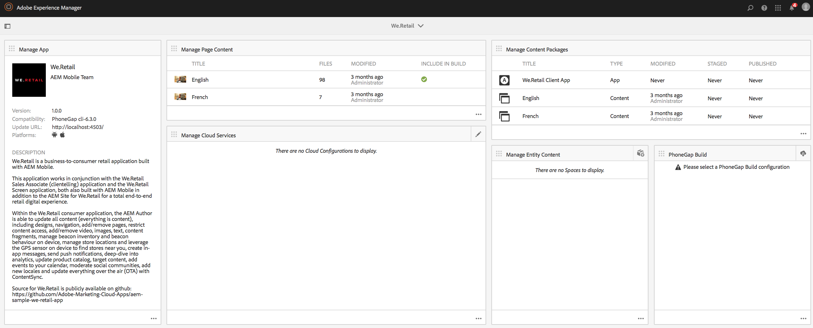

# Criação de aplicativos móveis{#authoring-mobile-applications}

>[!NOTE]
>
>A Adobe recomenda usar o Editor de SPA para projetos que exigem renderização do lado do cliente com base em estrutura de aplicativo de página única (por exemplo, React). [Saiba mais](/help/sites-developing/spa-overview.md).

O AEM Mobile Dashboard permite criar, criar e implantar seu aplicativo móvel, criar, excluir e editar metadados do aplicativo. Quando seu aplicativo estiver ativo, você poderá analisar análises de aplicativos, incluindo ciclo de vida e métricas de uso, para melhorar a conversão do cliente e a fidelidade da marca.

Para criar seu aplicativo AEM Mobile, consulte o [Criação de aplicativos móveis](/help/mobile/building-app-mobile-phonegap.md) página.

Para configurar seu ambiente e começar, consulte [Administração de AEM para usar AEM PhoneGap Enterprise](/help/mobile/administer-phonegap.md).

## O Catálogo de aplicativos AEM Mobile {#the-aem-mobile-apps-catalog}

O [Catálogo de aplicativos AEM Mobile](http://localhost:4502/aem/apps.html/content/phonegap) exibe todo o aplicativo móvel gerenciado no AEM.

Pense neste catálogo como a &quot;landing page&quot; do AEM Mobile, onde os administradores podem iniciar um novo aplicativo do AEM Mobile criando com base em um modelo ou fazendo o upload de um aplicativo existente já iniciado por um desenvolvedor móvel.

Siga estas etapas para acessar a página de aterrissagem do catálogo de aplicativos:

1. Navegue até **Navegação** e escolha **Celular**.

1. Choose **Aplicativos** para abrir o catálogo de aplicativos.

## O painel do aplicativo AEM Mobile {#the-aem-mobile-app-dashboard}

Selecionar um aplicativo AEM Mobile no catálogo exibirá seu painel. Aqui você pode gerenciar seu aplicativo, visualizar estatísticas, criar, implantar e gerenciar o conteúdo do aplicativo móvel.

Você pode expandir em cada bloco no Painel do AEM Mobile para exibir ou editar detalhes clicando no botão &#39;..&#39; no canto inferior direito.

### O Bloco Gerenciar Aplicativo {#the-manage-app-tile}

O Bloco Gerenciar aplicativos exibe o ícone do aplicativo, o nome, a descrição, as plataformas compatíveis, a página inicial de chamada para atualizações de URL e informações de versão. Você pode detalhar este bloco para editar e manter a Configuração do aplicativo PhoneGap (config.xml) e preparar seu aplicativo para envio aos vários armazenamentos de aplicativos para distribuição.

Clique em [here](/help/mobile/phonegap-app-details-tile.md) para obter detalhes.

### O mosaico Gerenciar conteúdo da página {#the-manage-page-content-tile}

O conteúdo pode ser criado, atualizado e excluído no AEM Mobile da mesma forma que você faz no AEM Sites. O **Gerenciar o mosaico de conteúdo da página** exibe o número de páginas de conteúdo gerenciado e a última modificação. Você pode detalhar o conteúdo para criar, copiar, mover, excluir e atualizar páginas clicando em cada registro no bloco. Depois que o conteúdo for atualizado, você poderá enviar uma atualização de conteúdo para seus clientes por meio do **Gerenciar blocos de conteúdo .**

### O mosaico Gerenciar pacotes de conteúdo {#the-manage-content-packages-tile}

Após adicionar ou modificar o conteúdo por meio do Mosaico de conteúdo da página, é possível enviar essas alterações para os clientes com uma atualização da Versão de conteúdo.

O Pacote de conteúdo permite que o Autor do aplicativo AEM gerencie o conteúdo da página no AEM e faça com que a sua equipe de desenvolvimento faça alterações no seu Aplicativo PhoneGap Shell (ou seja, estrutura do aplicativo ou infraestrutura) e envie essas alterações para seus clientes rapidamente e sem precisar se inscrever em um desenvolvedor para reenviar para as várias lojas para distribuição.

O Pacote de conteúdo cria um arquivo ZIP, considerado um Pacote de versão de conteúdo, para cada atualização. Esses pacotes contêm recursos html e páginas html que são geradas durante a renderização do aplicativo e são inteligentes o suficiente para empacotar apenas os arquivos que foram modificados desde a última atualização.

O mosaico Gerenciar pacote de conteúdo **Tipo** será exibida como &quot;Aplicativo&quot; para indicar o conteúdo do Application Shell, por exemplo, a estrutura ou a infraestrutura do aplicativo gerenciado por um desenvolvedor ou como &quot;Conteúdo&quot;, que representa o conteúdo da página gerenciado pelo autor de conteúdo.

O conteúdo pode ser representado como um idioma ou como uma parte específica do aplicativo, onde vários pacotes de versão de conteúdo são consumidos pelo aplicativo. A escolha de como agrupar seu conteúdo foi criada para ser flexível e estar totalmente à altura de como você deseja gerenciar o conteúdo para seu aplicativo.

O **Modificado** indica quando as páginas foram modificadas mais recentemente.

O **Preparado** mostra quando a última atualização de conteúdo foi criada. Para criar uma nova atualização de conteúdo e preparar as alterações, abra qualquer registro no bloco e crie uma nova atualização.

O **Publicado** mostra quando a última atualização de conteúdo foi publicada e disponibilizada para consumo pelos clientes. Para publicar o conteúdo, primeiro estágio desse conteúdo e, em seguida, publique a atualização neste bloco e publique no console Detalhes da versão do conteúdo .

 

Este ícone representa um pacote de versão de conteúdo para o shell do aplicativo

Esses ícones representam um pacote de versão de conteúdo para o conteúdo do aplicativo

### O Mosaico do PhoneGap Build {#the-phonegap-build-tile}

O **Bloco PhoneGap Build** conecta-se com [https://build.phonegap.com](https://build.phonegap.com) para criar e hospedar builds remotos. Depois de criada, a build é disponibilizada como download ou diretamente para seu dispositivo por meio de um código QR.

Como alternativa, você pode baixar a fonte do dispositivo para criar localmente pelo [CLI do PhoneGap](https://docs.phonegap.com/en/3.5.0/guide_cli_index.md.html).

### O mosaico Métricas {#the-metrics-tile}

>[!CAUTION]
>
>O bloco Métricas é exibido somente depois que você configura o serviço de nuvem.
>
>Consulte [Configurar o Cloud Service do Adobe Mobile Services](/help/mobile/configure-adobe-mobile-cloud-service.md) para obter detalhes.

AEM Mobile integra-se ao Adobe Analytics por meio de [SDK do Adobe Mobile Services](https://www.adobe.com/ca/solutions/digital-marketing/mobile-services/app-sdk.html) (AMS).

Centro de Controle **Mosaico de métricas** exibe análises de resumo extraídas do AMS para seu aplicativo. Você pode detalhar o painel de análise clicando no botão &#39;..&#39; no canto inferior direito.

### O Bloco Gerenciar Conteúdo da Entidade {#the-manage-entity-content-tile}

O Bloco Gerenciar conteúdo da entidade permite adicionar e gerenciar definições de aplicativos. As definições do aplicativo são uma maneira de identificar quais espaços (e outras configurações) são apropriados para o aplicativo. Dessa forma, um novo espaço pode ser adicionado, sem precisar recompilar o aplicativo. A definição do aplicativo é atualizada e incluirá as informações de quaisquer novos espaços.

Clique em [here](/help/mobile/phonegap-app-definitions.md) para criar e gerenciar as definições do aplicativo.

Você pode detalhar o painel de gerenciamento do conteúdo da entidade clicando no botão &#39;..&#39; no canto inferior direito.

#### Recursos adicionais {#additional-resources}

Para saber mais sobre as funções e responsabilidades de um Administrador e Desenvolvedor, consulte os recursos abaixo:

* [Desenvolvimento para Adobe PhoneGap Enterprise com AEM](/help/mobile/developing-in-phonegap.md)
* [Administração de conteúdo para Adobe PhoneGap Enterprise com AEM](/help/mobile/administer-phonegap.md)
