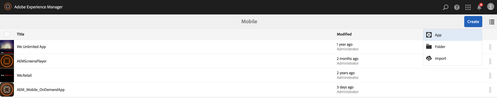

# Criação de um novo aplicativo AEM Mobile usando o assistente criar{#creating-a-new-aem-mobile-app-using-create-wizard}

>[!NOTE]
>
>A Adobe recomenda usar o Editor de SPA para projetos que exigem renderização do lado do cliente com base em estrutura de aplicativo de página única (por exemplo, React). [Saiba mais](/help/sites-developing/spa-overview.md).

Os aplicativos AEM Mobile são baseados em um blueprint que define uma estrutura de página e propriedades. Você pode configurar as seguintes propriedades do aplicativo:

* **Título:** O título do aplicativo.
* **Caminho de destino:** O local no repositório onde o aplicativo é armazenado. Deixe o padrão para criar um caminho com base no nome do aplicativo.

* **Nome:** O valor padrão é o valor da propriedade Título com caracteres de espaço removidos. O nome é usado em AEM para se referir ao aplicativo, por exemplo, para o nó do repositório que representa o aplicativo.
* **Descrição:** Uma descrição do aplicativo.
* **URL do servidor:** O URL que fornece atualizações de conteúdo OTA (Over-the-Air) para o aplicativo. O valor padrão é o URL do servidor de publicação da instância que é usada para criar um aplicativo (obtido do serviço externalizador). Observe que deve ser uma instância do servidor de publicação, em vez de um autor, o que requer autenticação.

Você também pode fornecer um arquivo de imagem para usar como miniatura do aplicativo, selecionar a configuração do PhoneGap Build a ser usada e selecionar a configuração de análise do aplicativo móvel a ser usada. Essa imagem é usada apenas como uma miniatura para representar seu aplicativo móvel no console de aplicativos móveis no Experience Manager.

Existem guias adicionais (e opcionais) para criar o serviço de nuvem e integrar o plug-in SDK do Adobe Mobile Services ao seu aplicativo.

* Build: Clique em gerenciar configurações e configure o serviço de build.phonegap.com aqui. Em seguida, na lista suspensa, é possível selecionar o serviço de nuvem de build PhoneGap recém-criado.
* Analytics: Clique em gerenciar configurações e configure o [SDK do Adobe Mobile Services](https://experienceleague.adobe.com/docs/mobile-services/using/home.html) serviço em nuvem. Em seguida, na lista suspensa, você poderá selecionar o Mobile Service recém-criado para integrar ao seu aplicativo móvel.

## Usar modelos de aplicativo {#using-app-templates}

Os modelos de aplicativos fornecem uma maneira fácil de aproveitar os designs existentes criados pelos desenvolvedores, usados para criar novos aplicativos no AEM.

O que é um modelo de aplicativo? Pense nisso como uma coleção de modelos de página e componentes que representam uma linha de base ou uma base de um aplicativo.
Ao criar um novo aplicativo com base no modelo de outro aplicativo, você obtém um aplicativo que tem um representante de ponto de partida do aplicativo no qual ele foi criado.

Você deve ter um modelo de aplicativo móvel existente (ou um aplicativo instalado que tenha um modelo de aplicativo) para usar esse recurso.

O pacote de amostras de AEM mais recente inclui uma versão atualizada do aplicativo Geometrixx com um modelo de aplicativo. Como alternativa, você pode instalar o [StarterKit](https://github.com/Adobe-Marketing-Cloud-Apps/aem-phonegap-starter-kit) que também fornece um template.

Etapas para criar um novo aplicativo com base em um modelo de aplicativo:

1. Navegue até o catálogo de aplicativos do AEM Mobile: &lt;*server-url*>aem/apps.html/content/mobileapps
1. Selecionar **Criar** e escolha **Aplicativo** conforme mostrado abaixo

Selecione um modelo de aplicativo disponibilizado para você por um desenvolvedor de AEM. Consulte [Estrutura de um aplicativo AEM Mobile](/help/mobile/phonegap-structure-an-app.md) para obter ajuda para desenvolvedores.

Preencha os detalhes do novo aplicativo, conforme necessário, incluindo como opção alterar a imagem em miniatura. Esses valores podem ser editados posteriormente na variável **Gerenciar aplicativo** mosaico.

## Próximas etapas {#the-next-steps}

Consulte os seguintes recursos para saber mais sobre outras funções de criação:

* [O Bloco Gerenciar Aplicativo](/help/mobile/phonegap-app-details-tile.md)
* [Edição de metadados do aplicativo](/help/mobile/phonegap-editmetadata.md)
* [Definições do aplicativo](/help/mobile/phonegap-app-definitions.md)
* [Importar um aplicativo híbrido existente](/help/mobile/phonegap-adding-content-to-imported-app.md)
* [Content Services](/help/mobile/develop-content-as-a-service.md)

## Recursos adicionais {#additional-resources}

Para saber mais sobre as funções e responsabilidades de um Administrador e Desenvolvedor, consulte os recursos abaixo:

* [Desenvolvimento para Adobe PhoneGap Enterprise com AEM](/help/mobile/developing-in-phonegap.md)
* [Administração de conteúdo para Adobe PhoneGap Enterprise com AEM](/help/mobile/administer-phonegap.md)
