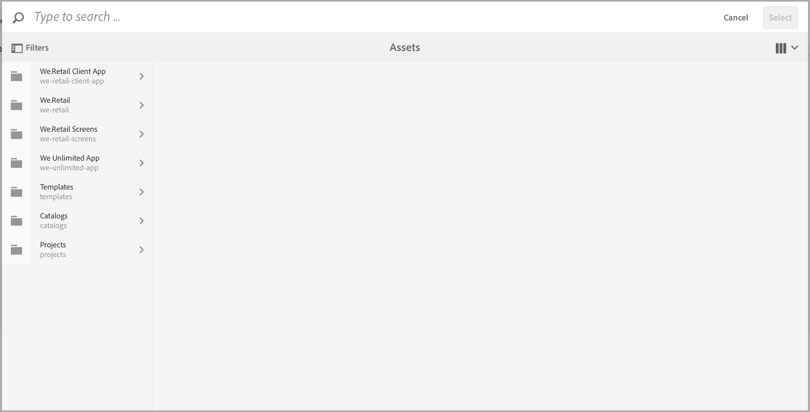

# Edição de metadados do aplicativo {#editing-app-metadata}

>[!NOTE]
>
>A Adobe recomenda o uso do Editor SPA para projetos que exigem renderização no lado do cliente baseada em estrutura de aplicativo de página única (por exemplo, React). [Saiba mais](/help/sites-developing/spa-overview.md).

A variável **Gerenciar aplicativo** O bloco e a página &quot;Gerenciar aplicativo&quot; fornecem um meio de exibir e editar metadados do aplicativo. Os metadados do aplicativo são detalhes necessários para lançar um aplicativo na loja de um fornecedor. Isso pode incluir metadados comuns, metadados do iOS e capturas de tela. Consulte a [Gerenciar mosaico do aplicativo](/help/mobile/phonegap-app-details-tile.md) para obter mais detalhes sobre metadados comuns e iOS.

## Editar os dados do aplicativo {#editing-the-app-data}

Para editar os metadados do aplicativo:

1. Navegue até a página de painel do Aplicativo.

   

1. Para exibir ou editar detalhes clicando em &quot;...&quot; no canto inferior direito do **Gerenciar aplicativo** bloco.

1. Insira ou exiba os detalhes em qualquer uma das cinco guias disponíveis, conforme mostrado na figura abaixo.

   

## Edição de metadados comuns e IOS {#editing-common-and-ios-metadata}

É possível editar os metadados comuns e IOS:

* Selecione o **Avançado** da página de descrição do aplicativo.
* Editar ou exibir os metadados comuns e do IOS. Consulte as figuras abaixo para obter mais detalhes.

 

## Adicionar e remover capturas de tela {#add-and-remove-screenshots}

É possível incluir capturas de tela do aplicativo no roll-up de metadados. Alguns fornecedores exigem capturas de tela precisas ao enviar qualquer aplicativo para sua loja de aplicativos. Essas imagens já devem existir no Assets. Consulte [Seletor de ativos](../assets/search-assets.md#assetpicker) para carregar suas capturas de tela.

### Adicionar capturas de tela {#add-screenshots}

Para adicionar um ativo como uma captura de tela:

1. Durante o modo de edição do **Gerenciar aplicativo** clique em adicionar (ícone de adição).
1. Selecione o ativo e clique em **Selecionar** para adicionar o ativo.

   

1. Selecione o ativo e clique em **Selecionar** para adicionar o ativo.

>[!NOTE]
>
>A captura de tela deve corresponder à resolução de tela do dispositivo de destino.

### Excluir capturas de tela {#delete-screenshots}

Para remover uma captura de tela:

Clique em Excluir no ativo.

## Próximas etapas {#the-next-steps}

Consulte os seguintes recursos para saber mais sobre outras funções de criação:

* [O mosaico Gerenciar aplicativo](/help/mobile/phonegap-app-details-tile.md)
* [Definições do aplicativo](/help/mobile/phonegap-app-definitions.md)
* [Criação de um novo aplicativo usando o Assistente para criação de aplicativo](/help/mobile/phonegap-create-new-app.md)
* [Importar um aplicativo híbrido existente](/help/mobile/phonegap-adding-content-to-imported-app.md)
* [Content Services](/help/mobile/develop-content-as-a-service.md)

### Recursos adicionais {#additional-resources}

Para saber mais sobre as funções e responsabilidades de um Administrador e Desenvolvedor, consulte os recursos abaixo:

* [Desenvolvimento do Adobe PhoneGap Enterprise com AEM](/help/mobile/developing-in-phonegap.md)
* [Administração de conteúdo para o Adobe PhoneGap Enterprise com AEM](/help/mobile/administer-phonegap.md)
