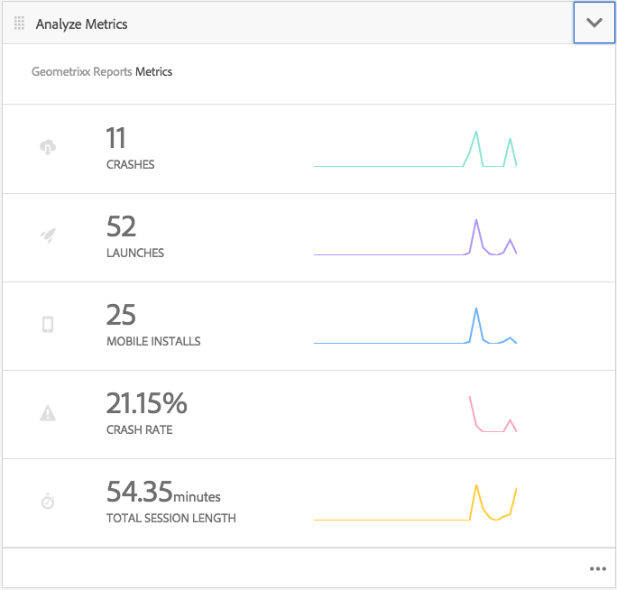

# Acompanhe o desempenho do aplicativo com o Adobe Mobile Analytics{#track-app-performance-with-adobe-mobile-analytics}

>[!NOTE]
>
>A Adobe recomenda o uso do Editor de SPA para projetos que exigem renderização do cliente baseada em estrutura de aplicativo de página única (por exemplo, Reagir). [Saiba mais](/help/sites-developing/spa-overview.md).

Você deseja aumentar as conversões e a fidelidade do cliente.

Você deseja fornecer experiências relevantes e envolventes aos seus clientes.

O que seu aplicativo AEM Mobile está fazendo para suas campanhas de marketing?

Como você pode ajustar seus aplicativos móveis para proporcionar a melhor experiência para seus usuários?

Com o Adobe Mobile Services, você pode obter informações sobre como seus usuários estão usando seus aplicativos móveis rastreando o uso, as falhas do aplicativo, os detalhes do dispositivo e tantas outras métricas críticas para seus aplicativos móveis.

A Adobe Experience Manager Mobile fornece uma visão geral dos detalhes de sua análise móvel diretamente do Painel de aplicativos AEM Mobile. O **mosaico de métricas móveis** no painel fornece análises em tempo real para seu aplicativo móvel, permitindo que desenvolvedores, autores e administradores tenham uma rápida visão da saúde do seu aplicativo móvel. Nas capas que alimentam a análise está o SDK [Adobe Mobile Analytics](https://www.adobe.com/ca/solutions/digital-analytics/mobile-web-apps-analytics.html). O SDK do Adobe Mobile Analytics pode ser conectado aos seus aplicativos nativamente ou por meio de um plug-in PhoneGap bridge para visualizações da Web. As métricas são coletadas e armazenadas em cache no dispositivo até que o dispositivo esteja conectado, no qual os dados são encaminhados para a Adobe Mobile Services Cloud para relatórios e análise.

O SDK do Adobe Mobile Analytics oferece o seguinte:

1. **Coleta de dados para canais**  móveis - Colete dados abrangentes para seus sites e aplicativos móveis em todos os principais sistemas operacionais.
1. **Análise**  de envolvimento móvel - Entenda o envolvimento do usuário em seu aplicativo móvel, site ou vídeo, incluindo a frequência com que os consumidores iniciam o canal, se eles fazem compras a partir dele e muito mais.
1. **Painéis e relatórios**  do aplicativo móvel - Obtenha relatórios de uso que incluem medições de ciclo de vida para seus aplicativos e métricas da app store. consulte as tendências para usuários, inicializações, duração média da sessão, duração da retenção e falhas.
1. **Análise**  de campanha móvel - Quantifica a eficácia de campanhas específicas para dispositivos móveis, como SMS, anúncios de pesquisa móvel, anúncios de exibição móvel e códigos QR.
1. **Análise**  de localização geográfica - Descubra onde os usuários do aplicativo iniciam e interagem com suas experiências móveis por localização GPS ou pontos de interesse.
1. **Análise**  de definição de caminho - Veja como os usuários navegam pelo aplicativo para determinar quais telas e elementos da interface estão envolvendo os usuários e quais fazem com que os usuários sejam excluídos.

Esta seção descreve como [AEM desenvolvedores](#developers) podem aprender a instruir aplicativos AEM Mobile com rastreamento analítico.

Finalmente, [AEM Administradores](#administrators) aprendem a:

* criar um serviço em nuvem para o Adobe Mobile Services
* criar uma configuração de serviço móvel e associar um conjunto de relatórios
* associar a configuração do serviço móvel a um aplicativo móvel
* Métricas de visualização por meio do Centro de comando de aplicativos AEM
* atribua a configuração do SDK do AMS ao seu aplicativo móvel

## Para desenvolvedores - Integre o Analytics ao seu aplicativo {#for-developers-integrate-analytics-into-your-app}

**Pré-requisito:** AEM os administradores precisam configurar a configuração de nuvem do Adobe Mobile Services,  [conforme discutido abaixo](#amscloudserviceconfig).

Os desenvolvedores são responsáveis por [adicionar análise a um aplicativo AEM Mobile](/help/mobile/phonegap-add-analytics-to-apps.md) conforme necessário para rastrear, relatar e entender como os usuários se envolvem com o conteúdo do aplicativo móvel e medir métricas essenciais do ciclo de vida, como inicializações, tempo no aplicativo e taxa de falha.

## Para administradores - Configure o Cloud Service do Adobe Mobile Services {#for-administrators-configure-the-adobe-mobile-services-cloud-service}

Para tirar proveito do Adobe Mobile Services, é necessário configurar o Cloud Service do Adobe Mobile Services com as informações da sua conta Adobe Analytics. A Central de comandos do aplicativo fornece um bloco **Analisar métricas** no qual você pode criar e associar o serviço em nuvem ao aplicativo móvel.

Configure o serviço de nuvem para seu aplicativo móvel e clique no ícone de engrenagem localizado no bloco Analisar métricas.

Clicar no ícone de engrenagem no bloco Analisar métricas abrirá a caixa de diálogo modal &quot;Configurar análise do Mobile Services&quot;. Selecione sua configuração no menu suspenso &quot;Selecione uma configuração de serviço móvel&quot;. Se precisar criar uma nova configuração, clique no botão chave inglesa.

Para criar um serviço em nuvem do Adobe Mobile Service, há duas etapas envolvidas: a conexão com o serviço e a seleção do conjunto de relatórios a ser atribuído à configuração.

Para começar, clique no botão &#39;+&#39; no bloco Gerenciar Cloud Services no painel.

Ao clicar no botão &#39;**+**&#39;, o assistente **Adicionar Cloud Service** será exibido.

Selecione ou crie uma nova configuração de serviço móvel preenchendo os campos obrigatórios, conforme mostrado abaixo. O administrador do AEM precisará dessas informações para criar com êxito a conexão com o Adobe Mobile Services.

Após concluir as Configurações da conta do Mobile Services, você será solicitado a selecionar um aplicativo. Isso conecta o relatórios de análise do Adobe Mobile Service ao aplicativo.

Selecione o serviço móvel desejado e clique em &#39;Atualizar&#39; para atribuir a configuração do serviço móvel e fechar a caixa de diálogo.

Agora que você associou a configuração do serviço móvel ao aplicativo AEM Mobile, o bloco será start para buscar os dados da métrica e iniciar o relatórios.

### Arquivo de configuração do SDK do Adobe Mobile Services {#adobe-mobile-services-sdk-config-file}

Neste ponto, seu aplicativo móvel está associado a um serviço em nuvem, no entanto, o aplicativo móvel ainda não sabe como comunicar as métricas móveis coletadas de volta à Adobe Analytics. Para conectar o aplicativo móvel ao Adobe Analytics, o arquivo de configuração do Adobe Mobile Services SDK precisa ser adicionado ao Adobe Experience Manager.

No bloco Analisar métricas, clique no ícone de seta para expor as entradas do menu Configuração do SDK para Download / Upload do AMS.

A primeira etapa é obter a configuração do SDK do Adobe Mobile Services, clicar em &#39;Baixar configuração do SDK do AMS&#39; redirecionará você para o site do Adobe Mobile Services no qual você pode baixar o arquivo de configuração. Depois de obter o arquivo ADBMobileConfig.json, clique em &quot;Carregar configuração do SDK do AMS&quot; para carregar o arquivo de configuração no AEM.

Clique no botão &quot;Carregar configuração de aplicativo do Adobe Mobile Services&quot; e procure o arquivo ADBMobileConfig.json e clique em &quot;Carregar&quot;.

Agora que o aplicativo móvel tem acesso ao arquivo ADBMobileConfig.json, ele tem o conhecimento sobre como se comunicar de volta à Adobe Analytics e começar a relatórios do valor dessas métricas importantes que ajudarão a direcionar seus aplicativos com sucesso.

## O que vem depois? {#what-s-next}

1. [Start da minha experiência com aplicativos AEM Mobile](/help/mobile/starting-aem-phonegap-app.md)
1. [Gerenciar o conteúdo do meu aplicativo](/help/mobile/phonegap-manage-app-content.md)
1. [Criar meu aplicativo](/help/mobile/building-app-mobile-phonegap.md)
1. [Acompanhe o desempenho do meu aplicativo com o Adobe Mobile Analytics](/help/mobile/phonegap-intro-to-app-analytics.md)
1. [Fornecer uma experiência personalizada com o aplicativo com a Adobe Target](/help/mobile/phonegap-aem-mobile-content-personalization.md)
1. [Enviar mensagens importantes para meus usuários](/help/mobile/phonegap-push-notifications.md)